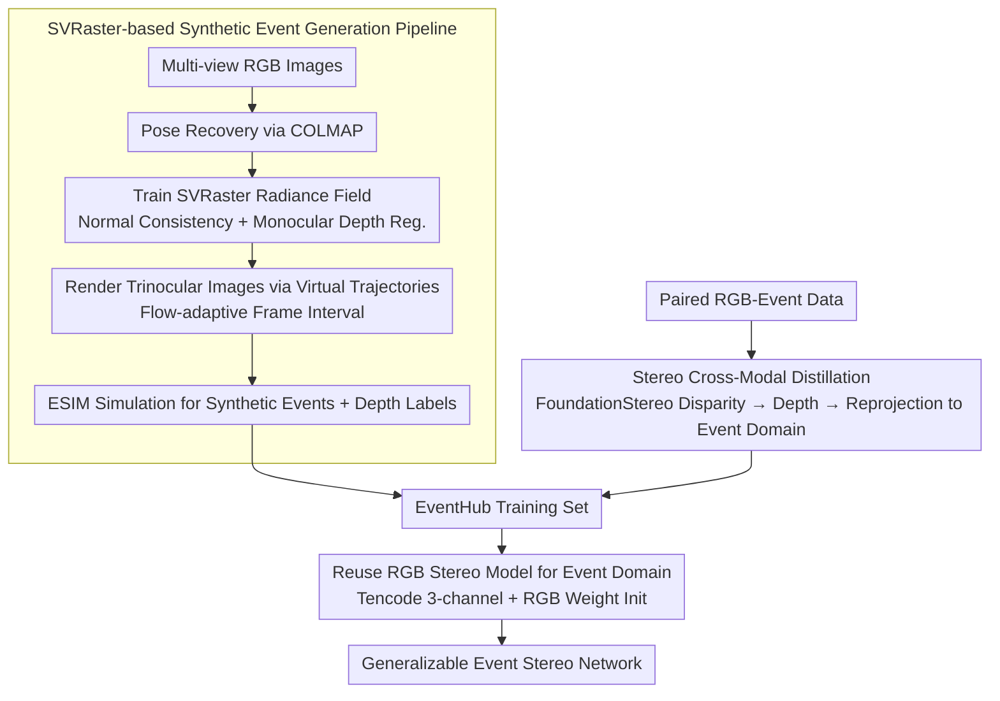

# EventHub: Data Factory for Generalizable Event-Based Stereo Networks without Active Sensors

**Conference**: CVPR 2026  
**arXiv**: [2604.02331](https://arxiv.org/abs/2604.02331)  
**Code**: [https://bartn8.github.io/eventhub](https://bartn8.github.io/eventhub)  
**Area**: 3D Vision / Stereo Matching / Event Camera  
**Keywords**: Event camera, Stereo matching, Data factory, Novel view synthesis, Cross-modal distillation  

## TL;DR
This paper proposes EventHub, a data factory for event-based stereo matching training without LiDAR or other active sensor annotations. By generating proxy events and depth labels via novel view synthesis and transferring knowledge from RGB stereo models through cross-modal distillation, the trained event stereo models surpass LiDAR-supervised models in cross-domain generalization (reducing error by up to 50% on M3ED and MVSEC).

## Background & Motivation

1. **Background**: Deep learning-driven stereo matching has achieved significant progress in the RGB domain, with the emergence of foundation models like FoundationStereo showing extreme generalization. Event cameras offer unique advantages in autonomous driving and robot navigation due to microsecond temporal resolution, no motion blur, and high dynamic range.

2. **Limitations of Prior Work**: Labeled data for event-based stereo matching is extremely scarce—datasets like DSEC, MVSEC, and M3ED are much smaller than those in the RGB domain. Furthermore, LiDAR annotations have inherent issues: sparsity (requiring 7×7 dilation), accumulation errors in dynamic scenes, reprojection errors, and failure on non-Lambertian surfaces.

3. **Key Challenge**: Obtaining and labeling event camera data requires complex active sensor setups (e.g., LiDAR), which is costly and results in limited label quality. In contrast, RGB data is abundant and has mature depth estimation tools. The core problem is how to leverage cheap RGB data to train event camera models.

4. **Goal**: (1) How to generate event camera training data from RGB images? (2) How to transfer knowledge from RGB stereo models to the event domain? (3) How to grant event stereo models unprecedented generalization capabilities?

5. **Key Insight**: RGB images are cheap and abundant, and RGB stereo foundation models already possess strong depth estimation capabilities. These resources can be used as inputs for a data factory to automatically generate training data for event stereo matching.

6. **Core Idea**: Combine novel view synthesis (to generate proxy events and depth labels) with cross-modal distillation (to transfer knowledge from RGB stereo models) to build an event-based stereo matching data factory without active sensors.

## Method

### Overall Architecture
EventHub generates training data through two complementary paths: (i) **Event Data Factory**—uses SVRaster to generate synthetic event stereo pairs and depth labels from sparse RGB image sequences via novel view synthesis; (ii) **Stereo Cross-Modal Distillation**—in scenarios with existing paired RGB-Event data, proxy depth labels are generated using an RGB stereo foundation model (e.g., FoundationStereo) and aligned to the event domain via multi-view geometry. Data from both paths are merged into the EventHub training set. During training, events are encoded into a three-channel Tencode format, allowing the reuse of RGB stereo model architectures and weights for the event stereo network.

### Key Designs

**1. SVRaster-based Synthetic Event Generation Pipeline: Creating event streams with depth labels from static RGB photos.**

Event cameras are triggered by brightness changes, but static RGB photos are stationary. The pipeline first uses COLMAP to recover camera poses and intrinsics from multi-view RGB images, then trains an SVRaster radiance field to reconstruct the scene into a fast-renderable representation. SVRaster is chosen for its rendering speed, which can match the microsecond temporal resolution of event cameras. To ensure clean depth maps (as label quality determines downstream training effects), regularization terms such as normal consistency $\mathcal{L}_{N\text{-mean/med}}$ and monocular depth priors $\mathcal{L}_{\text{DAv2}}$ are applied during training.

With the radiance field, "virtual motion" is artificially introduced to create brightness changes: local trajectories $\Gamma(\tau)$ translating along a single axis are used for object-centric scenes, and cubic spline-fitted global trajectories $\Omega(\tau)$ are used for large indoor scenes. After rendering trinocular image pairs along the trajectory, they are passed to the ESIM simulator to generate synthetic event streams from brightness differences between frames. A key detail is that frame intervals are not fixed; large intervals cause artifacts, while small intervals waste computation. Thus, pixel displacement is estimated via optical flow to adaptively determine interpolation:

$$n = \max\big(\lceil\log_2(|\mathbf{F}|_{\max})\rceil,\ 0\big)$$

The number of intermediate renderings is set to $2^n$, inserting more frames for large displacements and fewer for small ones, suppressing artifacts without redundant rendering.

**2. Stereo Cross-Modal Distillation: Transferring depth from RGB models when cameras are already paired.**

The synthesis pipeline is ideal for creating data from scratch, but in some datasets (e.g., DSEC), RGB and event cameras are already calibrated and paired for the same scene. In these cases, the distillation path leverages RGB stereo foundation models $\Phi_c$ (like FoundationStereo) to process RGB stereo pairs into disparity maps $\mathbf{D}_c$. These are converted to depth via $\mathbf{Z}_c = (b_c \cdot f_c) / \mathbf{D}_c$ and aligned to the event domain through "unprojection to 3D — transformation — reprojection to event image plane" using the known relative pose $\mathbf{T}_{c \to e}$. This path bypasses rendering and simulation, distilling depth estimation capabilities learned from massive data directly to the event side.

**3. Reuse of RGB Stereo Models for the Event Domain: Encoding events as "pseudo-RGB" to inherit weights.**

Event streams are asynchronous polarity pulses, which do not match the dense three-channel images expected by RGB models. To utilize RGB pre-trained weights, events are encoded into a Tencode representation—where positive polarity, timestamp, and negative polarity each occupy one channel. This creates a 3-channel input similar to RGB, allowing the event model $\Phi_e$ to directly inherit the architecture and weight initialization of the RGB stereo model. After initialization, the model is fine-tuned with a very low learning rate ($5 \times 10^{-5}$) while freezing the DAv2 prior to preserve strong RGB priors.

### Loss & Training
- NeRF-supervised loss (including trinocular photometric consistency and confidence weighting) is used for NVS-generated data.
- Original model losses are used for distilled and non-EventHub data.
- SVRaster training: Total loss $\mathcal{L} = \mathcal{L}_{\text{MSE}} + \lambda_{\text{SSIM}}\mathcal{L}_{\text{SSIM}} + \mathcal{L}_{\text{reg}}$, where regularization includes normal consistency, sparsity, and monocular priors.
- Custom voxel-size confidence $\mathbf{C}_{\text{Vsize}}$ is used to improve depth label quality estimation.

## Key Experimental Results

### Main Results

**DSEC In-domain Results (E-FoundationStereo)**:

| Training Method | 1PE ↓ | MAE ↓ |
|----------|-------|-------|
| Photometric | 93.85 | 3.65 |
| EV-SceneFlow | 61.80 | 3.10 |
| MIX 3 (NVS+ScanNet++) | 20.99 | 0.89 |
| MIX 4 (NVS+ScanNet+++DSEC Distill) | 20.42 | 0.87 |
| LiDAR (GT) | 12.53 | 0.60 |

**M3ED Cross-domain Generalization (E-FoundationStereo)**:

| Training Method | Day MAE ↓ | Night MAE ↓ | Indoor MAE ↓ |
|----------|-----------|-------------|--------------|
| MIX 4 (Ours) | **0.98** | **1.54** | 2.45 |
| LiDAR (GT) | 2.89 | 1.99 | 2.87 |

### Ablation Study

| Data Combination | Components | E-FoundationStereo DSEC MAE ↓ | Avg Rank |
|----------|------|-------------------------------|----------|
| MIX 1 | NeRF-Stereo only | 1.39 | 5.00 |
| MIX 2 | NeRF-Stereo + DSEC | 1.04 | 4.00 |
| MIX 3 | NeRF-Stereo + ScanNet++ | 0.89 | 2.75 |
| MIX 4 | NeRF-Stereo + ScanNet++ + DSEC | 0.87 | 2.25 |

### Key Findings
- **Models trained with EventHub completely outperform LiDAR-supervised models in cross-domain generalization**: On M3ED and MVSEC, the MAE of models trained with MIX 4 is over 50% lower than LiDAR supervision, suggesting that proxy label diversity is more important than LiDAR precision.
- **Data diversity is key**: Performance consistently improves from MIX 1 to MIX 4 as more data sources are added.
- **Bidirectional knowledge transfer**: The event model can, in turn, improve the performance of the RGB foundation model in night scenes, achieving an RGB→Event→RGB knowledge cycle.
- **EMatch degrades severely across domains**: EMatch trained on LiDAR shows an MAE of 12.22 on M3ED Day, while MIX 4 achieves 2.23.

## Highlights & Insights
- **Data Factory Paradigm**: Transforms the problem of "acquiring expensive labeled data" into "generating proxy labels from cheap data." This paradigm can be transferred to other data-scarce modalities (e.g., thermal infrared, radar).
- **Dynamic Adaptive Frame Interval**: Automatically adjusts rendering intervals via optical flow, avoiding simulation artifacts from large intervals and redundant computation from small ones.
- **Counter-intuitive finding: Proxy Labels > LiDAR Labels**: Although proxy labels are less precise than LiDAR, their diversity (multi-scene, multi-resolution, multi-baseline) results in stronger generalization, providing insights for data strategies in stereo matching.

## Limitations & Future Work
- **NVS pipeline limited to static scenes**: The current virtual trajectory scheme cannot generate event data for dynamic objects.
- **Simulation Gap**: Differences remain between ESIM synthetic events and real events regarding noise characteristics and non-ideal threshold behaviors.
- **Compute Cost**: Each scene requires independent SVRaster training; rendering 270 NeRF-Stereo scenes × 3 trajectories + 403 ScanNet++ scenes is computationally expensive.
- **Future Directions**: Introduce dynamic scene NVS (e.g., 4D Gaussian Splatting) to expand data factory capabilities.

## Related Work & Insights
- **vs NeRF-Stereo [Tosi 2023]**: NeRF-Stereo first synthesized RGB stereo data with NeRF; EventHub extends this to events with simulators and virtual trajectories.
- **vs EMatch**: EMatch is a recent SOTA for event stereo but relies heavily on in-domain LiDAR, leading to poor generalization. E-FoundationStereo trained via EventHub significantly outperforms EMatch out-of-domain.
- **vs GS2E**: GS2E concurrently used 3DGS to generate multi-view events but focused on NVS and deblurring, not stereo matching data generation.

## Rating
- Novelty: ⭐⭐⭐⭐ First to use NVS data factory + cross-modal distillation for event stereo.
- Experimental Thoroughness: ⭐⭐⭐⭐⭐ Comprehensive evaluation across 4 models, 4 data combinations, and 3 test sets.
- Writing Quality: ⭐⭐⭐⭐ Clear structure, detailed pipeline descriptions, and rich visualizations.
- Value: ⭐⭐⭐⭐⭐ Addresses the core pain point of data scarcity in event cameras with impactful findings on proxy labels.

<!-- RELATED:START -->

## Related Papers

- [\[CVPR 2026\] Bidirectional Cross-Modal Prompting for Event-Frame Asymmetric Stereo](bidirectional_cross-modal_prompting_for_event-frame_asymmetric_stereo.md)
- [\[CVPR 2026\] GS-ASM: 2DGS-Supervised Active Stereo Matching](gs-asm_2dgs-supervised_active_stereo_matching.md)
- [\[ICLR 2026\] EA3D: Event-Augmented 3D Diffusion for Generalizable Novel View Synthesis](../../ICLR2026/3d_vision/ea3d_event-augmented_3d_diffusion_for_generalizable_novel_view_synthesis.md)
- [\[CVPR 2026\] Geometric-Photometric Event-based 3D Gaussian Ray Tracing](geometric-photometric_event-based_3d_gaussian_ray_tracing.md)
- [\[CVPR 2026\] What Makes Good Synthetic Training Data for Zero-Shot Stereo Matching?](what_makes_good_synthetic_training_data_for_zero-shot_stereo_matching.md)

<!-- RELATED:END -->
