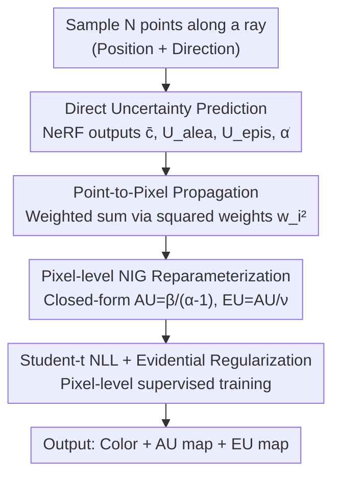

# Evidential Neural Radiance Fields

**Conference**: CVPR 2026  
**Paper**: [CVF Open Access](https://openaccess.thecvf.com/content/CVPR2026/html/Duan_Evidential_Neural_Radiance_Fields_CVPR_2026_paper.html)  
**Code**: https://github.com/KerryDRX/EvidentialNeRF  
**Area**: 3D Vision  
**Keywords**: NeRF, Uncertainty Quantification, Evidential Deep Learning, Aleatoric Uncertainty, Epistemic Uncertainty  

## TL;DR
This paper adapts Evidential Deep Learning (EDL) to the NeRF volume rendering pipeline, allowing the model to directly predict and disentangle aleatoric uncertainty (data noise) and epistemic uncertainty (model ignorance) in a single forward pass. Without sacrificing rendering quality or increasing inference cost, it achieves both leading reconstruction fidelity and competitive uncertainty quality across three standardized benchmarks.

## Background & Motivation
**Background**: NeRF demonstrates impressive results in 3D reconstruction and novel view synthesis, but it typically outputs only a deterministic pixel color without conveying model uncertainty. In safety-critical scenarios like autonomous driving, medical imaging, and robotics, knowing what the model is "unsure" about is as critical as the result itself.

**Limitations of Prior Work**: Uncertainty prediction stems from two sources: aleatoric uncertainty (AU, irreducible noise from data like lighting changes or high-frequency edges) and epistemic uncertainty (EU, reducible model ignorance from lack of data or out-of-distribution views). Existing NeRF uncertainty methods fall into three categories, each with drawbacks: ① Closed-form likelihood models (e.g., NeRF-W, ActiveNeRF using Gaussian distributions) are efficient but only capture AU; ② Bayesian methods (MC Dropout, S-NeRF, CF-NeRF) estimate EU but require multiple samples during inference, leading to high overhead; ③ Ensemble methods (Deep Ensembles, DANE) perform well but require training and storing multiple models, resulting in the highest costs.

**Key Challenge**: No existing method can quantify both AU and EU in a **single forward pass**, and many methods trade reconstruction accuracy for uncertainty estimation. The root cause is that classic Evidential Deep Learning (EDL) requires the network to regress parameters for an evidential distribution (e.g., NIG), but NeRF uses a hierarchical volume rendering structure—supervision is only available at the **pixel level** (after aggregation), whereas evidential parameters are tied to **point-level** predictions. This structural mismatch prevents EDL from being naturally applied to NeRF.

**Goal / Core Idea**: To adapt the "evidence collection" concept of EDL into a form compatible with volume rendering. The key insight is: **Instead of regressing NIG parameters, the model directly predicts AU, EU, and a shape score.** A set of point-to-pixel uncertainty propagation formulas is then used to aggregate these to the supervised pixel level, from which the closed-form NIG distribution is derived. Consequently, both types of uncertainty are obtained in one forward pass.

## Method

### Overall Architecture
The method can be viewed as an "upgrade" to the probabilistic modeling of the original NeRF. The paper outlines the evolution through three levels (Figure 2): **Level 1 vanilla NeRF** predicts density $\rho_i$ and color $c_i$ for each point, yielding a deterministic pixel color without uncertainty; **Level 2 normal NeRF** (classic Gaussian approach) assumes $c_i \mid \mu_i,\sigma_i^2 \sim \mathcal{N}(\mu_i,\sigma_i^2)$, where the pixel color is also normal, capturing AU but lacking EU as $\mu_i,\sigma_i^2$ are fixed point estimates; **Level 3 evidential NeRF** (ours) treats the pixel mean and variance as random variables themselves, following a higher-order normal-inverse-gamma (NIG) evidential distribution, enabling closed-form disentanglement of both AU and EU.

The pipeline follows: Sample $N$ points along a ray → pass through NeRF MLP to predict density, color, and **additional** $(U_i^\text{alea}, U_i^\text{epis}, \tilde\alpha_i)$ → propagate point-level uncertainty to pixel-level using squared volume rendering weights → reparameterize into a pixel-level NIG distribution $(\gamma,\nu,\alpha,\beta)$ → train at the pixel level using Student's t-likelihood and evidential regularization.

### Key Designs

**1. Direct Prediction of AU/EU Instead of Regressing Evidential Parameters**

This is the core deviation from classic EDL, designed to bypass the structural mismatch where evidence parameters are point-based but supervision is pixel-based. The paper treats the conditional mean and variance of point color as random variables $(\mu_i,\sigma_i^2)\sim\pi_i$. According to the law of total variance, point-level aleatoric and epistemic uncertainties are defined as $U_i^\text{alea}\coloneq\mathbb{E}[\text{Var}[c_i\mid\mu_i,\sigma_i^2]]=\mathbb{E}[\sigma_i^2]$ and $U_i^\text{epis}\coloneq\text{Var}[\mathbb{E}[c_i\mid\mu_i,\sigma_i^2]]=\text{Var}[\mu_i]$. In Gaussian methods, $\pi_i$ collapses to a Dirac delta, making $U_i^\text{epis}=0$.

In implementation, the model adds 3 output neurons to the final layer to predict $(\bar c_i, U_i^\text{alea}, U_i^\text{epis}, \tilde\alpha_i),\rho_i = f(\boldsymbol{x}_i,\boldsymbol{d})$, where $\bar c_i$ is the mean color (sigmoid), $U_i^\text{alea},U_i^\text{epis}$ are the uncertainties, and $\tilde\alpha_i$ is a positive shape score (both via softplus). **By outputting interpretable uncertainty quantities directly instead of raw NIG parameters**, the uncertainty flows through volume rendering naturally, simplifying the aggregation process.

**2. Point-to-Pixel Uncertainty Propagation (Squared Weight Aggregation)**

To aggregate point-level quantities to the supervised pixel level, the paper derives propagation rules. Given conditional mean and variance for all points $\boldsymbol\theta\coloneq\{(\mu_i,\sigma_i^2)\}_{i=1}^N$ and pixel color $c=\sum_i w_i c_i$ (where $w_i$ are standard volume rendering weights). Under the assumption of independence between points, the paper proves that while the mean uses linear weights, **pixel-level uncertainty uses the square of the weights**:

$$\bar c = \sum_{i=1}^N w_i \bar c_i,\quad U = \sum_{i=1}^N w_i^2 U_i,\quad U^\text{alea}=\sum_{i=1}^N w_i^2 U_i^\text{alea},\quad U^\text{epis}=\sum_{i=1}^N w_i^2 U_i^\text{epis}.$$

This stems from the property of variance for linear combinations ($\text{Var}[\sum w_i c_i]=\sum w_i^2\text{Var}[c_i]$). This derivation allows evidential information to aggregate at the pixel level where losses are applied. ⚠️ This relies on the simplifying assumption that points along a ray are statistically independent.

**3. Pixel-level NIG Reparameterization**

To quantify uncertainties in closed form, the pixel color mean and variance $(\mu,\sigma^2)$ are modeled as $\mu,\sigma^2\sim\text{NIG}(\gamma,\nu,\alpha,\beta)$. In this hierarchical view, the prediction mean and both uncertainties can be expressed by NIG parameters:

$$\bar c = \gamma,\qquad U^\text{alea}=\mathbb{E}[\sigma^2]=\frac{\beta}{\alpha-1},\qquad U^\text{epis}=\text{Var}[\mu]=\frac{\beta}{(\alpha-1)\nu}.$$

Conversely, the NIG parameters are reconstructed from the aggregated quantities: $\gamma=\bar c$, $\nu=U^\text{alea}/U^\text{epis}$, $\alpha=1+\sum_{i=1}^N\tilde w_i\tilde\alpha_i$, and $\beta=U^\text{alea}(\alpha-1)$, where $\tilde w_i=w_i/\sum_j w_j$ are normalized weights.

**4. Loss & Training**

With $(\mu,\sigma^2)$ marginalized, the pixel color follows a Student's t-distribution $c\sim t\!\left(\gamma,\frac{\beta(\nu+1)}{\alpha\nu},2\alpha\right)$. Training utilizes the negative log-likelihood $\mathcal{L}_\text{nll}=-\log p(c^\text{gt}\mid\gamma,\nu,\alpha,\beta)$. An evidential regularization term $\mathcal{L}_\text{reg}=|c^\text{gt}-\gamma|(2\nu+\alpha)$ is added to penalize high evidence (low uncertainty) for incorrect predictions. The total loss is $\mathcal{L}=\mathcal{L}_\text{nll}+\lambda_\text{reg}\mathcal{L}_\text{reg}$.

## Key Experimental Results

### Main Results
Comparison with six uncertainty methods using the nerfacto architecture across three datasets (Light Field, LLFF sparse 3-view, RobustNeRF).

| Dataset | Method | PSNR↑ | SSIM↑ | LPIPS↓ | NLL↓ |
|--------|------|-------|-------|--------|------|
| LF | Normal (Gaussian) | 28.01 | 0.9165 | 0.0531 | 0.4425 |
| LF | Ensembles | 29.38 | 0.9308 | 0.0411 | 0.3245 |
| LF | **Evidential (Ours)** | **29.97** | **0.9345** | **0.0359** | -2.4491 |
| LLFF | Ensembles | 17.92 | 0.5109 | 0.3932 | 11.17 |
| LLFF | **Evidential (Ours)** | 17.88 | 0.5068 | **0.3751** | **0.6765** |
| RobustNeRF| Ensembles | 26.20 | 0.8562 | 0.1438 | 4.63 |
| RobustNeRF| **Evidential (Ours)** | **26.23** | **0.8641** | **0.1112** | -1.27 |

Ours outperforms expensive Ensemble methods in 7 out of 9 reconstruction metrics while requiring only a single model and forward pass.

### Efficiency Comparison

| Mode | Baseline | Dropout | Normal | Ensembles | **Ours** |
|------|---------|---------|--------|-----------|------|
| Training/min (per 30k steps) ↓ | 11.84 | 88.54 | 12.22 | 59.22 | **13.57** |
| Inference/FPS↑ | 4.88 | 0.09 | 4.71 | 0.96 | **4.67** |

Ours is nearly as fast as vanilla NeRF and significantly faster than Ensembles or Dropout.

### Key Findings
- **Stochastic Mean/Variance Provides Massive Likelihood Gains**: Compared to Gaussian methods, Ours drastically improves test likelihood because it accounts for both aleatoric and epistemic uncertainty.
- **AU vs. EU Trends**: As training data increases, AU typically increases (more complex noise captured) while EU decreases (model ignorance reduced).
- **Practical Applications**: High AU regions correspond to noise/reflections, allowing for "scene cleaning." High EU regions correspond to out-of-distribution areas, useful for active learning (Next-Best-View).

## Highlights & Insights
- **Novelty**: Shifting the prediction target from raw NIG parameters to interpretable AU/EU values elegantly solves the point-pixel supervision mismatch in volume rendering.
- **Minimal Overhead**: The architecture remains largely unchanged (3 extra neurons), providing a highly cost-effective way to obtain AU+EU.
- **Value**: Disentangling the two types of uncertainty provides better interpretability and sanity checks (e.g., verifying EU decreases with more data).

## Limitations & Future Work
- **Geometry Uncertainty**: The model assumes density $\rho$ is deterministic, omitting geometric (density) uncertainty.
- **Independence Assumption**: The point-to-pixel propagation assumes independence along the ray, which is a common simplification but may introduce bias at high-frequency boundaries.

## Related Work & Insights
- **vs. Gaussian (NeRF-W/ActiveNeRF)**: Gaussian methods only capture AU; Ours provides both AU and EU with better reconstruction.
- **vs. Ensembles**: Ensembles are the gold standard for quality but expensive; Ours achieves comparable or better results at a fraction of the cost.
- **vs. Bayesian (MC Dropout)**: Bayesian methods require multiple passes; Ours is a deterministic single-forward pass.

## Rating
- Novelty: ⭐⭐⭐⭐⭐ (Clean adaptation of EDL to volume rendering)
- Experimental Thoroughness: ⭐⭐⭐⭐ (Strong benchmarks, but lack of comparison with concurrent ENeRF)
- Writing Quality: ⭐⭐⭐⭐⭐ (Clear derivation and intuitive explanations)
- Value: ⭐⭐⭐⭐⭐ (Practical for safety-critical 3D reconstruction)

<!-- RELATED:START -->

## Related Papers

- [\[CVPR 2026\] MU-GeNeRF: Multi-view Uncertainty-guided Generalizable Neural Radiance Fields for Distractor-aware Scene](mu-generf_multi-view_uncertainty-guided_generalizable_neural_radiance_fields_for.md)
- [\[ICLR 2026\] Splat the Net: Radiance Fields with Splattable Neural Primitives](../../ICLR2026/3d_vision/splat_the_net_radiance_fields_with_splattable_neural_primitives.md)
- [\[CVPR 2026\] Generalizable Radio-Frequency Radiance Fields for Spatial Spectrum Synthesis](generalizable_radio-frequency_radiance_fields_for_spatial_spectrum_synthesis.md)
- [\[CVPR 2025\] FFaceNeRF: Few-Shot Face Editing in Neural Radiance Fields](../../CVPR2025/3d_vision/ffacenerf_few-shot_face_editing_in_neural_radiance_fields.md)
- [\[CVPR 2026\] Turbo-GS: Accelerating 3D Gaussian Fitting for High-Resolution Radiance Fields](turbo-gs_accelerating_3d_gaussian_fitting_for_high-quality_radiance_fields.md)

<!-- RELATED:END -->
