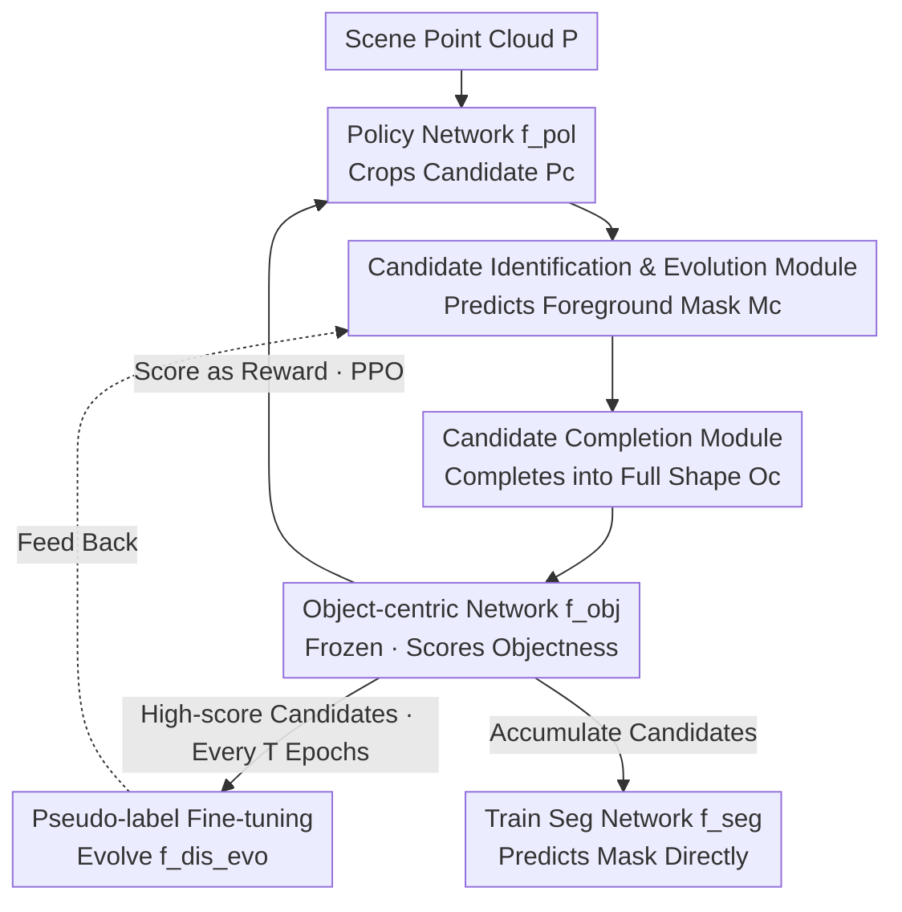

# EvObj: Learning Evolving Object-centric Representations for 3D Instance Segmentation without Scene Supervision

**Conference**: CVPR 2026  
**arXiv**: [2605.13152](https://arxiv.org/abs/2605.13152)  
**Code**: https://github.com/vLAR-group/EvObj (Available)  
**Area**: 3D Vision  
**Keywords**: Unsupervised 3D Instance Segmentation, Object-centric Prior, Domain Gap, Candidate Evolution, Point Cloud Completion

## TL;DR
Addressing the issue where "synthetic object priors cannot generalize to real-world scans" in unsupervised 3D instance segmentation, EvObj integrates two modules into the RL discovery framework of GrabS: an identification network that evolves throughout the discovery process and a point cloud completion network to recover partial candidates. By adapting synthetic priors to real-world point clouds, EvObj outperforms all unsupervised baselines on ScanNet, S3DIS, and multi-category synthetic datasets, closely approaching the supervised method 3D-BoNet on the ScanNet hidden test set.

## Background & Motivation

**Background**: Mainstream 3D instance segmentation relies either on expensive manual annotations (instance masks/boxes) for full supervision or projects 2D priors into 3D using foundation models like CLIP/SAM. To eliminate scene-level annotations, three unsupervised directions have emerged: motion-based discovery (limited to moving vehicles), lifting self-supervised 2D features (DINO) to 3D (lacks true objectness, leading to fragmented segmentation), and using 3D reconstruction priors (EFEM, GrabS). Among these, GrabS performs best in discovering complex static objects.

**Limitations of Prior Work**: GrabS employs a two-stage approach: first, it learns an "object-centric network" $f_{obj}$ as an objectness scorer using a self-supervised reconstruction network (VAE/Diffusion + SDF decoder) on ShapeNet; then, an RL policy network $f_{pol}$ is trained to manipulate a dynamic container (e.g., a cylinder) to crop candidate points from the scene. These candidates are fed to the frozen $f_{obj}$ for scoring, where higher scores yield rewards. However, a significant **geometric domain gap** exists between synthetic objects (ShapeNet chairs) and real-scanned objects (ScanNet chairs).

**Key Challenge**: The domain gap manifests in two ways: ① **Morphological Differences**: Synthetic objects have simple topologies, lacking the complex structures of real objects; ② **Occlusion and Incompleteness**: Real scans often exhibit partial geometry due to self-occlusion, mutual occlusion, or sensor truncation. Consequently, point sets cropped by the policy network (mixtures of background points and partial object parts) result in distorted objectness scores, leading to incorrect rewards and misleading discovery. $f_{obj}$ itself lacks the discriminative power to ignore background points, mechanisms to track morphological changes, or the ability to complete partial geometry.

**Goal**: To bridge the gap between "dirty candidates cropped by the policy network" and the "discriminative object-centric network" without modifying the pre-trained $f_{obj}$ or the policy network design.

**Core Idea**: Insert two checkpoints between $f_{pol}$ and $f_{obj}$: an **evolving identification network** that extracts foreground objects from noisy point sets and adapts to new morphologies, followed by a **completion network** that restores partial candidates to full shapes, ensuring $f_{obj}$ provides reliable scores.

## Method

### Overall Architecture
EvObj reuses the object-centric network $f_{obj}$ (frozen) and the dynamic container policy network $f_{pol}$ from GrabS, inserting two new modules. A discovery cycle works as follows: given an unlabeled scene point cloud $\bm{P}\in\mathbb{R}^{N\times 3}$, $f_{pol}$ crops a subset $\bm{P}_c\in\mathbb{R}^{K\times 3}$ (mixture of background and object parts). This subset first passes through the **Candidate Identification & Evolution Module** $f_{dis\_evo}$ to predict a foreground mask $\bm{M}_c$, then through the **Candidate Completion Module** $f_{comp}$ to reconstruct a complete shape $\bm{O}_c$. $\bm{O}_c$ is fed into the frozen $f_{obj}$ to get an objectness score, which serves as a reward to optimize $f_{pol}$ via PPO. High-scoring candidates are accumulated: a portion is used as pseudo-labels to fine-tune (evolve) $f_{dis\_evo}$ every $T$ epochs, and finally, all accumulated candidates serve as pseudo-labels to train a feed-forward segmentation network $f_{seg}$. At test time, only $f_{seg}$ is used to predict masks directly.

### Key Designs

**1. Candidate Identification & Evolution: Self-adapting Foreground Extraction**

The subset $\bm{P}_c$ cropped by the policy network is a mixture of background (floors, walls) and partial objects, which causes score distortion if fed directly to $f_{obj}$. The authors insert a point-wise binary classification network $f_{dis\_evo}$ (implemented with SparseConv) to extract the foreground mask: $\bm{M}_c = f_{dis\_evo}(\bm{P}_c),\ \bm{M}_c\in\mathbb{R}^{K\times 1}$. However, a static identification module cannot recognize new morphologies in the real domain. The key is a two-stage training: **Stage ① Pre-training**: Random planes (simulating walls/floors) are added to synthetic objects in ShapeNet to create "noisy point cloud → foreground label" pairs, giving the network basic extraction capabilities. **Stage ② Evolution**: During RL training, accumulated high-score masks $\{\bm{M}_c^1\cdots\bm{M}_c^H\}$ are used as **self-supervised pseudo-labels**. Every $T$ epochs, $f_{dis\_evo}$ is fine-tuned using the latest batch of pseudo-labels, which are then discarded. This allows the identification module to evolve from focusing on synthetic shapes to continuously absorbing new object variants in real scenes, creating a positive self-bootstrapping loop.

**2. Candidate Completion: Completion Before Scoring to Address Occlusion**

Even with clean foreground masks $\bm{M}_c$, objects in real scans are often partial. Since the $f_{obj}$ prior is learned from complete synthetic objects, partial inputs receive low scores, misleading the policy network. The authors use a completion network $f_{comp}$ to reconstruct the full shape: $\bm{O}_c = f_{comp}(\bm{P}_c * \bm{M}_c),\ \bm{O}_c\in\mathbb{R}^{K\times 3}$. This is implemented using the AdaPoinTr architecture, pre-trained on ShapeNet to map partial views to complete 3D shapes. The completed $\bm{O}_c$ ensures that $f_{obj}$ provides reasonable scores even for occluded candidates. Ablations show this is the primary reason for the Gain in AP@25 in occluded multi-category scenarios and that the module is robust to the choice of the completion model (AdaPoinTr / PoinTr / SnowflakeNet).

### Loss & Training
The framework is jointly trained as per Algorithm 1: $f_{obj}$, $f_{dis\_evo}$, and $f_{comp}$ are all pre-trained on ShapeNet. In the target domain training phase, $f_{pol}$ is optimized via PPO using objectness rewards. $f_{dis\_evo}$ is fine-tuned periodically (every $T=100$ epochs) using self-supervised pseudo-labels. Finally, the feed-forward segmentation network $f_{seg}$ is trained using all accumulated high-score candidates as pseudo-labels (following GrabS). $f_{obj}$ remains frozen, utilizing GrabS weights throughout.

## Key Experimental Results

### Main Results

ScanNet validation set (class-agnostic AP, %):

| Method | Supervision | AP | AP@50 | AP@25 |
|------|------|------|------|------|
| Mask3D | Supervised | 82.9 | 94.4 | 97.0 |
| UnScene3D | Unsupervised | 37.2 | 62.4 | 79.2 |
| Part2Object | Unsupervised | 34.4 | 56.8 | 73.9 |
| EFEM | Unsupervised | 24.6 | 50.8 | 61.3 |
| GrabS-VAE | Unsupervised | 46.7 | 71.5 | 82.9 |
| GrabS-Diffusion | Unsupervised | 47.1 | 70.6 | 81.1 |
| **Ours (VAE)** | Unsupervised | **55.0** | **76.9** | **88.2** |
| **Ours (Diffusion)** | Unsupervised | 54.7 | 76.0 | 88.6 |

On the ScanNet hidden test set, EvObj-VAE achieves an AP of 34.0, nearly matching the supervised method 3D-BoNet (AP 34.5). For cross-dataset generalization on S3DIS-Area5, EvObj-Diffusion achieves 60.6 AP / 82.8 AP@50, significantly outperforming GrabS-VAE (46.4 / 66.2). On multi-category synthetic datasets, EvObj-VAE reaches 62.1 AP / 90.3 AP@25, showing a substantial lead over GrabS (~82 AP@25), confirming the value of the completion module for occluded multi-category objects.

### Ablation Study (ScanNet Val, based on full EvObj, AP %)

| Config | AP | AP@50 | AP@25 | Note |
|------|------|------|------|------|
| Full EvObj | 55.0 | 76.9 | 88.2 | Complete model |
| (1) w/o identification | 45.0 | 72.0 | 86.2 | Reverts to GrabS reconstruction filtering |
| (2) w/o evolution (frozen $f_{dis\_evo}$) | 52.2 | 75.6 | 87.7 | No adaptation to real domain |
| (3) w/o pre-training (train from scratch) | 37.4 | 62.5 | 79.8 | Loses synthetic starting point |
| (4) w/o completion | 33.8 | 44.3 | 49.2 | Partial candidate scores are distorted |
| $T=50$ / $T=100$ / $T=200$ | 52.6 / 55.0 / 53.4 | — | — | Evolution frequency; $T=100$ is optimal |

### Key Findings
- **The completion module is most critical**: Removing it (4) causes AP to drop from 55.0 to 33.8 and AP@25 to crash from 88.2 to 49.2, indicating that occlusion in real scans is the primary source of score distortion.
- **Pre-training & Evolution are both essential**: Removing identification (1) drops 10 AP; keeping identification without evolution (2) drops 2.8 AP; but **training identification from scratch** (3) results in a plummet to 37.4, proving that synthetic pre-training provides an indispensable starting point, while evolution acts as continuous self-bootstrapping.
- **Robustness to hyperparameters and completion models**: AP fluctuates by only ~2.4 as $T$ varies from 50 to 200. Switching to PoinTr or SnowflakeNet maintains AP at 53-55.
- **Candidate quality rises with evolution**: Defining qualified candidates as having IoU > 60%, GrabS achieves only 53.7% at 500 epochs, while EvObj with $f_{dis\_evo}$ reaches 61.3% and leads throughout, explaining why it discovers more objects missed by the baseline.

## Highlights & Insights
- **Evolution in Unsupervised Discovery**: The identification network is not static; it uses high-score candidates from RL as pseudo-labels for self-improvement and discard, forming a "discovery → pseudo-labels → better identification → more discovery" loop. This "adapt-while-discovering" strategy can be transferred to any unsupervised discovery task with a scorer.
- **Completion for Occlusion**: The authors precisely decompose score distortion in real scans into "background noise + morphological difference + occlusion incompleteness," addressing each with identification and completion modules rather than generic "domain gap reduction."
- **Minimal Intervention Enhancement**: By freezing and reusing the GrabS $f_{obj}$ and policy network, and inserting plug-and-play modules, the approach is easy to reproduce and proves that the GrabS framework's bottleneck was strictly the domain gap.
- **Signals for Matching Supervised Methods**: Achieving performance on par with 3D-BoNet on ScanNet Test suggests that geometric reconstruction priors are highly competitive for static indoor objects.

## Limitations & Future Work
- **Category Constraints**: The object prior of $f_{obj}$ comes from specific ShapeNet categories. Evaluation on ScanNet is limited to the chair category, treating all outputs as chairs; open-vocabulary discovery remains limited by the pre-training library.
- **Dependency on Completion Quality**: The completion network is also trained on ShapeNet. If a real object's morphology is far from the training distribution, completion might introduce erroneous geometry, misleading the scorer.
- **Computational Cost**: The combination of PPO training, periodic evolution fine-tuning, and completion inference makes the training pipeline heavier than single-stage methods.
- **Pseudo-label Noise**: High-score candidates are not guaranteed to be true objects (precision cap of 61.3%). How noise accumulates or causes drift during evolution requires further analysis.

## Related Work & Insights
- **vs GrabS**: GrabS is the direct baseline and skeleton for EvObj. While GrabS uses "reconstruction prior + RL discovery," it fails to adapt synthetic priors. EvObj inserts identification, evolution, and completion to fix the domain gap, raising ScanNet Val AP from 47.1 to 55.0.
- **vs EFEM**: EFEM also learns priors from ShapeNet but uses EM optimization without RL discovery or domain adaptation, resulting in a significantly lower AP of 24.6.
- **vs UnScene3D / Part2Object**: These methods lift self-supervised 2D features (DINO/DINOv2) to 3D for clustering. They lack true objectness, leading to fragmentation (AP 37.2 / 34.4), whereas EvObj provides more complete segments and higher AP.
- **Insight**: The idea of "completion before scoring" applies to all tasks where incomplete observations are evaluated against complete priors (e.g., robotic grasping, AR object recognition). Evolving pseudo-label bootstrapping offers a lightweight paradigm for unlabeled domain adaptation.

## Rating
- Novelty: ⭐⭐⭐⭐ Inserting "evolution identification + completion" checkpoints into a reconstruction-prior discovery framework effectively addresses the domain gap.
- Experimental Thoroughness: ⭐⭐⭐⭐⭐ Covers ScanNet Val/Test, S3DIS, and synthetic benchmarks, with thorough ablations on modules, hyperparameters, and models.
- Writing Quality: ⭐⭐⭐⭐ Clear decomposition of motivation and mapping to results; some module details are relegated to the appendix.
- Value: ⭐⭐⭐⭐ Brings unsupervised 3D instance segmentation closer to supervised performance; the modules are plug-and-play and provide insights for domain adaptation.

<!-- RELATED:START -->

## Related Papers

- [\[CVPR 2026\] 2D-LFM: Lifting Foundation Model without 3D Supervision](2d-lfm_lifting_foundation_model_without_3d_supervision.md)
- [\[CVPR 2026\] CrossHOI: Learning Cross-View Representations for Monocular 3D Human-Object Interaction Reconstruction](crosshoi_learning_cross-view_representations_for_monocular_3d_human-object_inter.md)
- [\[CVPR 2026\] Towards Foundation Models for 3D Scene Understanding: Instance-Aware Self-Supervised Learning for Point Clouds](towards_foundation_models_for_3d_scene_understanding_instance-aware_self-supervi.md)
- [\[CVPR 2025\] Sketchy Bounding-Box Supervision for 3D Instance Segmentation](../../CVPR2025/3d_vision/sketchy_bounding-box_supervision_for_3d_instance_segmentation.md)
- [\[CVPR 2026\] Grounded Latents for Entity-Centric 4D Scene Generation](grounded_latents_for_entity-centric_4d_scene_generation.md)

<!-- RELATED:END -->
