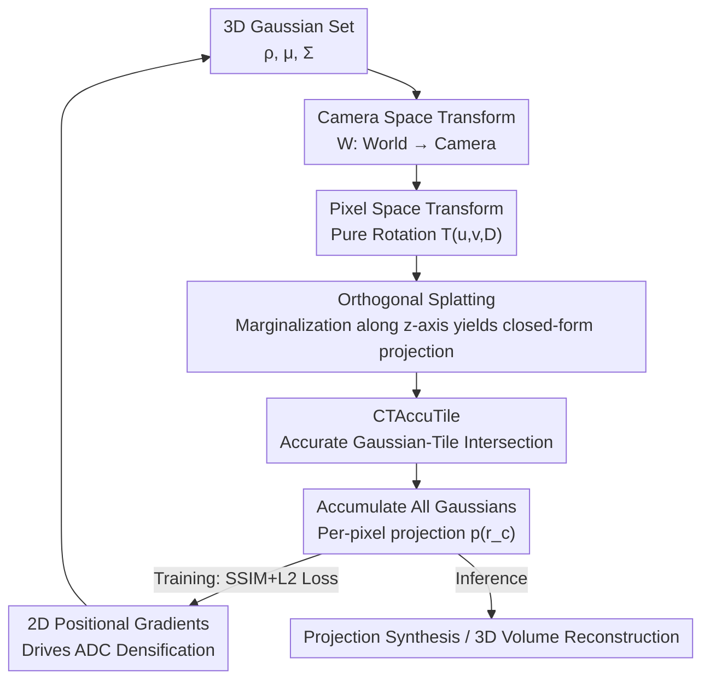

# Exact-GS: Mathematically Rigorous and Accurate 3D Gaussian Splatting for 3D X-ray Reconstruction

**Conference**: CVPR 2026  
**Paper**: [CVF Open Access](https://openaccess.thecvf.com/content/CVPR2026/html/Yang_Exact-GS_Mathematically_Rigorous_and_Accurate_3D_Gaussian_Splatting_for_3D_CVPR_2026_paper.html)  
**Code**: https://github.com/brucee1323/Exact-GS  
**Area**: 3D Vision / Gaussian Splatting / X-ray CT Reconstruction  
**Keywords**: 3D Gaussian Splatting, CBCT Reconstruction, Accurate Splatting, Closed-form Projection, Affine Approximation Error

## TL;DR
Exact-GS derives a **closed-form Gaussian splatting projection formula free of any approximations**: it projects each 3D Gaussian orthogonally to a per-pixel "pixel plane" and analytically integrates them. This makes splatting rendering mathematically equivalent to ray-tracing integration, thereby eliminating the local affine approximation error inherent in traditional 3DGS (achieving a projection PSNR approximately 94 dB higher than R2-GS) while remaining about 2× faster than ray tracing, applied to X-ray CT projection synthesis and volume reconstruction.

## Background & Motivation
**Background**: Cone-Beam CT (CBCT) and pinhole cameras share the same geometric model, where the core challenge is reconstructing 3D volumes from sparse-angle 2D projections. NeRF-like methods (IntraTomo, NAF, SAX-NeRF) can learn continuous representations but suffer from massive volume grid sizes, slow rendering, and high VRAM consumption. 3D Gaussian Splatting (3D-GS) addresses this efficiency issue via GPU rasterization, and R2-GS further adapts 3D-GS to CBCT by correcting the integration bias.

**Limitations of Prior Work**: All mainstream 3DGS methods rely on a "local affine approximation"—it only keeps the first two terms of the Taylor expansion of the projective transformation at the Gaussian center, approximating 3D Gaussians projected onto the **same image plane** as 2D Gaussians. This approximation has two major consequences: ① The projection itself introduces errors, leading to inconsistencies among projections from different angles, which disrupts optimization convergence and introduces artifacts in reconstructions. ② Compressing the entire Gaussian into a 2D Gaussian on a single image plane blurs edges and compromises the ability to represent high-frequency structures. Optimal-GS uses a tangent plane to minimize this error, but **remains error-free only along the "light source $\rightarrow$ Gaussian center" direction**.

**Key Challenge**: A long-standing trade-off exists between projection quality and rendering efficiency. To be "accurate," one must integrate along rays as in 3DGRT, RaySplats, or CT-domain ray tracing (which are error-free but extremely slow in both forward and backward passes). To be "fast," one must use splatting approximations (which are fast but suffer from affine errors). No existing method achieves both simultaneously.

**Goal**: To deliver a mathematically rigorous, zero-approximation projection formula **within the splatting framework**, making its rendering results pixel-wise identical to ray-tracing integration, while preserving the speed advantage of splatting (which can be rasterized on GPU hardware via CUDA) and supporting end-to-end differentiable CT reconstruction.

**Key Insight**: The authors observe that the root cause of the affine approximation is forcing all Gaussians to be projectively mapped onto a single, shared image plane. If a **dedicated "pixel plane" is defined individually for each pixel** such that the ray aligns exactly with the z-axis of this coordinate system, the integration along the ray degrades to a **marginalization** of the multivariate Gaussian along one dimension—and the marginal distribution of a Gaussian remains a Gaussian with a closed-form solution. Thus, the integration simplifies to an analytical expression.

**Core Idea**: Rather than projecting Gaussians onto a unified image plane, a **pure rotation matrix $T$ is used to transform each Gaussian into "the pixel-specific plane of that pixel"**, where orthogonal splatting is performed. The marginalization property then directly yields the exact projection value of that pixel—mathematically equivalent to ray-tracing integration but computed entirely in closed form.

## Method

### Overall Architecture
Exact-GS is a differentiable Gaussian splatting rasterizer designed for X-ray CT. Objects are represented as a set of anisotropic 3D Gaussian kernels $G_i(x|\rho_i,\mu_i,\Sigma_i)$, each characterized by a learnable position $\mu_i$, a covariance matrix $\Sigma_i$ (decomposed via rotation $R_i$ and scale $S_i$ as $\Sigma_i=R_iS_iS_i^TR_i^T$), and a center density $\rho_i$. The total attenuation at any point is the sum over all kernels. The entire rendering pipeline proceeds as follows: 3D Gaussians $\rightarrow$ (world-to-camera transform $W$) camera-space Gaussians $\rightarrow$ (constructing a pure rotation $T$ based on the current pixel) pixel-space Gaussians $\rightarrow$ (orthogonal splatting / marginalization along the z-axis) exact projection value of the pixel $\rightarrow$ accumulating all Gaussians to yield downstream pixel readings. During training, a composite SSIM+L2 loss is optimized over 30k steps via ADAM to backpropagate and update the Gaussian parameters. Two matching engineering components are also introduced: **CTAccuTile** (which accurately assigns Gaussians to tiles to ensure GPU-parallelized rasterization only renders contributing tiles) and **2D positional gradients** accumulation for Adaptive Density Control (ADC).

### Key Designs

**1. Per-pixel pixel-space transform: replacing the affine approximation with a pure rotation**

The source of error in the affine approximation is using the Jacobian $J_i$ of the projective transformation at the Gaussian center to linearize the entire projection, squeezing all Gaussians onto a single image plane. Exact-GS instead adopts the CBCT coordinate system from R2-GS, expressing the camera-space ray corresponding to each detector pixel $x_d=[u,v]^\top$ as $r_c(t)=t\,d$, with direction $d=[u/l,v/l,D/l]^\top$ and $l=\sqrt{u^2+v^2+D^2}$ (where $D$ is the distance from the source to the detector). Then, a **"pixel space" is defined for this pixel**, with its origin coincident with the camera space and its z-axis $Z_p$ pointing directly at the pixel. The key is to construct a **pure rotation matrix $T(u,v,D)$ that depends only on the pixel position and camera intrinsic parameters** to rotate the camera-space Gaussian as a whole: $\mu_{i,p}=T\mu_{i,c}$ and $\Sigma_{i,p}=T\Sigma_{i,c}T^\top$. The objective of $T$ is to rotate the pixel direction $d$ to the vertical direction of the camera space $d_0=[0,0,1]^\top$ (i.e., $d_0=Td$), yielding the closed form via Rodrigues' rotation formula:

$$T(u,v,D)=I+N\sin(\phi)+N^2(1-\cos(\phi)),$$

where the rotation axis is $n=(d\times d_0)/(\|d_0\|\|d\|\sin\phi)$, $\cos\phi=d\cdot d_0/(\|d_0\|\|d\|)$, and $N=\lfloor n\rfloor$ is the skew-symmetric matrix of $n$. Since this is a pure rotation without any linearization truncation, this step **introduces no approximation error**, and $T$ has a closed-form expression that can be efficiently computed in CUDA. This constitutes the geometric foundation of the exact formulation.

**2. Orthogonal splatting: deriving closed-form ray integration via Gaussian marginalization**

In the defined pixel space for the pixel, the ray aligns exactly with the positive z-axis: $r_p(t)=tTd=t\,d_0=t[0,0,1]^\top$. Consequently, "integrating along the ray" simplifies to the marginalization of the Gaussian along the $z$-dimension. After discarding the irrelevant components, the remaining marginal distribution remains Gaussian, which can be analytically integrated to yield the projection of that pixel:

$$p_i(r_p)=\frac{\rho_i(2\pi)^{1/2}|\Sigma_{i,p}|^{1/2}}{|\hat{\Sigma}_{i,p}|^{1/2}}\exp\!\left(-\tfrac{1}{2}\hat{\mu}_{i,p}^T\hat{\Sigma}_{i,p}^{-1}\hat{\mu}_{i,p}\right),$$

where $\hat{\mu}_{i,p}$ and $\hat{\Sigma}_{i,p}$ represent the first two elements of $\mu_{i,p}$ and the upper-left $2\times2$ submatrix of $\Sigma_{i,p}$ (i.e., the 2D Gaussian projected orthogonally onto the pixel plan). The final pixel reading is the sum over all Gaussians: $p(r_c)=\sum_i p_i(r_p)$. The authors emphasize that this represents the **mathematically exact projection of the pixel along direction $r_c$, aligning pixel-by-pixel with the ray-tracing integration**. Why does it remain faster than ray tracing? While ray tracing requires numerical or analytical sampling along rays for each Gaussian, this design leverages the fact that the "marginal distribution of a multivariate Gaussian remains a Gaussian" to obtain a closed-form expression. The forward pass requires only a single analytical evaluation, and the backward pass avoids the complex path-based gradients of ray tracing—empirically rendering about 2× faster in the forward pass, and substantially faster in the backward pass (where ray-tracing backward times are $\gg44$ ms). This represents a hybrid of "splatting efficiency + ray-tracing accuracy."

**3. CTAccuTile: accurate Gaussian-tile intersection based on density and integration bias thresholds**

GPU parallel rasterization maps each Gaussian to the tiles it affects. 3D-GS and R2-GS directly use the 3-sigma bounding box of the 2D Gaussian to determine the region of influence, but overlook density and integration biases, which leads to processing many tiles with negligible contributions and wasting computation. Exact-GS implements CTAccuTile based on Speedy-Splat, using $\rho_i|\Sigma_{i,p}|^{1/2}|\hat{\Sigma}_{i,p}|^{-1/2}$ (the scale of the projection intensity of the Gaussian on the pixel plane) as the intersection threshold—**only valid tiles with projection values exceeding this threshold are rendered**. This precisely models the Gaussian-tile intersection, prunes invalid tiles, and makes rendering faster and more resource-efficient.

**4. 2D positional gradients: accumulating gradients on the pixel plane for a fair comparison with R2-GS densification**

The Adaptive Density Control (ADC) in 3DGS (pruning, splitting, and cloning based on gradient thresholds) relies on positional gradients as an indicator. 3DGRT uses 3D world-space gradients, but to ensure a fair comparison with R2-GS, Exact-GS retains the image-plane positional gradients: it first accumulates the gradients of the 3D Gaussian positions from different pixel planes back to the camera space, and then calculates the magnitude of the 2D image-plane positional gradient $\tau_i$ according to:

$$\tau_i=\frac{1}{N}\sum_{j=0}^{N}\left\|\frac{\partial\mathcal{L}}{\partial\hat{\mu}_{(i,j),c}}\cdot\frac{\overline{\mu_{i,c}}}{D}\right\|$$

(where $i, j$ index the Gaussians and projections, respectively, and $\mathcal{L}$ is the loss). This step aligns the densification mechanism with the existing 3DGS pipeline, ensuring that the benefits of the exact projection are not confounded by a changed densification strategy.

### Loss & Training
Custom PyTorch operators are implemented in C++/CUDA (built on 3D-GS and R2-GS), with default training of 30k steps on a single RTX 4090. The loss function consists of a combination of D-SSIM structural similarity loss and L2 squared error, optimized via ADAM. To isolate ADC interference and simulate true continuous integration in synthetic data, the authors **developed a custom ray-tracing renderer with exact integration** to synthesize ground-truth projections (making the loss function quasi-convex and the optimization more reliable), initializing Gaussians with "reference values + perturbations". For real-world datasets, FDK is used to obtain point clouds for initial representations, and both Exact-GS and R2-GS share identical learning rates and initialization settings.

## Key Experimental Results

### Main Results

Single-Gaussian projection error (referenced against ray-tracing integration):

| Method | PSNR-2D↑ | SSIM-2D↑ | LPIPS↓ |
|------|----------|----------|--------|
| R2-GS | 55.56 | 0.9988 | 1.59×10⁻⁵ |
| Optimal-GS | 50.43 | 0.9967 | 4.37×10⁻⁵ |
| **Exact-GS** | **149.64** | **1.0000** | **1.53×10⁻¹³** |

> Exact-GS boosts the projection PSNR from ~55 dB to approximately 149 dB (stated as "a 94 dB improvement over R2-GS" in the abstract). Its residual error stems entirely from GPU single-precision floating-point limits, meaning there is mathematically zero approximation error.

Synthetic dataset volume reconstruction (subset of views, PSNR-3D / SSIM-3D):

| Method | 75 views PSNR-3D | 50 views PSNR-3D | 25 views PSNR-3D |
|------|-----------------|-----------------|-----------------|
| FDK | 28.11 | 25.31 | 20.77 |
| SART | 34.86 | 31.51 | 26.41 |
| NAF (14.27M) | 40.86 | 39.18 | 35.80 |
| TensoRF (12.64M) | 39.47 | 37.96 | 33.43 |
| R2-GS | 57.17 | 54.86 | 45.54 |
| **Exact-GS** | **59.17** | **56.89** | **45.83** |

At 75 views, Exact-GS improves volume reconstruction by approximately 1.9 dB compared to R2-GS. Overall, Gaussian-based methods clearly outperform NeRF-like methods (partially due to better initialization).

Runtime (673,434 Gaussian instances, single RTX 4090, in ms):

| Method | Forward | Backward | Total | Ratio to R2-GS |
|------|------|------|------|-------------|
| R2-GS | 0.543 | 21.358 | 21.901 | 1.0 |
| Ray Tracing | 16.746 | ≫35.727 | ≫44.422 | ≫2.028 |
| **Exact-GS** | **8.695** | 35.727 | 44.422 | 2.028 |

Exact-GS is about 2× faster in the forward pass than ray tracing, and its backward pass is significantly faster. Its total reconstruction time is approximately double that of R2-GS, comparable to NAF (28m 26s vs. 25m 44s), but far faster than SAX-NeRF (7h 22m).

### Ablation Study
Comparison with R2-GS under different initialization errors (higher Case number denotes smaller initialization error):

| Configuration | PSNR-2D↑ | PSNR-3D↑ | Description |
|------|----------|----------|------|
| R2-GS Case 1 | 61.84 | 43.88 | Large init error |
| Exact-GS Case 1 | 61.84 | 43.95 | Slight improvement |
| R2-GS Case 3 | 64.42 | 47.62 | Medium init error |
| Exact-GS Case 3 | 65.20 | 47.72 | Superior |
| R2-GS Case 4 | 70.28 | 57.08 | Small init error |
| **Exact-GS Case 4** | **73.57** | **59.13** | More accurate initialization yields greater improvement |

Convergence study (single Gaussian, trained on 5 projections): Exact-GS reaches a projection PSNR-2D of 147.28 (versus 66.36 for R2-GS) and a volume reconstruction PSNR-3D of 155.26 (versus 88.27 for R2-GS). Loss curves show that Exact-GS falls and remains stable after ~3,600 epochs, whereas R2-GS initially converges to an incorrect value close to GT but then oscillates violently (with position parameters $x$ and $z$ showing clear jitter after 8,000 steps).

### Key Findings
- **The affine approximation is the root cause of optimization instability**: R2-GS converges to incorrect values and then oscillates even on a single Gaussian, demonstrating that the local affine approximation introduces varying errors for each projection angle, which breaks optimization convergence. Exact-GS enables all Gaussian parameters to converge accurately.
- **More accurate initialization yields greater benefits from exact projection** (leading by ~3.3 dB PSNR-2D / ~2 dB PSNR-3D in Case 4). This indicates that error elimination primarily unlocks high-precision details in the late stages of optimization.
- **NeRF-like methods report higher metrics on real-world data but output worse details**: On real-world FIPS walnut data, NeRF-like methods achieve slightly better PSNR values numerically, but visualizations show they lose high-frequency details and suffer from noticeable blurriness. Both 3DGS methods clearly reconstruct structural edges, and Exact-GS achieves slightly higher PSNR-3D using fewer Gaussians (50,010 vs. 50,186 for R2-GS), while outperforming R2-GS across all 2D metrics.
- **Densification is the bottleneck**: Under the existing ADC densification scheme, the lead of exact projection is partially offset by stripe artifacts in smooth areas, which degrades the global PSNR. As a result, its advantage on real-world data is less pronounced.

## Highlights & Insights
- **Reformulating "integration" as "marginalization"**: The core insight is establishing a per-pixel pixel space that aligns the ray with the z-axis, turning ray integration into the marginalization of a Gaussian along one dimension—where the marginal distribution remains Gaussian and has a closed-form solution. This resolves the trade-off between "accuracy" and "speed," providing a true "aha" moment.
- **Pure rotation $T$ instead of Jacobian linearization**: Utilizing Rodrigues' rotation formula to derive a closed-form rotation based solely on pixel positions and intrinsic parameters geometrically avoids the truncation errors of Taylor expansions. The residual error is limited only by GPU single-precision floating-point limits (around the scale of $10^{-13}$).
- **High transferability**: The concept of exact splatting is not restricted to X-ray CT. The authors note that it can be applied to all 3DGS methods, such as computing transmittance integrals in natural light scenes—any scenario requiring "integration of Gaussians along rays" can benefit from closed-form marginalization.
- **Engineering-level accuracy**: CTAccuTile refines "which tiles are affected by Gaussians" from a rough 3-sigma bounding box to precise intersections based on projection intensity thresholds, demonstrating the thorough implementation of accuracy down to the rasterization layer.

## Limitations & Future Work
- **Authors' self-acknowledged limitations**: ① Densification remains a bottleneck—3DGS is highly sensitive to local minima and relies on ADC pruning/splitting/cloning. Under the current densification scheme, Exact-GS does not show a massive lead on real-world data, and stripe artifacts in smooth areas degrade global PSNR. ② The work only validates accuracy and convergence without exploring hardware-accelerated rendering platforms like VKGS / NVIDIA OptiX or second-order optimization to further speed up the process.
- **Identified limitations**: The synthetic experiments heavily rely on a controlled setup ("custom ray-tracing integration for GT synthesis + initialization with reference value + perturbation" to make the loss quasi-convex), which diverges from clinical noise and motion realities. On real FIPS data, the relative motion of objects during scans is not compensated, and the overall reconstruction time is approximately twice that of R2-GS.
- **Future directions**: Jointly optimizing the exact projection with more robust densification/regularization (to suppress stripe artifacts); or porting the closed-form splatting to hardware pipelines like OptiX/VKGS and applying second-order optimization to offset the 2× time overhead.

## Related Work & Insights
- **vs. R2-GS**: R2-GS was the first to adapt 3D-GS to CBCT and correct the integration bias, but still relies on local affine approximations onto a unified image plane. Exact-GS uses per-pixel space transformation + marginalization to deliver zero-approximation closed-form projection, elevating projection PSNR by ~94 dB and stabilizing convergence at the cost of doubling the overall reconstruction time.
- **vs. Optimal-GS**: Optimal-GS uses a tangent plane to minimize affine errors, but is only error-free along the direction of "light source $\rightarrow$ Gaussian center". Exact-GS is accurate along all pixel directions.
- **vs. Ray-Tracing Methods (3DGRT / RaySplats / CT-domain ray tracing)**: These methods integrate along rays to achieve exact results but are exceedingly slow in both forward and backward passes. Exact-GS delivers pixel-wise identical exact results within a splatting framework, preserving CUDA rasterization speeds—representing a hybrid of "splatting efficiency × ray-tracing accuracy."
- **vs. NeRF-like Methods (NAF / TensoRF / SAX-NeRF)**: NeRF-like volumetric representations suffer from slow rendering speeds, high VRAM consumption, and a tendency to lose high-frequency details on real-world data. Gaussian-based methods allow better initialization and reconstruct sharper edges.

## Rating
- Novelty: ⭐⭐⭐⭐⭐ Formulates ray integration as pixel-space marginalization to provide a zero-approximation closed-form splatting, fundamentally resolving the long-standing affine approximation error in 3DGS.
- Experimental Thoroughness: ⭐⭐⭐⭐ Covers synthetic/real data, projection/reconstruction, convergence/runtime, and ablation studies. However, the advantage on real data is less pronounced, and it relies on a controlled custom synthetic setup.
- Writing Quality: ⭐⭐⭐⭐ Mathematical derivations are clear with helpful diagrams; some formula and coordinate system definitions are dense, requiring reference to the appendix.
- Value: ⭐⭐⭐⭐⭐ The core concept is transferable to all 3DGS rendering tasks (including natural light fields), establishing a general mathematical foundation for "accurate splatting."

<!-- RELATED:START -->

## Related Papers

- [\[CVPR 2026\] Stochastic Ray Tracing for the Reconstruction of 3D Gaussian Splatting](stochastic_ray_tracing_for_the_reconstruction_of_3d_gaussian_splatting.md)
- [\[CVPR 2026\] BA-GS: Bayesian Adaptive Gaussian Splatting for SFM-Free 3D Reconstruction](ba-gs_bayesian_adaptive_gaussian_splatting_for_sfm-free_3d_reconstruction.md)
- [\[CVPR 2026\] Geometric-Photometric Event-based 3D Gaussian Ray Tracing](geometric-photometric_event-based_3d_gaussian_ray_tracing.md)
- [\[CVPR 2026\] Urban-GS: A Unified 3D Gaussian Splatting Framework for Compact and High-Fidelity Aerial-to-Street Reconstruction](urban-gs_a_unified_3d_gaussian_splatting_framework_for_compact_and_high-fidelity.md)
- [\[CVPR 2026\] GS²: Graph-based Spatial Distribution Optimization for Compact 3D Gaussian Splatting](gs2_graph-based_spatial_distribution_optimization_for_compact_3d_gaussian_splatt.md)

<!-- RELATED:END -->
