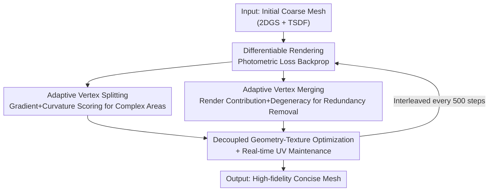

# ExMesh: EXplicit Mesh Reconstruction with Topology Adaptation

**Conference**: CVPR 2026  
**arXiv**: [2606.07288](https://arxiv.org/abs/2606.07288)  
**Code**: None (Paper not public)  
**Area**: 3D Vision  
**Keywords**: Explicit Mesh Reconstruction, Topology Adaptation, Vertex Splitting/Merging, Differentiable Rendering, UV Decoupling

## TL;DR
ExMesh embeds "discrete topology operations (vertex splitting/merging)" directly into a "continuous differentiable optimization" pipeline to optimize an explicit triangle mesh end-to-end from multi-view images. Without intermediate representations like Marching Cubes/TSDF or post-processing, and featuring real-time UV maintenance, it achieves a superior balance between precision, efficiency, and mesh conciseness (reaching SOTA-equivalent Chamfer distance on DTU in 13 minutes with approximately 196K faces).

## Background & Motivation
**Background**: Surface mesh reconstruction from multi-view images follows three main paradigms. Implicit methods (e.g., NeuS, Neuralangelo) use MLPs to learn continuous SDF/density fields but require discretizing the field into high-resolution voxels followed by Marching Cubes for extraction. Explicit Gaussian methods (3DGS, 2DGS) offer fast training and rendering, but Gaussians are essentially unstructured point clouds, necessitating TSDF fusion or Poisson reconstruction to generate meshes. Mesh-driven methods (Nvdiffrec, FlexiCubes, IMLS-Splatting) introduce differentiable rasterization to pass gradients directly to mesh attributes, yet their optimization targets remain **intermediate carriers** (SDF, point clouds, or voxels) rather than the mesh itself.

**Limitations of Prior Work**: The aforementioned routes are "indirect"—implicit methods are slow and struggle with sharp edges or fine structures; Gaussian methods produce discrete fragments and noise after post-processing; intermediate carrier methods increase framework complexity and introduce precision bias. Texturing is particularly problematic: if texture is stored on vertices/faces, even simple geometry requires a massive face count to express detailed textures, leading to face count explosion. While decoupled UV maps are ideal, **real-time maintenance of UV coordinates** during dynamic topology changes has remained an unsolved challenge.

**Key Challenge**: Directly optimizing explicit meshes faces a dilemma at the geometric level: "adaptive refinement vs. structural integrity"—standard global uniform refinement quadruples all faces, leading to redundancy in flat areas and insufficient detail in complex regions, while vertex displacement easily generates degenerate faces that degrade precision. At the texture level, the dilemma is "texture decoupling vs. dynamic topology"—Nvdiffrec uses coordinate MLPs for decoupling but requires freezing topology to maintain mapping continuity, often needing post-training baking.

**Goal**: Discard all intermediate representations to directly optimize mesh vertex positions and an independent UV map, while solving: (1) how to adaptively refine topology without introducing degenerate faces; (2) how to maintain UV coordinate consistency in real-time during topological evolution.

**Core Idea**: Seamlessly interweave "continuous gradient optimization" with "discrete topology updates"—gradients optimize vertex positions, while complex areas are periodically split based on "gradient + curvature" and redundant/degenerate faces are merged based on "rendering contribution + degeneracy". UV coordinates are updated synchronously during every topological change, achieving end-to-end coarse-to-fine explicit mesh reconstruction.

## Method

### Overall Architecture
ExMesh takes an initial coarse mesh $\mathcal{M}_{init}$ (obtained via 2DGS trained for 7k steps + TSDF extraction at $256^3$) and outputs a high-fidelity, concise mesh ready for rasterization rendering and editing. Each iteration uses the differentiable renderer nvdiffrast to render the current viewpoint image $\hat{I}$ and calculate photometric loss against the ground truth $I$. Backpropagated gradients drive two **decoupled by design** optimization loops: geometry optimization updates vertex 3D positions $\mathbf{V}$, and texture optimization refines an independent UV map $\mathbf{T}$ at a fixed resolution. Crucially, discrete **vertex splitting and merging** operations are periodically inserted (every 500 steps) into the continuous optimization, with synchronous UV maintenance at each topological change—enabling dynamic mesh refinement and redundancy clearing from coarse to fine.

### Key Designs

**1. Adaptive Vertex Splitting: Adding Faces Only Where Necessary Without Degeneracy**

Addressing the pain point where "global uniform four-way splitting" wastes faces in flat regions yet lacks detail in complex ones, ExMesh borrows vertex splitting concepts from mesh generation and combines them with 3DGS-style density control. Face refinement is scored by two clues: **Optimization Error Significance**, measured by the vertex EMA gradient magnitude $\mathcal{G}_v$—calculated as an exponential moving average of the position gradient norm $\mathcal{G}_v^{(t)}=(1-\beta_g)\mathcal{G}_v^{(t-1)}+\beta_g\lVert\nabla_{\mathbf{V}}^{(t)}\rVert$; and **Geometric Complexity**, measured by curvature $\mathcal{K}_f$, defined as the average angle between the face normal $\mathbf{n}_f$ and its neighbors $\mathcal{K}_f=\frac{1}{N_{adj}}\sum_{\mathcal{F}_{adj}}\arccos(\mathbf{n}_f\cdot\mathbf{n}_{adj})$. A face-level score $S_f=\alpha\mathcal{G}_f+\beta\mathcal{K}_f$ (where $\mathcal{G}_f$ is the mean $\mathcal{G}_v$ of its three vertices) serves as the sampling probability, with candidates restricted to the top 50% of faces by area to prevent ineffective splitting.

Operationally, the edge with the highest "length/vertex degree" $S_e=l_e/d_e$ is selected for splitting. The opposite vertices $v_c, v_d$ are projected onto the edge, and the midpoint of the projections becomes the new vertex $v_s$ to better fit the local surface. Two old faces are replaced by four new ones. To **avoid degenerate faces**, two constraints are vital: skipping operations if an adjacent face was modified in the current round (preventing conflicts), and ensuring the relative position $\alpha=\lVert v_s-v_a\rVert/\lVert v_b-v_a\rVert$ falls within the central interval $[0.25, 0.75]$ to prevent creating needle-like faces.

**2. Adaptive Vertex Merging: Cleaning Redundant and Degenerate Faces**

As a counterpart to splitting, merging functions similarly to "edge collapse" in mesh simplification to restore clean topology. A face is judged for merging based on: **Rendering Visibility**, using a contribution counter $\mathcal{C}_{render}(\mathcal{F})$ to record rasterization frequency—faces with $\mathcal{C}_{render}=0$ never contribute to output (e.g., internal or fully occluded faces) and are redundant; and **Geometric Morphology**, measured by degeneracy $\mathcal{D}_f=\frac{\text{Area}(\mathcal{F})}{l_{\max}^2(\mathcal{F})}$. Faces in the bottom 50% of area that meet either criterion enter the merge set $\mathcal{M}_{merge}$.

Boundary faces collapse their boundary edges to preserve shape, while internal faces collapse the edge with the smallest $S_e$. The lower-degree vertex $v_m$ is merged into $v_i$. This removes $v_m$ and its associated degenerate faces while re-linking adjacent faces to maintain the local manifold structure. Like splitting, "skipping modified faces" prevents topological errors. This balance between splitting for "detail addition" and merging for "redundancy removal" keeps face counts controlled (final ~196K, significantly fewer than GeoSVR's 1.12M).

**3. Decoupled Geometry-Texture Optimization + Real-time UV Maintenance: Maintaining Continuity under Dynamic Topology**

To solve the conflict between "texture stored on geometry causing face explosion" and "difficulty in maintaining decoupled UVs during topology changes," ExMesh fully decouples the two: geometry is represented by vertex positions $\mathbf{V}$, while texture resides in a **fixed-resolution** independent UV map $\mathbf{T}$, linked by UV coordinates $\mathbf{u}$. During rendering, $\mathbf{V}$ determines projection, and interpolated $\mathbf{u}$ samples $\mathbf{T}$ for color. Gradients propagate independently to geometry and texture. Consequently, the resolution of $\mathbf{T}$ is independent of face count—concise meshes can express high-frequency textures.

The challenge lies in updating UVs during topology changes. When splitting adds a vertex $v_s$: if on a boundary edge, $u_s$ is the midpoint of $u_a, u_b$; if on an interior edge, $v_s$ may be shared by faces belonging to different UV islands. In this case, candidates $u_s^{(1)}$ and $u_s^{(2)}$ are interpolated in respective UV spaces. If $\lVert u_s^{(1)}-u_s^{(2)}\rVert<\tau_{uv}$, they are averaged; otherwise, both are stored independently to preserve **texture seams**. Merging cleans up any unreferenced UV coordinates. This "on-the-fly UV update" enables ExMesh to achieve both dynamic topology and texture decoupling.

### Loss & Training
The total loss is a weighted combination: $\mathcal{L}=\lambda_{rgb}\mathcal{L}_{rgb}+\lambda_{d}\mathcal{L}_{d}+\lambda_{m}\mathcal{L}_{m}+\lambda_{s}\mathcal{L}_{s}+\lambda_{b}\mathcal{L}_{b}$. $\mathcal{L}_{rgb}$ follows the 3DGS combination of $(1-\lambda_{dssim})\mathcal{L}_{L1}+\lambda_{dssim}\mathcal{L}_{D\text{-}SSIM}$. $\mathcal{L}_{d}$ is the Pearson depth loss with references from Depth Anything 3. $\mathcal{L}_{m}$ is the silhouette loss. $\mathcal{L}_{s}$ is the Laplacian smoothing term, and $\mathcal{L}_{b}$ is the bi-vertex offset regularization from FlexiCubes. Training involves: 1k steps of warm-up; 1k–7k steps with splitting/merging and UV updates every 500 steps and UV map rebuilding every 2000 steps; and a final 1k steps with frozen topology for refinement. The process runs on a single RTX 3090.

## Key Experimental Results

### Main Results
The DTU dataset (15 real objects) uses Chamfer Distance (CD) for geometry quality. ExMesh shows significant advantages in training time and face count while maintaining SOTA-comparable accuracy.

| Dataset | Metric | ExMesh | GeoSVR (Best Acc.) | PGSR | 2DGS |
|--------|------|--------|------------------|------|------|
| DTU | Avg. CD↓ | 0.58 | 0.47 | 0.52 | 0.76 |
| DTU | Train Time↓ | 13min | 49min | 30min | 11min |
| DTU | Face Count↓ | 196K | 1.12M | 1.05M | 260K |

ExMesh's precision (0.58) sits between the top-tier methods (GeoSVR 0.47 / PGSR 0.52) and 2DGS (0.76), but it reaches this level using approximately 1/6 the faces and 1/4 the time of GeoSVR. On NeRF-synthetic, it achieves an average CD of 0.64 with ~216K faces in 13 minutes.

Regarding rendering quality (NeRF-synthetic, Novel View Synthesis), ExMesh leads among mesh-driven methods:

| Method | PSNR↑ | SSIM↑ | LPIPS↓ |
|------|-------|-------|--------|
| Nvdiffrec | 26.87 | 0.930 | 0.090 |
| FlexiCubes | 27.50 | 0.930 | 0.080 |
| IMLS-Splat | 28.38 | 0.950 | 0.060 |
| **Ours (ExMesh)** | **29.32** | **0.958** | **0.051** |
| 2DGS (Gaussian-based) | 33.07 | 0.968 | 0.031 |

ExMesh is the best among mesh-driven methods but still trails Gaussian methods (33.07 PSNR). This is attributed to Gaussians using Spherical Harmonics (SH) for flexible view-dependent appearance modeling.

### Ablation Study
Comparing five variants on NeRF-synthetic:

| Configuration | CD↓ | PSNR↑ | Face Count | Description |
|------|-----|-------|------|------|
| Only Split | 0.74 | 28.77 | 239K | Can add detail but face count explodes |
| Only Merge | 1.81 | 23.51 | 12K | Cannot fit detail; precision collapses |
| Random Split | 0.77 | 28.30 | 184K | Disordered and irregular triangulation |
| Random Merge | 1.34 | 26.27 | 192K | Incorrect collapses introduce distortion |
| **Ours (full)** | **0.64** | **29.32** | 196K | Split + Merge synergy is optimal |

### Key Findings
- **Synergy between Splitting and Merging**: "Only Merge" is unable to add detail (CD 1.81), while "Only Split" causes face explosion (239K). Interweaving both achieves the best performance.
- **Precise Splitting Position**: Random Splitting (CD 0.77) proves that the "midpoint projection + interval constraint" strategy is superior for maintaining local mesh regularity.
- **Robustness to Initialization**: Even using a 1000-face random colored sphere as initialization, the pipeline reconstructs the target, demonstrating robustness beyond carefully selected coarse meshes.

## Highlights & Insights
- **Seamless Interweaving of Discrete & Continuous Operations**: This is the core "Aha!" moment. Unlike methods that are purely continuous (optimizing carriers) or purely discrete (remeshing), ExMesh treats topology changes as discrete steps inserted into continuous optimization, using constraints to preserve structural integrity.
- **Scoring-Driven "On-Demand" Refinement**: Splitting and merging use optimization signals (EMA gradients, render contribution) to decide where to refine and where to simplify, a generalizable approach for any differentiable mesh task.
- **UV Seam Management**: The mechanism to automatically decide between merging UV coordinates or maintaining independent ones during splitting is a clever engineering solution to the "dynamic topology vs. texture decoupling" conflict.

## Limitations & Future Work
- **Rendering Quality Gap**: Explicit meshes lack view-dependent modeling like SH, leading to lower PSNR compared to 2DGS.
- **Initial Mesh Dependency**: While it can converge from a sphere, the standard pipeline still relies on a 2DGS + TSDF pre-step.
- **Geometry Precision**: While highly efficient and concise, it does not yet exceed the absolute geometric precision of GeoSVR.
- **Heuristic-based Thresholds**: Parameters like $\tau_{degen}$ and $\tau_{uv}$ are empirically determined, which may affect replicability across diverse scenes.

## Related Work & Insights
- **vs. Nvdiffrec / FlexiCubes**: Those methods optimize continuous SDF carriers. ExMesh directly optimizes the mesh and maintains UVs in real-time, offering a better balance of face count and precision.
- **vs. IMLS-Splatting / GeoSVR**: These use point clouds/voxels as carriers, causing face count explosion (GeoSVR 1.12M) and floating artifacts. ExMesh produces cleaner, more efficient meshes (13 min vs. 49 min).
- **vs. 2DGS / GOF**: Gaussian methods provide higher rendering quality but require post-processing for meshes. ExMesh provides end-to-end editable manifold meshes at the cost of slightly lower rendering quality.

## Rating
- Novelty: ⭐⭐⭐⭐⭐ 
- Experimental Thoroughness: ⭐⭐⭐⭐ 
- Writing Quality: ⭐⭐⭐⭐ 
- Value: ⭐⭐⭐⭐ 

<!-- RELATED:START -->

## Related Papers

- [\[CVPR 2026\] Learning Explicit Continuous Motion Representation for Dynamic Gaussian Splatting from Monocular Videos](learning_explicit_continuous_motion_representation_for_dynamic_gaussian_splattin.md)
- [\[CVPR 2026\] Anny-Fit: All-Age Human Mesh Recovery](anny-fit_all-age_human_mesh_recovery.md)
- [\[CVPR 2026\] ActionMesh: Animated 3D Mesh Generation with Temporal 3D Diffusion](actionmesh_animated_3d_mesh_generation_with_temporal_3d_diffusion.md)
- [\[CVPR 2026\] CraftMesh: High-Fidelity Generative Mesh Manipulation via Poisson Seamless Fusion](craftmesh_high-fidelity_generative_mesh_manipulation_via_poisson_seamless_fusion.md)
- [\[CVPR 2026\] Fall Risk and Gait Analysis using World-Spaced 3D Human Mesh Recovery](fall_risk_gait_analysis_hmr.md)

<!-- RELATED:END -->
