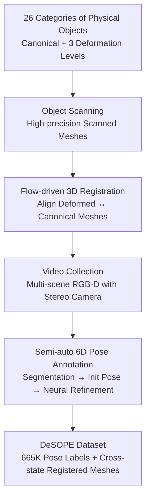

# Exploring 6D Object Pose Estimation with Deformation

**Conference**: CVPR 2026  
**arXiv**: [2604.06720](https://arxiv.org/abs/2604.06720)  
**Code**: https://desope-6d.github.io/ (Project Page)  
**Area**: 3D Vision / 6D Pose Estimation / Dataset  
**Keywords**: 6DoF Pose, Deformable Objects, Dataset, RGB-D, Mesh Registration

## TL;DR
Addressing the common but often invalid assumption in 6D pose estimation that objects are "rigid and perfectly consistent with canonical CAD models," this paper constructs the first dataset explicitly characterizing deformation, **DeSOPE**. It covers 26 categories of daily necessities, scanning 1 canonical part + 3 incremental deformed parts (Light/Medium/Heavy) for each. A flow-driven registration aligns deformed meshes to canonical ones, and a semi-automatic pipeline generates 665K pose annotations across 133K RGB-D frames. Experiments demonstrate that more severe deformation leads to sharper performance drops in mainstream methods, revealing that the "rigidity assumption" is a significantly underestimated weakness in current pose pipelines.

## Background & Motivation
**Background**: 6D object pose estimation is a core capability for robotic grasping, mixed reality, and embodied intelligence. Both instance-level methods (e.g., LINEMOD, YCB-V, T-LESS, where each instance has its own CAD/scanned model) and category-level methods (e.g., REAL275, HouseCat6D, where a category shares a canonical mesh) rely on the premise that "objects in images match the reference mesh perfectly" for evaluation and training.

**Limitations of Prior Work**: In reality, daily items like cardboard boxes, plastic bottles, and cans, which are treated as "rigid," become flattened, dented, or bent due to collisions, wear, or transportation pressure. Instance-level datasets only include intact objects, treating mesh discrepancies as "different rigid instances." While category-level datasets tolerate intra-class variance, they lack precise per-instance meshes and cannot characterize geometric changes of the same object before and after deformation. Consequently, no benchmark can answer whether pose methods remain functional when an object deviates from its canonical shape.

**Key Challenge**: All methods assume "Input Image = Projection of a Canonical Mesh View," but unpredictable real-world deformations directly violate this premise. No data exists to quantify how severe this violation is.

**Goal**: (1) Create a dataset containing both canonical and multi-level deformed parts with precise cross-state registration; (2) Provide large-scale reliable 6D pose annotations; (3) Systematically quantify the degradation of mainstream methods under deformation.

**Key Insight**: Focus on "nominally rigid but actually frequently deformed" daily necessities (packaging, containers) rather than objects that are inherently deformable (clothes/soft bodies), as the former is the blind spot where existing methods are assumed to work but actually fail.

**Core Idea**: A collection paradigm of "one canonical part + three incremental deformed parts + precise cross-state registration" turns "deformation" from noise into a measurable, annotatable, and evaluatable first-class citizen.

## Method
As a dataset paper, the "Method" refers to a four-stage data production and annotation pipeline: high-precision scanning of canonical and multi-level deformed meshes; flow-driven registration to align deformed meshes to canonical ones; RGB-D video collection in multiple scenes using stereo cameras; and a semi-automatic pipeline (segmentation → initial pose → implicit neural field refinement → manual verification) to produce high-quality 6D annotations. The pipeline ensures credible geometric correspondence between deformed meshes while providing BOP-level accuracy for large-scale video annotations.

### Overall Architecture
The input consists of 26 categories of daily items, and the output is a 3D mesh library with precise cross-state registration + 133K RGB-D frames + 665K pose annotations. The process flows through four serial steps: object scanning for meshes → model registration for canonical-deformed correspondence → video collection for RGB-D sequences → pose annotation to "attach" meshes back to each frame. "Model registration" and "Pose annotation" are the core technical contributions.

### Key Designs

**1. Collection Paradigm of Canonical + Three Incremental Deformations: Controllable Variable for Deformation**

To study "how deformation affects pose estimation," deformation must be quantifiable and graded. This paper prepares 4 instances for each of the 26 categories: 1 canonical (undeformed) reference piece, plus light, medium, and heavy incremental deformed pieces, totaling 104 objects. These cover stretching, bending, compression, and twisting. Meshes are built using a Go!SCAN SPARK scanner (~10 mins/item). Deformation level is defined by a computable metric—the average point-to-point 3D distance (cm) between corresponding vertices of the aligned deformed and canonical meshes—turning "Light/Medium/Heavy" from subjective descriptions into a continuous scale (Deformed 1/2/3). The canonical part serves as an anchor, allowing methods to "assume" the input is canonical while evaluating error against the true deformed mesh, isolating the impact of deformation.

**2. Flow-driven Cross-state 3D Mesh Registration: Vertex-to-vertex Correspondence**

Deformed and canonical pieces are scanned independently and lack natural vertex correspondence. Direct ICP often falls into local optima under large deformations. This paper uses a flow-guided refinement strategy after a coarse manual alignment. Two meshes are rendered from six orthogonal views (applying identical transformations). SCFlow predicts dense 2D correspondences for these rendering pairs (SCFlow is pre-trained on ~90K meshes; only its 2D correspondences are used, discarding its pose output). Using the 2D–3D mappings from rendering, 2D correspondences are lifted to 3D–3D correspondences between canonical and deformed meshes. Transformation is solved in two steps: RANSAC (3 cm threshold) to remove outliers and estimate initial transform, followed by the Umeyama algorithm on inliers for the optimal similarity transform (rotation, translation, scale). This achieves robust registration under large deformations, reducing error from 0.78/1.14/1.40 cm (Deformed 1/2/3) after manual alignment to 0.54/0.72/0.93 cm.

**3. Semi-auto 6D Pose Annotation: Foundation Model Initialization + Instance-constrained Implicit Field Refinement**

Manually annotating 665K instances across 133K frames is infeasible. A semi-automatic pipeline is designed. SAM2 generates 2D masks for every instance. For pose initialization, FoundationPose is used for zero-shot estimation, followed by consistency voting across multiple candidates—retaining poses only where pairwise errors are below threshold $\tau$ (rotation $5^\circ$, translation $5\,\text{cm}$) and averaging them. Subsequently, camera poses $\xi_t$ and implicit scene representation $f_\theta$ (world coords → color & TSDF) are jointly optimized based on Co-SLAM. Key modifications include: first, restricting ray sampling to instance mask regions to block background interference; second, adding an instance mask alignment loss that penalizes depth residuals for rays falling on the background ($\max_i M_i(u,v)=0$) while ignoring instance pixels:

$$\mathcal{L}_{\text{mask}}=\frac{1}{|\mathcal{R}_t|}\sum_{(o_t,r_{t,u,v})\in\mathcal{R}_t}\big(1-\max_i M_i(u,v)\big)\cdot\big\|\hat{d}_{t,u,v}-d_{t,u,v}\big\|_2^2$$

The total loss weights color, depth, SDF, free space, and mask ($\lambda_{\text{rgb}}=5,\ \lambda_d=0.1,\ \lambda_{\text{sdf}}=1000,\ \lambda_{\text{fs}}=10,\ \lambda_{\text{mask}}=2$), with global bundle adjustment for all keyframe poses, followed by manual verification.

### Loss & Training
During the annotation refinement phase, optimization alternates: fix poses and optimize scene parameters $\theta$ for $k=10$ iterations, then update poses with accumulated gradients. Note: this is for "annotation production," not training a pose model. DeSOPE is a benchmark; evaluated methods (SCFlow2, FoundationPose, GenPose) follow their original settings (GenPose is retrained on this data treating 4 meshes as a single category).

## Key Experimental Results

### 3D Model Registration Accuracy
Registration error (cm, calculated after RANSAC 3 cm threshold); "Init." denotes manual alignment, "+Refine" denotes post-refinement:

| Deformation Level | Init. | +Refine | Error Reduction |
| :--- | :--- | :--- | :--- |
| Deformed 1 (Light) | 0.782 | 0.538 | -31% |
| Deformed 2 (Medium) | 1.138 | 0.719 | -37% |
| Deformed 3 (Heavy) | 1.400 | 0.933 | -33% |

Flow-driven refinement reduces registration error by approximately one-third across all levels, validating that multi-view matching effectively captures vertex-level deformation.

### Main Results: Method Degradation under Deformation
Average Recall (AR, mean of BOP metrics VSD/MSSD/MSPD) on DeSOPE. Methods use canonical meshes for inference but are evaluated against true deformed meshes:

| Mesh State | SCFlow2 | FoundationPose | GenPose |
| :--- | :--- | :--- | :--- |
| Canonical | 0.82 | 0.78 | 0.67 |
| Deformed 1 (Light) | 0.67 | 0.58 | 0.56 |
| Deformed 2 (Medium) | 0.43 | 0.38 | 0.36 |
| Deformed 3 (Heavy) | 0.23 | 0.24 | 0.31 |

All methods suffer a sharp decline in AR from canonical to heavy deformation: SCFlow2 drops from 0.82 to 0.23 (-0.59), FoundationPose from 0.78 to 0.24, and GenPose from 0.67 to 0.31.

### Impact of Human Manipulation and Occlusion
On subsets with human manipulation (grabbing, holding, shaking, intentional occlusion), all methods perform consistently lower across deformation levels (e.g., SCFlow2 canonical 0.82→0.77, heavy 0.23→0.20). This is attributed to: (1) hand occlusion reducing visible surface and geometric cues; (2) fast hand motion causing motion blur and degrading RGB-D observations.

### Key Findings
- **Deformation is the primary cause of degradation**: AR is high (0.67–0.82) on canonical parts but collapses (0.23–0.31) under heavy deformation, proving the rigidity assumption fails significantly.
- **Methods relying on precise geometric matching are more fragile**: SCFlow2 and FoundationPose degrade more severely under manipulation; GenPose, due to retraining on this data and category-level generalization, shows flatter degradation—surpassing the zero-shot methods under heavy deformation (0.31).
- **Registration refinement is necessary**: Manual alignment error reaches 1.40 cm under heavy deformation, reduced to 0.93 cm by flow refinement, indicating cross-state registration cannot rely solely on manual initialization.

## Highlights & Insights
- **Turning "Deformation" into a Controllable Variable**: The paradigm of using registered canonical and deformed parts ensures all methods are evaluated under the same canonical assumption but measured against reality. This isolates deformation as a single factor—a clever dataset design transferable to tasks like category-level reconstruction or template tracking.
- **Foundation Models as Labeling Engines**: Using FoundationPose instead of constant-velocity models for initialization, plus consistency voting, represents a modern paradigm for large-scale dataset annotation, offering better robustness to fast motion and occlusion.
- **Mask-constrained Implicit Field Refinement**: Restricting ray sampling and loss to instance masks is a simple yet effective trick to confine optimization signals to target geometries in cluttered multi-object scenes.
- **"Aha" Moment**: An engineering-heavy dataset contribution reveals a widely violated fundamental premise of the field—that "the object in the image is the canonical mesh."

## Limitations & Future Work
- **Ours Only Providing a Benchmark**: DeSOPE provides a evaluation baseline but not a deformation-aware pose method; it calls for future work in deformation-aware representations, temporal modeling, and robust pose estimation.
- **Deformation Type and Scale**: Limited to 26 categories and specific types of manipulation. Whether findings generalize to highly flexible or complex deformations (e.g., multiple local dents) is unverified.
- **Evaluation Scope**: Only 3 RGB-D methods were evaluated; pure RGB methods and more category-level methods are missing.
- **Semi-auto Pipeline**: Accuracy is capped by the performance of SAM2 and FoundationPose, requiring manual verification as a safety net.
- **Future Directions**: Training models to explicitly model deformation fields or introducing temporal constraints to utilize video continuity for robustness.

## Related Work & Insights
- **vs. Instance-level Datasets (LINEMOD / YCB-V / HOPE)**: These assume rigid CAD models and no deformation; DeSOPE enables evaluation under deformation by providing aligned multi-level deformed meshes.
- **vs. Category-level Datasets (REAL275 / HouseCat6D)**: These use one canonical mesh for a category (one-to-many), tolerating intra-class variance but lacking per-instance precise meshes for deformation. DeSOPE fills this gap.
- **vs. Deformable/Non-rigid Research (Clothes, Soft bodies)**: While those fields center on deformation, this paper focuses on "nominally rigid" items like packaging, which current methods mistakenly assume they can handle.

## Rating
- Novelty: ⭐⭐⭐⭐⭐ First 6D pose dataset explicitly characterizing deformation, revealing a significantly underestimated blind spot.
- Experimental Thoroughness: ⭐⭐⭐⭐ Registration accuracy and multi-method evaluation are complete, though more methods (especially RGB-only) could be included.
- Writing Quality: ⭐⭐⭐⭐ Clear motivation, well-documented pipeline, and explicit chart correspondences.
- Value: ⭐⭐⭐⭐⭐ Establishes the first benchmark for deformation-aware pose estimation, highly relevant for practical deployment in robotics/MR.

<!-- RELATED:START -->

## Related Papers

- [\[CVPR 2026\] PoseGaussian: 6D Pose Estimation for Unseen Objects via Sparse-View Object-Level 3D Gaussian Splatting](posegaussian_6d_pose_estimation_for_unseen_objects_via_sparse-view_object-level_.md)
- [\[CVPR 2026\] Egocentric Visibility-Aware Human Pose Estimation](egocentric_visibility-aware_human_pose_estimation.md)
- [\[CVPR 2026\] AlignPose: Generalizable 6D Pose Estimation via Multi-view Feature-metric Alignment](alignpose_generalizable_6d_pose_estimation_via_multi-view_feature-metric_alignme.md)
- [\[CVPR 2026\] SE(3)-Equivariance with Geometric and Topological Guidance for Category-Level Object Pose Estimation](se3-equivariance_with_geometric_and_topological_guidance_for_category-level_obje.md)
- [\[CVPR 2026\] ConceptPose: Training-Free Zero-Shot Object Pose Estimation using Concept Vectors](conceptpose_training-free_zero-shot_object_pose_estimation_using_concept_vectors.md)

<!-- RELATED:END -->
