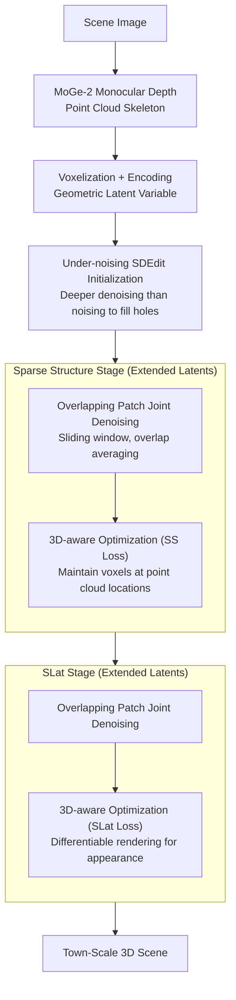

# Extend3D: Town-Scale 3D Generation

**Conference**: CVPR 2026  
**arXiv**: [2603.29387](https://arxiv.org/abs/2603.29387)  
**Code**: None (Project page available)  
**Area**: 3D Vision  
**Keywords**: 3D Scene Generation, Large-scale Scenes, Training-free, Extended Latent Space, Voxel Generation

## TL;DR

This paper proposes Extend3D, a training-free 3D scene generation pipeline. By extending the voxel latent space of a pre-trained object-level 3D generative model (Trellis) and introducing joint denoising of overlapping patches, under-noising SDEdit initialization, and 3D-aware optimization, it generates town-scale large 3D scenes from a single image. It outperforms existing methods in both human preference and quantitative evaluation.

## Background & Motivation

1.  **Background**: 3D generative models (e.g., Trellis, Hunyuan3D) can generate high-quality 3D objects but are limited by object-level training data and use fixed latent space sizes to represent 3D data.
2.  **Limitations of Prior Work**:
    *   Fixed latent space sizes limit output details; larger scenes become blurrier (similar to low-resolution images).
    *   3D scene datasets are scarce, restricting data-driven scene generation to limited categories.
    *   Outpainting methods (e.g., SynCity, 3DTown) generate blocks sequentially, leading to inconsistencies and visible seams.
3.  **Key Challenge**: The latent space of object-level models is insufficient to represent details of large-scale scenes, yet the lack of scene-level data makes direct training of scene models infeasible.
4.  **Goal**: How to leverage pre-trained object-level 3D generative models to achieve high-fidelity large-scale 3D scene generation?
5.  **Key Insight**: Drawing inspiration from MultiDiffusion in 2D high-resolution image generation, the 3D latent space is extended along the x/y directions. It utilizes joint generation of overlapping patches while incorporating structural priors and optimization for 3D-specific issues (e.g., ground disappearance, incorrect object rotation).
6.  **Core Idea**: Extend the latent space of object-level 3D models horizontally. Achieve town-scale 3D scene generation through joint denoising of overlapping patches, point cloud prior initialization, and 3D-aware loss optimization.

## Method

### Overall Architecture

Extend3D addresses the challenge of generating large-scale scenes when only object-level pre-trained models (Trellis) are available. Since Trellis uses a fixed latent size, forcing it to generate a town causes blurred results. Instead of retraining, this method horizontally extends the latent space and enables the original model to collaborate on a larger canvas.

The pipeline follows the two-stage structure of Trellis: first generating the sparse structure (voxel occupancy), then the structured latent variables SLat (voxel features). Both stages operate on the extended latent space. Given a scene image, the MoGe-2 monocular depth estimator first reconstructs it into a point cloud as a geometric skeleton. This skeleton is voxelized and encoded for initializing the extended latent space. Subsequently, the scene is formed through joint denoising of overlapping patches. At each step, point cloud and original image priors guide the denoising trajectory back to a realistic scene structure, eventually outputting a town-scale 3D scene.

### Key Designs

**1. Overlapping patch joint denoising: Concurrent generation and error correction**

Once the latent space is expanded from $N\times N\times N$ to $\mathbf{Z}_t \in \mathbb{R}^{aN \times bN \times N}$ (where $a, b$ are horizontal expansion factors), the original model cannot process the entire input. While sequential outpainting causes seams, this method adopts the MultiDiffusion approach: a sliding window divides the latent space into overlapping patches. Each patch independently computes its vector field using the original model, and results are merged by averaging overlapping regions:

$$\bm{v}(\mathbf{Z}_t, \mathcal{I}, t) = \sum_{i,j} \phi_{i,j}^{-1}(\bm{v}_{i,j}) \oslash \sum_{i,j} \mathbf{1}_{\mathbb{W}_{i,j}}$$

where $\phi_{i,j}$ represents the cropping mapping for the $(i,j)$-th window. Image conditions are aligned using the same cropping. Overlapping ensures adjacent patches reconcile during denoising, while objects in the center of any patch still benefit from object-level details.

**2. Under-noising SDEdit initialization: Skeleton construction and occlusion filling**

Strictly starting from pure noise leads to chaotic large-scale structures. While using MoGe-2 point clouds voxelized into latent variables $\mathbf{Z}_0^{(g)}$ for SDEdit initialization is intuitive, standard SDEdit faces a trade-off: if the noise level $t_{\text{start}}$ is too low, occluded holes aren't filled; if too high, reliable structures are destroyed. This method proposes "under-noising"—setting $t_{\text{start}} > t_{\text{noise}}$, meaning the denoising process is deeper than the noising process. This allows the model to actively fill missing/occluded regions as if they were additional noise while preserving existing structures.

**3. 3D-aware optimization: Guiding object models with scene priors**

Object-level models tend to treat everything as individual objects, causing "background" elements like the ground to disappear or buildings to rotate randomly. Rather than fine-tuning weights, the vector field $\hat{\bm{v}}_t$ is optimized at each denoising step using Adam. The Sparse Structure stage constrains voxels at point cloud locations:

$$\mathcal{L}_{\text{SS}} = -\frac{1}{|\mathbb{P}|}\sum_{\bm{p}\in\mathbb{P}} \log \sigma\big((\mathcal{D}(\mathbf{Z}_t^{\text{SS}} - t\cdot\hat{\bm{v}}_t))_{\bm{p}}\big)$$

This raises occupancy probability $\mathbb{P}$ at point cloud locations. The SLat stage utilizes an appearance constraint:

$$\mathcal{L}_{\text{SLat}} = \text{LPIPS}(\hat{\mathcal{I}}, \mathcal{I}) - \text{SSIM}(\hat{\mathcal{I}}, \mathcal{I})$$

Differentiable rendering aligns the 3D result with the input image, correcting biases and smoothing residual seams.

### Loss & Training

The process is training-free. Optimization losses are applied only during inference via Adam to update the vector field $\hat{\bm{v}}_t$ instead of model weights. Dilated sampling is used in the Sparse Structure stage to expand the receptive field for global consistency.

## Key Experimental Results

### Main Results (Quantitative, 100 input images)

| Method | LPIPS↓ | SSIM↑ | PSNR↑ | CD↓ | F-score↑ |
| :--- | :--- | :--- | :--- | :--- | :--- |
| Trellis | 0.650 | 0.239 | 10.0 | 0.0315 | 0.442 |
| Hunyuan3D | 0.683 | 0.255 | 10.4 | 0.0192 | 0.567 |
| EvoScene | 0.482 | 0.310 | 13.2 | 0.0188 | 0.498 |
| **Ours w/o SLat optim** | **0.400** | **0.333** | **13.8** | **0.0078** | **0.708** |
| **Ours (full)** | **0.240** | **0.611** | **20.4** | **0.0086** | **0.694** |

### Ablation Study (a=b=2)

| Configuration | LPIPS↓ | SSIM↑ | PSNR↑ | CD↓ | F-score↑ |
| :--- | :--- | :--- | :--- | :--- | :--- |
| Patch-wise flow only | 0.606 | 0.209 | 9.63 | 0.0348 | 0.261 |
| + Initialization | 0.425 | 0.312 | 13.0 | 0.0083 | 0.693 |
| + SS Optimization | 0.400 | 0.333 | 13.8 | 0.0078 | 0.708 |
| + SLat Optimization (full) | 0.240 | 0.611 | 20.4 | 0.0086 | 0.694 |

### Key Findings

*   In human preference evaluations, Extend3D wins across geometry, fidelity, appearance, and completeness.
*   Initialization is essential; without it ($t_{\text{start}}=1$), the structure collapses.
*   Under-noising fills occluded areas more naturally than standard SDEdit.
*   SLat optimization significantly improves texture quality (PSNR increases from 13.8 to 20.4).

## Highlights & Insights

*   **Under-noising Concept**: Leveraging $t_{\text{start}} > t_{\text{noise}}$ allows the model to treat structural incompleteness as noise for completion, a principle applicable to other "edit+complete" tasks.
*   **Scene Generation without Scene Data**: Successfully repurposes object-level knowledge for town-scale scenes through latent expansion and prior guidance.
*   **Joint Denoising vs. Sequential Outpainting**: Concurrent generation allows neighboring patches to correct each other, ensuring superior consistency compared to sequential methods like SynCity.

## Limitations & Future Work

*   Manual parameter tuning is required for expansion and division factors, increasing computational overhead.
*   Performance depends on the quality of the monocular depth estimator (MoGe-2).
*   Physical plausibility (e.g., gravity, complex occlusions) is not explicitly modeled.
*   SLat optimization slightly increases Chamfer Distance (0.0078 to 0.0086), potentially introducing minor geometric bias.

## Related Work & Insights

*   **vs. SynCity**: Avoids sequential inconsistencies and visible seams through concurrent generation.
*   **vs. 3DTown/EvoScene**: While both use point cloud initialization, Extend3D better addresses systematic biases of object-level models (like ground disappearance) via 3D-aware optimization.
*   **vs. MultiDiffusion**: Extends 2D high-resolution principles to 3D, adding priors to handle 3D-specific spatial alignment challenges.

## Rating

*   Novelty: ⭐⭐⭐⭐ (Under-noising and 3D-aware optimization are valuable contributions)
*   Experimental Thoroughness: ⭐⭐⭐⭐ (Comprehensive human preference, quantitative metrics, and ablations)
*   Writing Quality: ⭐⭐⭐⭐ (Clear methodology and intuitive illustrations)
*   Value: ⭐⭐⭐⭐⭐ (High practical utility for scene generation without specific scene-level training)

<!-- RELATED:START -->

## Related Papers

- [\[CVPR 2026\] WonderZoom: Multi-Scale 3D World Generation](wonderzoom_multi-scale_3d_world_generation.md)
- [\[CVPR 2026\] LATTICE: Democratize High-Fidelity 3D Generation at Scale](lattice_democratize_high-fidelity_3d_generation_at_scale.md)
- [\[CVPR 2026\] PointNSP: Autoregressive 3D Point Cloud Generation with Next-Scale Level-of-Detail Prediction](pointnsp_autoregressive_3d_point_cloud_generation_with_next-scale_level-of-detai.md)
- [\[CVPR 2026\] OLATverse: A Large-scale Real-world Object Dataset with Precise Lighting Control](olatverse_a_large-scale_real-world_object_dataset_with_precise_lighting_control.md)
- [\[CVPR 2026\] Gen3R: 3D Scene Generation Meets Feed-Forward Reconstruction](gen3r_3d_scene_generation_meets_feed-forward_reconstruction.md)

<!-- RELATED:END -->
## Related Papers

- [\[CVPR 2026\] WonderZoom: Multi-Scale 3D World Generation](wonderzoom_multi-scale_3d_world_generation.md)
- [\[CVPR 2026\] PointNSP: Autoregressive 3D Point Cloud Generation with Next-Scale Level-of-Detail Prediction](pointnsp_autoregressive_3d_point_cloud_generation_with_next-scale_level-of-detai.md)
- [\[CVPR 2026\] OLATverse: A Large-scale Real-world Object Dataset with Precise Lighting Control](olatverse_a_large-scale_real-world_object_dataset_with_precise_lighting_control.md)
- [\[CVPR 2026\] VGG-T3: Offline Feed-Forward 3D Reconstruction at Scale](vgg-t3_offline_feed-forward_3d_reconstruction_at_scale.md)
- [\[CVPR 2026\] AMB3R: Accurate Feed-forward Metric-scale 3D Reconstruction with Backend](amb3r_accurate_feed-forward_metric-scale_3d_reconstruction_with_backend.md)

<!-- RELATED:END -->
