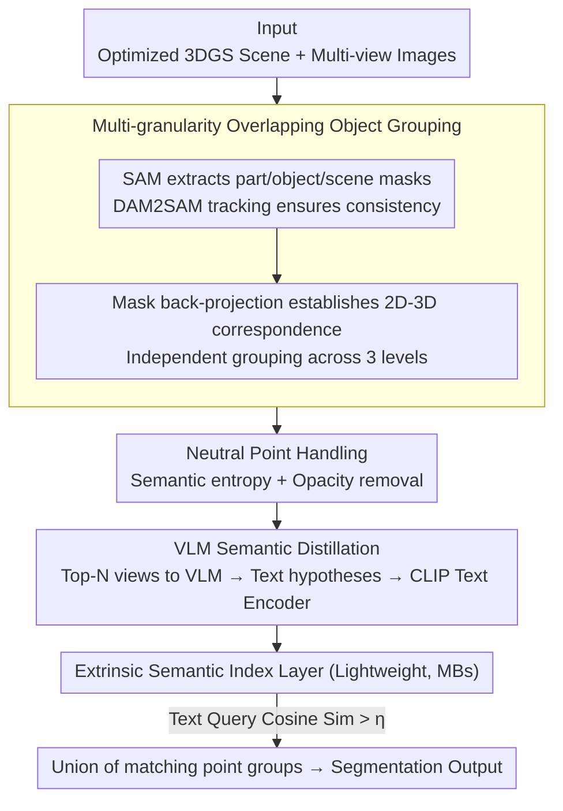

# ExtrinSplat: Decoupling Geometry and Semantics for Open-Vocabulary Understanding in 3D Gaussian Splatting

**Conference**: CVPR 2026  
**arXiv**: [2509.22225](https://arxiv.org/abs/2509.22225)  
**Code**: None  
**Area**: 3D Vision / Open-Vocabulary 3D Scene Understanding  
**Keywords**: 3D Gaussian Splatting, Open-Vocabulary Understanding, Semantic Decoupling, VLM, Text Hypotheses

## TL;DR

Ours proposes the extrinsic paradigm, which completely decouples semantics from 3DGS geometry. By constructing a lightweight semantic index layer through multi-granularity object grouping and VLM text hypotheses, ours achieves training-free, low-storage, and ambiguity-aware open-vocabulary 3D scene understanding.

## Background & Motivation

**Background**: Open-vocabulary 3D scene understanding is a critical capability for autonomous driving and robotics. 3DGS has become an ideal representation foundation due to its high-fidelity modeling and real-time rendering.

**Limitations of Prior Work**: Mainstream methods adopt the "embedding paradigm," which directly injects high-dimensional semantic features into each Gaussian point. This faces three fundamental flaws:
   - **Geometry-Semantic Inconsistency**: The basic unit of semantics should be an object, not a Gaussian point. "Neutral points" at boundaries are forcibly assigned semantic labels, leading to blurred boundaries.
   - **Semantic Inflation**: Injecting GB-level feature data imposes an extreme burden on storage and downstream processing (approx. 3GB of CLIP features per scene).
   - **Semantic Rigidity**: A single Gaussian can only store one feature vector, failing to express ambiguity (e.g., a "car window" is both a "window" and "part of a car").

**Key Challenge**: The embedding paradigm embeds semantics within the geometry, yet the minimal operational units of geometry and semantics are fundamentally different (points vs. objects).

**Goal**: How to achieve efficient, accurate, and ambiguity-aware open-vocabulary 3D understanding without modifying the geometry.

**Key Insight**: Propose the extrinsic paradigm—semantics serve as an independent abstract index layer that references rather than embeds into the geometry.

**Core Idea**: Replace point-wise semantic embedding with multi-granularity object grouping, and replace high-dimensional visual features with text hypotheses generated by VLMs.

## Method

### Overall Architecture

ExtrinSplat addresses the common pitfalls of the "embedding paradigm" in open-vocabulary 3D scene understanding: injecting high-dimensional semantic features directly into each Gaussian point leads to geometry-semantic unit misalignment, GB-level storage inflation, and the rigidity of single-semantic points. It proposes the "extrinsic paradigm"—semantics are no longer embedded in geometry but function as an independent, queryable index layer referencing it.

The entire framework is training-free. Taking an optimized 3DGS scene and corresponding multi-view images as input, it assembles the extrinsic semantic index layer in four steps: first, extracting multi-view, multi-granularity object masks and ensuring view consistency through tracking (data preparation); then, back-projecting 2D masks to 3D Gaussian points for **multi-granularity overlapping object grouping** and purifying boundaries via **neutral point handling**; next, distilling each object group into text hypotheses using a VLM (**VLM Semantic Distillation**); and finally, assembling a text-queryable extrinsic semantic index layer. During query, only text-to-text cosine similarity matching is performed.

### Key Designs

**1. Multi-granularity Overlapping Object Grouping: Enabling one point to belong to multiple semantic entities**

In the embedding paradigm, each Gaussian can only store one feature vector, which cannot express ambiguity such as "a car window is both a window and part of a car." ExtrinSplat uses SAM to extract three sets of masks at part, object, and scene levels, tracks them with DAM2SAM for multi-view consistency, and establishes 2D-3D correspondence through mask back-projection. The foreground probability is: $W_k(G_j) = \sum_{v \in \mathcal{V}} \sum_{r \in \mathcal{P}_v} \delta(m_v(r) - k) \cdot w_v(r, G_j)$.

The key is that the three levels are grouped independently, allowing a single Gaussian point to simultaneously fall into "window" and "car" groups—making ambiguity an inherent property of the framework rather than an edge case requiring patches.

**2. Neutral Point Handling: Eliminating transition points that are neither foreground nor background**

Gaussian points at object boundaries naturally serve as transitional points for anti-aliasing. The embedding paradigm assumes every point is either foreground or background, introducing noise. ExtrinSplat quantifies this ambiguity using multi-view semantic consistency: treating each view as a vote for foreground/background to calculate semantic entropy $H(p) = -\left(\frac{V_f}{V}\log_2\frac{V_f}{V} + \frac{V_b}{V}\log_2\frac{V_b}{V}\right)$.

High-entropy points are candidate neutral points, which are further differentiated by opacity $\alpha$: high-opacity high-entropy points are actually object surfaces that were mislabeled and should be retained; only low-opacity high-entropy points are true transition points and are excluded. This is the first time the boundary issue of "neutral points" has been explicitly defined and addressed.

**3. VLM Semantic Distillation: Replacing view-sensitive visual features with stable text representations**

2D encoders like CLIP are view-sensitive; the same object produces vastly different feature vectors from different angles. ExtrinSplat selects Top-N view masks with the largest visible area for each object group and feeds them into a VLM (e.g., Gemini 2.5 Pro) to generate candidate object names as "text hypotheses," which are then encoded by the CLIP text encoder.

This "distills" unstable visual appearance into stable text descriptions, eliminating cross-view semantic inconsistency. A secondary benefit is that text requires only MB-level storage, a reduction of approximately three orders of magnitude compared to GB-level visual features.

### Loss & Training

ExtrinSplat is completely training-free and does not perform contrastive learning or feature optimization. At query time, text queries are matched with pre-computed text features via cosine similarity:

$$\mathcal{I}_m = \{i \mid \max_{\mathbf{q} \in \mathbf{Q}_i} \text{sim}(\mathbf{s}, \mathbf{q}) > \eta\}$$

The final segmentation is the union of Gaussian points from all matching groups: $\mathcal{G}_{\text{final}} = \bigcup_{i \in \mathcal{I}_m} \mathcal{G}_i$.

## Key Experimental Results

### Main Results (LERF Dataset - Open-Vocabulary 3D Object Selection)

| Method | Paradigm | Ramen | Teatime | Figurines | Waldo | Mean mIoU |
|------|------|-------|---------|-----------|-------|-----------|
| LangSplat (CVPR'24) | Embedding | 51.2 | 65.1 | 44.7 | 44.5 | 51.4 |
| OpenGaussian (NeurIPS'25) | Embedding | 31.0 | 60.4 | 39.3 | 22.7 | 38.4 |
| Dr.Splat (CVPR'25) | Embedding | 24.7 | 57.2 | 53.4 | 39.1 | 43.6 |
| LAGA (ICML'25) | Embedding | 55.6 | 70.9 | 64.1 | 65.6 | 64.0 |
| LUDVIG (ICCV'25) | Embedding | 42.3 | 58.6 | 58.0 | 42.8 | 50.4 |
| **ExtrinSplat (Ours)** | **Extrinsic** | 45.6 | 72.7 | 63.1 | 68.2 | **62.4** |

### Efficiency Comparison

| Method | Scene Opt. | Training Time | CLIP Storage | Peak VRAM |
|------|----------|----------|--------------|----------|
| LEGaussians | Required | ~2h | ~3GB | ~20GB |
| LangSplat | Required | ~2h | ~3GB | ~20GB |
| Dr.Splat | Not Req. | ~1h | ~3GB | ~24GB |
| **ExtrinSplat** | **Not Req.** | **None** | **~3MB** | **~8GB** |

### Key Findings

- CLIP feature storage reduced from GB-level to MB-level (approx. 1000x reduction), with the lowest VRAM usage (8GB vs. 20-28GB).
- Achieved SOTA performance among training-free 3D methods, with overall performance close to the best embedding method, LAGA.
- Neutral point handling significantly improves object boundary clarity.

## Highlights & Insights

- **Paradigm Innovation**: Proposes the "extrinsic paradigm," completely decoupling semantics as an independent index layer, contrasting sharply with the embedding paradigm.
- **Extreme Storage Efficiency**: Reducing semantic storage from 3GB to 3MB is highly significant for practical deployment.
- **Natural Ambiguity Support**: The overlapping grouping design ensures ambiguity is an inherent property of the framework rather than a problem requiring external handling.
- **VLM Distillation Insight**: Distilling unstable visual features into stable text representations is a strategy that could be generalized to other multi-view understanding tasks.

## Limitations & Future Work

- Dependent on the mask quality of SAM and DAM2SAM; complex scenes may result in incomplete grouping.
- VLM inference costs (Gemini 2.5 Pro) may be restricted in offline environments.
- Fixed grouping granularity at SAM's three levels may not fit all semantic query scales.
- Does not currently handle dynamic scenes.

## Related Work & Insights

- **OpenGaussian/Dr.Splat**: Represent recent progress in the embedding paradigm, optimizing efficiency through feature aggregation and quantization.
- **LUDVIG**: Training-free but still embeds CLIP features; ExtrinSplat significantly outperforms it under the same training-free constraints.
- **Insight**: The decoupling idea of the extrinsic paradigm can be generalized to other 3D representations (e.g., NeRF, Point Clouds). The core is "alignment of operational units"—using objects as semantic units and points as geometric units.

## Rating

- Novelty: ⭐⭐⭐⭐⭐ The extrinsic paradigm is a fresh design philosophy; the neutral point concept is original.
- Experimental Thoroughness: ⭐⭐⭐⭐ Benchmarked on LERF and ScanNet with sufficient ablation, though lacks large-scale scene tests.
- Writing Quality: ⭐⭐⭐⭐⭐ The structure mapping three problems to three solutions is very clear.
- Value: ⭐⭐⭐⭐⭐ 1000x storage reduction and training-free nature provide extremely high practical value.

<!-- RELATED:START -->

## Related Papers

- [\[CVPR 2026\] Cross-Instance Gaussian Splatting Registration via Geometry-Aware Feature-Guided Alignment](cross-instance_gaussian_splatting_registration_via_geometry-aware_feature-guided.md)
- [\[CVPR 2026\] EmbodiedSplat: Online Feed-Forward Semantic 3DGS for Open-Vocabulary 3D Scene Understanding](embodiedsplat_online_feed-forward_semantic_3dgs_for_open-vocabulary_3d_scene_und.md)
- [\[CVPR 2026\] LightSplat: Fast and Memory-Efficient Open-Vocabulary 3D Scene Understanding in Five Seconds](lightsplat_fast_and_memory-efficient_open-vocabulary_3d_scene_understanding_in_f.md)
- [\[CVPR 2026\] FastGS: Training 3D Gaussian Splatting in 100 Seconds](fastgs_training_3d_gaussian_splatting_in_100_seconds.md)
- [\[CVPR 2026\] OnlinePG: Online Open-Vocabulary Panoptic Mapping with 3D Gaussian Splatting](onlinepg_online_open-vocabulary_panoptic_mapping_with_3d_gaussian_splatting.md)

<!-- RELATED:END -->
