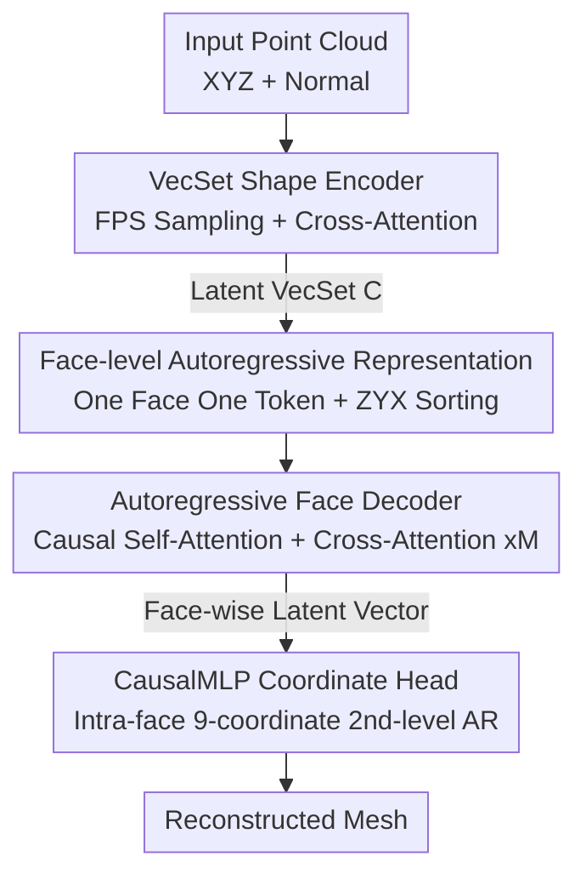

# FACE: A Face-based Autoregressive Representation for High-Fidelity and Efficient Mesh Generation

**Conference**: CVPR 2026  
**Paper**: [CVF Open Access](https://openaccess.thecvf.com/content/CVPR2026/html/Wang_FACE_A_Face-based_Autoregressive_Representation_for_High-Fidelity_and_Efficient_Mesh_CVPR_2026_paper.html)  
**Code**: To be confirmed  
**Area**: 3D Vision  
**Keywords**: Mesh Generation, Autoregressive, Face-level Representation, VecSet, Sequence Compression

## TL;DR
FACE elevates the "semantic granularity" of triangle mesh generation from vertex coordinates to entire triangular faces. By proposing a "one-face-one-token" strategy, it directly shortens the sequence length processed by the autoregressive Transformer by 9 times, pushing the compression ratio to 0.11 (half of the previous SOTA), while simultaneously reaching SOTA reconstruction quality when paired with a VecSet encoder.

## Background & Motivation

**Background**: Triangle meshes are the de facto standard for industrial 3D content, and directly generating "topologically coherent high-fidelity meshes" is considered the "holy grail" of computer graphics. Since MeshGPT, autoregressive (AR) models have become the mainstream paradigm for end-to-end mesh generation—flattening meshes into one-dimensional vertex coordinate token sequences and then generating them token-by-token like language models.

**Limitations of Prior Work**: This paradigm has a fatal bottleneck: the computational complexity of the Transformer's self-attention is $O(N^2)$ with respect to the sequence length. The flattened coordinate sequence is extremely long (1 face = 3 vertices $\times$ 3 coordinates = 9 tokens), making the generation of meshes with thousands of faces computationally prohibitive. To alleviate this, the community has proposed various compression methods: some use complex graph traversal algorithms to optimize vertex reuse (EdgeRunner, MeshAnythingV2), while others modify tokenization schemes to implement block indexing (BPT, Nautilus). However, traversal-based strategies are often fragile and disrupt the global structure of the mesh, while block-based methods easily cause vocabulary explosion.

**Key Challenge**: The authors point out that these methods address the symptoms (shortening sequence length) rather than the root cause. The true issue lies in **operating at the wrong semantic level**: generating at the low level of individual coordinates inevitably leads to extremely long sequences.

**Goal**: Can a new representation be designed so that "compression" is not an afterthought but emerges naturally from the representation itself? Moreover, this must be achieved without sacrificing reconstruction quality, and ideally, show transferability to downstream tasks such as image-to-mesh.

**Key Insight**: Triangular faces are the "building blocks" of a mesh. If an entire face is treated as a semantic unit, the sequence length is naturally shortened by an order of magnitude—representing a dimensional upgrade at the representation level rather than temporary repairs at the algorithmic level.

**Core Idea**: Replace "one-coordinate-one-token" with "one-face-one-token" to raise autoregressive generation to the face level. This is integrated into an autoregressive autoencoder (ARAE) framework—employing a VecSet encoder to compress point clouds into latent representations and a face-level decoder to reconstruct the mesh face-by-face, trained jointly end-to-end.

## Method

### Overall Architecture
FACE models the conditional probability $p(M|P)$ : given an input point cloud $P$, generate the corresponding high-fidelity triangular mesh $M$. The overall architecture is an **Autoregressive Autoencoder (ARAE)**: it first uses a Shape Encoder to compress the point cloud into a compact latent representation (a VecSet $C$ ), and then utilizes an Autoregressive Decoder conditioned on $C$ to generate the faces of the mesh sequentially.

The key lies in "at which granularity to generate". FACE first represents the mesh $M$ as an ordered sequence of faces $F=(f_1, f_2, \dots, f_N)$, where each face $f_i=(v_i^0, v_i^1, v_i^2)\in\mathbb{R}^9$ (three vertices flattened into a 9-dimensional vector). Then, using "one-face-one-token", the entire 9-dimensional vector is packed into a single token fed to the Transformer. This design reduces the sequence length for self-attention from $9\times|F|$ to $|F|$, driving a massive efficiency leap across the pipeline. During generation, a two-level autoregressive mechanism is employed: the Transformer performs autoregression at the **face level** (generating latent vectors face-by-face), and a CausalMLP head performs autoregression at the **coordinate level** (casually decoding the 9 coordinates of a face one by one). Finally, this latent space can be bridged with an image-conditioned diffusion model to perform single-image-to-mesh generation, demonstrating the generalizability of the latent space.

### Key Designs

**1. One-face-one-token: Elevating generation to the face level to directly shorten sequence length by 9x**

This is the foundation of the framework, addressing the "long sequence" issue in autoregressive mesh generation. The standard approach splits each face into 9 coordinate tokens, resulting in a sequence length of $9\times|F|$. In contrast, FACE treats the entire 9-dimensional face vector $f_i=(v_i^0, v_i^1, v_i^2)$ as **an indivisible unit** and projects it into a single $d_{model}$-dimensional token using a lightweight embedding layer (Face Pooling layer, essentially an MLP): $t_{i-1}=\mathrm{MLP}_{\text{embed}}(f_{i-1})$. Since self-attention complexity is $O(S^2)$, shrinking the sequence length from $9|F|$ to $|F|$ theoretically signifies an $81\times$ reduction in computation, which scales to roughly $9\times$ GPU memory savings with FlashAttention. In Table 1, the actual compression ratio (the ratio of the sequence length processed by the model compared to the "one-coordinate-one-token" baseline) reaches **0.11**, precisely half of the previous best of 0.22. Meanwhile, Face Pooling and the subsequent CausalMLP introduce only negligible linear $O(N)$ overhead. The compression emerges naturally from the elegance of the architecture rather than from lossy, complex compression pipelines.

The accompanying face sorting is deliberately kept simple: rather than relying on fragile graph traversal, the authors find that a deterministic spatial sorting is highly effective—sorting faces lexicographically based on the ZYX coordinates of their minimum-coordinate vertex. This provides a canonical, reproducible order for any mesh, removing system complexity without sacrificing quality, as proven by ablation experiments.

**2. VecSet Shape Encoder: Compressing point clouds into strong conditional signals**

To generate face-by-face, the face-level decoder requires a conditional signal that captures global geometry. The encoder maps the raw point cloud $P\in\mathbb{R}^{m\times3}$ to a compact latent VecSet $C\in\mathbb{R}^{k\times d_{latent}}$, adopting the validated architecture from 3DShape2VecSet. Specifically, Farthest Point Sampling (FPS) selects $k$ representative query points from the input. These query points aggregate the global geometry of the whole point set via cross-attention, producing the initial representation $C'=\mathrm{CrossAttn}(Q=Q, K=K_P, V=V_P)$. It is then refined through $L_E$ standard Transformer Encoder layers into the final $C=\mathrm{TransformerEncoder}_{L_E}(C')$. This $C$ acts as a global condition injected into every layer of the decoder, ensuring that each step of local generation is guided by the holistic target geometry. The ablation study (Table 4) shows that using downsampled point clouds as queries is significantly better than using learnable queries.

**3. Autoregressive Face Decoder: Causal self-attention manages connectivity, while cross-attention injects global shape**

The decoder is responsible for generating the face sequence $F$ conditioned on $C$. The key difference is that it **learns the internal representation of faces itself**, unlike MeshGPT which relies on a separately trained VAE for coordinate tokenization. The entire encoder-decoder pipeline is trained end-to-end, and the representation is optimized directly for the generation task. At each step $i$, the ground truth faces from the prefix are embedded into tokens via Face Pooling before entering $L_D$ Transformer layers. Each layer performs two actions: first, Causal Self-Attention $H'_l=\mathrm{CausalSelfAttn}(H_l)$ allows the model to process previously generated face tokens $t_{<i}$, capturing local structures and connectivity; second, Cross-Attention $H_{l+1}=\mathrm{CrossAttn}(Q=H'_l, K=C, V=C)$ uses the self-attention output as the query and the VecSet $C$ as keys/values, injecting global shape context layer-by-layer. The Transformer outputs a latent face vector $h_i\in\mathbb{R}^{d_{model}}$ at the $i$-th step. This combination of "local autoregression + global condition" ensures that each local generation decision is constrained by the overall geometry, which is core to high-fidelity reconstruction.

**4. CausalMLP Coordinate Head: Introducing another level of autoregression within the face, much more stable than parallel prediction**

Having only the face-level latent vector $h_i$ is insufficient; it must be decoded back into 9 quantized coordinate tokens. The authors use a lightweight CausalMLP head to introduce a second-level autoregression **inside the face**: the prediction of the $j$-th coordinate token is conditioned not only on $h_i$ but also on **all previously predicted coordinate tokens** within the same face. This intra-face causal dependency is far more effective than "predicting 9 coordinates in parallel". In the ablation (Table 5), the Parallel Decode (a single MLP directly outputting a $9\times|V|$ tensor) yields a high Hausdorff distance of 0.426, the Attention-based version yields 0.132, while CausalMLP achieves only 0.103—a massive improvement. Consequently, FACE establishes a clean hierarchical structure: the Transformer performs face-level autoregression, the CausalMLP performs coordinate-level autoregression, and the model is trained end-to-end.

### Loss & Training
The entire framework is trained end-to-end using a unified objective: the reconstruction loss of mesh faces. For each face $f_i$ in the ground truth sequence, the CausalMLP head predicts logit vectors $(L_{i,1},\dots,L_{i,9})$ for the 9 quantized coordinates. The objective is to minimize the sum of cross-entropy for each coordinate prediction, averaged over all faces:

$$\mathcal{L}=\frac{1}{N}\sum_{i=1}^{N}\sum_{j=1}^{9}\mathrm{CrossEntropy}(L_{i,j}, c_{i,j})$$

where $c_{i,j}$ represents the ground truth token index of the $j$-th coordinate of the $i$-th face. Optimizing this objective allows the encoder and decoder to jointly learn a compact latent representation $C$, enabling faithful reconstruction of the original mesh. The base model has 500M parameters and adopts an **asymmetric design** (the decoder is larger than the encoder: encoder with 8 layers and 768 hidden size, decoder with 24 layers and 1024 hidden size). It is trained on approximately 130k meshes from Objaverse with face counts <4000, where vertices are quantized to $[0,127]$. The training uses the Muon optimizer, a learning rate of $6\times10^{-4}$, 100K steps, and 8$\times$A100 GPUs. The DiT used for image-to-mesh is 350M parameters, utilizing a flow matching objective, DINOv3 to extract image features, and 100 steps of Euler sampling for inference.

## Key Experimental Results

### Main Results

**Token Efficiency (Table 1)**: The compression ratio is defined as the ratio of the sequence length processed by the model relative to the "one-coordinate-one-token" baseline, where lower is better.

| Method | Compression Ratio ↓ |
|------|---------|
| MeshXL / MeshAnything | 1.00 |
| MeshGPT / PivotMesh | 0.67 |
| EdgeRunner | 0.47 |
| MeshAnythingV2 | 0.46 |
| BPT | 0.26 |
| Mesh-Silksong / TreeMeshGPT | 0.22 |
| **Ours (FACE)** | **0.11** |

**Reconstruction Quality (Table 2)**: Evaluated on three unseen datasets during training using Hausdorff distance (worst-case deviation) and Chamfer distance (average closeness), both lower are better.

| Dataset | Metric | FACE | Best Baseline (BPT) | Note |
|--------|------|------|--------------|------|
| Objaverse | Hausdorff ↓ | **0.090** | 0.126 | FACE leads across all metrics |
| Objaverse | Chamfer ↓ | **0.041** | 0.043 | |
| Toys4K | Hausdorff ↓ | **0.067** | 0.091 | ~26% lower than the best baseline |
| Toys4K | Chamfer ↓ | **0.033** | 0.037 | |
| Famous | Hausdorff ↓ | **0.077** | 0.143 | Complex/diverse, demonstrating generalization |
| Famous | Chamfer ↓ | **0.049** | 0.061 | |

Obtaining SOTA on complex models like Famous, where styles differ significantly from the training data, demonstrates robust generalization. Qualitatively, FACE generates cleaner surfaces and preserves sharp features and details, whereas baselines often exhibit holes, missing pieces, or over-smoothing.

### Ablation Study

| Module | Configuration | Hausdorff ↓ | Chamfer ↓ | Note |
|------|------|------------|-----------|------|
| Face Sorting | BFS | 0.728 | 0.528 | Graph traversal, extremely poor |
| Face Sorting | DFS | 0.171 | 0.077 | Graph traversal |
| Face Sorting | ZYX-component | 0.110 | 0.045 | ZYX sorting after connected components |
| Face Sorting | **ZYX** (Adopted) | 0.103 | 0.047 | Spatial sorting, simpler and optimal |
| Encoder Query | Learnable | 0.132 | 0.058 | Learnable query |
| Encoder Query | **Downsample** (Adopted) | 0.103 | 0.047 | Downsampled point cloud as query is significantly better |
| Coordinate Decoding | Parallel Decode | 0.426 | 0.239 | Parallel 9-coordinate generation, collapses |
| Coordinate Decoding | Attention-based | 0.132 | 0.064 | Attention-based decoding |
| Coordinate Decoding | **CausalMLP** (Adopted) | 0.103 | 0.047 | Intra-face autoregression, leading by a large margin |

### Key Findings
- **Face Sorting: Spatial Sorting >> Graph Traversal**. BFS collapses directly to an HD of 0.728, whereas a simple ZYX lexicographical order achieves 0.103. This validates the authors' premise that "complex traversal algorithms are unnecessary"—under face-level generation, simple spatial sorting suffices.
- **Coordinate Decoding Head Contributes the Most**. Replacing CausalMLP with parallel prediction causes the HD to surge from 0.103 to 0.426. This indicates that intra-face hierarchical autoregression is key to high-fidelity, and parallel prediction fails to handle the dependencies among the 9 coordinates.
- **Downsampled queries outperform learnable queries**, consistent with the findings in 3DShape2VecSet.
- **Scalability**: Scaling the model to 1.2B (Ours-large), increasing the input points to 65,536, raising quantization to $[0,1023]$, and training on 380k high-quality proprietary data reconstructs finer geometric details and sharper features, proving the favorable scaling properties of this framework.

## Highlights & Insights
- **"Root Cause vs. Symptom" diagnosis is brilliant**: Instead of continuously optimizing the compression algorithms, the authors identify that the issue lies in the "operated semantic level." By shifting the generation unit from coordinates to faces, the sequence length is naturally shortened by an order of magnitude, making compression emerge from the representation itself rather than an afterthought. This approach of "changing levels rather than algorithms" is transferable to other sequence modeling tasks (e.g., elevating token granularity).
- **Hierarchical design of two-level autoregression is ingenious**: The nested autoregression of the face-level (Transformer) + coordinate-level (CausalMLP) simultaneously reaps the efficiency of short sequences and maintains coordinate precision through intra-face causal dependence. The ablation data (0.426 $\rightarrow$ 0.103) proves that this layer is indispensable.
- **End-to-end, no separate VAE**: The decoder learns the internal representation of faces itself, avoiding the two-stage error accumulation of approaches like MeshGPT (where VAE training is decoupled from generation training). The representation is optimized directly for mesh generation.
- **Generalizability of the latent space is solidly validated**: Without fine-tuning the FACE decoder, simply appending an image-conditioned DiT to the front enables single-image-to-mesh generation. This proves that ARAE learns a truly generalizable 3D shape representation with the potential to serve as a foundational 3D component.

## Limitations & Future Work
- **Discrete resolution upper bound acknowledged by the authors**: Although it can scale to a resolution of 1024, the discrete quantized representation has inherent limits, posing an upper bound on reachable detailed geometry.
- **Dependency on input point cloud sampling quality**: Extremely thin or fine structures (such as bicycle wheel spokes) may be under-sampled, leading to incomplete reconstruction in these areas.
- **Self-identified limitations**: ① Reconstruction quality evaluation is restricted to reconstructing known shapes (point cloud $\rightarrow$ mesh), and generation diversity/unconditional generation from noise lacks quantitative evaluation. ② For image-to-mesh, due to unreleased baseline weights, it is only compared qualitatively against EdgeRunner's project page without quantitative metrics. ③ While ZYX sorting is simple and effective, its robustness against meshes with numerous degenerate or overlapping faces remains uninvestigated.
- **Future directions**: Continuous or hybrid resolution representations could be explored to break the discrete upper bound, or additional topological priors / normal-guided sampling could be introduced for thin structures.

## Related Work & Insights
- **vs. MeshGPT / MeshXL (one-coordinate-one-token)**: These approaches split faces into 9 coordinate tokens, resulting in a sequence length of $9|F|$ and a compression ratio of 0.67–1.00. FACE uses one-face-one-token with a sequence length of $|F|$ and a compression ratio of 0.11. The advantage of this work lies in achieving a win-win for efficiency and quality, alongside a single-stage end-to-end framework without a decoupled VAE.
- **vs. Traversal/Block Compression (EdgeRunner, BPT, TreeMeshGPT, Nautilus)**: They treat the symptom by shortening sequences through complex graph traversals or block indexing, often inducing fragility or vocabulary explosion (compression ratios plateauing at 0.22). FACE addresses the root cause at the representation level, cutting the compression ratio in half with simple ZYX sorting while outperforming them entirely in reconstruction quality.
- **vs. Diffusion-based face-per-token (PolyDiff, MeshCraft)**: They also adopt "one-face-one-token," but the non-sequential nature of diffusion makes it challenging to generate variable-length outputs and guarantee topological integrity. FACE is the first to successfully implement face-as-token within an **autoregressive** framework, naturally handling variable-length sequences and sequential dependencies.
- **vs. Implicit Representation + Marching Cubes (SDF / Occupancy / TRELLIS, etc.)**: They require post-processing to extract polygonal meshes, offering no fine-grained control over face structures and easily introducing artifacts. FACE directly generates explicit meshes, providing superior controllability.

## Rating
- Novelty: ⭐⭐⭐⭐⭐ First to successfully integrate face-as-token into an autoregressive framework. The "changing semantic hierarchy" diagnosis and solution are highly insightful.
- Experimental Thoroughness: ⭐⭐⭐⭐ Comprises reconstruction on three datasets, three groups of ablations, and scaling experiments. However, evaluation on generation diversity and quantitative image-to-mesh comparison is relatively weak.
- Writing Quality: ⭐⭐⭐⭐⭐ Clear progression of motivation, methodology, and experiments. The "root cause vs. symptom" narrative is highly compelling.
- Value: ⭐⭐⭐⭐⭐ Doubles the compression ratio, achieves SOTA quality, and features a transferable latent space—significantly lowering the barrier for high-fidelity structured 3D generation.

<!-- RELATED:START -->

## Related Papers

- [\[CVPR 2026\] HyperGaussians: High-Dimensional Gaussian Splatting for High-Fidelity Animatable Face Avatars](hypergaussians_high-dimensional_gaussian_splatting_for_high-fidelity_animatable_.md)
- [\[CVPR 2026\] FHAvatar: Fast and High-Fidelity Reconstruction of Face-and-Hair Composable 3D Head Avatar from Few Casual Captures](fhavatar_fast_and_high-fidelity_reconstruction_of_face-and-hair_composable_3d_he.md)
- [\[CVPR 2026\] LATTICE: Democratize High-Fidelity 3D Generation at Scale](lattice_democratize_high-fidelity_3d_generation_at_scale.md)
- [\[CVPR 2026\] HiFi-BRep: High-Fidelity Latent Representation for Robust B-Rep Generation](hifi-brep_high-fidelity_latent_representation_for_robust_b-rep_generation.md)
- [\[CVPR 2026\] SketchFaceGS: Real-Time Sketch-Driven Face Editing and Generation with Gaussian Splatting](sketchfacegs_real-time_sketch-driven_face_editing_and_generation_with_gaussian_s.md)

<!-- RELATED:END -->
