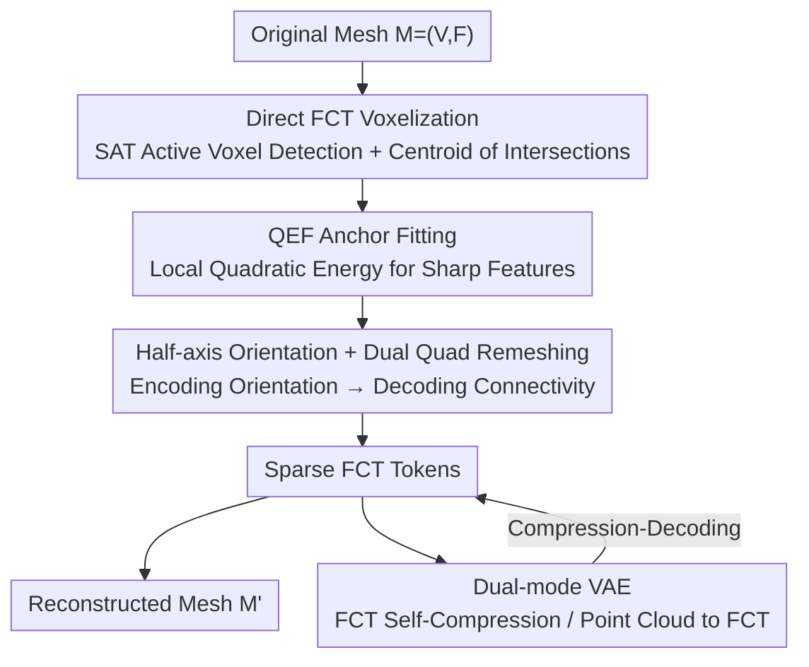

# Faithful Contouring: Near-Lossless 3D Voxel Representation Free from Iso-surface

**Conference**: CVPR 2026  
**Paper**: [CVF Open Access](https://openaccess.thecvf.com/content/CVPR2026/html/Luo_Faithful_Contouring_Near-Lossless_3D_Voxel_Representation_Free_from_Iso-surface_CVPR_2026_paper.html)  
**Code**: https://github.com/Luo-Yihao/FaithC  
**Area**: 3D Vision  
**Keywords**: Voxel Representation, Mesh Reconstruction, Unsigned Distance Fields, Sharp Feature Preservation, VAE

## TL;DR
This paper proposes Faithful Contouring (FaithC), a sparse voxel representation that **bypasses signed distance fields (SDF) and Marching Cubes iso-surface extraction**. It directly fits "anchors + connectivity" within each voxel from the original triangular mesh and stores them as FCT tokens. Supporting resolutions of 2048+ with reconstruction errors down to the scale of $10^{-5}$, its accompanying dual-mode VAE reduces Chamfer Distance by 93% and improves the F-score by 35% compared to strong baselines.

## Background & Motivation

**Background**: 3D reconstruction and generation widely rely on **voxelized representations**, which discretize irregular meshes/point clouds into regular grids to facilitate tensorized deep network training. The current mainstream pipeline first converts meshes into distance fields (occupancy/SDF), and then extracts surfaces from the iso-surface using Marching Cubes (MC) or its variants (Dual Contouring, FlexiCubes). Recent sparse voxel generation methods (such as Trellis, Sparc3D, SparseFlex, Ultra3D, etc.) are almost entirely built on this "SDF $\to$ iso-surface" pipeline.

**Limitations of Prior Work**: Every step in this pipeline discards information. ① **Water-tightening**: Using $\epsilon$-ball dilation to seal openings artificially thickens shells and alters topology; ② **Sign determination**: Utilizing flood-fill / winding number / rasterization statistics to infer inside/outside on non-watertight meshes requires **global operations**, which are unstable at non-manifold and open surfaces, and directly erase internal cavities; ③ **Iso-surface extraction**: MC over-smooths and degrades high-frequency details, leaving stair-step artifacts and grid bumping. Consequently, sharp edges and internal structures are frequently lost, and the resolution is bottlenecked below 1024.

**Key Challenge**: Distance fields are inherently **global and non-linear**—determining the sign of a point requires global information and cannot be resolved through local, parallelizable computation, which fundamentally limits scalability, resolution, and fidelity. Meanwhile, implicit/rendering representations make structured editing, such as selective filtering, splitting, and combining, highly awkward due to the implicit nature of the geometry.

**Goal**: To develop a voxel representation that is **directly obtained from the original mesh** without distance field conversion, capable of near-losslessly preserving smooth, sharp, and internal details, while maintaining voxel regularity to support structured operations.

**Key Insight**: The authors revisit the two essential steps of MC / Dual Contouring—(i) **interpolating** vertex coordinates on the iso-surface, and (ii) **determining connectivity** based on sign changes to generate faces. They then ask: Is it possible to **directly extract candidate vertices (anchors) within each voxel from the original mesh, and then determine connectivity to complete marching-style remeshing**, thereby skipping the "distance field conversion + iso-surface extraction" steps?

**Core Idea**: To replace "global SDF + iso-surface extraction" with "per-voxel local anchor fitting + half-axis orientation check for connectivity". This process is completely **local, GPU-parallelizable, and unsigned-distance-free**, naturally accommodating open surfaces, non-manifolds, multi-component structures, and internal cavities.

## Method

### Overall Architecture

FaithC converts an arbitrary triangular mesh $M=(V,F)$ into a sparse voxel representation and then reversibly decodes it back to a mesh. The overall architecture is an **Encoder–Decoder** structure, accompanied by a **VAE** for compression and learning:

- **Encoder**: Iterates over the voxel grid $G$. For each active voxel intersecting the mesh, it sequentially performs "active voxel detection $\to$ intersection centroid $\to$ QEF anchor fitting $\to$ half-axis orientation", packing the results into **Faithful Contour Tokens (FCT)**. For each active voxel, one row is recorded containing the voxel index, primary anchor $(x^*, n^*)$, 8 dual anchors $\{m_d,(x_d,n_d)\}_{d=1}^{8}$, and 6 half-axis orientation codes $\{\text{orient}_e\}$.
- **Decoder**: First globally aggregates dual anchors shared by multiple primary voxels into unified vertices. Then, on each primary face, it takes 4 adjacent dual anchors to form a quad, reorients them according to the half-axis codes, and performs triangulation along the diagonal with the minimum normal deviation deviation to assemble the reconstructed mesh $M'$.
- **FCT Editing / Dual-mode VAE**: Since FCTs are regular tokens, voxel-level edits such as affine transformations, filtering, assembly, and texturing can be performed directly. A dual-mode VAE (FCT self-compression / point cloud to FCT) is employed to validate its efficacy as a 3D learning representation.

The entire pipeline is **unsigned-distance-free, avoids iso-surface extraction, requires no manifold assumptions, and bypasses rendering optimization**, operating purely via local parallelization.

### Key Designs

**1. Direct FCT Voxelization: Bypassing SDF and Iso-surface to Obtain Anchors from the Original Mesh**

To address the limitations of "water-tightening thickening + global sign determination erasing internal structures", FaithC entirely avoids constructing a distance field. In the first step, the Encoder uses the **Separating Axis Theorem (SAT)** to determine whether a triangle $f$ intersects a voxel $v$: projections are computed on 13 axes (3 box axes, the triangle normal, and 9 edge-axis cross products). If the projection is separated on any axis, they do not intersect; otherwise, $v$ is marked as an **active primary voxel**. In the second step, for each intersecting voxel-triangle pair, plane-by-plane clipping yields the clipped polygon $Q_{v,f}=v\cap f$, followed by the computation of its centroid:

$$c_{v,f} = \frac{1}{3A}\sum_{k=2}^{m-1} A_k\,(q_1+q_k+q_{k+1}),\quad A_k=\tfrac{1}{2}\lVert (q_k-q_1)\times(q_{k+1}-q_1)\rVert$$

Due to the convexity of voxels and triangles, the centroid is guaranteed to lie inside the voxel. By pairing each centroid with the triangle normal $n_f$, reliable local geometric samples $(c_{v,f}, n_f)$ are obtained. The key to this step is that all evidence stems from **local voxel-triangle intersections**, requiring no global determination of whether "a point is inside or outside the object." Consequently, it naturally supports open surfaces, internal cavities, and non-manifold structures, which is the root cause of its ability to preserve internal structures and scale up to resolutions of 2048+ with GPU parallelization.

**2. QEF Anchor Fitting: Drawing Anchors Toward Sharp Edges and Corners via Local Quadratic Energy**

Since centroid samples alone are insufficient, the authors aim to fit an anchor within each voxel (and its 8 dual voxels) that **reflects sharp geometry**. Inheriting the Quadratic Error Function (QEF) concept from Dual Contouring, the anchor position and normal are jointly solved from cumulative samples $\{(c_i,n_i)\}$:

$$x^* = \arg\min_x \sum_i \big(n_i^\top (x-c_i)\big)^2 + \lambda\lVert x-\bar c\rVert^2,\qquad n^* = \arg\min_{\lVert n\rVert=1}\sum_i\big(n^\top(x^*-c_i)\big)^2 + \mu\lVert n-\bar n\rVert^2$$

where $\bar c,\bar n$ represent the sample means. The position term forces the anchor to satisfy various tangent plane constraints (pulling it toward the intersection lines/corners of multiple planes), while the centroid regularization stabilizes the solution in ill-conditioned cases. The normal term aligns the orientation with local displacements and regularizes it toward the average normal. Formulated in matrix form as $\min_x \lVert Mx-d\rVert_2^2+\lambda\lVert x-\bar c\rVert_2^2$ (with $M$ stacking $n_i^\top$ and $d_i=n_i^\top c_i$), its normal equation $(M^\top M+\lambda I)x^*=M^\top d+\lambda\bar c$ yields a stable closed-form solution via Cholesky decomposition since $M^\top M+\lambda I\succ0$. Similarly, the normal is solved using Tikhonov-regularized closed-form $\tilde n=(C+\mu I)^{-1}(\mu\bar n)$ followed by normalization, where $C=\sum_i v_i v_i^\top,\ v_i=x^*-c_i$. This joint optimization produces unique and well-behaved anchors even under ill-conditioned cases such as **nearly parallel normals**, actively shifting the anchors toward sharp edges and prominent corners—preserving global shapes and sharp features even at extremely low resolutions like $8^3$ or $16^3$ (Paper Fig. 4).

**3. Half-axis Orientation + Dual Quad Remeshing: Replacing Global Sign Checks with Local Orientation Codes**

Once anchors are secured, connectivity must be determined. In the fourth step, the Encoder performs Möller–Trumbore ray-triangle intersection tests along the 6 half-axes of the voxel $\hat e\in\{\pm x,\pm y,\pm z\}$, encoding the orientation as $\text{orient}=\mathrm{sign}\langle n^*,\hat e\rangle\in\{-1,0,1\}$ (where 0 indicates no crossing or nearly parallel direction), generating a compact half-axis code for each voxel. These 6 choices in $\{-1,0,1\}$ act as a **localized version of "sign change,"** replacing the connectivity determination in MC that relies on global inside/outside signs. The Decoder remeshes based on this: First, **global aggregation** is performed where dual voxel anchors shared by multiple primary voxels are averaged over their adjacent primary voxels, $x_d=\frac{1}{|P(d)|}\sum_{p\in P(d)}x_d^{(p)}$, unified into a single vertex set $V'$. Then, on each primary face, 4 adjacent dual anchors are grouped into a quad and reoriented according to the half-axis code (if $\langle n^*,\hat e\rangle<0$, the anchor sequence is reversed). Finally, the diagonal with the **minimum normal deviation** is selected for triangulation: $\{d_i,d_j\}=\arg\min_{(1,3),(2,4)}\sum_{t\in T_{ij}}(1-\langle n^{(t)},n_{\text{avg}}\rangle)$. Since orientation only checks local half-axis crossings and aggregation only averages adjacent voxels, the decoder **completely avoids global operations**, representing open surfaces as a single layer (avoiding the double-layer artifacts of UDF) and bypassing MC's grid bumping.

**4. Dual-mode VAE: Enforcing both FCT Self-compression and Point-Cloud-to-FCT Reconstruction**

To validate FCT as an effective representation for 3D learning and generation, the authors deploy a Variational Autoencoder (VAE). The Encoder consists of cascaded sparse 3D convolutional residual blocks and lightweight local attention, progressively compressing inputs into a compact latent space; the Decoder symmetrically performs hierarchical upsampling to predict the reconstructed FCT. The key lies in the **dual-mode input**—accepting either FCT features (auto-compression mode: FCT $\to$ latent $\to$ FCT, for near-lossless compression) or point clouds sampled from the original mesh (point-to-FCT mode: adding a local attention layer before the Encoder to aggregate point features into corresponding voxels). This **transforms unstructured point sets into structured contour voxel representations without explicit remeshing**, bridging the modal gap. Training involves multiple loss terms: anchor position MSE $L_x$, normal cosine similarity $L_n$, BCE for half-axis codes, dual masks, and upsampled occupancy $L_{axis}, L_{mask}, L_{occ}$, alongside latent KL divergence $L_{KL}$, weighted as:

$$L = \lambda_x L_x + \lambda_n L_n + \lambda_{axis}L_{axis} + \lambda_{mask}L_{mask} + \lambda_{occ}L_{occ} + \lambda_{KL}L_{KL}.$$

### Loss & Training
The core operators of the representation layer (Encoder/Decoder Algorithm 1 & 2) are completely implemented using custom PyTorch + CUDA kernels to ensure scalability: resolutions $\le 1024^3$ run on a single RTX 3090 (24GB), while $2048^3$ is processed on an RTX A6000 (48GB). Following SparC, the VAE compresses FCTs into an $8\times$ downsampled latent space, trained for 200K steps across 32 A100 GPUs, using approximately 400,000 meshes from Objaverse-XL as training data.

## Key Experimental Results

### Main Results: Representation Fidelity (Table 1)
Evaluated on challenging meshes (containing occlusions, complex geometry, and open surfaces) selected from ABO / Objaverse, compared against UDF, Flood-fill, and SparC (current SOTA). Metrics: HD ($\times 10^{-2}$), the two components of bidirectional Chamfer Distance CD$_{P\to G}$ / CD$_{G\to P}$ ($\times 10^{-4}$, where the former measures redundancy/overfilling and the latter measures detail recovery), F$_{0.01}$, NCD, and ANC.

| Method | HD ↓ | CD$_{P\to G}$ ↓ | CD$_{G\to P}$ ↓ | F$_{0.01}$ ↑ | NCD ↓ |
|------|------|------|------|------|------|
| UDF 1024 | 0.20 | 1.61 | 0.42 | 99.15 | 0.88 |
| Flood 1024 | 0.75 | 1.68 | 1.16 | 98.85 | 0.80 |
| SparC 1024 | 0.71 | 0.30 | 1.19 | 98.50 | 0.46 |
| **Ours 1024** | **0.11** | 0.30 | **0.01** | 99.71 | **0.13** |
| **Ours 2048** | **0.11** | **0.24** | **<0.01** | **99.99** | 0.24 |

Under 1024 resolution, FaithC achieves the lowest HD (0.11) and the lowest CD$_{G\to P}$ (0.01), demonstrating that thin walls, sharp features, and occluded structures are accurately recovered. The 2048 resolution (unachievable by prior voxel methods due to global optimization/VRAM limits) further drives down all errors, reaching an F$_{0.01}$ of 99.99. This makes it the only voxel method capable of scalable reconstruction at $2048^3$ while achieving a bidirectional CD of $<10^{-4}$ against all baselines.

### VAE Reconstruction Quality (Table 2)
Compared with Craftsman, Dora, Trellis, XCube, 3PSDF, SparseFlex, and SparC using CD ($\times 10^4$) and F-score ($\times 10^2$, threshold 0.001 / 0.01). The left of "/" represents the full dataset, and the right represents the watertight subset.

| Method | Toys4K CD ↓ | Toys4K F$_{0.01}$ ↑ | Dora CD ↓ | Dora F$_{0.01}$ ↑ |
|------|------|------|------|------|
| SparseFlex 1024 | 1.33/0.60 | 92.30/96.22 | 0.86/0.12 | 94.71/99.14 |
| SparC 1024 | 11.42/9.80 | 74.72/83.67 | 2.67/0.97 | 94.95/97.55 |
| Ours pc 512 | 0.59/0.20 | 97.06/98.98 | 0.09/0.06 | 99.76/99.93 |
| Ours 512 | 0.57/0.18 | 97.15/99.09 | 0.07/0.05 | 99.88/99.99 |
| **Ours 1024** | **0.46/0.13** | **97.89/99.39** | **0.06/0.05** | **99.97/99.99** |

Compared to SparseFlex / Sparc3D, FaithC **reduces CD by approximately 93% and improves the F-score by about 35%**.

### Key Findings
- **Input Modality Comparison**: At 512 resolution, directly compressing FCT features (Ours 512, CD 0.57/0.18) outperforms point-cloud-to-FCT conversion (Ours pc 512, CD 0.59/0.20). This occurs because sparse point clouds have limited expressiveness and contain less structural information, whereas FCT preserves complete geometric details.
- **High Fidelity at Low Resolutions**: Even at 512 resolution, FaithC significantly outperforms SparseFlex / Sparc3D at 1024 resolution, showcasing the strong preservation capability of anchor fitting for sharp edges and internal structures. Increasing the resolution to 1024 yields further improvements.
- **Artifact Comparison**: UDF induces prominent double-layer artifacts, Flood-fill causes surface thickening and erases internal structures, and SparC struggles to reconstruct open surfaces and high-detail facial features even with differentiable optimization—all while suffering from the grid bumping of MC. FaithC uniquely circumvents these issues through local QEF solving.

## Highlights & Insights
- **Paradigm-Shifting Contribution**: To the best of the authors' knowledge, this is the **first voxel representation to simultaneously eliminate dependence on both SDF conversion and Marching Cubes**. Replacing "global signs + iso-surfaces" with "local anchors + half-axis orientations" offers a clean and elegant restructuring concept, widely applicable to any scenario requiring mesh discretization into regular grids.
- **Global Operations $\to$ Local Parallelization**: All geometric evidence originates from local voxel-triangle intersections without global steps like flood-fill or winding numbers. This makes it inherently GPU-parallelizable, breaking the traditional resolution ceiling of voxel methods to achieve $2048^3$.
- **Editability via Tokenization**: FCTs are regular tokens. Voxel-level operations such as affine transformations, filtering (thresholding-out based on ray-casting visibility estimation), assembly (mean/max aggregation of overlapping voxels), and texturing (nearest-triangle UV projection) can be applied directly on the tokens without remeshing—unifying "representation" and "editing."
- **Decomposed Bidirectional CD**: Splitting Chamfer Distance into P$\to$G (completeness/overfilling) and G$\to$P (detail recovery) accurately captures "whether thickening occurs" and "whether internal cavities are lost," serving as a great evaluation practice for fidelity.

## Limitations & Future Work
- The authors acknowledge that severe self-intersections or multiple extremely close thin-walled layers can yield **ambiguous anchors**, resulting in minor local drifting.
- The VAE does not yet fully unleash the expressiveness of FCT, especially for highly irregular structures; the decoded FCT is **slightly inferior** to the original fitting results in terms of smoothness and sharpness.
- *Reviewer's Note:* While the representation layer achieves an error scale of $10^{-5}$, the error rises back after VAE compression (with CD in the range of $10^{-1}$ to $10^{-2}$). This indicates that the bottleneck has shifted from "representation" to "learning/compression," and downstream generation will require stronger latent designs to truly benefit.
- **Future Work**: Developing **differentiable contouring/rendering** to integrate with gradient-based learning, allocating dynamic resolutions to thin walls, and utilizing contour tokens as structured latents for high-precision 3D generation.

## Related Work & Insights
- **vs Distance Fields like UDF / Flood-fill**: These approaches always require water-tightening before inside/outside check and subsequent iso-surface extraction, losing information at every step (double layers, thickening, or cavity loss). FaithC avoids distance field construction and iso-surface extraction entirely, fitting anchors directly via local QEFs, fundamentally avoiding these artifacts.
- **vs SparC (Current SOTA)**: SparC deforms SDF using differentiable optimization at voxel corners, which is still restricted by the grid bumping of MC remeshing and struggles with open surfaces or high-detail facial reconstruction. FaithC avoids reliance on differentiable rendering, determining connectivity purely via half-axis orientations to represent open surfaces as a single layer.
- **vs Sparse Voxel Generation like SparseFlex / Sparc3D / Trellis**: While these models demonstrate high-resolution generation capabilities with arbitrary topologies, their underlying pipeline remains "implicit/explicit SDF + MC," sharing the same representation bottleneck. FaithC provides an alternative, SDF-free foundation representation.
- **vs Dual Contouring / FlexiCubes**: FaithC borrows the quadratic error anchor concept of Dual Contouring but replaces "interpolating iso-surface vertices" with "fitting anchors locally from the original mesh." In addition, it employs half-axis orientations instead of sign changes to determine connectivity, breaking free from dependence on watertightness and manifold assumptions.

## Rating
- Novelty: ⭐⭐⭐⭐⭐ First voxel representation to simultaneously bypass SDF conversion and Marching Cubes, representing a paradigm-level reconstruction.
- Experimental Thoroughness: ⭐⭐⭐⭐ Comprehensive comparison across multiple baselines and datasets on both representation and reconstruction levels. However, adding ablation studies of each FaithC component (e.g., QEF regularization, half-axis orientation) would make it more complete.
- Writing Quality: ⭐⭐⭐⭐ The motivation progresses logically, and the algorithm pseudocode is clear. The mathematics are dense but self-consistent.
- Value: ⭐⭐⭐⭐⭐ Rectifies the global operations/resolution ceilings of voxel representations, while the tokenization introduces structural editability, holding practical value for both 3D reconstruction and generation.

<!-- RELATED:START -->

## Related Papers

- [\[CVPR 2026\] MeshWeaver: Sparse-Voxel-Guided Surface Weaving for Autoregressive Mesh Generation](meshweaver_sparse-voxel-guided_surface_weaving_for_autoregressive_mesh_generatio.md)
- [\[CVPR 2026\] NeAR: Coupled Neural Asset–Renderer Stack](near_coupled_neural_asset-renderer_stack.md)
- [\[CVPR 2026\] VIAFormer: Voxel-Image Alignment Transformer for High-Fidelity Voxel Refinement](viaformer_voxel-image_alignment_transformer_for_high-fidelity_voxel_refinement.md)
- [\[CVPR 2026\] ManifoldNeuS: Manifold-aware View Optimizability for Pose-Free Neural Surface Reconstruction](manifoldneus_manifold-aware_view_optimizability_for_pose-free_neural_surface_rec.md)
- [\[CVPR 2026\] Easy3E: Feed-Forward 3D Asset Editing via Rectified Voxel Flow](easy3e_feed-forward_3d_asset_editing_via_rectified_voxel_flow.md)

<!-- RELATED:END -->
