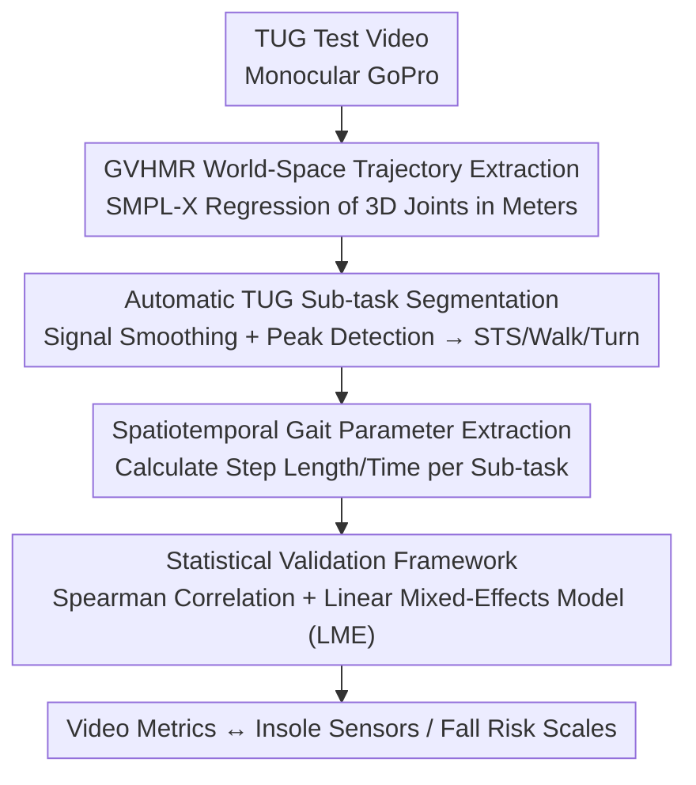

# Fall Risk and Gait Analysis using World-Spaced 3D Human Mesh Recovery

**Conference**: CVPR 2026  
**arXiv**: [2604.11961](https://arxiv.org/abs/2604.11961)  
**Code**: None  
**Area**: 3D Vision  
**Keywords**: Gait analysis, Fall risk, Human mesh recovery (HMR), Elderly, Monocular video

## TL;DR

A gait analysis pipeline based on GVHMR (World-Spaced 3D Human Mesh Recovery) is proposed to extract spatiotemporal gait parameters from monocular Timed Up and Go (TUG) test videos of older adults. The study validates the correlation between video-derived metrics, wearable sensors, and fall risk.

## Background & Motivation

**Background**: Gait assessment is a critical clinical indicator for fall risk and overall health in older adults, but standard clinical practice is primarily limited to gait speed measured by stopwatches.

**Limitations of Prior Work**: Comprehensive gait assessment is constrained by limited access to technology and specialized training. Inertial sensors, optical marker systems, and multi-camera markerless motion capture require dedicated infrastructure, limiting deployment outside controlled clinical or research environments.

**Key Challenge**: While biomechanical correlates of fall risk are well-defined, existing measurement methods cannot be scaled in uncontrolled community settings. Existing 2D keypoint methods fail to recover depth information or decouple camera perspective from human pose.

**Goal**: Utilize world-spaced HMR to extract spatiotemporal gait parameters in absolute metric units from monocular camera videos for accessible gait analysis in community settings.

**Key Insight**: GVHMR reconstructs the true trajectory of participants in a gravity-aligned world coordinate system, enabling the extraction of gait parameters in absolute units.

**Core Idea**: Replace 2D skeleton-based methods with GVHMR to achieve end-to-end extraction of world-space gait parameters from monocular video.

## Method

### Overall Architecture

The study addresses the quantification of fall-risk-associated gait parameters for older adults in community settings using a single standard camera. The pipeline begins with a GoPro video of a Timed Up and Go (TUG) test: first, GVHMR is used to reconstruct the person's 3D trajectory and SMPL-X parameters with absolute scale in a gravity-aligned world coordinate system. This trajectory then undergoes signal processing and peak detection to automatically segment the TUG into sub-tasks: sit-to-stand (STS), walking, and turning. Spatiotemporal parameters such as step length and step time are derived from these segments. Finally, a statistical validation framework using Spearman correlation and Linear Mixed-Effects (LME) models aligns these video metrics with insole sensors and fall risk scales. The mechanism relies on obtaining the true world-space trajectory to make "absolute metric step length" meaningful.

### Key Designs

**1. GVHMR World-Space Trajectory Extraction: Returning the Person to the Real World**

Prior 2D keypoint methods cannot distinguish between person movement and camera movement, making parameters requiring absolute spatial scales (like step length) impossible to extract. GVHMR predicts local body pose, shape parameters, and the orientation and translation within a gravity-aligned world coordinate system simultaneously, decoupling camera shake from true human movement. These parameters allow the regression of 3D joint positions $\{J^t \in \mathbb{R}^{24 \times 3}\}_{t=0}^{T}$ for every frame in world space, with units in real meters—the foundation for calculating step length and speed.

**2. Automatic TUG Sub-task Segmentation: Identifying STS and Turning from Signals**

Sit-to-stand transitions, walking, and turning have different clinical correlations with fall risk. Instead of manual frame-by-frame labeling, the pipeline uses kinematic features of the trajectory signals. To detect STS, it weights multiple velocity signals into a composite signal: $\text{STS} = 1.0 \cdot \dot{y}_{hip} + 0.7 \cdot \dot{z}_{shoulder} + 0.5 \cdot \dot{\theta}_{trunk}$. Simultaneous increases in vertical hip velocity, forward shoulder velocity, and trunk angular velocity correspond to the sit-to-stand transition. For turning, it monitors velocity extrema in the hip-line signal $x_{R,hip} - x_{L,hip}$, as the relative lateral position of the hips changes most drastically during axial rotation.

**3. Statistical Validation Framework: Verifying Credibility and Clinical Relevance**

Video-derived metrics must be both accurate and clinically meaningful. Accuracy is assessed by comparing video step times directly with insole sensors using Spearman correlation. Clinical relevance is evaluated using Linear Mixed-Effects (LME) models to determine if risk factors like STEADI scores or fear of falling (FES-I) predict gait parameters. LME is chosen over standard regression because each participant performed three TUG trials; by setting the participant as a random effect, the model controls for intra-participant variation and avoids overestimating significance from repeated measures.

### Loss & Training

This is an application-focused paper using a pre-trained GVHMR model; no model training is performed. Signal processing involves Gaussian smoothing ($\sigma=3$, 19-point symmetric filter) for noise reduction followed by peak detection.

## Key Experimental Results

### Main Results

| Metric | Fixed Effect | Estimate (95% CI) | p-value |
|------|---------|---------------|-----|
| STS Duration | STEADI Score | 1.23 (0.45, 2.01) | **0.002** |
| Step Length | STEADI Score | -1.36 (-2.03, -0.68) | **<0.001** |
| Step Length Variability | STEADI Score | -19.62 (-30.44, -8.80) | **<0.001** |
| Step Length | FES-I Score | -1.04 (-1.65, -0.43) | **0.001** |

### Ablation Study

| Validation Analysis | Result | Description |
|---------|------|------|
| Step Time Correlation | ρ=0.673, p<0.001 | Moderate correlation between video and insole sensors |
| Step Length ICC | 0.81 | High inter-participant consistency |
| Step Length Model R² | 0.85 | Strong model fit |
| STS Model R² | Lower | High intra-participant variability |

### Key Findings

- STEADI scores significantly predict sit-to-stand duration and step length parameters but do not predict turn duration.
- Step length and its variability are more stable indicators with stronger associations to fall risk compared to STS duration (ICC = 0.81 vs. low ICC).
- Video-derived step times systematically underestimate insole measurements, though the trends remain consistent.

## Highlights & Insights

- Applying GVHMR to clinical gait analysis is a valuable contribution: it requires only a GoPro and a chair for deployment in community centers.
- Step length variability as a proxy for fall risk holds strong clinical significance, consistent with existing biomechanical literature.

## Limitations & Future Work

- Systematic bias in video-derived step timing may relate to sampling rate differences (30fps vs. 60fps).
- Turning segmentation precision is affected by individual variations in turning strategies.
- Sample size is limited (52 participants), all of whom are older adults.
- Future work could evaluate the efficacy of GVHMR-derived metrics in prospective fall prediction.

## Related Work & Insights

- **vs. 2D Skeleton Methods**: 2D methods cannot recover depth or decouple camera motion; GVHMR reconstructs absolute trajectories in world coordinates.
- **vs. Multi-camera Systems**: This method requires only a monocular camera, significantly lowering the barrier for deployment.

## Rating

- Novelty: ⭐⭐⭐ GVHMR is an existing method; the innovation lies in its application.
- Experimental Thoroughness: ⭐⭐⭐⭐ Includes sensor cross-validation and rigorous statistical modeling.
- Writing Quality: ⭐⭐⭐⭐ Clear descriptions of methodology and statistics.
- Value: ⭐⭐⭐⭐ Practical application value for community health assessments.

<!-- RELATED:START -->

## Related Papers

- [\[CVPR 2026\] Anny-Fit: All-Age Human Mesh Recovery](anny-fit_all-age_human_mesh_recovery.md)
- [\[CVPR 2026\] Adapting Point Cloud Analysis via Multimodal Bayesian Distribution Learning](adapting_point_cloud_analysis_via_multimodal_bayesian_distribution_learning.md)
- [\[CVPR 2026\] ActionMesh: Animated 3D Mesh Generation with Temporal 3D Diffusion](actionmesh_animated_3d_mesh_generation_with_temporal_3d_diffusion.md)
- [\[CVPR 2026\] Learning 3D Shape Fidelity Metric from Real-world Distortions](learning_3d_shape_fidelity_metric_from_real-world_distortions.md)
- [\[CVPR 2026\] MatSpray: Fusing 2D Material World Knowledge on 3D Geometry](matspray_fusing_2d_material_world_knowledge_on_3d_geometry.md)

<!-- RELATED:END -->
