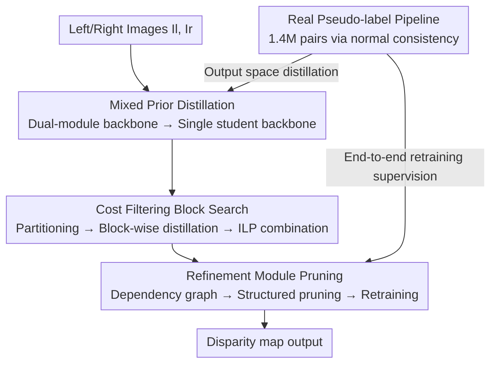

# Fast-FoundationStereo: Real-Time Zero-Shot Stereo Matching

**Conference**: CVPR 2026  
**Paper**: [CVF Open Access](https://openaccess.thecvf.com/content/CVPR2026/html/Wen_Fast-FoundationStereo_Real-Time_Zero-Shot_Stereo_Matching_CVPR_2026_paper.html)  
**Code**: https://nvlabs.github.io/Fast-FoundationStereo/ (Project Page)  
**Area**: 3D Vision  
**Keywords**: Stereo Matching, Zero-shot Generalization, Knowledge Distillation, Neural Architecture Search, Structured Pruning

## TL;DR
FoundationStereo, which features strong zero-shot performance but slow execution, is compressed using a "divide and conquer" strategy comprising three pillars: feature distillation, block-wise search for cost filtering, and pruning of the refinement module. Supplemented by an automated pseudo-labeling pipeline processing 1.4M real stereo pairs, this approach maintains near-original zero-shot accuracy at real-time frame rates, achieving a speedup of over 10x compared to FoundationStereo.

## Background & Motivation
**Background**: Stereo matching (estimating disparity/depth from binocular images) has recently diverged into two directions. One follows the "Foundation Model route" (e.g., FoundationStereo, MonSter, StereoAnywhere), relying on strong monocular priors like DepthAnythingV2 or DINO combined with Disparity Transformers for long-range self-attention. These models exhibit exceptional zero-shot generalization without requiring target-domain fine-tuning. The other follows the "Efficiency route" (e.g., LightStereo, RT-IGEV, BANet), utilizing lightweight backbones with 2D convolutions and local iterative refinement to reach real-time frame rates.

**Limitations of Prior Work**: Both routes possess critical drawbacks. Foundation models are computationally expensive—FoundationStereo takes ~496ms per frame on an RTX 3090, making it unsuitable for latency-constrained systems like robotics or AR. Conversely, while efficient models are fast (~30ms), they suffer from poor generalization and often require re-tuning for every target domain. Furthermore, obtaining dense, high-quality ground truth (GT) depth for real-world scenarios is extremely difficult, preventing these models from serving as "out-of-the-box" in-the-wild solutions.

**Key Challenge**: There exists a sharp trade-off between zero-shot robustness and real-time speed. Robust generalization stems from heavy architectures (ViT monocular priors + 4D cost volume self-attention), which are exactly the bottlenecks for speed. Reducing this capacity typically results in a loss of generalization.

**Goal**: To systematically accelerate an existing strong foundation model (FoundationStereo) to real-time performance without redesigning from scratch or sacrificing robustness.

**Key Insight**: The authors observe that FoundationStereo consists of three stages with distinct characteristics: feature extraction, cost filtering, and disparity refinement. Rather than applying a generic compression method, they apply targeted treatments for each stage: distillation for the feature backbone, architecture search for cost filtering, and structured pruning for the recursive refinement module.

**Core Idea**: A "divide and conquer" acceleration of the foundational stereo model—applying the most suitable compression technique (Distillation / NAS / Pruning) to each of the three stages. This is followed by deriving a family of real-time students with adjustable speed-accuracy trade-offs using output-space distillation on 1.4M real images via automated pseudo-labeling.

## Method

### Overall Architecture
The method employs FoundationStereo as the teacher, which follows an inference chain of "Feature Extraction → Cost Filtering → Disparity Refinement." The authors apply specific compression to each stage, decomposing, compressing, and reassembling the heavy teacher into a family of lightweight students, finally retraining end-to-end with real pseudo-labeled data. Specifically: ① The feature backbone (a hybrid of DepthAnythingV2 + side-tuning CNN) is distilled into a **single** student backbone to preserve monocular and stereo priors; ② The cost filtering network is partitioned into several local blocks, with each block producing multiple distilled candidates for combinatorial optimization under a latency budget; ③ The recursive refinement module (ConvGRU) is retrained after structured pruning based on its recursive dependency graph. These candidate modules can be flexibly assembled into different speed tiers. Outside this pipeline, an automated pseudo-labeling pipeline generates 1.4M real stereo pairs using normal consistency filtering for additional output-space supervision.

### Key Designs

**1. Mixed Monocular + Stereo Prior Distillation: Compressing dual modules into a single student**

The bottleneck lies in feature extraction: FoundationStereo uses a **hybrid dual-module** consisting of DepthAnythingV2 (providing large-scale monocular priors) and a side-tuning CNN (adapting monocular features for binocular tasks) to extract multi-level pyramid features $f^{(i)}_l, f^{(i)}_r \in \mathbb{R}^{C_i \times \frac{H}{i} \times \frac{W}{i}}$ ($i \in \{4,8,16,32\}$). While powerful, it is the primary speed bottleneck. The authors use knowledge distillation to replace this hybrid with a **single** student backbone: the teacher's multi-level features $\bar{f}^{(i)}$ are used as targets for the student via an MSE loss (adding linear projections if channels do not match).

Distillation is chosen over pruning because it is "architecture-agnostic," allowing the reuse of mature ImageNet-pretrained backbones. Pruning would require maintaining the ViT-constrained dual-module, where accuracy is difficult to recover on Internet-scale data. Although feature extraction is image-wise, both left and right images are placed in the same batch during training to preserve statistical similarity. By training various student backbones, a family of models with different speed-accuracy profiles is derived. The distilled features successfully replicate high-frequency edges and relative depth from the teacher, significantly improving robustness on translucent surfaces.

**2. Cost Filtering Block Search: Avoiding combinatorial explosion via block-wise distillation and ILP**

Cost filtering is the second bottleneck. The cost volume $V_C \in \mathbb{R}^{C \times \frac{D}{4} \times \frac{H}{4} \times \frac{W}{4}}$ is formed by group-wise correlation and concatenation. The teacher processes this using a dual-branch "3D hourglass (with Axial-Planar Conv) + Disparity Transformer." Simple pruning is ineffective here as the $V_C$ channels are already small ($<100$). Direct distillation would require manual structure design, where the design space is less mature than backbones.

Instead, the authors utilize a "block-wise" NAS strategy to avoid combinatorial explosion. ① **Block construction**: The filtering module is decomposed into a sequence of operational blocks $\Phi_t(V_C) = B_N \circ \cdots \circ B_2 \circ B_1(V_C)$. Within the 3D hourglass, partitions are made at spatial dimension changes. Each block selects from 5 layer types (3D conv / 3D deconv / APC / Residual 3D conv / Feature-guided volume excitation), constrained such that the runtime $t^s_B < t^t_B$ and channels match the original. The Disparity Transformer is treated as a single block. ② **Block-wise distillation and evaluation**: With $C = C_1 C_2 \cdots C_N$ total combinations (e.g., $200^8 \approx 10^{18}$), standard evolutionary NAS is infeasible. The authors train each candidate $B_i$ independently to mimic the teacher's corresponding block given the teacher's previous output $f_{i-1}$: $\|B_i(f_{i-1}) - \bar{B}_i(f_{i-1})\|_2^2$. Trained candidate blocks $B^c_i$ are then swapped into the teacher's pipeline to measure the relative error change $\Delta m^c_i$ and runtime change $\Delta t^c_i$ on a validation set. This reduces complexity from $O(n^N)$ to $O(n)$. ③ **Combinatorial search**: The optimal combination is found under a latency budget via Integer Linear Programming (ILP):

$$\min_{\mathcal{E}} \sum_{i=1}^{N} (\Delta \mathbf{m}_i)^\top \mathbf{e}_i, \quad \text{s.t.} \quad \sum_{i=1}^{N} (\Delta \mathbf{t}_i)^\top \mathbf{e}_i \leq \Delta \tau$$

where $\mathbf{e}_i$ is the one-hot selection vector for candidates of $B_i$, and $\Delta\tau$ is the runtime budget. Solving for different $\tau$ yields a family of cost filtering students.

**3. Refinement Module Structured Pruning: Removing ConvGRU redundancy via dependency graphs**

The third bottleneck is disparity refinement. Given an initial disparity $d_0$ and a hidden state from the context network, ConvGRU iteratively outputs $d_k, h_k$. These iterations contain significant redundancy suitable for structured pruning compatible with TensorRT. The challenge lies in circular dependencies; pruning channels in one layer affects the input dimensions of others. The authors apply three specific constraints: ① Final layers predicting disparity and upsampling masks must have fixed output channels; ② Layers consuming $h_{k-1}$ and layers outputting $h_k$ are interdependent and must be pruned jointly; ③ The motion encoder consuming indexed volume features has fixed input channels.

Importance is estimated via a first-order Taylor expansion by accumulating gradients through multiple iterations. After global sorting and pruning the least important $\alpha$ proportion of parameters, the remaining model is retrained with:

$$\mathcal{L} = \sum_{k=1}^{K} \gamma^{K-k} \| d_k - \bar{d} \|_1 + \lambda \sum_{i=1}^{L} \| x_i - \bar{x}_i \|_2^2$$

The first term supervises iterative disparity ($\gamma=0.9$ weights later iterations higher), and the second term is layer-wise feature distillation ($\lambda=0.1$). Initial disparity supervision is excluded as it is independent of the refinement module.

**4. Automated Pseudo-labeling for Real Data: Filtering 1.4M pairs via normal consistency**

Synthetic data lacks the realism of real images, but real-world GT depth is hard to obtain. An automated pipeline is designed for Stereo4D rectified pairs: the teacher predicts disparity, while a monocular estimator predicts depth. Both are converted to normal maps using 3D back-projection and Sobel operators. Pixel-wise cosine similarity between the two normal maps is thresholded to create a consistency mask. Samples with low consistency are discarded. Sky regions, which have infinite depth and are under-represented in synthetic data, are detected via open-vocabulary segmentation and zeroed out. Temporal sampling with a stride of 10 yields 1.4M pairs. The key insight is that consistency checks in normal space are more robust to varying depth ranges and noise in the-wild than checks in depth/disparity space. This dataset provides **output-space distillation** to complement feature-level distillation.

## Key Experimental Results

### Main Results
Zero-shot generalization is compared across 4 public datasets (Middlebury / ETH3D / KITTI 2012 / KITTI 2015). Runtime is measured on a 3090 at Middlebury-Q resolution.

| Method | Category | Midd.-H BP-2 | ETH3D BP-1 | KITTI15 D1 | Runtime(ms) |
|------|------|------|------|------|------|
| FoundationStereo (Teacher) | Non-RT | 1.10 | 0.50 | 2.80 | 496 |
| MonSter | Non-RT | 4.24 | 0.99 | 3.41 | 336 |
| Zero-RAFT-Stereo | Non-RT | 4.68 | 2.14 | 4.48 | 164 |
| RT-IGEV (Trained on same data) | RT | 7.82 | 5.05 | 4.00 | 45 |
| LightStereo-L (Trained on same data) | RT | 12.55 | 16.34 | 4.51 | 30 |
| **Ours** | **RT** | **2.20** | **1.22** | **3.25** | **49 (21)** |

Ours leads the real-time group by a large margin and ranks second overall (only behind the 10x slower teacher). The 49ms runtime drops to 21ms with TensorRT. It outperforms heavy models like Zero-RAFT-Stereo while being 10x faster than FoundationStereo with minimal error increase.

Robustness on non-Lambertian (transparent/specular) surfaces on Booster-Q:

| Method | BP-2 | EPE(px) | RT |
|------|------|---------|------|
| FoundationStereo | 5.18 | 1.13 | ✗ |
| StereoAnywhere | 9.01 | 1.21 | ✗ |
| RT-IGEV† (Same data) | 18.19 | 4.20 | ✓ |
| **Ours** | **6.61** | **1.54** | ✓ |

Ours is the only method that remains real-time while approaching the performance of heavy models in these difficult scenarios.

### Ablation Study

| Configuration | Midd.-H BP-2 | ETH3D BP-1 | KITTI15 D1 | Description |
|------|------|------|------|------|
| W/O Distillation | 2.87 | 2.11 | 4.32 | ImageNet backbone baseline |
| Cosine Distillation | 2.29 | 1.19 | 3.31 | Distillation loss variant |
| **MSE Distillation (Ours)** | **2.20** | **1.22** | **3.25** | Full backbone distillation |
| W/O Pseudo-labels | 2.53 | 1.31 | 3.48 | Removing real data |
| **+Pseudo-labels (Ours)** | **2.20** | **1.22** | **3.25** | 1.4M real pairs added |

### Key Findings
- **Backbone Distillation** consistently improves zero-shot generalization, rescuing the model in cases like transparent glass doors. MSE slightly outperforms Cosine.
- **Block-wise Search** is superior to random assembly under the same latency. As $\Delta\tau$ increases, it consistently finds better candidates. Eq.(1)'s proxy objective effectively handles tight budgets.
- **Pruning** reveals massive redundancy in the refinement module; while aggressive pruning drops points, retraining with Eq.(2) recovers most accuracy.
- **Pseudo-labeling** improves all methods, significantly benefiting those originally trained only on SceneFlow (e.g., LightStereo-L ETH3D BP-1 from 45.46 to 21.12).

## Highlights & Insights
- The **"divide and conquer" acceleration philosophy** is elegant: treating the foundation model as a three-stage pipeline (extraction/filtering/refinement) and applying localized compression (distillation/NAS/pruning) is a transferrable paradigm.
- **Reducing NAS from $O(n^N)$ to $O(n)$** via block-wise distillation is a practical contribution, allowing the derivation of an entire speed-accuracy family within a manageable search space.
- **Consistency checks in normal space** for pseudo-labeling is a clever trick: it is more robust to the varied depth noise of in-the-wild images and handles sky regions correctly.
- The framework essentially converts "one teacher into a family of students," allowing flexible assembly based on hardware constraints.

## Limitations & Future Work
- **Accuracy Gap**: While approaching the teacher, there is a stable, small error increase; it may not yet replace the teacher in accuracy-extreme tasks like high-precision 3D reconstruction.
- **Teacher Dependency**: The method inherits the teacher's failure modes (e.g., extreme non-Lambertian cases).
- **Pseudo-labeling Cost**: The pipeline requires multiple heavy models (Teacher + Monocular + Seg), and the computational cost of generating the 1.4M pairs was not quantified.
- **Quantization**: While likely a fruitful direction for edge deployment, it was not investigated in this paper.

## Related Work & Insights
- **vs FoundationStereo (Teacher)**: The teacher prioritizes accuracy over compute (496ms). This work trades ~10% of the compute for ~95% of the accuracy, enabling real-time deployment.
- **vs Efficiency Route**: Lightweight designs (LightStereo/RT-IGEV) rely on domain fine-tuning and have weak generalization. This work significantly outperforms them in zero-shot settings, even when they are provided with the same pseudo-labeled data.
- **vs VFM Acceleration**: While models like SAM or VGGT have extensive acceleration research, stereo matching foundation models have been largely unexplored. This work fills that gap with stereo-specific pruning and search strategies.

## Rating
- Novelty: ⭐⭐⭐⭐⭐ First to achieve real-time zero-shot stereo matching; block NAS and normal consistency are well-informed designs.
- Experimental Thoroughness: ⭐⭐⭐⭐⭐ Comprehensive coverage across 5 datasets, non-Lambertian tasks, and ablation of every component.
- Writing Quality: ⭐⭐⭐⭐ Clear "divide and conquer" narrative; some ILP/pruning notation in the text version requires careful cross-referencing with figures.
- Value: ⭐⭐⭐⭐⭐ Directly addresses the latency pain point for robotics and AR, with a framework applicable to other heavy models.

<!-- RELATED:START -->

## Related Papers

- [\[CVPR 2026\] Lite Any Stereo: Efficient Zero-Shot Stereo Matching](lite_any_stereo_efficient_zero-shot_stereo_matching.md)
- [\[CVPR 2026\] AsymLoc: Towards Asymmetric Feature Matching for Efficient Visual Localization](asymloc_towards_asymmetric_feature_matching_for_efficient_visual_localization.md)
- [\[CVPR 2026\] Distilling Unsigned Distance Function for Surface Reconstruction from 3D Gaussian Splatting](distilling_unsigned_distance_function_for_surface_reconstruction_from_3d_gaussia.md)
- [\[CVPR 2026\] GS-ASM: 2DGS-Supervised Active Stereo Matching](gs-asm_2dgs-supervised_active_stereo_matching.md)
- [\[CVPR 2026\] LaS-Comp: Zero-shot 3D Completion with Latent-Spatial Consistency](las-comp_zero-shot_3d_completion_with_latent-spatial_consistency.md)

<!-- RELATED:END -->
