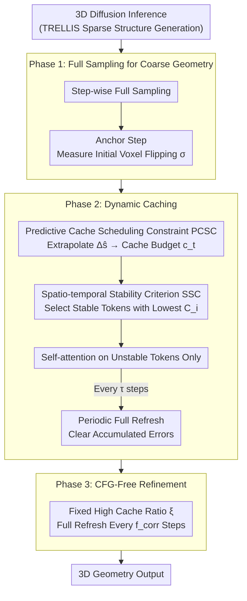

# Fast3Dcache: Training-free 3D Geometry Synthesis Acceleration

**Conference**: CVPR 2026  
**arXiv**: [2511.22533](https://arxiv.org/abs/2511.22533)  
**Code**: [https://fast3dcache-agi.github.io](https://fast3dcache-agi.github.io)  
**Area**: 3D Vision  
**Keywords**: 3D Geometry Synthesis Acceleration, Caching Mechanism, Voxel Stability, Training-free, Diffusion Models

## TL;DR

Fast3Dcache is proposed as a training-free geometry-aware caching framework for 3D diffusion models. It dynamically allocates caching budgets using Predictive Cache Scheduling Constraints (PCSC) based on voxel stabilization patterns and selects stable tokens for reuse via the Spatio-temporal Stability Criterion (SSC) based on velocity and acceleration. It achieves up to a 27.12% increase in throughput and a 54.83% reduction in FLOPs, with only about a 2% loss in geometric quality.

## Background & Motivation

1. **Background**: Cache-based acceleration methods have succeeded in 2D image and video diffusion models by reusing intermediate computations from previous timesteps to reduce redundant inference. Representative methods include various feature caching techniques.
2. **Limitations of Prior Work**:
    - Direct migration of 2D caching strategies to 3D diffusion models severely disrupts geometric consistency.
    - While small texture errors in 2D/video are visually negligible, numerical errors in 3D voxel/point predictions directly affect topology and spatial integrity, leading to surface holes, geometric distortions, or non-manifold meshes.
    - Existing 3D acceleration methods (e.g., Hash3D) are not applicable to the diffusion framework.
3. **Key Challenge**: 2D caching exploits perceptual redundancy, but 3D requires strict geometric correctness; small accumulated errors can result in topological disasters.
4. **Goal**: How to safely cache and reuse computations in 3D diffusion inference to achieve acceleration while maintaining geometric fidelity.
5. **Key Insight**: Analysis of the evolution of the voxel occupancy field in the sparse structure generation stage of the TRELLIS framework reveals a three-phase stabilization pattern (unstable → log-linear decay → fine-tuning), which enables the design of adaptive caching strategies.
6. **Core Idea**: Adaptive acceleration is achieved by utilizing the predictable decay pattern of voxel state changes in 3D generation to determine "how much to cache" (PCSC) and "what to cache" (SSC).

## Method

### Overall Architecture

Fast3Dcache addresses the slow inference speed of 3D diffusion. It observes the rhythm of 3D generation—where the voxel occupancy field in the sparse structure generation stage undergoes three phases: intense flipping, log-linear decay, and near-stasis. This determines the caching strategy for each step.

The inference process is divided into three phases. Phase 1 performs full sampling to build coarse geometry and records the initial voxel flipping rate at an anchor step. Phase 2 introduces dynamic caching: PCSC calculates the budget based on the decay trend, and SSC selects the most stable tokens for reuse, applying self-attention only to the remaining unstable tokens. Periodic full refreshes every $\tau$ steps clear accumulated errors. Phase 3 (CFG-Free Refinement) utilizes a fixed high cache ratio $\xi$ as the geometry has largely converged.

### Key Designs

**1. Predictive Cache Scheduling Constraint (PCSC): Determining budget per step via decay curves**

Instead of using a fixed ratio (e.g., 25% throughout), which would harm early coarse structures or waste late-stage convergence benefits, PCSC links the cache budget to actual voxel changes. The voxel occupancy change $\Delta s_t$ is defined as the sum of XOR operations between adjacent timesteps:

$$\Delta s_t = \sum_{i,j,k} \big(\mathcal{O}_{t+1}(i,j,k) \oplus \mathcal{O}_t(i,j,k)\big)$$

This follows a three-phase pattern: high fluctuation, log-linear decay, and abrupt stabilization. After the anchor step at $\lceil T \cdot \rho_a \rceil$, $\Delta s_t$ is extrapolated using a fixed slope $\mu$:

$$\Delta\hat{s}_t = \sigma \cdot e^{\mu \cdot (t - \lceil T \cdot \rho_a \rceil)}$$

The cache budget $c_t = D^3 - \frac{\Delta\hat{s}_t}{\gamma_{\text{up}}}$ increases naturally as predicted changes decrease. This adaptive allocation is more stable than fixed ratios (CD of 0.0697 vs. 0.0956).

**2. Spatio-temporal Stability Criterion (SSC): Selecting stable tokens within the budget**

SSC assigns a cacheability score to each token to ensure that only truly stable ones are reused:

$$C_i(t) = \omega \cdot \text{norm}(A_i(t)) + (1-\omega) \cdot \text{norm}(V_i(t))$$

Velocity $V_i(t) = \|v_i(t)\|_2$ measures the magnitude of feature updates, while acceleration $A_i(t) = \|v_i(t) - v_i(t-1)\|_2$ measures the stability of that velocity (Instantaneous Cache Error, ICE). Using both with $\omega=0.7$ outperforms any single metric.

**3. Three-Phase Pipeline and Periodic Refresh**

Since caching accumulates drift, Phase 2 implements a full refresh every $\tau$ steps to reset errors. Disabling this refresh leads to significant degradation (CD drops to 0.0724). Phase 3 uses a high fixed ratio $\xi$ and refreshes every $f_{\text{corr}}$ steps.

### Loss & Training

Fast3Dcache is entirely training-free. Hyperparameters include anchor ratio $\rho_a$, decay slope $\mu$ (default -0.07), refresh interval $\tau$, Phase 3 ratio $\xi$, and acceleration weight $\omega$ (default 0.7).

## Key Experimental Results

### Main Results (TRELLIS framework, Toys4K Dataset)

| Method | Throughput↑ | FLOPs(T)↓ | CD↓ | F-Score↑ |
|:---|:---|:---|:---|:---|
| TRELLIS vanilla | 0.5055 | 244.2 | 0.0686 | 54.8244 |
| RAS (25%) | 0.6337 (+25.36%) | 125.1 (-48.77%) | 0.0867 (+26.38%) | 40.2769 (-26.53%) |
| RAS (12.5%) | 0.6177 (+22.20%) | 125.8 (-48.48%) | 0.0846 (+23.32%) | 43.9622 (-19.81%) |
| **Fast3Dcache (τ=3)** | 0.5850 (+15.73%) | 142.4 (-41.69%) | **0.0697 (+1.60%)** | **54.0900 (-1.34%)** |
| **Fast3Dcache (τ=5)** | **0.6344 (+25.50%)** | **121.3 (-50.33%)** | 0.0712 (+3.79%) | 53.5003 (-2.42%) |
| **Fast3Dcache (τ=8)** | **0.6426 (+27.12%)** | **110.3 (-54.83%)** | 0.0703 (+2.48%) | 53.7528 (-1.95%) |

### Ablation Study (SSC Components)

| Configuration | CD↓ | F-Score↑ |
|:---|:---|:---|
| w/o SSC (std. dev) | 0.0743 | 50.9974 |
| Velocity $V_i$ only | 0.0836 | 44.9630 |
| Acceleration $A_i$ only | 0.0709 | 53.5394 |
| Combined $\omega=0.7$ | **0.0697** | **54.0900** |

### Key Findings

- Direct migration of 2D methods (RAS) causes severe geometric degradation, validating the need for geometry-aware caching.
- At $\tau=8$, throughput increases by 27.12% and FLOPs decrease by 54.83%, with minimal impact on CD and F-Score.
- Fast3Dcache is complementary to TeaCache; combined, they achieve 3.41× speedup with better quality than TeaCache alone.
- Acceleration $A_i$ is a more effective indicator of stability than velocity $V_i$.

## Highlights & Insights

- **Three-Phase Stabilization Pattern**: The observation of "unstable → log-linear decay → fine-tuning" might be a universal law for 3D diffusion models, providing a foundation for future acceleration work.
- **Decoupled Design**: The separation of macro scheduling (PCSC) and micro selection (SSC) allows for generalized application in other adaptive compute scenarios.
- **Joint Stability Metric**: Combining velocity and acceleration mimics physical motion tracking, ensuring that persistent but stable updates are handled correctly.

## Limitations & Future Work

- Currently only accelerates the sparse structure generation stage in TRELLIS; the SLat stage remains unoptimized.
- Relies on hyperparameters ($\mu, \tau$, etc.) that may require tuning across different tasks.
- Assumes a constant decay rate $\mu$, which might not hold for extremely complex or fine-grained geometries.
- Performance on implicit representations like Hunyuan3D remains unverified.

## Related Work & Insights

- **vs RAS**: Direct 2D DiT caching fails in 3D (27% F-Score drop). Ours keeps loss within 2%.
- **vs TeaCache**: Ours is complementary and achieves synergy when combined.
- **vs Hash3D**: While Hash3D explored 3D acceleration, it is not tailored for diffusion/flow-matching frameworks like ours.

## Rating

- Novelty: ⭐⭐⭐⭐
- Experimental Thoroughness: ⭐⭐⭐⭐
- Writing Quality: ⭐⭐⭐⭐
- Value: ⭐⭐⭐⭐

<!-- RELATED:START -->

## Related Papers

- [\[CVPR 2026\] Beyond Geometry: Artistic Disparity Synthesis for Immersive 2D-to-3D](beyond_geometry_artistic_disparity_synthesis_for_immersive_2d-to-3d.md)
- [\[CVPR 2026\] LASER: Layer-wise Scale Alignment for Training-Free Streaming 4D Reconstruction](laser_layer-wise_scale_alignment_for_training-free_streaming_4d_reconstruction.md)
- [\[CVPR 2026\] C-GenReg: Training-Free 3D Point Cloud Registration by Multi-View-Consistent Geometry-to-Image Generation with Probabilistic Modalities Fusion](c-genreg_training-free_3d_point_cloud_registration_by_multi-view-consistent_geom.md)
- [\[CVPR 2026\] ForeHOI: Feed-forward 3D Object Reconstruction from Daily Hand-Object Interaction Videos](forehoi_feed-forward_3d_object_reconstruction_from_daily_hand-object_interaction.md)
- [\[CVPR 2026\] E-RayZer: Self-supervised 3D Reconstruction as Spatial Visual Pre-training](e-rayzer_self-supervised_3d_reconstruction_as_spatial_visual_pre-training.md)

<!-- RELATED:END -->

## Related Papers

- [\[CVPR 2025\] Hash3D: Training-free Acceleration for 3D Generation](../../CVPR2025/3d_vision/hash3d_training-free_acceleration_for_3d_generation.md)
- [\[CVPR 2026\] C-GenReg: Training-Free 3D Point Cloud Registration by Multi-View-Consistent Geometry-to-Image Generation with Probabilistic Modalities Fusion](c-genreg_training-free_3d_point_cloud_registration_by_multi-view-consistent_geom.md)
- [\[CVPR 2026\] Beyond Geometry: Artistic Disparity Synthesis for Immersive 2D-to-3D](beyond_geometry_artistic_disparity_synthesis_for_immersive_2d-to-3d.md)
- [\[CVPR 2026\] ConceptPose: Training-Free Zero-Shot Object Pose Estimation using Concept Vectors](conceptpose_training-free_zero-shot_object_pose_estimation_using_concept_vectors.md)
- [\[CVPR 2026\] FE2E: From Editor to Dense Geometry Estimator](from_editor_to_dense_geometry_estimator.md)

<!-- RELATED:END -->
