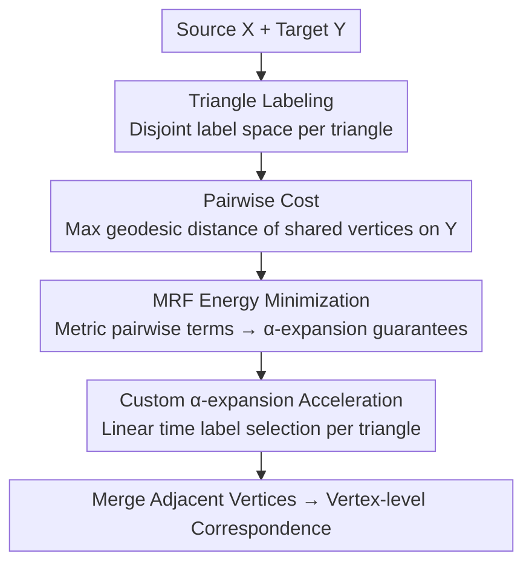

# Fast Markov Random Field Optimisation for Topologically Noisy 3D Shape Matching

**Conference**: CVPR 2026  
**Paper**: [CVF Open Access](https://openaccess.thecvf.com/content/CVPR2026/html/Roetzer_Fast_Markov_Random_Field_Optimisation_for_Topologically_Noisy_3D_Shape_CVPR_2026_paper.html)  
**Code**: https://github.com/paul0noah/sm-mrf  
**Area**: 3D Vision  
**Keywords**: Non-rigid shape matching, Markov Random Fields, $\alpha$-expansion, Topological noise, Combinatorial optimization  

## TL;DR
This paper reformulates non-rigid 3D shape matching as a triangle-based multi-label MRF problem. It ensures neighborhood smoothness using a pairwise pseudometric that measures geodesic distances exclusively on the target shape. By employing a variant of $\alpha$-expansion tailored for the specific label space, the problem is solved in linear time, achieving high accuracy, stability, and speed in scenarios with topological noise (genus changes).

## Background & Motivation
**Background**: The goal of 3D shape matching is to establish point-to-point correspondences between two surface meshes. Current mainstream approaches rely on "neighborhood preservation" to achieve high-quality results—either by approximating point correspondences in low-dimensional functional spaces via functional maps or by explicitly constraining adjacent surface elements to remain adjacent after matching through combinatorial optimization (e.g., shortest-path SpiderMatch/GeCo, graph matching). These methods depend on **global intrinsic quantities** such as geodesic distances or Laplace-Beltrami eigenfunctions.

**Limitations of Prior Work**: In real-world scenarios, objects move; for instance, when two hands of a human body touch, the genus $g$ of the shape changes from 0 to 1, while the geometric appearance remains nearly identical—the authors refer to this change in genus as **topological noise**. Topological noise is catastrophic for global intrinsic measures: two points on the hands that were originally geodesically far apart suddenly become very close. Consequently, methods relying on geodesic consistency or functional maps either become inapplicable (due to constraint violations between different genera) or suffer significant accuracy degradation. As shown in Tab. 1, existing methods struggle to satisfy the four criteria of neighborhood preservation, robustness to topological noise, efficiency, and accuracy simultaneously.

**Key Challenge**: There is an inherent conflict between neighborhood preservation (necessary for high quality) and robustness to topological noise (necessary for reliability). Neighborhood preservation is built on the assumption that the intrinsic metrics of the two shapes are comparable, but topological noise breaks this assumption. Furthermore, general multi-label MRF optimization is NP-hard, creating a third conflict: the need for an expressive neighborhood constraint that remains efficiently solvable.

**Goal**: To design a purely intrinsic, scalable combinatorial matching framework that is robust to genus changes and can be solved efficiently with approximation guarantees.

**Key Insight**: The authors observe that the $\alpha$-expansion algorithm offers an approximation factor guarantee when the pairwise cost is a metric. If shape matching can be formulated as a multi-label MRF where the pairwise term is a metric, this mature algorithm can be leveraged. A crucial observation is that measuring neighborhood costs **only on the target shape** is sufficient. This does not require the distances on both shapes to be equal (which is the source of sensitivity to topological noise), but only necessitates that adjacent triangles on the source are matched to nearby surface elements on the target.

**Core Idea**: Each triangle (rather than vertex or edge) is used as the matching unit. Each triangle is assigned a **disjoint** label space. A pairwise pseudometric cost is defined by calculating the maximum geodesic distance of shared vertices on the target shape only. The matching is formulated as a multi-label MRF and solved in linear time using a variant of $\alpha$-expansion customized for this label space.

## Method

### Overall Architecture
Given a source shape $X$ and a non-rigidly deformed target shape $Y$, the goal is to find a mapping $\phi: V_X \to V_Y$. Instead of operating directly on vertices, this method uses **triangles as units**: each triangle $f \in F_X$ in the source shape is assigned a label that encodes which three vertices (i.e., a surface element) on the target shape it maps to. The objective is to ensure that for two adjacent source triangles, their **shared vertices** map to points on the target with minimal geodesic distance. This preserves neighborhood structures while avoiding noise contamination since distances are only measured on the target side. The pipeline involves building a triangle neighborhood graph, creating disjoint label spaces for each triangle, defining pairwise costs, formulating the MRF energy, and solving it via custom $\alpha$-expansion.

### Key Designs

**1. Triangle Labeling: Encoding Matching as a Multi-label Problem via Disjoint Label Spaces**

Defining neighborhood costs at the vertex or edge level often leads to degeneracies where adjacent elements collapse into a single point or fail under noise due to rigid distance constraints. This paper uses triangles as units and defines a unique label space for each triangle $f=(x_1,x_2,x_3)$:

$$\mathcal{L}_f := \left\{ \left(\tbinom{x_1}{y_1},\tbinom{x_2}{y_2},\tbinom{x_3}{y_3}\right) \mid \forall y_1,y_2,y_3 \in V_Y \right\}.$$

Each label is a triplet mapping the source triangle's vertices to target vertices. Because the labels **explicitly include the source vertices** $x_1, x_2, x_3$, the label spaces for different triangles are naturally disjoint: $\mathcal{L}_f \cap \mathcal{L}_{\bar f} = \emptyset\ (f \neq \bar f)$. This disjointness is the prerequisite for subsequent acceleration. In practice, the target triplets are restricted to three types—a single point, an edge, or three vertices within $k$ edges of each other—to accommodate discretization differences and mesh stretching. The union of all label spaces is $\mathcal{L} = \mathcal{L}_1 \cup \cdots \cup \mathcal{L}_{|F_X|}$. Using triangles allows the expression of "surface element adjacency" without introducing geometric inconsistencies.

**2. Pairwise Cost: Measuring distances on the target shape only using shared vertex maximums**

This is the core design for robustness against topological noise. Two adjacent triangles in $X$ (sharing exactly two vertices) should remain close in $Y$. Projections $\pi_{f\bar f}, \pi_{\bar f f}: \mathcal{L} \to V_Y$ decode labels into the matching points of the shared vertices on $Y$. The pairwise cost is then:

$$V_{f\bar f}(\ell_1,\ell_2) := \max\left\{ d_Y\!\big(\pi_{f\bar f}(\ell_1),\pi_{f\bar f}(\ell_2)\big),\ d_Y\!\big(\pi_{\bar f f}(\ell_1),\pi_{\bar f f}(\ell_2)\big)\right\},$$,

where $d_Y$ is the geodesic distance on the **target shape**. Crucially, the cost only reads distances on the $Y$ side and does not require the distances of $X$ and $Y$ to be comparable. This bypasses topological noise, which typically breaks the comparability of source/target distances. Costs are zero when adjacent source triangles map to adjacent target elements. To further handle noise, a concave function $\Phi$ is applied to the pairwise term to maintain pseudometric properties while capping large distances: $\Phi(a)= a\ (a<10b);\ 10+0.0001a\ (\text{otherwise})$, where $b$ is the minimum edge length of the target.

**3. MRF Energy Minimization: Metric Pairwise Terms and $\alpha$-expansion Guarantees**

The matching problem is formulated as minimizing a multi-label MRF energy:

$$\min \sum_{f\in F_X} D_f(\ell_f) + \lambda \sum_{(f,\bar f)\in A_X} V_{f\bar f}(\ell_f,\ell_{\bar f}) \quad \text{s.t. } \forall f: \ell_f \in \mathcal{L}_f,$$

where $D_f$ is the unary term (feature difference) and $\lambda$ is a weight. While multi-label MRFs are generally NP-hard, the authors prove (Lemma 6) that each $V_{f\bar f}$ is a **pseudometric** on the label set. By adding a Potts term $\tau$, it becomes a strict metric, allowing the use of $\alpha$-expansion for "metric MRFs" with an approximation factor guarantee of $C = 2 + 2\max V_{f\bar f}$. In practice, since label spaces are disjoint, adjacent triangles never share the same label, making the explicit addition of $\tau$ unnecessary.

**4. Custom $\alpha$-expansion Acceleration: Linear Time via Label Disjointness**

Standard $\alpha$-expansion requires solving a graph cut for each expansion move, which is expensive. Due to the unique structure where "each label can only be assigned to a specific triangle" (disjointness), the authors simplify each iteration: for each triangle $f$, the unary and pairwise costs are calculated based on the current labels of other triangles, and the **optimal label is selected directly**. This step is linear in time and avoids graph cuts entirely. Consequently, this version is more scalable than general $\alpha$-expansion while retaining approximation guarantees.

### Loss & Training
This method is a **non-learning** optimization framework. The unary term is $D_f(\ell_f)=\sum_{i=1}^3 \Psi(f_{x_i}-f_{y_i})$, where features $f_{x_i},f_{y_i}$ are per-vertex features from ULRSSM, and $\Psi$ is the Barron robust loss ($\alpha=-1.0, c=0.1$). Hyperparameters include the pairwise weight $\lambda=100$ and label sampling neighborhood $k=2$. The final vertex-to-vertex correspondence is extracted by merging triangle label mappings.

## Key Experimental Results

### Main Results
The evaluation uses geodesic error (normalized by shape diameter) and Dirichlet energy (measuring smoothness). Datasets include clean sets (FAUST, SMAL, DT4D) and topologically noisy sets (SCAPET, TOPKIDS, and the self-created TOPFAUST with 95 pairs).

| Setting | Dataset | Performance (Ours) | Comparison |
|------|--------|----------|------|
| Clean Data | FAUST / SMAL / DT4D | Consistently on the Pareto front of accuracy vs. time | Similar accuracy to SpiderMatch/GeCo/SuPaMatch but faster; KernelMatch is faster but less accurate |
| Topological Noise | SCAPET / TOPKIDS / TOPFAUST | **Lowest overall geodesic error** | All methods degrade under noise, but Ours shows the least degradation |
| Runtime | FAUST (5 Resolutions) | Custom $\alpha$-exp. is significantly faster than standard version | Only KernelMatch is faster, but with inferior matching quality |

### Ablation Study
The paper uses a capabilities table (Tab. 1) and qualitative results to justify design choices.

| Configuration / Contrast | Key Observation | Explanation |
|------------|----------|------|
| Full Model (with Pairwise) | Smooth correspondence, no artifacts | Smoothness is "likely attributable" to the pairwise cost term |
| Neighborhood-based (SpiderMatch/GeCo) | Excluded from noise evaluation | Explicit geometric consistency is violated by topological noise |
| KernelMatch | Artifacts in noise scenarios | Uses symmetric heatmap-based proximity; Ours is asymmetric and more stable |
| Custom vs. General $\alpha$-exp. | Custom is faster/more scalable | Exploits label disjointness to avoid graph cuts |

### Key Findings
- **Pairwise cost is the primary source of smoothness**: Removing it or using symmetric metrics (like KernelMatch) leads to artifacts. Asymmetric measurement on the target side is critical for topological robustness.
- **Triangle-based disjoint label spaces provide dual benefits**: They allow neighborhood constraints to be expressed and enable linear-time $\alpha$-expansion simultaneously.
- **Minimal degradation under noise**: While all methods degrade on TOPFAUST, Ours remains the most robust without sacrificing performance on clean data.
- ⚠️ Fig. 7 shows a failure case, indicating that the method is not 100% immune to extreme topological shortcuts.

## Highlights & Insights
- **Asymmetric measuring is a "lever" design**: Instead of trying to fix the comparability of source/target intrinsic metrics broken by noise, the method simply stops comparing them—it only requires source neighbors to stay close on the target.
- **Dual design dividend**: The disjoint triangle labels serve both modeling (surface element adjacency) and optimization (linear-time expansion).
- **Vindication for traditional optimization**: Despite the deep learning era, this non-learning framework with approximation guarantees outperforms the unsupervised deep method ULRSSM on topological noise.
- **Transferable Trick**: Formulating a task as a multi-label MRF with metric pairwise terms to leverage $\alpha$-expansion is a robust strategy for correspondence problems where global quantities are unreliable.

## Limitations & Future Work
- **Global Optimality**: There is no guarantee of reaching a global optimum, only an approximation factor.
- **Feature Dependency**: The quality of the unary term relies on external features (ULRSSM); the method still requires a decent initial feature space.
- **Extreme Shortcuts**: Failure cases still exist under severe topological changes.
- **Evaluation Scale**: Quantitative tests were limited to shapes with $\leq 1k$ triangles; performance at higher resolutions requires further validation.

## Related Work & Insights
- **vs. KernelMatch [83]**: Both seek robustness to topology. KernelMatch uses symmetric heat kernels; Ours uses asymmetric pairwise costs, providing higher quality at a slightly higher time cost.
- **vs. Functional Maps (ULRSSM/DiscrOpt)**: Functional maps fail when LB eigenfunctions become inconsistent due to topology; Ours is a purely combinatorial discrete optimization.
- **vs. SpiderMatch/GeCo/SuPaMatch**: These methods enforce strict geometric consistency, which is violated by noise; Ours uses "soft" pairwise costs to tolerate genus changes.

## Rating
- Novelty: ⭐⭐⭐⭐⭐ 
- Experimental Thoroughness: ⭐⭐⭐⭐ 
- Writing Quality: ⭐⭐⭐⭐⭐ 
- Value: ⭐⭐⭐⭐⭐ 

<!-- RELATED:START -->

## Related Papers

- [\[CVPR 2026\] Fast-FoundationStereo: Real-Time Zero-Shot Stereo Matching](fast-foundationstereo_real-time_zero-shot_stereo_matching.md)
- [\[CVPR 2026\] From Feature Learning to Spectral Basis Learning: A Unifying and Flexible Framework for Efficient and Robust Shape Matching](from_feature_learning_to_spectral_basis_learning_a_unifying_and_flexible_framewo.md)
- [\[CVPR 2026\] Random Wins All: Rethinking Grouping Strategies for Vision Tokens](random_wins_all_rethinking_grouping_strategies_for_vision_tokens.md)
- [\[CVPR 2026\] Fast SceneScript: Fast and Accurate Language-Based 3D Scene Understanding via Multi-Token Prediction](fast_scenescript_fast_and_accurate_language-based_3d_scene_understanding_via_mul.md)
- [\[CVPR 2025\] PrEditor3D: Fast and Precise 3D Shape Editing](../../CVPR2025/3d_vision/preditor3d_fast_and_precise_3d_shape_editing.md)

<!-- RELATED:END -->
