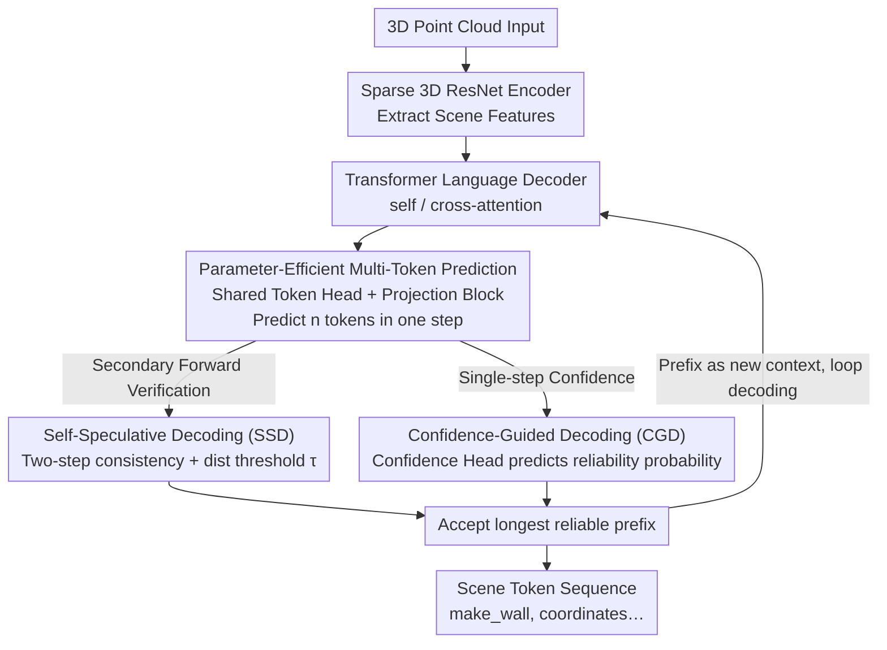

# Fast SceneScript: Fast and Accurate Language-Based 3D Scene Understanding via Multi-Token Prediction

**Conference**: CVPR 2026  
**arXiv**: [2512.05597](https://arxiv.org/abs/2512.05597)  
**Code**: None  
**Area**: 3D Vision  
**Keywords**: 3D scene understanding, multi-token prediction, structured language models, inference acceleration, self-speculative decoding

## TL;DR

This paper proposes Fast SceneScript, which achieves inference acceleration for 3D scene understanding by introducing Multi-Token Prediction (MTP) into structured language models. Combined with Self-Speculative Decoding (SSD) and Confidence-Guided Decoding (CGD) to filter unreliable tokens, along with a parameter-efficient head-sharing mechanism, it achieves 5.09× and 5.14× speedups for layout estimation and object detection, respectively, without compromising accuracy.

## Background & Motivation

1.  **Background**: 3D perception methods based on structured language models, such as SceneScript, represent 3D scenes as token sequences (e.g., `[make_wall, x1, y1, z1, x2, y2, z2, height, thickness]`), enabling a single model architecture to handle tasks like layout estimation, 3D object detection, and coarse reconstruction.
2.  **Limitations of Prior Work**:
    *   Autoregressive Next-Token Prediction (NTP) suffers from slow inference; latency increases with sequence length (e.g., 1176ms on Structured3D).
    *   Direct application of MTP reduces inference steps but leads to significant accuracy degradation (F1-Score drops from 0.913 to 0.840 with 8 heads).
    *   MTP introduces $(n-1)$ additional token heads, substantially increasing parameter count (14M → 23.67M).
3.  **Key Challenge**: The trade-off between MTP acceleration and token prediction accuracy, as well as the overhead of additional parameters.
4.  **Goal**: Achieve multi-fold inference acceleration for structured language models while maintaining accuracy and minimizing parameter increments.
5.  **Key Insight**: Structured languages (vs. natural languages) exhibit stronger determinism and weaker coupling, making MTP more feasible; the key is designing reliable token filtering strategies to prune inaccurate predictions.
6.  **Core Idea**: Use MTP to predict multiple tokens and then filter unreliable ones via SSD/CGD, retaining only the longest reliable prefix to implement a "predict many, accept reliable" acceleration paradigm.

## Method

### Overall Architecture

Fast SceneScript addresses the bottleneck of "slow token-by-token decoding" in structured language models for 3D perception without sacrificing accuracy like naive MTP. The pipeline maintains the backbone of SceneScript: input 3D point clouds are encoded into features via a sparse 3D ResNet, then fed into a Transformer language decoder with self/cross-attention to sequentially generate token sequences describing the scene (e.g., `[make_wall, x1, y1, z1, ...]`).

The core difference lies in the decoding step. Instead of outputting one token per step, the decoder **predicts $n$ future tokens simultaneously** (plus $n-1$ confidence scores) in a single step. This is followed by a token filtering stage—discarding unreliable predictions in the batch and accepting only the longest reliable prefix starting from the beginning. This prefix serves as the new context for the next step. This "predict many, but accept only reliable ones" approach reduces the theoretical steps from $N$ to $\lceil N/n \rceil$ while ensuring the accepted tokens remain accurate.

### Key Designs

**1. Parameter-Efficient Multi-Token Prediction: Accelerating MTP without linear parameter costs for extra heads**

Directly assigning an independent token head to each of the $n$ positions causes parameters to inflate linearly—MTP-8 increases parameters from 14M to 23.67M. Fast SceneScript instead uses a **Shared Token Head** across all $n$ positions. Differentiation is handled by a lightweight Projection Block consisting of 2 FFN blocks (each with 2 linear layers + ReLU + LayerNorm), which maps the hidden state $f_{k+1}$ from the language decoder to $n-1$ distinct hidden states $f_{k+i}$, all of which pass through the same head. This works because language model hidden states reside in a shared semantic space; structures similar to Transformer FFNs are sufficient to distinguish between positions. Consequently, for $n=8$, parameters increase by only ~7.5% (15.05M) compared to the 69% increase in naive MTP-8.

**2. Self-Speculative Decoding (SSD): Filtering unreliable tokens via two-step consistency**

SSD identifies errors to maintain accuracy. It involves two steps: first, $n$ MTP heads provide candidates $\{t_{k+1}, \dots, t_{k+n}\}$. Second, these candidates are treated as fixed preceding inputs, and the most reliable first head is used to re-predict $\{\tilde{t}_{k+2}, \dots, \tilde{t}_{k+n}\}$ sequentially. The two sets are compared, and the longest consistent prefix is accepted. Crucially, as numerical tokens (coordinates, heights) in structured language allow for small errors, consistency is defined by a distance threshold:

$$|t_{k+i} - \tilde{t}_{k+i}| \leq \tau$$

Predictions within $\tau$ are considered valid. This distance metric is better suited for geometric tokens than exact matching used in natural language, allowing the model to accept approximately one extra token per step.

**3. Confidence-Guided Decoding (CGD): Folding verification into a single step**

While SSD is accurate, it requires an extra forward pass for verification. CGD is a single-step alternative. It adds a Confidence Head to each extra token head to predict the probability $c_{k+i}$ that the token will be consistent with the result of the first head. During inference, if $c_{k+i} < \epsilon$, the token is deemed unreliable and discarded immediately. This confidence is supervised via BCE during training: if $|t_{k+i} - \tilde{t}_{k+i}| \leq \tau$, the target label $\hat{c}_{k+i}=1$, otherwise 0. This trades extra training for the Confidence Heads for a more elegant single-step "predict + verify" cycle.

### Mechanism Example

Given $n=8$, the decoder attempts to continue a wall command `[make_wall, x1, y1, z1, x2, y2, z2, height]`. The MTP heads provide 8 candidate tokens. SSD then re-calculates using the first head: the first 7 tokens fall within the distance threshold $\tau$ (categorical labels match perfectly, coordinates differ by only a few centimeters), but the 8th token (thickness) deviates beyond $\tau$. Thus, the longest reliable prefix—the first 7 tokens—is accepted, and the 8th token and subsequent ones are recalculated in the next step. This "predict 8, accept 7" progression corresponds to the average acceptance rates ($\alpha=7.45$ for $n=8$ and $\alpha=8.97$ for $n=10$) observed in the main experiments.

### Loss & Training

The total loss is the MTP primary loss plus the confidence loss: $\mathcal{L} = \mathcal{L}_{\text{MTP}} + \lambda_c \mathcal{L}_c$. The MTP loss assigns lower weights to tokens further in the future using a decay factor $\lambda_h$:

$$\mathcal{L}_{\text{MTP}} = -\sum_k \sum_i \lambda_h^{i-1} \log p(t_{k+i}\mid t_{\leq k})$$

The confidence loss is similarly distance-weighted, using BCE to supervise the reliability prediction of each additional head:

$$\mathcal{L}_c = -\sum_{i,k} \lambda_h^{i-1} \big(\hat{c}_{k+i} \log c_{k+i} + (1-\hat{c}_{k+i}) \log(1-c_{k+i})\big)$$

## Key Experimental Results

### Main Results (Layout Estimation on ASE Dataset)

| Method | n | Params | Latency | α (Accepted tokens/step) | F1-Score (test) |
| :--- | :--- | :--- | :--- | :--- | :--- |
| SceneScript | 1 | 14.00M | 382ms | 1 | 0.915 |
| SceneScript+MTP | 4 | 18.14M | 109ms | 4 | 0.889 |
| SceneScript+MTP | 8 | 23.67M | 62ms | 8 | 0.842 |
| SceneScript+MTP | 10 | 26.43M | 54ms | 10 | 0.814 |
| **Fast SceneScript (SSD)** | **8** | **15.05M** | **81ms** | **7.45** | **0.913** |
| **Fast SceneScript (CGD)** | **8** | **16.10M** | **92ms** | **6.30** | **0.913** |
| **Fast SceneScript (SSD)** | **10** | **15.05M** | **75ms** | **8.97** | **0.912** |

### Cross-Dataset Comparison (Layout Estimation on Structured3D)

| Method | Latency | F1-Score |
| :--- | :--- | :--- |
| RoomFormer | 54ms | 0.702 |
| SceneScript | 1176ms | 0.774 |
| Fast SceneScript (SSD, n=8) | 230ms | 0.791 |
| Fast SceneScript (CGD, n=8) | 269ms | 0.795 |

### Key Findings

*   SSD accepts more tokens per step than CGD (7.45 vs. 6.30) and has lower latency, though CGD avoids the extra verification step.
*   The parameter-efficient mechanism significantly reduces overhead: for $n=8$, parameters drop from 23.67M to 15.05M (-36%), only 7.5% more than the original SceneScript.
*   While naive MTP accuracy degrades severely at $n=10$ (F1 drops to 0.814), Fast SceneScript maintains 0.912.
*   The distance threshold $\tau$ for numerical tokens significantly boosts acceptance rates, adding roughly 1 accepted token per step compared to exact matching.
*   Simultaneous validation of layout estimation and object detection on SceneCAD achieved 5× speedup with improved accuracy.

## Highlights & Insights

*   **Determinism of Structured Language as an MTP Advantage**: Commands like "make_wall" are necessarily followed by coordinate sequences. This strong structural constraint makes multi-token prediction more feasible than in natural language, an insight potentially generalizable to code generation or SQL queries.
*   **"Predict Many + Filter" Paradigm**: Instead of striving for perfect accuracy for every token, the model predicts boldly and filters unreliable results. SSD and CGD offer different trade-offs (SSD is faster but requires verification; CGD is more elegant but requires training confidence heads).
*   **Parameter Sharing Strategy**: Leveraging the shared semantic hidden space of language models, a lightweight Projection Block replaces $n-1$ independent heads, reducing parameters by 43% without accuracy loss.

## Limitations & Future Work

*   SSD requires an additional forward pass for verification, making the actual speedup slightly lower than the theoretical maximum.
*   The confidence threshold $\epsilon$ in CGD requires manual tuning and may vary across datasets.
*   The method has only been validated in 3D scene understanding; its efficacy in 2D perception (e.g., object detection) remains unexplored.
*   Token filtering only considers the longest reliable prefix; if a single token is unreliable, all subsequent tokens are discarded, which may be overly conservative.

## Related Work & Insights

*   **vs. SceneScript**: The direct predecessor; Fast SceneScript preserves its architecture and interface while accelerating inference.
*   **vs. Medusa/DeepSeek-V3**: Natural language MTP methods; this work is the first to apply MTP to structured perception language models, finding that distance metrics are superior to exact matching.
*   **vs. RoomFormer**: Traditional detection-based methods have lower latency (54ms vs. 230ms) but lower F1-Scores (0.702 vs. 0.791) and are less flexible than language model-based approaches.

## Rating

*   Novelty: ⭐⭐⭐⭐ First application of MTP to structured perception language models; CGD and parameter-sharing designs are novel.
*   Experimental Thoroughness: ⭐⭐⭐⭐⭐ Evaluated on three datasets across two tasks with detailed ablation studies.
*   Writing Quality: ⭐⭐⭐⭐ Clear methodology and intuitive tables.
*   Value: ⭐⭐⭐⭐ 5× inference acceleration provides significant engineering value for real-time 3D perception systems.

<!-- RELATED:START -->

## Related Papers

- [\[CVPR 2026\] LightSplat: Fast and Memory-Efficient Open-Vocabulary 3D Scene Understanding in Five Seconds](lightsplat_fast_and_memory-efficient_open-vocabulary_3d_scene_understanding_in_f.md)
- [\[CVPR 2026\] Masking Matters: Unlocking the Spatial Reasoning Capabilities of LLMs for 3D Scene-Language Understanding](masking_matters_unlocking_the_spatial_reasoning_capabilities_of_llms_for_3d_scen.md)
- [\[CVPR 2026\] Geometry-Guided 3D Visual Token Pruning for Video-Language Models](geometry-guided_3d_visual_token_pruning_for_video-language_models.md)
- [\[CVPR 2026\] Lifting Unlabeled Internet-level Data for 3D Scene Understanding](lifting_unlabeled_internet-level_data_for_3d_scene_understanding.md)
- [\[CVPR 2026\] RAP: Fast Feedforward Rendering-Free Attribute-Guided Primitive Importance Score Prediction for Efficient 3D Gaussian Splatting Processing](rap_fast_feedforward_rendering-free_attribute-guided_primitive_importance_score_.md)

<!-- RELATED:END -->
