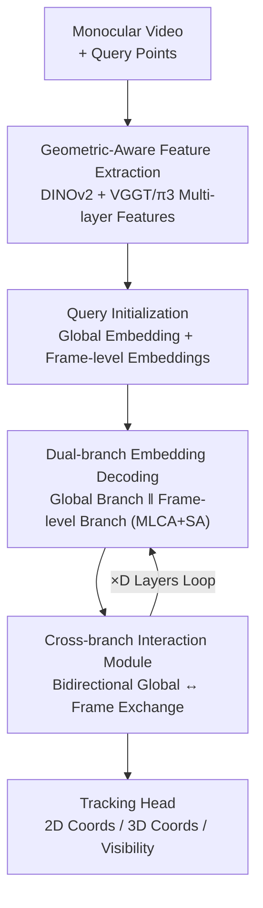

# Fast Spatial Tracking with Visual Geometry Transformer

**Conference**: CVPR 2026  
**Paper**: [CVF Open Access](https://openaccess.thecvf.com/content/CVPR2026/html/Huang_Fast_Spatial_Tracking_with_Visual_Geometry_Transformer_CVPR_2026_paper.html)  
**Code**: Not released  
**Area**: 3D Vision  
**Keywords**: 3D point tracking, visual geometry Transformer, dual-branch decoding, monocular video, real-time tracking

## TL;DR
This paper employs a feed-forward visual geometry Transformer to directly predict 2D/3D trajectories of arbitrary query points from monocular video. By replacing the traditional dependence on dense depth estimation and scene reconstruction with a dual-branch design of "global branch + frame-level branch + bidirectional interaction," it achieves real-time speeds of 28 ms/frame and attains SOTA performance on TAPVid-3D with 19.0 AJ / 28.9 ADP.

## Background & Motivation

**Background**: 3D point tracking (spatial tracking) aims to recover the 3D trajectories of arbitrary query points in monocular videos. It is more challenging than 2D tracking as it requires consistent reasoning about both geometry and camera motion. Current SOTA methods (SpatialTracker, TAPIP3D, SpatialTrackerV2) almost exclusively follow the pipeline of "estimating depth/pose first, then lifting image features to 3D, and finally performing iterative optimization or point cloud alignment."

**Limitations of Prior Work**: This pipeline has two critical flaws. First, tracking accuracy is strictly bound by the quality of pre-trained depth models—SpatialTracker's accuracy improved by 23.8% just by switching from UniDepthV2 to MegaSaM, meaning downstream errors cannot be corrected if depth estimation fails. Second, dense depth estimation is inherently slow: feed-forward depth methods take milliseconds per frame, while reconstruction-based optimization like MegaSaM and ViPE takes seconds per frame (MegaSaM takes >1s per frame on a 150-frame sequence), making "real-time tracking" impossible. Furthermore, these methods include numerous tracking-specific inductive biases (explicit cost volumes, iterative refinement), limiting scalability to large-scale real-world data.

**Key Challenge**: Accuracy depends on depth quality vs. high-quality depth is extremely expensive—3D tracking is bottlenecked by the prerequisite of "obtaining depth first," making it both slow and brittle.

**Goal**: Remove the independent depth model as an intermediate step, allowing the model to project 2D and 3D trajectories directly from monocular video in a feed-forward manner at real-time speeds.

**Key Insight**: The authors observe that visual geometry Transformers (e.g., VGGT, $\pi 3$) already implicitly encode 3D geometric information and multi-view correspondences within their feature representations. Since these features are already "geometry-aware," there is no need for an external depth model; tracking can be performed directly in this feature space.

**Core Idea**: Use a feed-forward visual geometry Transformer to extract geometry-grounded features, and utilize a set of "global + frame-level" dual-branch query embeddings to directly regress trajectories, compressing the heavy "depth estimation $\rightarrow$ lift $\rightarrow$ optimization" pipeline into a lightweight decoding head.

## Method

### Overall Architecture
The method solves the task of "directly predicting 2D/3D trajectories of arbitrary points from monocular video without depth priors." The pipeline consists of five stages: first, a visual geometry Transformer backbone extracts geometric-aware patch features from the video; then, a query initialization mechanism converts each query point into a global trajectory embedding and a set of frame-level trajectory embeddings; these are fed into a dual-branch embedding decoder where the global branch handles long-range sequence coherence and the frame-level branch manages fine-grained per-frame coordinates; both branches exchange information bidirectionally via an interaction module after each decoding stage; finally, a tracking head decodes the frame-level embeddings into 2D coordinates, 3D coordinates, and visibility. The entire pipeline is purely feed-forward, involving no point cloud optimization or camera pose solving.

### Key Designs

**1. Geometric-Aware Feature Extraction: Replacing External Depth Models with Visual Geometry Transformer**

To address the bottleneck where accuracy is tied to slow depth models, the authors omit depth estimation entirely. Instead, they leverage a backbone that inherently encodes 3D geometry and multi-view correspondence. Given a $T$-frame video $\{I_t\}_{t=1}^{T}$, per-frame patches are processed by DINOv2 followed by alternating "global self-attention / frame-level self-attention" blocks (denoted as $\mathrm{AA}$), allowing the model to capture across-frame geometric correspondence while retaining intra-frame spatial context to output geometric-aware patch features $f_t = \mathrm{AA}\big(\mathrm{DINOv2}(I_t)\big)$. Crucially, multi-scale features $f_t^l$ are extracted from multiple intermediate layers $\mathcal{L}$ (layers 4, 11, 17 in the implementation), as different layers encode varying geometric/semantic granularities. The implementation uses a pre-trained $\pi 3$ backbone producing 1024-D features. This design eliminates depth estimation as a separate, expensive, and non-correctable pre-processing step.

**2. Query Initialization: Dual Representation for Each Point**

Tracking requires both global coherence (no drifting across frames) and frame-level precision (accurate per-frame coordinates). The authors maintain a global trajectory embedding $g_i \in \mathbb{R}^C$ and a frame-level trajectory embedding $\{h_{i,t}\}_{t=1}^{T}$ for each query $q_i$. The global embedding, representing the entire trajectory, is initialized by bilinear sampling of patch features at the query coordinates across selected layers, followed by an FFN: $g_i = \mathrm{FFN}_{\text{init}}\big(\mathrm{Concat}\big(\mathrm{Sample}(f_t^l, q_i)\big)_{l\in\mathcal{L}}\big)$. Frame-level embeddings are propagated from the global embedding to all frames, i.e., initially $h_{i,t} = g_i$ for all $t$. This division of labor enables the dual-branch decoder to handle both long-range consistency and local refinement.

**3. Dual-branch Embedding Decoder: Parallel Decoding via Multi-layer Cross-Attention**

The two branches share the same structure but differ in their "attention scope." The global branch allows the global embedding $g_i$ to perform Multi-Layer Cross-Attention (MLCA) over features from **all frames and all layers** of the entire video sequence, followed by Self-Attention (SA) across trajectories: $g_i' = \mathrm{SA}\big(\{\mathrm{MLCA}(g_i, \{f_t^l\}_{\forall t,l})\}_{i=1}^{N}\big)$. The frame-level branch restricts attention to features of the **current frame** $t$: $h_{i,t}' = \mathrm{SA}\big(\{\mathrm{MLCA}(h_{i,t}, \{f_t^l\}_{l\in\mathcal{L}})\}_{i=1}^{N}\big)$. The novelty of MLCA lies in its layer-wise cross-attention combined with input-dependent weights $w_i^l$: $\mathrm{MLCA}(g_i, \{f_t^l\}) := \sum_{l\in\mathcal{L}} w_i^l \cdot \mathrm{CA}(g_i, \{f_t^l\}_{t=1}^{T})$, where $w_i = \mathrm{Softmax}(\mathrm{FFN}(g_i))$. This allows each query point to dynamically decide whether to focus on shallow geometric details or deep semantic information. Compared to the cost-volume-based iterative refinement in SpatialTracker, this approach updates embeddings directly via attention, making it lighter and faster (taking only 2.2 ms/frame).

**4. Interaction Module: Bidirectional Communication Across Branches**

To prevent frame-level embeddings from drifting and losing global context over long sequences, an interaction module is inserted after each decoding stage. In the Global $\rightarrow$ Frame direction, global context is injected into per-frame embeddings: $h_{i,t}' = \mathrm{FFN}_{g2f}\big(\mathrm{Concat}(g_i, h_{i,t})\big)$. In the Frame $\rightarrow$ Global direction, each global token aggregates observations from all frames via cross-attention: $g_i' = \mathrm{CA}_{f2g}\big(g_i, \{h_{i,t}\}_{t=1}^{T}\big)$. This ensures temporal consistency and inhibits feature drift without introducing cross-frame correlation features.

### Loss & Training
The tracking head uses three independent FFNs to decode each frame-level embedding: 2D trajectories are decoded via classification (predicting discrete distributions along image dimensions followed by truncated soft-argmax), 3D trajectories are regressed in camera coordinates using log-depth: $x=\exp(\hat z)\cdot\hat x,\ y=\exp(\hat z)\cdot\hat y,\ z=\exp(\hat z)$, and visibility is output via sigmoid. The total loss is a weighted multi-task loss $L_{\text{total}} = \omega_{2D}L_{2D} + \omega_{3D}L_{3D} + \omega_{\text{vis}}L_{\text{vis}}$. The 3D loss is normalized by the average ray depth $\bar d$ across all points in the sequence to reduce cross-dataset scale variance. Training uses AdamW with learning rates of $1\times10^{-6}$ for DINOv2, $2\times10^{-5}$ for the backbone, and $2\times10^{-4}$ for the decoder/head, lasting 50,000 steps on 16x80GB GPUs.

## Key Experimental Results

### Main Results
On TAPVid-3D (ADT / DriveTrack / PStudio subsets), methods are categorized by their dependence on depth/pose (Type I/II/III). Ours is Type II but **requires no depth**:

| Method | Type | Depth Dep. | Average AJ ↑ | Average ADP ↑ | Average OA ↑ |
|------|------|---------|------|------|------|
| SpaTracker | II | UniDepthV2 | 10.0 | 16.8 | 83.0 |
| SpaTracker | II | MegaSaM | 13.0 | 20.8 | 84.5 |
| DELTA | II | MegaSaM | 17.8 | 26.3 | 86.4 |
| SpaTrackerV2 | II | MegaSaM | 18.7 | 27.9 | 90.5 |
| **Ours** | **II** | **None** | **19.0** | **28.9** | 85.5 |
| TAPIP3D | III | MegaSaM | 18.8 | 27.4 | 86.4 |
| SpaTrackerV2 | III | Custom | 21.4 | 31.0 | 90.6 |

Ours achieves the highest AJ/ADP in Type II, surpassing DELTA and SpaTrackerV2 (both using MegaSaM), and even exceeds the Type III method TAPIP3D which uses camera poses.

Inference speed comparison (150 frames, 50 points, Type II/III using MegaSaM depth):

| Method | MegaSaM Depth | Tracker | ADP |
|------|------|------|------|
| SpaTracker | 1.2 s | 48 ms | 20.8 |
| DELTA | 1.2 s | 37 ms | 26.3 |
| TAPIP3D | 1.2 s | 93 ms | 27.4 |
| SpaTrackerV2 | 1.2 s | 309 ms | 27.9 |
| **Ours** | **None** | **28 ms** | **28.9** |

While others require >1s for depth per frame, Ours takes 28 ms/frame end-to-end (backbone 26.1ms, decoder 2.2ms) and provides higher accuracy.

### Ablation Study
On TAPVid-3D minival, components were added incrementally (Frame, Global, MLCA, FT=Fine-tune backbone):

| Config | Key Change | AJ ↑ | ADP ↑ | OA ↑ |
|------|---------|------|------|------|
| (a) | Frame-only + frozen backbone + synth data | 8.9 | 14.5 | 80.8 |
| (b) | +MLCA | 9.0 | 15.0 | 81.2 |
| (c) | +Global branch | 9.5 | 16.0 | 81.0 |
| (d) | Frame+Global+MLCA | 9.8 | 16.3 | 81.5 |
| (e) | (d)+Real 3D data | 13.0 | 21.9 | 76.8 |
| (f) | (e)+Fine-tune backbone | 16.1 | 25.7 | 82.8 |
| (g) | (f)+Pseudo-labels/AI-gen data | 17.9 | 27.5 | 85.5 |

### Key Findings
- The base baseline (a) with a frozen backbone reaches 8.9 AJ, proving geometric backbones already contain strong correspondence/geometry info.
- The global branch is more significant than MLCA (c vs b). The full dual-branch (d) outperforms single components, validating sequence-level aggregation.
- Data scale acts as an amplifier: adding real 3D data (e) and fine-tuning (f) significantly boosts ADP, suggesting the architecture excels at absorbing heterogeneous large-scale data.
- In 2D tracking (TAP-Vid), Ours has the best OA among 3D trackers but lags behind dedicated 2D SOTAs due to coarse patch resolution and fewer training hours.

## Highlights & Insights
- **Confirmation of the "geometric backbone as depth" hypothesis**: Baselines with frozen backbones perform competitively, proving tracking can be redefined as "lightweight decoding of good features" rather than "reconstruct-then-track."
- **Elegant Dual-branch Division**: Global consistency + frame detail linked by an interaction module effectively prevents drift in long sequences without cost volumes.
- **Dynamic Layer Weighting via MLCA**: Allowing each query point to choose its own geometric granularity across scales via Softmax is more flexible than fixed fusion.
- **40x Speedup**: 28 ms vs others >1.2 s is a breakthrough for real-time applications in AR, robotics, and autonomous driving.

## Limitations & Future Work
- Complexity for long sequences: Global attention scales quadratically with sequence length; streaming frameworks are suggested.
- **No metric scale**: Scale-invariant representations mean absolute physical scale is not output.
- Optional camera pose: Incorporating pose information might further improve accuracy.
- Visibility: OA is lower than SpaTrackerV2, indicating room for improvement in visibility classification.

## Related Work & Insights
- **vs SpatialTrackerV2**: While both use VGGT, SpaTrackerV2 involves a heavy multi-stage design with explicit point cloud/pose optimization. Ours uses a feed-forward dual-branch decoder, trading ~2% accuracy for a jump from 309 ms to 28 ms.
- **vs DELTA / TAPIP3D**: These rely on MegaSaM depth. Ours removes this dependency, resulting in better accuracy and no extra depth-related latency.

## Rating
- Novelty: ⭐⭐⭐⭐ Removing the depth prerequisite and using a dual-branch decoder is clean and counter-intuitive.
- Experimental Thoroughness: ⭐⭐⭐⭐ Comprehensive main results on TAPVid-3D/TAP-Vid and detailed ablation of components and data.
- Writing Quality: ⭐⭐⭐⭐ Clear explanation of the framework, MLCA, and interaction modules.
- Value: ⭐⭐⭐⭐⭐ High utility for real-time 3D tracking applications due to the massive speedup.

<!-- RELATED:START -->

## Related Papers

- [\[CVPR 2026\] MVGGT: Multimodal Visual Geometry Grounded Transformer for Multiview 3D Referring Expression Segmentation](mvggt_multimodal_visual_geometry_grounded_transformer_for_multiview_3d_referring.md)
- [\[CVPR 2026\] LongStream: Long-Sequence Streaming Autoregressive Visual Geometry](longstream_long-sequence_streaming_autoregressive_visual_geometry.md)
- [\[CVPR 2026\] E-RayZer: Self-supervised 3D Reconstruction as Spatial Visual Pre-training](e-rayzer_self-supervised_3d_reconstruction_as_spatial_visual_pre-training.md)
- [\[CVPR 2026\] MERG3R: A Divide-and-Conquer Approach to Large-Scale Neural Visual Geometry](merg3r_a_divide-and-conquer_approach_to_large-scale_neural_visual_geometry.md)
- [\[CVPR 2026\] FlashVGGT: Efficient and Scalable Visual Geometry Transformers with Compressed Descriptor Attention](flashvggt_efficient_and_scalable_visual_geometry_transformers_with_compressed_descr.md)

<!-- RELATED:END -->
