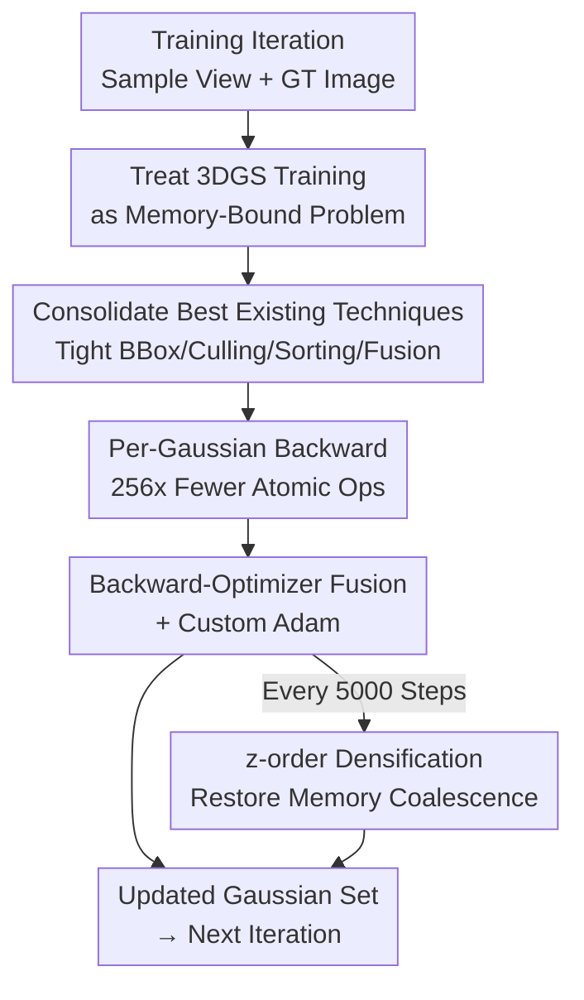

# Faster-GS: Analyzing and Improving Gaussian Splatting Optimization

**Conference**: CVPR 2026  
**Paper**: [CVF Open Access](https://openaccess.thecvf.com/content/CVPR2026/html/Hahlbohm_Faster-GS_Analyzing_and_Improving_Gaussian_Splatting_Optimization_CVPR_2026_paper.html)  
**Code**: https://github.com/nerficgproject/faster-gaussian-splatting  
**Area**: 3D Vision  
**Keywords**: 3D Gaussian Splatting, Training Acceleration, GPU Memory Optimization, Kernel Fusion, z-order Densification  

## TL;DR
This paper systematically organizes, aligns, and integrates training acceleration techniques scattered across multiple 3DGS follow-up works into a clean baseline. By introducing "memory-coalescence-friendly z-order densification" and "backward-propagation-optimizer fusion + custom Adam," it accelerates 3DGS training by up to 5× and reduces VRAM by 30% without changing reconstruction quality or Gaussian count, compressing single-scene reconstruction to under 2 minutes.

## Background & Motivation
**Background**: 3D Gaussian Splatting (3DGS) has become the mainstream representation for novel view synthesis. Numerous speedup works have emerged around it—tighter bounding boxes, more efficient sorting, per-Gaussian backward passes, and kernel fusion—enabling high-quality scene reconstruction within minutes on consumer-grade GPUs.

**Limitations of Prior Work**: These acceleration techniques are often "entangled." Many papers mix "engineering optimizations at the implementation layer" with "fundamental changes at the algorithm/representation layer," or trade quality/Gaussian count for speed. Consequently, it remains unclear how fast 3DGS can run when all positive contributions are combined without sacrificing quality. Meanwhile, modular frameworks like `gsplat` struggle to integrate low-level performance optimizations targeted at the original 3DGS pipeline.

**Key Challenge**: There is no "clean, fair, and additive" unified baseline for training acceleration. The true gains of various techniques are obscured by implementation differences, hyperparameter variations, and quality losses, making horizontal comparisons impossible and leaving the "performance upper bound" unanswered.

**Goal**: (1) To integrate existing effective techniques into a unified framework and quantify their gains while strictly maintaining original 3DGS quality and Gaussian counts; (2) To identify residual bottlenecks on this strengthened baseline and introduce new memory-level optimizations.

**Key Insight**: The authors treat 3DGS training purely as a **memory-bound problem**. Tile-based rasterization loads over a dozen floating-point parameters for each Gaussian; most of the time is spent waiting for data rather than arithmetic. Thus, "reducing memory access and improving cache locality" becomes the primary objective, aligning with general GPU architecture techniques like memory coalescence, shared memory, and kernel fusion.

**Core Idea**: First "consolidate"—incorporate the most effective, non-destructive techniques from prior work into a restructured, clean 3DGS implementation; then "refine"—apply a memory-coalescence perspective to add z-order densification and backward-optimizer fusion, squeezing out the residual optimizer overhead.

## Method

### Overall Architecture
Faster-GS is not a new Gaussian representation but the result of memory-optimizing the **original 3DGS training loop** (forward rasterization → backward propagation for gradients → Adam parameter updates → periodic densification). It is deliberately designed to be compatible with the original CUDA differentiable rasterization pipeline. The method progresses through four layers: first, reconstructing a numerically stable and VRAM-efficient **baseline implementation** (~15% faster than original); then, integrating the **best existing techniques** (tight bounding boxes, tile culling, two-pass sorting, per-Gaussian backward, kernel fusion); next, adding two **new optimizations** (z-order densification, backward-optimizer fusion + custom Adam); and finally, porting the optimizations to **4D dynamic Gaussians**. Pruning, compression, low-precision, dense initialization, and feed-forward pipelines are intentionally excluded as they fundamentally alter results and break the "same quality, same quantity" comparison premise.

The following diagram illustrates the placement of each design within a training iteration (dashed lines indicate periodic steps triggered every 5000 steps):

### Key Designs

**1. Clean Baseline Reconstructed as a "Memory-Bound Problem"**

The prerequisite for acceleration is a stable testbed without algorithmic changes. The authors rewrote the 3DGS implementation with core improvements in stability and memory: backward propagation uses **front-to-back alpha blending**, eliminating zero-division checks prevalent in the original backward pass; it explicitly handles degenerate quaternions (Gaussian covariance) to stabilize gradients; and it explicitly manages $\mu_{2D}$ gradients and visibility masks to reduce VRAM overhead. This "clean-slate" baseline is ~15% faster than the original by Kerbl et al. without any algorithmic changes, providing a solid foundation for additive quantification.

**2. Integrating and Aligning Best Existing Techniques**

The authors consolidated various techniques into a single pipeline, mapping each to a specific memory bottleneck. **Tight Bounding Boxes**: The original uses a square box with side length $3\sigma$, underestimating the true range for the $\tau_\alpha=1/255$ cutoff (approx. $3.33\sigma$). Using axis-aligned rectangles with half-lengths derived from $\sqrt{\Sigma_{2D_{1,1}}}$ and $\sqrt{\Sigma_{2D_{2,2}}}$ and incorporating opacity—solving for $\tau_\alpha$ in Eq. (3) by multiplying by $-2\ln(\tau_\alpha/o)$ inside the square root—yields an opacity-aware tight box that significantly reduces false positives in tile splat lists. **Tile Culling**: Employs load-balanced determination based on per-tile Gaussian maximums (Radl et al.), simplifying control flow. **Two-pass Sorting**: Splits the original "64-bit key" radix sort (tile ID + depth) into two steps: depth sorting followed by tile list splitting (requiring stable sort), reducing VRAM and sorting time. **Per-Gaussian Backward**: Original alpha-blending gradients are expensive as one splat contributes to many pixels, requiring atomic accumulation; switching to **Gaussian-parallel** backward reduces atomic operations by roughly the number of pixels in a tile ($16\times16=256$ times), though it is the only change that **increases VRAM** due to storing blending states every 32 splats. **Kernel Fusion**: Activation functions for scale/rotation/opacity and two sets of SH coefficients (split for independent learning rates) are passed directly into the rasterization kernels, avoiding PyTorch's kernel launch/write-back overhead.

**3. Memory-Coalescence-Friendly z-order Densification**

After reducing memory costs, the **memory layout itself** became the bottleneck. During densification, new Gaussians are appended to the buffer end, meaning Gaussians adjacent in 3D space are far apart in VRAM. This causes **uncoalesced memory access**, warp divergence, and cache misses. The solution is lightweight: periodically perform **z-order (Morton) reordering** [69] on all Gaussians during active densification. This ensures 3D neighbors are adjacent in the parameter buffer, recovering memory coalescence. z-order is cheap (~4 ms per million Gaussians), but doing it every step has diminishing returns; **every 5000 steps** was found optimal. A key insight: this is **only effective when paired with per-Gaussian backward**—with pixel-parallel backward, massive atomic operations cause false sharing across tiles, which z-order actually worsens.

**4. Backward-Optimizer Fusion + Custom Adam**

The authors discovered that the **optimizer step (Adam update) accounts for 40%–60% of total training time** because the original uses non-fused Adam. First, they switch to fused Adam (PyTorch `fused=True` or apex `FusedAdam`). Further, they developed a **custom Adam that matches PyTorch behavior but removes all redundant overhead**: it is fully integrated into CUDA kernels using fast-math and fused-multiply-add, outperforming both PyTorch and apex versions. The most aggressive step is **fusing the parameter update directly into the rasterization backward kernel**: loading momentum and calculating updates while gradients are computed, eliminating separate parameter buffers. To maintain parity with standard Adam, Gaussians with zero gradients (e.g., outside the frustum) are still updated, which slightly reduces the fusion speedup.

### Loss & Training
The original 3DGS training protocol is strictly followed: 30,000 iterations, rendering one training view per iteration to compare against GT using a combination of L1 + D-SSIM loss, updated via Adam. For fairness, all methods use unified hyperparameters and the consolidated SSIM implementation from Taming-3DGS.

## Key Experimental Results

### Main Results
Evaluated across 13 scenes from Mip-NeRF360 / Tanks&Temples / Deep Blending on an RTX 4090. All methods maintain consistent PSNR/SSIM/LPIPS and Gaussian counts; differences lie in training time and VRAM.

| Dataset | Method | PSNR↑ | Training Time↓ | VRAM↓ | # Gaussians |
|:---|:---|:---|:---|:---|:---|
| Mip-NeRF360 | 3DGS | 27.53 | 18m44s | 8.8GiB | 2.74M |
| Mip-NeRF360 | Taming-3DGS† | 27.53 | 10m49s | 8.9GiB | 2.73M |
| Mip-NeRF360 | **Ours** | 27.56 | **4m31s** | **6.1GiB** | 2.73M |
| Tanks&Temples | 3DGS | 23.77 | 11m26s | 4.7GiB | 1.57M |
| Tanks&Temples | **Ours** | 23.75 | **3m04s** | **3.4GiB** | 1.55M |
| Deep Blending | 3DGS | 29.81 | 19m43s | 8.1GiB | 2.47M |
| Deep Blending | **Ours** | 29.78 | **3m46s** | **6.0GiB** | 2.61M |

Ours achieves up to 5.2× speedup over original 3DGS and 2.4× over Taming-3DGS, with ~30% VRAM reduction.

### GPU and Cross-Generation Analysis

| GPU | 3DGS | Ours (Full) | Gain |
|:---|:---|:---|:---|
| RTX 3090 | 23m46s | 6m03s | 3.9× |
| RTX 4090 | 17m46s | 4m10s | 4.3× |
| RTX 5090 | 13m05s | **2m43s (163s)** | 4.8× |

Newer GPUs show higher speedup ratios, suggesting greater potential on future hardware.

### Ablation Study (Mip-NeRF360 Outdoor/Indoor Cumulative, RTX 4090)

| Optimization Added (Cumulative from Basis) | Outdoor Training Time | VRAM Change | Note |
|:---|:---|:---|:---|
| Basis | 17m07s | 6.39GiB | Reconstructed Baseline |
| + Fusion/Split SH/Tight BBox/Culling | ~16m50s | Slight Decrease | Each ~1.02-1.09x, mainly saves VRAM |
| + Per-Gaussian Backward | 14m14s (1.20×) | 7.69GiB (1.20×↑) | Large speedup, but increases VRAM |
| + Custom Fused Adam | 12m50s (1.33×) | 6.40GiB | Optimizer is a major bottleneck |
| Full (inc. z-order) | **5m31s (3.10×)** | 5.99GiB (0.94×) | z-order only works with per-Gaussian backward |

### Key Findings
- **Optimizer is the hidden bottleneck**: Profiling shows fused Adam still takes 40%–60% of training time, motivating "backward-optimizer fusion."
- **Per-Gaussian backward provides the largest single speedup** but is the only change to increase VRAM. Load-balanced tile culling can actually slow down training as Gaussian counts increase due to warp divergence.
- **z-order benefits depend on the backward method**: It speeds up all scenes with per-Gaussian backward but can slow down low-density scenes with pixel-parallel backward due to false sharing.
- **Skipping invisible updates / reducing SH degrees** can provide further speedup but sacrifices quality (PSNR drop from 24.72 to 24.38).

## Highlights & Insights
- **Consolidation as a research contribution**: Strictly locking quality and quantity to quantify additive gains provides the community with a clean, high-performance base.
- **Architecture-driven bottleneck analysis**: Treating 3DGS as memory-bound allows the application of standard GPU optimizations like z-order reordering to recover cache locality at near-zero cost.
- **Coupling between optimizations**: The fact that z-order requires per-Gaussian backward and tile culling can be harmful at scale shows that speedups cannot be viewed in isolation.
- **Extensibility**: The optimizations port seamlessly to 4D Gaussians (D-NeRF set), achieving 2.8× speedup over prior SOTA.

## Limitations & Future Work
- Residual bottlenecks still lie in parameter updates; future work might introduce second-order optimizers.
- Deliberately excludes pruning/compression/low-precision to ensure fairness, leaving the combined upper bound of these techniques unexplored.
- "Skipping updates for invisible Gaussians" and "reducing SH degrees" degrade quality and are treated only as optional flags.

## Related Work & Insights
- **vs. 3DGS [35]**: Maintains identical quality/representation while providing 4.1–5.2× speedup and 30% VRAM savings.
- **vs. Taming-3DGS [54]**: Adopts per-Gaussian backward but improves VRAM via shared memory and adds z-order and optimizer fusion to be up to 2.4× faster.
- **vs. StopThePop / Radl et al. [63]**: Adopts tight opacity-aware bounding boxes but demonstrates the trade-offs of load-balanced culling during training.

## Rating
- Novelty: ⭐⭐⭐⭐ (Techniques are often integrated, but z-order for densification and coupling analysis are significant new contributions.)
- Experimental Thoroughness: ⭐⭐⭐⭐⭐ (Detailed ablations, cross-GPU tests, and 4D extensions.)
- Writing Quality: ⭐⭐⭐⭐⭐ (Clear bottleneck positioning and articulation of trade-offs.)
- Value: ⭐⭐⭐⭐⭐ (Provides a high-performance, reproducible baseline for 2-minute 3DGS reconstruction.)

<!-- RELATED:START -->

## Related Papers

- [\[CVPR 2026\] GS²: Graph-based Spatial Distribution Optimization for Compact 3D Gaussian Splatting](gs2_graph-based_spatial_distribution_optimization_for_compact_3d_gaussian_splatt.md)
- [\[CVPR 2026\] DirectFisheye-GS: Enabling Native Fisheye Input in Gaussian Splatting with Cross-View Joint Optimization](directfisheye-gs_enabling_native_fisheye_input_in_gaussian_splatting_with_cross-.md)
- [\[CVPR 2026\] SparseOIT: Improving Order-Independent Transparency 3DGS via Active Set Method](sparseoit_improving_order-independent_transparency_3dgs_via_active_set_method.md)
- [\[CVPR 2026\] Intrinsic Geometry-Appearance Consistency Optimization for Sparse-View Gaussian Splatting](intrinsic_geometry-appearance_consistency_optimization_for_sparse-view_gaussian_.md)
- [\[CVPR 2026\] Turbo-GS: Accelerating 3D Gaussian Fitting for High-Resolution Radiance Fields](turbo-gs_accelerating_3d_gaussian_fitting_for_high-quality_radiance_fields.md)

<!-- RELATED:END -->
