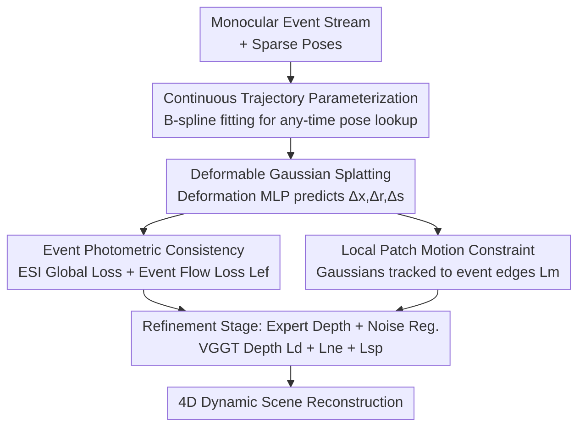

# FastEventDGS: Deformable Gaussian Splatting for Fast Dynamic Scenes from a Single Event Camera

**Conference**: CVPR 2026  
**Paper**: [CVF Open Access](https://openaccess.thecvf.com/content/CVPR2026/html/Dai_FastEventDGS_Deformable_Gaussian_Splatting_for_Fast_Dynamic_Scenes_from_a_CVPR_2026_paper.html)  
**Code**: https://github.com/daizijia/FastEventDGS  
**Area**: 3D Vision  
**Keywords**: Deformable Gaussian Splatting, Event Camera, Dynamic Scene Reconstruction, 4D Reconstruction, Monocular  

## TL;DR
FastEventDGS represents the first work to train Deformable 3D Gaussian Splatting (Deformable 3DGS) for dynamic scenes using only a **single monocular event camera**. By utilizing continuous trajectory parameterization, a dual event generation model, local patch motion loss, and expert depth refinement, it improves PSNR from ~16 dB to 22–24 dB on both synthetic and real-world fast-motion datasets.

## Background & Motivation
**Background**: Mainstream Novel View Synthesis (NVS) for dynamic scenes typically extends static 3DGS by adding a temporal dimension—learning a deformation field or 4D primitives. A deformation MLP $\mathcal{D}(\mathbf{x},t)$ predicts the displacement/rotation/scaling $(\Delta\mathbf{x},\Delta\mathbf{r},\Delta\mathbf{s})$ of each Gaussian at any given time. Supervision is almost entirely derived from multi-view RGB / RGB-D images.

**Limitations of Prior Work**: RGB cameras suffer from two critical flaws: **motion blur** under fast motion and **low temporal resolution**. Consequently, frame-based methods can only model moderate-speed motion; fast dynamic objects are often misplaced or blurred beyond recognition. Event cameras (neuromorphic sensors) detect brightness changes asynchronously with microsecond-level latency, making them naturally suited for high-speed scenes. However, their output is **sparse, noisy, and contains only relative brightness (no absolute intensity)**, making it extremely difficult to reconstruct a complete dynamic scene from pure events.

**Key Challenge**: Existing event-based NVS methods almost always **rely on auxiliary sensors** to obtain global context priors—either fusing RGB frames or Lidar. This introduces burdensome hardware setups and multi-sensor calibration requirements, contradicting the "lightweight" philosophy of event cameras.

**Goal**: This work seeks to answer a fundamental question: **Can dynamic scenes be reconstructed using only a monocular event camera?** This is decomposed into three sub-problems: (1) How to obtain supervision at any timestamp given that event frequencies far exceed pose sampling rates; (2) How to simultaneously constrain photometry and geometry without absolute intensity; (3) How to correct motion and depth under monocular sparse-view conditions, which are prone to overfitting.

**Key Insight**: Events inherently encode "where things move and how they move." The authors argue that events should be treated as explicit supervision for the motion field rather than merely as "brightness differences."

**Core Idea**: Camera trajectories are modeled as continuous B-splines, allowing events to supervise deformable Gaussians over any time interval. Two event generation models (long-interval integration and a linear flow model) are employed to provide photometric and geometric constraints, respectively. Additionally, a local motion loss pins Gaussian trajectories to event edges to suppress overfitting, and an off-the-shelf feed-forward reconstruction model (VGGT) is used to refine depth.

## Method

### Overall Architecture
The input consists of a monocular event stream and its corresponding sparse camera poses. The output is a deformable Gaussian field with a temporal dimension capable of rendering novel views of dynamic scenes (4D reconstruction). The pipeline centers on the deformation MLP $\mathcal{D}$ of the Deformable 3DGS: sparse poses are first fitted into a **continuous trajectory**, enabling the event stream to act as supervision over any time window. Event photometric consistency provides global consistency, event flow loss provides local detail/geometry, and local patch motion loss provides explicit motion guidance to optimize Gaussian deformations $(\Delta\mathbf{r},\Delta\mathbf{x},\Delta\mathbf{s})$. During the late training stage, the **refinement phase** introduces expert depth estimated by VGGT for geometric correction, alongside two regularization terms to suppress noise.

### Key Designs

**1. Continuous Trajectory Parameterization: Any-time Event Supervision**

The sampling frequency of event cameras is significantly higher than that of pose systems (mocap or SfM). Poses are discrete points, while events are dense streams. Supervising only at discrete points wastes fine-grained motion information. The authors use cubic B-splines to fit sparse poses into a **continuous temporal trajectory**, allowing camera poses to be queried at any time $\tau$. This step is the foundation of the method: the subsequent event flow loss $\mathcal{L}_{ef}$ and motion loss $\mathcal{L}_m$ require events within "arbitrarily small intervals between two training poses," which is impossible without continuous trajectories. During testing, this also allows for the evaluation of temporal interpolation between training views.

**2. Event Photometric Consistency: Global Integration and Linear Flow**

Since pure events lack absolute brightness, supervision relies on brightness changes in log-space. The authors combine two complementary event generation models. First, the **Event Single Integral (ESI) loss** provides global supervision: images are rendered at two timestamps $t_k-\Delta t_k$ and $t_k$, and their difference in log-space $\Delta\hat I$ is calculated. The ground truth is given by the event integral over that interval $\Delta I=\int_{t_k-\Delta t_k}^{t_k} C\cdot e(\tau)\,d\tau$. The loss is $\mathcal{L}_{esi}=\lVert\Delta I-\Delta\hat I\rVert_1\odot\mathbf{m}$ (where $\mathbf{m}$ is a binary mask for pixels with events), weighted with D-SSIM to form the main $\mathcal{L}_e$. Second, the **event flow loss** $\mathcal{L}_{ef}$ uses a linear event generation model to constrain brightness increments over **short intervals** $\Delta\tau$:

$$\Delta I(\mathbf{x})\approx-\nabla\mathcal{I}(\mathbf{x})\cdot\mathbf{v}(\mathbf{x})\,\Delta\tau$$

The pixel velocity $\mathbf{v}(\mathbf{x})$ is derived from the optical flow $\mathcal{F}^O=\mathcal{F}^C+\mathcal{F}^G$, composed of **camera flow** (from known extrinsics and rendered depth) and **Gaussian flow** (2D projection of Gaussian deformation). Both predicted and measured brightness increments are $L_2$-normalized to eliminate the effects of $\Delta\tau$ and contrast threshold $C$ before calculating the $L_1$ difference. This combination ensures global consistency and local detail while providing geometric and motion constraints through the embedded flow terms.

**3. Local Patch Motion Constraint: Suppressing Overfitting via Event Edges**

A common failure in monocular sparse-view setups is **overfitting to training views**, where Gaussians fail to move coherently or background Gaussians "jitter." Observing that event edges align with true object motion, the authors propose ensuring that the 2D projected trajectories of Gaussians **do not deviate from nearby event edges**. Specifically, an interval $\Delta t$ is divided into $m$ sub-sequences with equal event counts. A fixed number of Gaussians are sampled and filtered by depth to remove occlusions. The mean of each sampled Gaussian is projected onto the image plane $\hat g^i=\pi(K,T_t,(\mathbf{x}+\Delta\mathbf{x}))$, and a square patch of fixed size is centered around it. For the same Gaussian center, the event single integral $\Delta I_j^{g_i}$ on $m$ consecutive patches is computed to find adjacent residuals, summed across all sampled Gaussians:

$$\mathcal{L}_m=\sum_i\sum_j\lVert\Delta I_j^{g_i}-\Delta I_{j+1}^{g_i}\rVert_1$$

For static background Gaussians, this penalizes jitter; for dynamic object Gaussians, it forces shared rigid motion, injecting explicit "how things move" signals into the deformation field.

**4. Refinement Stage: Expert Depth Correction and Noise Regularization**

After several optimization rounds, intensity maps improve, but monocular views leave Gaussians "floating" in flat regions, causing depth inconsistency. The authors use a pre-trained feed-forward model, VGGT, as a "depth expert." It constrains the relative consistency between rendered depth $\hat d_i$ and estimated depth $d_i$ using Scale-Invariant Logarithmic (SiLog) loss: $\mathcal{L}_d=\frac1n\sum_i\alpha_i^2-\frac1{n^2}(\sum_i\alpha_i)^2$, where $\alpha_i=\log d_i-\log\hat d_i$. Additionally, to address non-event textured regions and "trailing event" noise in real data, two regularizers are added: **non-event region constraint** $\mathcal{L}_{ne}=\mathrm{ReLU}(|\Delta\hat I|-C)\odot\neg\mathbf{m}$, ensuring no brightness change exceeds threshold $C$ where no events were triggered, and **event spatial loss** $\mathcal{L}_{sp}=\lVert\delta_x\mathcal{I}\rVert_1+\lVert\delta_y\mathcal{I}\rVert_1$ to suppress noise by penalizing excessive spatial gradients. These are only introduced in the final refinement stage to avoid interfering with early optimization.

### Loss & Training
The total loss is:
$$\mathcal{L}=\mathcal{L}_e+\lambda_{ef}\mathcal{L}_{ef}+\lambda_m\mathcal{L}_m+\lambda_d\mathcal{L}_d+\lambda_{ne}\mathcal{L}_{ne}+\lambda_{sp}\mathcal{L}_{sp}$$
Training follows a three-stage curriculum: (1) **Warm-up** (first 3,000 epochs) using only $\mathcal{L}_e$ to optimize Gaussian position/rotation/scale like vanilla 3DGS; (2) Introduction of motion-related losses $\mathcal{L}_{ef}$ and $\mathcal{L}_m$ after warm-up; (3) **Refinement stage** (after 20,000 epochs) introducing $\mathcal{L}_d, \mathcal{L}_{ne}, \mathcal{L}_{sp}$, for a total of 30,000 epochs on an RTX 4090.

## Key Experimental Results

### Main Results
Quantitative comparison on the BlenderDynamicEvent synthetic dataset (ESIM simulation, ~1000 fps, color events) (PSNR↑ / SSIM↑):

| Scene | Metric | Event3GS | EvDNeRF | E2vidDGS | Ours |
|------|------|----------|---------|----------|------|
| Butterfly | PSNR | 14.46 | 12.10 | 16.13 | **24.27** |
| Butterfly | SSIM | 0.6464 | 0.4635 | 0.7615 | **0.9020** |
| Duck | PSNR | 16.21 | 8.18 | 19.54 | **21.25** |
| Alarm | PSNR | 16.47 | – | 16.61 | **23.24** |
| Ball | PSNR | 15.46 | 16.64 | 18.74 | **22.89** |

Ours leads by a significant margin. Event3GS (no motion field) can only reconstruct static parts; EvDNeRF fails under monocular fast motion; E2vidDGS (two-stage) performs decently on simple scenes but suffers from color shifts and structural degradation in complex ones. On the real-world Gen4Dynamic dataset, since RGB truth is unreliable at 10 fps, qualitative results show that while FrameDGS handles static detail better due to absolute intensity, it misplaces dynamic objects during fast motion (e.g., a 0.25s fall), whereas Ours accurately reconstructs motion and temporal consistency.

### Ablation Study
Incremental contribution of losses (Synthetic, PSNR↑ / SSIM↑ / LPIPS↓):

| Config | PSNR | SSIM | LPIPS | Description |
|------|------|------|-------|------|
| $\mathcal{L}_e$ | 18.61 | 0.8478 | 0.2267 | Global photometry only |
| $+\mathcal{L}_{ef}$ | 19.35 | 0.8570 | 0.2231 | Add event flow loss |
| $+\mathcal{L}_m$ | 20.52 | 0.8692 | 0.2160 | Add local motion constraint |
| $+\mathcal{L}_d$ | 22.49 | 0.8911 | 0.1944 | Add expert depth (**Largest Gain**) |
| All | 22.91 | 0.8921 | 0.1952 | Add noise regularization |

Object speed ablation (Ball scene):

| Speed | PSNR | SSIM | LPIPS |
|------|------|------|-------|
| 1× | 22.91 | 0.8921 | 0.1952 |
| 2× | 19.51 | 0.8456 | 0.2369 |
| 3× | 18.43 | 0.8361 | 0.2532 |
| 4× | 18.31 | 0.8308 | 0.2578 |

### Key Findings
- **Depth constraint is the most significant contributor**: $\mathcal{L}_d$ alone raises PSNR from 20.52 to 22.49 (+1.97 dB). It clarifies depth maps significantly, indicating that "floating Gaussians" are the primary geometric bottleneck in monocular setups.
- $\mathcal{L}_{ef}$ and $\mathcal{L}_m$ contribute equally (~0.7–1.2 dB each). Noise regularization $\mathcal{L}_{ne}+\mathcal{L}_{sp}$ shows positive but smaller gains in PSNR/SSIM, though LPIPS slightly regressed (0.1944→0.1952), which the authors did not detail.
- Higher speeds lead to lower PSNR, but **SSIM remains stable**: This suggests that high speed causes **color shifts** (loss of relative intensity information) rather than structural collapse.

## Highlights & Insights
- **Effective Division in Dual Event Models**: The long-interval ESI captures global alignment, while the short-interval linear flow model (integrating camera/Gaussian flow) handles details and geometry. This allows one loss to handle both photometry and motion without external optical flow networks.
- **Events as Motion Supervision, not just Delta-Brightness**: The local patch motion loss pins 2D Gaussian trajectories to event edges. The prior that "event edges ≈ true perceived motion" is key to fighting overfitting in sparseview monocular settings.
- **Foundation Models as Geometry Experts**: Using VGGT as an off-the-shelf depth expert to correct floating Gaussians is a practical paradigm for supplementing information in degraded-sensor scenarios.

## Limitations & Future Work
- The method **relies on known camera poses** (mocap/SfM), which limits deployment. Future work aims for pose-agnostic reconstruction.
- **Lack of reliable real-world ground truth**: Quantitative superiority is mostly established via simulation (ESIM); the domain gap between ESIM and real events remains a factor.
- **Performance at extreme speeds**: PSNR drops to 18.31 dB at 4× speed with noticeable color shifts. Pure events' lack of absolute intensity remains a fundamental "ceiling" for visual quality.

## Related Work & Insights
- **vs. Sensor Fusion DGS (e.g., RGB+depth+event)**: These rely on auxiliary sensors for global priors. This work achieves dynamic GS with **pure monocular events**, minimizing hardware requirements at the cost of high reliance on continuous trajectories and expert depth.
- **vs. Static Event 3DGS (Event3DGS / EventSplat)**: These only handle static scenes. This work adds a temporal dimension and explicit motion constraints for 4D. The Event3GS baseline in the ablation shows that without a deformation field, dynamic regions simply blur.
- **vs. 2D Flow Prior Supervision**: This work follows the trend of "flow-guided deformation" but derives flow from its own event generation model (camera + Gaussian flow) rather than external estimators, making it more tailored to the data source.

## Rating
- Novelty: ⭐⭐⭐⭐⭐ First monocular pure-event deformable GS; both the problem and solution are novel.
- Experimental Thoroughness: ⭐⭐⭐⭐ Strong synthetic/real dataset evaluation and clear ablation, though real-world quantitative metrics are missing.
- Writing Quality: ⭐⭐⭐⭐ Clear loss derivations and three-stage training logic.
- Value: ⭐⭐⭐⭐ Simplifying sensor setups for high-speed AR/VR capture is practical; the VGGT depth refinement is highly reusable.

<!-- RELATED:START -->

## Related Papers

- [\[CVPR 2026\] 4C4D: 4 Camera 4D Gaussian Splatting](4c4d_4_camera_4d_gaussian_splatting.md)
- [\[CVPR 2026\] InstantHDR: Single-forward Gaussian Splatting for High Dynamic Range 3D Reconstruction](instanthdr_singleforward_gaussian_splatting_for_hi.md)
- [\[CVPR 2026\] AeroDGS: Physically Consistent Dynamic Gaussian Splatting for Single-Sequence Aerial 4D Reconstruction](aerodgs_physically_consistent_dynamic_gaussian_splatting_for_single-sequence_aer.md)
- [\[CVPR 2026\] $L^{2}DGS$: Low-Light Dynamic Gaussian Splatting](l2dgs_low-light_dynamic_gaussian_splatting.md)
- [\[CVPR 2026\] E2EGS: Event-to-Edge Gaussian Splatting for Pose-Free 3D Reconstruction](e2egs_event-to-edge_gaussian_splatting_for_pose-free_3d_reconstruction.md)

<!-- RELATED:END -->
