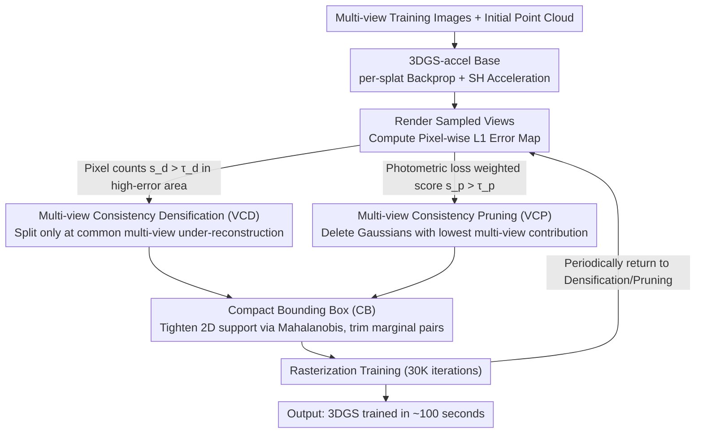

# FastGS: Training 3D Gaussian Splatting in 100 Seconds

**Conference**: CVPR2026  
**arXiv**: [2511.04283](https://arxiv.org/abs/2511.04283)  
**Code**: [fastgs.github.io](https://fastgs.github.io)  
**Area**: 3D Vision  
**Keywords**: 3D Gaussian Splatting, Training Acceleration, Multi-view Consistency, Gaussian Density Control, Pruning Strategy

## TL;DR

FastGS is proposed as a 3DGS acceleration framework based on multi-view consistency. By employing Multi-view Consistency Densification (VCD) and Multi-view Consistency Pruning (VCP) to precisely control the number of Gaussians, it achieves scene training in approximately 100 seconds on datasets like Mip-NeRF 360—a 15× speedup over vanilla 3DGS with comparable rendering quality.

## Background & Motivation

1.  **3DGS Training Time Bottleneck**: Vanilla 3DGS typically requires tens of minutes to train a single scene. Its Adaptive Density Control (ADC) generates a large number of redundant Gaussians, leading to persistent high computational overhead and limiting the user experience in practical deployments.

2.  **Limitations of Prior Densification Strategies**: While Taming-3DGS considers multi-view information, its scoring method based on Gaussian intrinsic attributes (opacity, scale, gradient) fails to strictly constrain multi-view consistency, still resulting in millions of redundant Gaussians.

3.  **Limitations of Prior Pruning Strategies**: Speedy-Splat performs pruning through Hessian approximation accumulation, which indirectly utilizes multi-view information and leads to significant drops in rendering quality. Other methods using simple thresholds for opacity or scale also fail to effectively eliminate redundancy.

4.  **Key Challenge: Lack of Strict Multi-view Consistency Constraints**: Many Gaussians contribute to rendering quality in only a few views while remaining useless in others, meaning they do not satisfy "bundle adjustment" style multi-view consistency constraints.

5.  **Limitations of Budget Mechanisms**: Methods like DashGaussian limit the number of Gaussians through budget mechanisms, but scenes still require millions of Gaussians to maintain quality, resulting in limited practical speedup.

6.  **Optimization Space in Rasterization**: The 3-sigma rule in vanilla 3DGS generates many redundant Gaussian-tile pairs. Even the precise tile intersection strategy in Speedy-Splat does not fully resolve the issue of invalid coverage by marginal Gaussians.

## Method

### Overall Architecture

FastGS aims to solve the slow training and Gaussian redundancy of vanilla 3DGS. The Core Idea is to treat "multi-view consistency" as a unified metric throughout the process—retaining only Gaussians that truly contribute to multi-view rendering during both densification and pruning, and then using tighter rasterization bounding boxes to trim invalid marginal coverage. The entire framework is built upon 3DGS-accel. During training, it periodically uses VCD to decide which Gaussians to split and VCP to decide which to remove, with CB finally tightening the effective support range of each 2D Gaussian.

### Key Designs

**1. Multi-view Consistency Densification (VCD): Adding Gaussians only where multiple views are under-reconstructed**

Addressing the pain point where ADC or Taming-style indirect scoring (based on opacity/scale/gradient) still yields millions of redundancies, VCD judges densification directly from "multi-view reconstruction quality." It randomly samples $K$ training views to render images and compute pixel-wise L1 error maps. After min-max normalization, high-error pixels are identified using a threshold $\tau$. Each Gaussian is projected to 2D to obtain its footprint $\Omega_i$, and the average number of high-error pixels within this footprint is calculated as the importance score $s_d^i$. Densification is permitted only if $s_d^i$ exceeds the threshold $\tau_d$ (experimentally set to 5). Consequently, new Gaussians serve areas under-reconstructed across multiple views rather than specific individual views, reducing the count significantly without a budget mechanism—ablation shows it reduces Gaussians from 2.64M to 0.53M alone.

**2. Multi-view Consistency Pruning (VCP): Deleting Gaussians with the lowest contribution to multi-view quality**

Speedy-Splat uses Hessian approximation to indirectly leverage multi-view information for pruning, which results in a clear decline in rendering quality. VCP adopts the scoring logic of VCD but measures "how much quality degrades if deleted" using the overall photometric loss. For each sampled view, the photometric loss $E_\text{photo}$ (a combination of L1+SSIM) is computed. The pruning score $s_p^i$ is the normalized value of the weighted product of high-error pixel counts and photometric loss across views. Gaussians are pruned if $s_p^i$ exceeds $\tau_p$ (set to 0.9). Compared to indirect Hessian criteria, this direct quality-based scoring is more precise and enables significant thinning while preserving quality.

**3. Compact Bounding Box (CB): Tightening 2D Gaussian support to trim invalid marginal pairs**

The 3-sigma rule in vanilla 3DGS generates many redundant Gaussian-tile pairs. CB builds on the precise tile intersection of Speedy-Splat by using Mahalanobis distance to set stricter effective area thresholds and a scaling factor $\beta$ to control the effective support range of 2D Gaussians. A smaller $\beta$ results in tighter ellipses and fewer invalid marginal pairs, further compressing rasterization overhead.

### Loss & Training

- Base is 3DGS-accel (vanilla 3DGS + per-splat backprop from Taming + SH optimization acceleration).
- Densification is performed every 500 iterations, stopping at 15K.
- Pruning is performed every 500 iterations before 15K, and every 3000 iterations after 15K.
- Total training is 30K iterations using the Adam optimizer.

## Key Experimental Results

### Table 1: Training Speed and Quality Comparison on Static Scenes (RTX 4090)

| Method | Mip-NeRF 360 Time (min) | PSNR↑ | SSIM↑ | #Gaussian↓ | FPS↑ |
|------|------------------------|-------|-------|------------|------|
| 3DGS | 20.93 | 27.53 | 0.812 | 2.63M | 146 |
| Taming-3DGS | 5.36 | 27.48 | 0.794 | 0.68M | 221 |
| DashGaussian | 6.35 | 27.73 | 0.817 | 2.40M | 155 |
| Speedy-Splat | 13.38 | 26.91 | 0.781 | 0.30M | 552 |
| **FastGS** | **1.93** | 27.56 | 0.797 | **0.40M** | **579** |
| FastGS-Big | 3.58 | **27.93** | **0.820** | 1.15M | 469 |

### Table 2: Ablation Study (Mip-NeRF 360)

| Method | Time (min)↓ | PSNR↑ | #Gaussian↓ | FPS↑ |
|------|------------|-------|------------|------|
| 3DGS-accel (baseline) | 7.10 | 27.46 | 2.64M | 182 |
| +VCD | 3.53 | 27.69 | 0.53M | 222 |
| +VCP | 5.32 | 27.70 | 1.96M | 285 |
| +CB | 6.13 | 27.44 | 2.78M | 303 |
| Full (VCD+VCP+CB) | **1.93** | 27.56 | **0.40M** | **579** |

VCD is the primary contributor, reducing the Gaussian count from 2.64M to 0.53M (an 80% reduction) and accelerating training by over 2×.

## Highlights

1.  **Extreme Training Speed**: Completes scene training in as fast as 77 seconds (Tanks & Temples), averaging ~100 seconds, far exceeding existing SOTA.
2.  **Simple and General**: VCD/VCP requires no budget mechanism and can be directly applied to various tasks such as dynamic reconstruction, surface reconstruction, sparse-view reconstruction, large-scale reconstruction, and SLAM, achieving 2-6× speedup across the board.
3.  **Core Insight on Multi-view Consistency**: Analogous to bundle adjustment, it requires each Gaussian to have a positive contribution to multi-view rendering rather than serving individual views.
4.  **Backbone Compatibility**: Accelerates Mip-Splatting by 8.8× and Scaffold-GS by 3.6× while maintaining rendering quality.
5.  **FastGS-Big Variant Surpasses DashGaussian**: Higher PSNR by 0.2dB, 43.6% reduction in training time, and half the Gaussian count.

## Limitations & Future Work

1.  **Not applicable to feed-forward 3DGS post-training**: Gaussians output by these methods are extremely dense; VCP struggles to effectively prune such massive numbers within a few thousand iterations. Post-training still takes ~20s even for 3K iterations.
2.  **Rendering Quality Not Optimal**: Under extreme acceleration, the default FastGS configuration has slightly lower LPIPS metrics than DashGaussian and vanilla 3DGS.
3.  **Hyperparameter Sensitivity**: Parameters like $\tau_d, \tau_p, \beta$ need adjustment for different scenes; the paper lacks extensive discussion on their robustness.
4.  **Hardware Testing**: Only tested on RTX 4090; acceleration transferability across different GPU hardware is not shown.
5.  **Speed-Quality Trade-off**: FastGS-Big offers better quality but half the speed, suggesting the Pareto frontier between the two still has room for exploration.

## Related Work & Insights

- **vs Taming-3DGS**: Both consider multi-view information, but Taming relies on indirect assessments (opacity/scale/gradient), which are insufficiently strict and result in 680K Gaussians. FastGS directly evaluates contributions to reconstruction quality, achieving similar quality with only 400K Gaussians.
- **vs Speedy-Splat**: Its pruning is based on Hessian gradients, and this indirect use of multi-view consistency leads to severe quality degradation (PSNR 26.91 vs FastGS 27.56). FastGS's VCP is more precise while preserving quality.
- **vs DashGaussian**: Current SOTA, maintaining quality through resolution scheduling but still requiring 2.4M Gaussians. FastGS-Big surpasses its quality with half the Gaussian count.
- **vs Mini-Splatting**: A simplification strategy based on intersection preservation; although Gaussian count is low (530K), training speed (17.69 min) is far slower than FastGS.

## Rating

- Novelty: ⭐⭐⭐⭐ — The idea of multi-view consistency densification/pruning is concise and effective. While individual components aren't complex, the combined effect is strong.
- Experimental Thoroughness: ⭐⭐⭐⭐⭐ — Very comprehensive across 6 task types, multiple backbones, multiple datasets, and detailed ablation studies.
- Writing Quality: ⭐⭐⭐⭐ — Clear motivation analysis, intuitive visual comparisons, and detailed supplementary materials.
- Value: ⭐⭐⭐⭐⭐ — Training 3DGS in 100 seconds holds significant practical value and high generality.

<!-- RELATED:START -->

## Related Papers

- [\[CVPR 2025\] DashGaussian: Optimizing 3D Gaussian Splatting in 200 Seconds](../../CVPR2025/3d_vision/dashgaussian_optimizing_3d_gaussian_splatting_in_200_seconds.md)
- [\[ICCV 2025\] Faster and Better 3D Splatting via Group Training](../../ICCV2025/3d_vision/faster_and_better_3d_splatting_via_group_training.md)
- [\[CVPR 2026\] Speeding Up the Learning of 3D Gaussians with Much Shorter Gaussian Lists](speeding_up_the_learning_of_3d_gaussians_with_much_shorter_gaussian_lists.md)
- [\[CVPR 2026\] VarSplat: Uncertainty-aware 3D Gaussian Splatting for Robust RGB-D SLAM](varsplat_uncertainty-aware_3d_gaussian_splatting_for_robust_rgb-d_slam.md)
- [\[CVPR 2025\] SfM-Free 3D Gaussian Splatting via Hierarchical Training](../../CVPR2025/3d_vision/sfm-free_3d_gaussian_splatting_via_hierarchical_training.md)

<!-- RELATED:END -->
