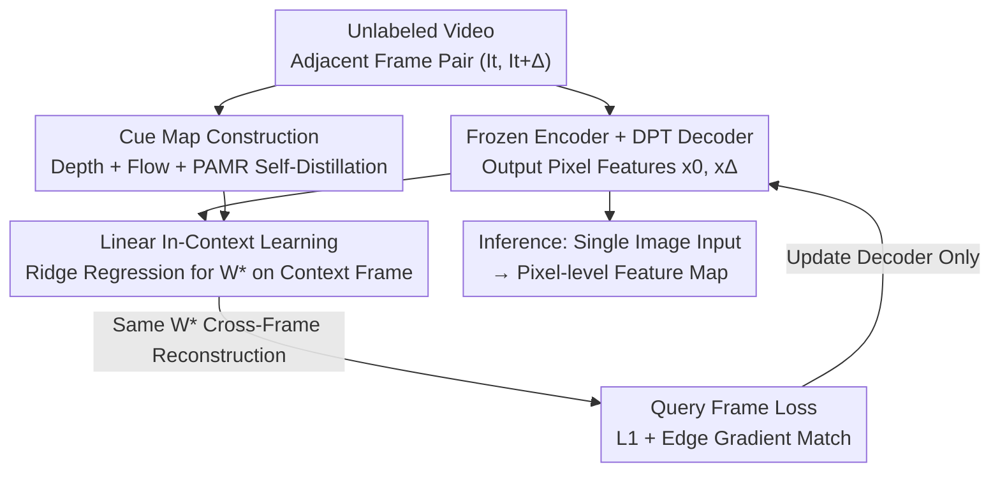

# Featurising Pixels from Dynamic 3D Scenes with Linear In-Context Learners

**Conference**: CVPR 2026  
**arXiv**: [2604.26488](https://arxiv.org/abs/2604.26488)  
**Code**: https://lila-pixels.github.io (Project Page)  
**Area**: 3D Vision / Self-supervised Representation Learning  
**Keywords**: Pixel-level features, Video self-supervision, Linear in-context learning, Depth and optical flow cues, Temporal consistency

## TL;DR
LILA utilizes a frozen DINOv2 encoder and a DPT decoder to learn pixel-wise features from unlabeled videos. The core training signal is "linear in-context learning": an optimal linear projection is fitted on context frames to map features to depth, optical flow, and self-distillation cues. **By forcing the same projection to reconstruct corresponding cues on adjacent query frames**, the model compresses geometric, semantic, and temporal consistency into pixel-level features. Downstream performance on VOS, surface normal estimation, and semantic segmentation significantly outperforms FlowFeat, LoftUp, and others.

## Background & Motivation
**Background**: Most vision tasks (segmentation, depth, normals) require **pixel-wise** features that simultaneously encode semantics and geometry. Foundation models like the DINO series can encode these attributes but are typically encoder-only, outputting patch-level (e.g., 14×14 downsampled) low-resolution feature grids.

**Limitations of Prior Work**: The most direct way to obtain pixel-level features is to upsample the input by the patch size before feeding it into the encoder, which is neither efficient nor consistent between training and inference. Existing feature upsampling methods (FeatUp, LoftUp) mostly operate on images, with LoftUp requiring SAM mask supervision. Video self-supervised methods (V-JEPA, VideoMAE) focus more on action-level semantics and are difficult to scale to dense pixel prediction.

**Key Challenge**: Existing depth and optical flow networks generalize well to in-the-wild videos, providing cheap and abundant "geometry + motion" supervision—however, their predictions are **noisy and imperfect** pseudo-labels. Learning clean, temporally stable pixel features from these noisy cues without being biased by the noise is a critical problem.

**Goal**: (i) Design an encoder-decoder training paradigm that natively learns pixel-wise features from video; (ii) ensure the learned representations yield gains on downstream tasks that **differ** from the training cues.

**Key Insight**: The authors observe that a feature truly encoding "cross-frame invariant structure" should satisfy this property: the **optimal linear projection** fitted on frame $t$ that maps features to a cue map should also reconstruct the corresponding cue map when applied to the features of the adjacent frame $t+\Delta$. This transforms "temporal consistency" into a directly optimizable constraint.

**Core Idea**: Replace frame-wise distillation with "Linear In-context Learning (LILA)." Using the optimal linear projection solved from context frames as a bridge, the model is required to reconstruct cues for query frame features under the same projection. This distills stable components from noise and suppresses temporally inconsistent noise.

## Method

### Overall Architecture
LILA trains an encoder-decoder network to produce pixel-wise feature maps from unlabeled video. The backbone uses a **frozen** pre-trained DINOv2 ViT, followed by a DPT decoder. The DPT connects to four intermediate blocks of the encoder via skip connections, upsampling patch-level tokens back to pixel-level features—**only the decoder is updated during training**.

Each iteration takes a pair of adjacent frames $(I_t, I_{t+\Delta})$, where $I_t$ acts as the **context frame** and $I_{t+\Delta}$ as the **query frame**, with $\Delta$ sampled from a variable time window. For this pair, depth maps, forward/backward optical flow, and PAMR-refined encoder features are estimated using off-the-shelf networks to form cue maps $G_\text{context}$ and $G_\text{query}$. The network produces pixel features $x_0, x_\Delta$ for both frames. During training: an optimal projection $W^*$ is solved via ridge regression on the context frame to map $x_0$ to $G_\text{context}$. Then, the **same** $W^*$ is applied to the query frame features $x_\Delta$ to reconstruct $G_\text{query}$, minimizing the reconstruction error. During inference, the depth/flow networks are discarded, and the model outputs a feature map of the same resolution from a single image.

### Key Designs

**1. Linear In-Context Learning: Temporal Consistency as a "Shared Linear Projection" Constraint**

Directly using depth/flow pseudo-labels for frame-wise distillation (ERM) causes the network to absorb the noise unique to each frame, leading to temporally unstable features. LILA introduces a "cross-frame bridge": given context features $x_0$ and cue map $G_\text{context}$, an optimal projection is solved via closed-form ridge regression:
$$W^* = \arg\min_W \|x_0 W - G_\text{context}\| + \lambda\|W\|$$
Note that the scale of this regression depends on the feature dimension $d$ (128/192/256) rather than the number of pixels $N$, making the solver efficient. Subsequently, **$W^*$ is frozen**, and it is required to map query frame features $x_\Delta$ to its cue $G_\text{query}$ with loss $\mathcal{L}_\text{L1} = \|x_\Delta W^* - G_\text{query}\|_1$. This is effective because the optimal linear projection can only capture visual structures that are "invariant across the time window"—the same $W^*$ holds for both frames only if cross-frame stable geometry/semantics are encoded into the features. Frame-specific, jittery noise components are naturally suppressed by this cross-frame constraint. For optical flow, if $W$ approximates forward flow $U_\uparrow$, then $-W$ should approximate backward flow; thus, $G_\text{query}$ handles backward flow with a sign flip.

**2. Tri-modal Cue Maps + PAMR Self-Distillation: One Projection for Geometry, Motion, and Semantics**

Using a single cue (e.g., depth only) provides insufficient information to learn representations that are both semantically rich and geometrically accurate. LILA concatenates three pixel-level cues along the feature dimension: depth $D$ (encoding scene geometry), forward/backward flow $U$ (highlighting dynamic objects), and PAMR-refined encoder features $F$ (retaining original DINOv2 semantics as self-distillation). Formally, $G_\text{context} := \mathcal{C}_0\circ(F_t \| D_t \| U_\uparrow)$ and $G_\text{query} := \mathcal{C}_\Delta\circ(F_{t+\Delta} \| D_{t+\Delta} \| -U_\downarrow)$, where $\|$ denotes concatenation and $\mathcal{C}$ denotes cropping. PAMR (pixel-adaptive map refinement) is a variant of CRF mean-field inference based on local affinity kernels that refines low-resolution features to align with boundaries using image statistics, incurring nearly zero extra cost. Synergistic effects are key: ablations show that using all three cues improves VOS-KNN by 5.3% $\mathcal{JF}$ compared to only self-distillation.

**3. Cropping Mismatch + Edge Gradient Matching: Forcing Generalization via Misalignment**

Although depth/flow are estimated on the full frames $(I_t, I_{t+\Delta})$, the network is fed **independently and randomly cropped** regions $c_0=\mathcal{C}_0(I_t)$ and $c_\Delta=\mathcal{C}_\Delta(I_{t+\Delta})$. This intentional spatial mismatch makes applying $W^*$ from context to query a non-trivial task. Removing cropping drops DAVIS linear probe performance to 66.0 (compared to 68.6 for Full), indicating that misalignment forces the network to learn transferable structures rather than memorizing fixed alignments. Additionally, discontinuities in cue maps correspond to semantic boundaries; thus, a gradient matching loss is added: $\mathcal{L}_{\nabla x} = \omega_x \|\nabla_x(x_\Delta W^*) - \nabla_x G_\text{query}\|_1$, where weights $\omega_x = 1 - \exp(-\nabla_x G_\text{query}/\sigma)$ are larger at strong gradients, guiding features to be sharper at semantic boundaries. Total loss is $\mathcal{L}_\text{LILA} = \mathcal{L}_\text{L1} + \gamma\mathcal{L}_\nabla$, with $\gamma=1$.

### Loss & Training
- Optimizer: AdamW, learning rate $10^{-4}$, weight decay $10^{-5}$, $\gamma=1$.
- Decoder output dimensions vary with backbone: 128 / 192 / 256 for ViT-S14 / B14 / L14 respectively.
- Backbone initialized from DINOv2 and frozen; only the DPT decoder is trained.
- Training sets: YouTube-VOS (small backbones) and Kinetics-700 (large backbones, ~650K clips), **without using any annotations**.

## Key Experimental Results

### Main Results
**Video Object Segmentation (DAVIS-2017 val, $\mathcal{JF}$ for Linear Probe / Local k-NN)**:

| Backbone / Method | Training Data | LP $\mathcal{JF}$ | k-NN $\mathcal{JF}$ |
|------|------|------|------|
| DINO2-S14 (Baseline) | LVD | 57.5 | 65.1 |
| + FeatUp | +COCO-S | 60.5 | 65.5 |
| + LoftUp (uses SAM massk) | +SA1B | 63.0 | 66.0 |
| + FlowFeat | +YT-VOS | 65.8 | 67.6 |
| **+ LILA** | +YT-VOS | **68.6** | **73.9** |
| DINO2-B14 + FlowFeat | +YT-VOS | 65.7 | 69.0 |
| **DINO2-B14 + LILA** | +YT-VOS | **70.4** | **74.2** |
| **DINO2-L14 + LILA** | +Kinetics | **69.3** | **74.9** |

On S14, LILA outperforms the baseline by nearly 10% $\mathcal{JF}$ (LP) and exceeds LoftUp (which uses SAM) by 4.3% **without mask supervision**. On B14, it exceeds FlowFeat by 4.7% (LP) / 5.2% (k-NN).

**Surface Normals (NYUv2) and Semantic Segmentation (COCO-Stuff)**:

| Backbone / Method | RMSE↓ | $\delta_1$↑ | COCO mIoU↑ | pAcc↑ |
|------|------|------|------|------|
| DINO2-S14 | 29.71 | 26.91 | 56.6 | 77.2 |
| + FlowFeat | 29.04 | 27.89 | 58.0 | 78.7 |
| **+ LILA** | **28.53** | **31.14** | **59.6** | **79.8** |
| DINO2-L14 | 24.70 | 39.89 | 58.7 | 78.1 |
| **+ LILA (Kinetics)** | **24.04** | **40.89** | **63.3** | **81.4** |

LILA consistently outperforms FlowFeat across all backbones and metrics for normals and segmentation; mIoU gains increase with model size (S14 +3.0%, L14 +4.1%). Consistent gains are also seen on ADE20K and zero-shot CLIP segmentation.

### Ablation Study
**Cue Modalities (Tab. 4, DAVIS LP/KNN $\mathcal{JF}$)**:

| Configuration | DAVIS LP/KNN | NYUv2 RMSE | COCO mIoU |
|------|------|------|------|
| Self-distill (SD) only | 66.9 / 68.6 | 28.61 | 59.3 |
| SD + Depth | 67.2 / 72.6 | 29.06 | 58.7 |
| SD + Flow | 67.0 / 72.6 | 28.64 | 59.5 |
| Depth + Flow | 69.1 / 72.5 | 28.49 | 59.3 |
| **LILA (Full)** | **68.6 / 73.9** | **28.53** | **59.6** |

**Training Components (Tab. 5, DINO2-S14)**:

| Configuration | DAVIS LP/KNN | Description |
|------|------|------|
| (A) ERM Distillation | 63.2 / 61.1 | Frame-wise prediction using same cues; significantly worse |
| (B) ×PAMR | 67.3 / 71.9 | Without feature refinement |
| (C) ×cropping | 66.0 / 72.4 | Without random crop misalignment |
| (D) ×temporal sampling | 69.3 / 72.4 | Without variable time window |
| (E) ×edge loss | 68.1 / 72.9 | Without edge gradient loss |
| **LILA (Full)** | **68.6 / 73.9** | Full model |

### Key Findings
- **In-context training is the primary source of gain**: ERM distillation (A) uses identical cues but k-NN performance drops from 73.9 to 61.1. The gap stems purely from the cross-frame linear constraint, which filters out frame-specific noise that standard distillation would otherwise absorb.
- **Removing geometric/motion cues is costly**: Using only self-distillation drops VOS-KNN by 5.3% $\mathcal{JF}$, demonstrating clear tri-modal synergy.
- **Cropping misalignment is critical**: Removing it drops LP $\mathcal{JF}$ from 68.6 to 66.0, as misalignment forces the network to learn transferable structures.
- **Scalability to noisy big data**: Switching L14 to Kinetics (larger but noisier than YT-VOS) still yields visible improvements in normals and segmentation.
- **Counter-intuitive cross-domain generalization**: Pre-training on dynamic/outdoor videos improves details like furniture in **static indoor** NYUv2 normal maps.

## Highlights & Insights
- **Temporal consistency as a closed-form linear constraint**: Without introducing extra parameters or contrastive queues, LILA uses "shared linear projection across frames" as a supervision signal. The regression scale is $d$ rather than $N$, making it nearly cost-free.
- **Learning from noisy labels without being biased**: The cross-frame formulation acts naturally as a denoiser (retaining only shared components), a perspective transferable to any scenario using "off-the-shelf pseudo-labels + video."
- **Video for training, single image for inference**: Unlike V-JEPA/VideoMAE which require spatio-temporal inputs, LILA discards depth/flow networks at inference and processes single images, making it deployment-friendly.
- **PAMR self-distillation preserves semantics**: Concatenating original encoder semantics as a third cue prevents geometric cues from "washing out" DINOv2 semantics at low cost.

## Limitations & Future Work
- **Dependency on off-the-shelf network quality**: Cues are provided by pre-trained networks; systematic biases (rather than random noise) might not be eliminated by the cross-frame constraint.
- **Backbone is frozen**: The representation capacity is limited by the DINOv2 backbone; LILA primarily improves "upsampling + temporal alignment."
- **Expressiveness of linear constraints**: Whether linear projections suffice for highly non-rigid, large displacement, or occluded scenes requires further stress testing.
- **Future Directions**: Exploring joint backbone fine-tuning, replacing linear projections with lightweight non-linear in-context modules, or expanding to more cues like normals or segmentation pseudo-labels.

## Related Work & Insights
- **vs FlowFeat**: Both use off-the-shelf flow for pixel-level supervision, but FlowFeat resembles BYOL by encouraging similarity between temporally corresponding pixels. LILA's in-context framework using shared linear reconstruction, combined with depth and self-distillation, outperforms FlowFeat consistently (+4~5% $\mathcal{JF}$ on VOS).
- **vs LoftUp / FeatUp**: These are image-domain upsamplers; LoftUp requires SAM masks. LILA learns pixel features natively from video without masks and surpasses LoftUp on VOS.
- **vs V-JEPA / VideoMAE**: Video self-supervised but action-centric; weak on dense pixel tasks. LILA explicitly injects geometric/motion cues for pixel-level temporal consistency, leading significantly on DAVIS.
- **vs ERM Distillation (own baseline)**: Frame-wise prediction with identical cues proves that gains come from the in-context formulation rather than the cues themselves.

## Rating
- Novelty: ⭐⭐⭐⭐⭐ Using "shared linear projection cross-frame reconstruction" to turn temporal consistency into a cheap closed-form constraint is a simple yet rare paradigm.
- Experimental Thoroughness: ⭐⭐⭐⭐⭐ Comprehensive evidence across three tasks, three backbones, two datasets, and two dimensions of ablation.
- Writing Quality: ⭐⭐⭐⭐ Motivation and formulas are clear; some details like PAMR and cropping are relegated to the appendix.
- Value: ⭐⭐⭐⭐ Practical for downstream dense tasks due to label-free training, single-image inference, and plug-and-play pixel-level representation gains.

<!-- RELATED:START -->

## Related Papers

- [\[CVPR 2026\] Dynamic-Static Decomposition for Novel View Synthesis of Dynamic Scenes with Spiking Neurons](dynamic-static_decomposition_for_novel_view_synthesis_of_dynamic_scenes_with_spi.md)
- [\[CVPR 2026\] I-Scene: 3D Instance Models are Implicit Generalizable Spatial Learners](i-scene_3d_instance_models_are_implicit_generalizable_spatial_learners.md)
- [\[CVPR 2026\] Efficiently Reconstructing Dynamic Scenes One D4RT at a Time](efficiently_reconstructing_dynamic_scenes_one_d4rt_at_a_time.md)
- [\[CVPR 2026\] FastEventDGS: Deformable Gaussian Splatting for Fast Dynamic Scenes from a Single Event Camera](fasteventdgs_deformable_gaussian_splatting_for_fast_dynamic_scenes_from_a_single.md)
- [\[CVPR 2026\] Deformation-based In-Context Learning for Point Cloud Understanding](deformation-based_in-context_learning_for_point_cloud_understanding.md)

<!-- RELATED:END -->
