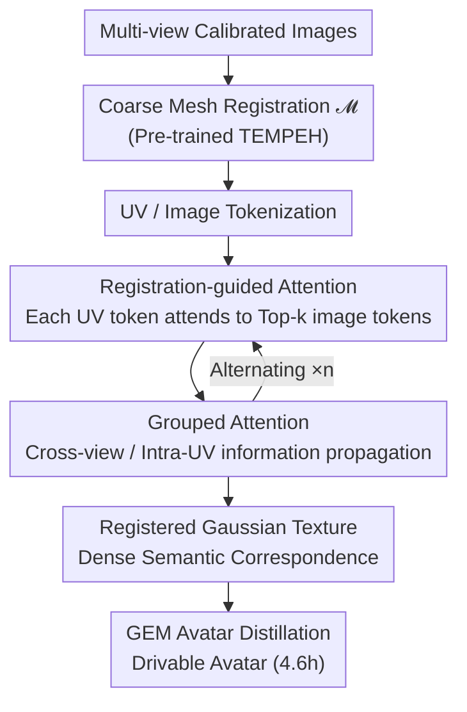

# Feed-forward Gaussian Registration for Head Avatar Creation and Editing

**Conference**: CVPR 2026  
**Paper**: [CVF Open Access](https://openaccess.thecvf.com/content/CVPR2026/html/Prinzler_Feed-forward_Gaussian_Registration_for_Head_Avatar_Creation_and_Editing_CVPR_2026_paper.html)  
**Code**: Available (Code and model weights on project page)  
**Area**: 3D Vision  
**Keywords**: Gaussian Splatting, Head Avatar, Dense Semantic Correspondence, Feed-forward Registration, Registration-guided Attention  

## TL;DR
MATCH utilizes a transformer to directly predict "Gaussian Splatting textures under dense semantic correspondence" from calibrated multi-view images in 0.5 seconds. It bypasses the time-consuming mesh tracking and per-subject optimization—which typically take hours or even a day in traditional workflows—and directly enables cross-identity/cross-expression applications such as avatar creation, interpolation, semantic editing, and expression transfer.

## Background & Motivation

**Background**: High-fidelity studio-level head avatars currently rely on a two-stage pipeline: first, performing mesh-based head tracking to establish correspondences across views and frames, and then attaching surface primitives like Gaussians to the tracked geometry followed by per-subject appearance optimization against training images.

**Limitations of Prior Work**: This two-stage pipeline is a major computational bottleneck. Creating a personalized avatar often takes hours or over a day (e.g., GEM takes ~45.3 hours, including 10.7 hours for mesh tracking and 27.7 hours for drivable Gaussian optimization), making it prohibitively expensive to scale to large populations. Furthermore, single-frame mesh tracking is inherently slow (~12 seconds/frame for VHAP).

**Key Challenge**: High fidelity depends on "per-subject optimization + explicit tracking," but these two steps incur massive time costs. Conversely, inference-based methods (which regress avatars directly from few images) are fast but generally sacrifice synthesis quality or predict Gaussians that are pixel-aligned without cross-frame/cross-identity semantic correspondence, making them unsuitable for direct editing and transfer.

**Goal**: (1) Compress "establishing correspondence + appearance generation" into a single feed-forward inference pass; (2) Ensure the output Gaussians inherently possess dense semantic correspondence (e.g., the same Gaussian always represents the same semantic region, such as the nose tip), making expensive correspondence a free byproduct for downstream applications.

**Key Insight**: The authors adopt the transformer-based approach from Large Reconstruction Models (LRM) to tokenize images and UV textures. However, they observe that having every UV token attend to all image tokens is computationally expensive and generalizes poorly to unseen subjects. Key observation: since a coarse mesh is available, the approximate region in the image corresponding to each UV token (a texture patch) is known; thus, attention does not need to be global.

**Core Idea**: Use a fixed-topology UV Gaussian texture to carry dense semantic correspondences and employ "Registration-guided Attention" so that each UV token only attends to a few image tokens in its corresponding head region. This localizes the reconstruction task, saving computation while improving quality.

## Method

### Overall Architecture
MATCH (Multi-view Avatars from Topologically Corresponding Heads) takes $V$ calibrated multi-view images as input and outputs a UV Gaussian Splatting texture $G_{\{c,\alpha,\phi,\sigma,\theta\}}\in\mathbb{R}^{H_{uv}\times W_{uv}\times C}$. Each texel is a $C$-dimensional vector encoding the RGB color $c$, opacity $\alpha$, position $\phi$, anisotropic scale $\sigma$, and rotation quaternion $\theta$ of a Gaussian. The pipeline first estimates a coarse mesh $\mathcal{M}$ using a pre-trained network, tokenizes images and UV textures based on this mesh, processes them through a transformer with interleaved "Registration-guided Attention" and "Grouped Attention" blocks, and finally de-tokenizes the UV tokens into a Gaussian texture (rendered via 2DGS). Because the texture uses a fixed UV topology, it naturally maintains semantic correspondence across identities and expressions. It can subsequently be distilled into a lightweight, monocular-video-drivable GEM avatar.

### Key Designs

**1. Registered Gaussian Texture: Dense Correspondence via Fixed UV Topology**

Traditional pixel-aligned Gaussians (e.g., Avat3r, FaceLift) can reconstruct appearance but lack semantic correspondence across frames or subjects, preventing expression transfer and component editing. MATCH represents the head as a fixed-topology UV Gaussian texture: a specific texel always represents the same semantic region regardless of identity or expression changes. Specifically, UV tokenization first performs per-texel barycentric interpolation on mesh $\mathcal{M}$ vertices to obtain a dense 3D position texture, then back-projects input images onto $\mathcal{M}$ to obtain an RGB texture. These are concatenated, split into non-overlapping patches of size $p_{uv}$, added with learnable positional embeddings, and linearly projected into UV tokens. Since the output shares a fixed topology, "establishing correspondence" is no longer an optimization step but an inherent property of the representation—enabling zero-optimization tracking, interpolation (linear interpolation via coefficient $\gamma$ in Fig. 7), semantic editing (replacing nose region attributes), and arithmetic expression transfer (adding the Gaussian residual between expression and neutral frames to a source identity).

**2. Registration-guided Attention: Localizing Attention to Corresponding Regions**

This is the core innovation addressing the bottleneck of global attention. The method computes a correspondence score for every (UV token, image token) pair and restricts the UV token to attend only to the $k_{\mathcal{T},img}$ image tokens with the highest scores. The scores are derived by rasterizing UV coordinates onto the input view planes using the coarse mesh $\mathcal{M}$ to determine the Region of Interest ($\mathrm{RoI}_{\mathcal{T},uv}$) in the image for a given UV token. Let $\mathcal{B}_{\mathcal{T},img}$ be the bounding box of an image token and $\mathcal{B}_{encomp}$ be the box encompassing both $\mathcal{B}_{\mathcal{T},img}$ and $\mathrm{RoI}_{\mathcal{T},uv}$. The score is defined as:

$$S(\mathcal{T}_{uv},\mathcal{T}_{img}) = \frac{\mathrm{RoI}_{\mathcal{T},uv}\cap\mathcal{B}_{\mathcal{T},img}}{\mathcal{B}_{\mathcal{T},img}} + \lambda\cdot\frac{\mathrm{RoI}_{\mathcal{T},uv}}{\mathcal{B}_{encomp}},$$

where operations are performed on pixel areas ($\lambda=0.1$). The first term measures the proportion of the image token box within the RoI, while the second term considers proximal image tokens even if they do not overlap. This provides three benefits: it localizes reconstruction, significantly improves generalization to unseen subjects, and ensures the attention context length is independent of the number of input images (remaining fixed at $k$). Experimentally, this was the most impactful component. To handle sparse updates to image tokens, the authors average updates across all occurrences of an image token.

**3. Grouped Attention: Information Propagation to Unobserved Regions**

Registration-guided attention only handles local "UV token ↔ relevant image token" interactions and cannot propagate information to head regions not observed by any view. Grouped attention blocks serve as a complement: they perform attention within UV tokens and within image tokens for each input view independently. This allows information to diffuse across UV space to unobserved regions and ensures image feature processing complexity scales linearly with the number of input images. These two blocks alternate $n$ times to form the "Registration-guided Transformer." During de-tokenization, each UV token is projected back into a $p_{uv}\times p_{uv}\times C$ texture patch. For color and position, the network predicts offsets relative to initial values from the UV tokenization stage (following Avat3r's skip connections).

**4. MATCH→GEM Distillation: 10× Faster Creation of Drivable Avatars**

Real-world applications require animatable avatars. The original GEM pipeline requires mesh-based tracking followed by training a CNN head to obtain a sequence of correspondent Gaussian textures, then performing PCA on attributes (scale, position, opacity, rotation) to create a linear Gaussian eigenspace model $G=\{\mu_i+B_ik_i\mid i\in\{\alpha,\phi,\sigma,\theta\}\}$. Since MATCH already predicts correspondent textures, it skips the expensive tracking and CNN stages. Predicted Gaussians are transformed to canonical space via inverse linear blend skinning, followed by PCA decomposition, basis refinement, and MLP training. This reduces creation time from 45.3 hours to 4.6 hours (10× speedup) while achieving higher self-reenactment quality.

### Loss & Training
The total loss is $L_{total}=L_{photometric}+w_{geometry}\cdot L_{geometry}+w_{reg}\cdot L_{reg}$. The photometric loss includes $L_{LPIPS}, L_{L1}, \text{and } L_{SSIM}$, with the torso and shoulders masked out. $L_{geometry}$ is the L2 loss between predicted 3D positions and dense targets from mesh registration. $L_{reg}$ regularizes scale and opacity. Training is three-stage: (1) $L_{geometry}+L_{reg}$ on Ava-256; (2) added $L_{photometric}$; (3) joint training on Ava-256 and NeRSemble v2 (disabling $L_{geometry}$ for NeRSemble due to lack of ground truth geometry). The model predicts $64\times64$ UV tokens (each $16\times16$ texels), synthesizing a $1024\times1024$ texture with ~1M Gaussians at 570 FPS. Training uses 12 $640\times512$ images per sample on 4 H100s for 860k steps (~11.8 days).

## Key Experimental Results

### Main Results: Novel View Synthesis (Ava-256 / NeRSemble)

| Dataset | Method | LPIPS ↓ | CSIM ↑ | PSNR ↑ | SSIM ↑ |
|--------|------|---------|--------|--------|--------|
| Ava-256 | Avat3r | 0.274 | 0.626 | 22.722 | 0.745 |
| Ava-256 | FaceLift | 0.208 | 0.868 | 21.661 | 0.825 |
| Ava-256 | **MATCH (Ours)** | **0.163** | **0.928** | **23.680** | **0.848** |
| NeRSemble | FaceLift | 0.200 | 0.866 | 21.524 | 0.853 |
| NeRSemble | Ours (Ava-256 only) | 0.182 | 0.892 | 23.182 | 0.861 |
| NeRSemble | **MATCH (Ours)** | **0.152** | **0.944** | **25.509** | **0.884** |

MATCH outperforms all baselines (GPAvatar, FastAvatar, LAM, Avat3r, FaceLift) across almost all metrics. Notably, even when trained only on Ava-256, it surpasses baselines on the unseen NeRSemble dataset. Joint training (even without geometry supervision on NeRSemble) yields the best results, bypassing the need for expensive mesh registration on NeRSemble (estimated at 216k GPU hours for 65M frames).

### Main Results: Per-subject Drivable Avatars

| Method | Creation Time ↓ | Reenactment PSNR ↑ | Reenactment SSIM ↑ | Cross-Ident. CSIM ↑ |
|------|-----------|--------------|--------------|--------------|
| GaussianAvatars | 15.5h | 21.248 | 0.755 | 0.629 |
| RGBAvatar | 11.4h | 22.185 | 0.782 | 0.657 |
| GEM | 45.3h | 21.761 | 0.778 | 0.800 |
| **Ours (MATCH→GEM)** | **4.6h** | **24.122** | **0.809** | **0.813** |

Relative to GEM (the closest in quality), MATCH achieves a 10× speedup and significantly better self-reenactment quality, with cross-identity performance on par with or slightly better than GEM.

### Ablation Study (Ava-256, 300k steps)

| Configuration | LPIPS ↓ | CSIM ↑ | PSNR ↑ | Note |
|------|---------|--------|--------|------|
| Dense Attention | 0.221 | 0.849 | 20.364 | Replaced with global dense attention; worst performance |
| w/o Sapiens | 0.202 | 0.907 | 22.104 | Removed Sapiens features; second largest drop |
| w/o Skipconn. | 0.192 | 0.913 | 23.075 | Removed color/position skip connections |
| Orig. TEMPEH | 0.190 | 0.909 | 22.775 | Initialized with original global TEMPEH |
| Full (Ours) | **0.187** | **0.918** | **23.032** | Full model |

### Key Findings
- **Registration-guided attention is the most impactful component**: Replacing it with Dense Attention caused significant degradation (PSNR 23.0→20.4) and loss of facial accessory and hair detail, proving that localized attention saves computation while improving quality.
- **Pre-trained Sapiens features are the second largest contributor**: Removing them hurts generalization and synthesis quality.
- **Works with few images; small $k$ is better**: Reliable reconstruction is possible with only 4 images. Smaller $k_{\mathcal{T},img}$ values actually improved performance, suggesting that restricting attention to relevant tokens is a beneficial inductive bias.
- **Higher resolution improves quality**: Quality scales monotonically as UV texture resolution increases from 256 to 1024.

## Highlights & Insights
- **Transformation of "Correspondence" from optimization to a side product**: The fixed UV topology provides dense semantic correspondence for free. Downstream editing and transfer require no additional networks.
- **Clipped Attention Maps via Geometric Priors**: By using a coarse mesh to compute correspondence scores based on pixel area ratios, global $O(N^2)$ attention is reduced to a top-k context of constant length—a clean example of trading structural knowledge for efficiency and generalization.
- **Sparse Update Averaging**: The simple trick of averaging sparse/repeated updates for image tokens is a reusable technique for localized attention mechanisms.
- **Transferable Acceleration Paradigm**: Any drivable asset pipeline (body, hands, animals) that follows the "establish correspondence, then per-subject optimize" pattern could potentially adopt this "feed-forward prediction of correspondent textures → direct distillation" paradigm.

## Limitations & Future Work
- **Dependency on Mesh Registration Supervision**: Training relies on Ava-256 registration. Fully unsupervised training remains future work.
- **Identity Leakage in Arithmetic Expression Transfer**: Direct transfer between very different identities can lead to appearance leakage. Learned expression transfer might be more appropriate.
- **Geometric Self-intersections**: Converting predicted 3D position textures to meshes occasionally produces self-intersecting surfaces.
- **Training Expression Constraints**: The distilled avatars are limited by the interpolation of training expressions and do not track eye movements.

## Related Work & Insights
- **vs. LAM / FastAvatar**: Both use transformers to predict Gaussians on fixed UV locations on a template, but they predict in "unposed canonical space." MATCH reconstructs the actual expression in "posed observation space," yielding higher fidelity.
- **vs. Avat3r / FaceLift**: These predict pixel-aligned Gaussians without cross-frame correspondence. MATCH features inherent dense correspondence, enabling editing and transfer while achieving better NVS metrics.
- **vs. GEM**: GEM distills high-quality avatars into PCA models over 45 hours. MATCH replaces the most expensive tracking/CNN training stages, reducing creation time to 4.6 hours for equivalent quality.
- **vs. TEMPEH**: While TEMPEH is a feed-forward mesh tracker, MATCH generates both geometry and appearance with higher whole-head geometric accuracy, acting as an "appearance-aware inference tracker."

## Rating
- Novelty: ⭐⭐⭐⭐⭐ Localizing attention via geometric priors and making correspondence an inherent property of the representation is a clean and effective mechanism.
- Experimental Thoroughness: ⭐⭐⭐⭐⭐ Covers NVS, geometric reconstruction, and drivable avatars across multiple datasets with extensive ablations.
- Writing Quality: ⭐⭐⭐⭐ Clear methodology and diagrams; score definitions for guided attention are well-explained.
- Value: ⭐⭐⭐⭐⭐ Reducing avatar creation from days to hours while providing free correspondence for editing is highly valuable for scalable digital humans.

<!-- RELATED:START -->

## Related Papers

- [\[CVPR 2026\] OMG-Avatar: One-shot Multi-LOD Gaussian Head Avatar](omg-avatar_one-shot_multi-lod_gaussian_head_avatar.md)
- [\[CVPR 2026\] Feed-Forward One-Shot Animatable Textured Mesh Avatar Reconstruction](feed-forward_one-shot_animatable_textured_mesh_avatar_reconstruction.md)
- [\[CVPR 2026\] PercHead: Perceptual Head Model for Single-Image 3D Head Reconstruction & Editing](perchead_perceptual_head_model_for_single-image_3d_head_reconstruction_editing.md)
- [\[CVPR 2026\] Easy3E: Feed-Forward 3D Asset Editing via Rectified Voxel Flow](easy3e_feed-forward_3d_asset_editing_via_rectified_voxel_flow.md)
- [\[CVPR 2026\] FUSER: Feed-Forward Multiview 3D Registration Transformer and SE(3)$^N$ Diffusion Refinement](fuser_feed-forward_multiview_3d_registration_transformer_and_se3n_diffusion_refi.md)

<!-- RELATED:END -->
