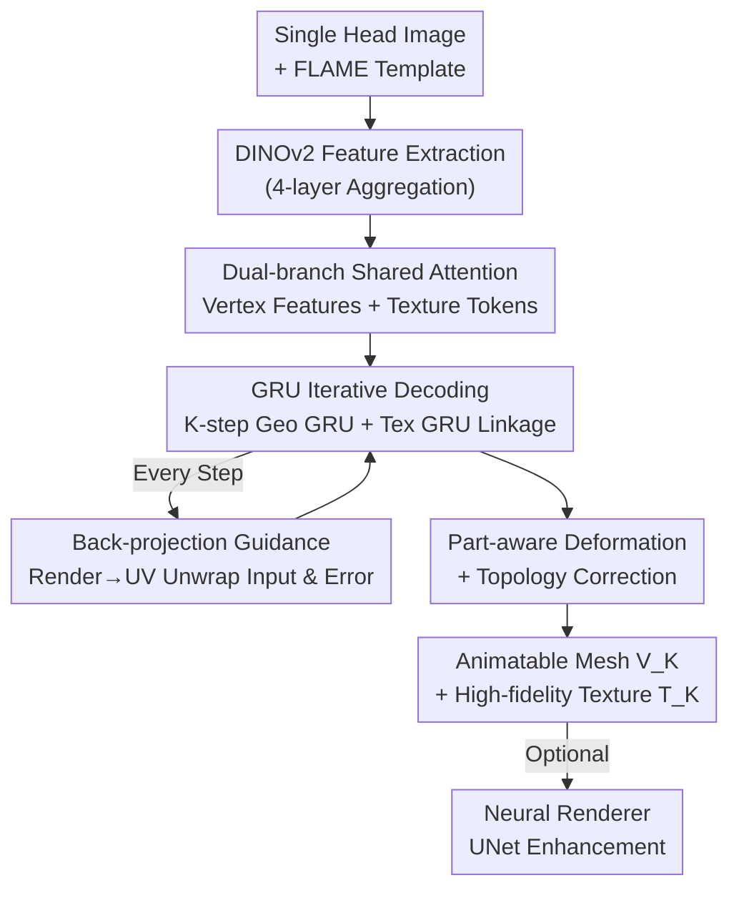

# Feed-Forward One-Shot Animatable Textured Mesh Avatar Reconstruction

**Conference**: CVPR 2026  
**Paper**: [CVF Open Access](https://openaccess.thecvf.com/content/CVPR2026/html/He_Feed-Forward_One-Shot_Animatable_Textured_Mesh_Avatar_Reconstruction_CVPR_2026_paper.html)  
**Code**: https://meshlam.github.io (Project Page)  
**Area**: 3D Vision  
**Keywords**: Single-image reconstruction, Animatable head avatar, Mesh avatar, FLAME, Feed-forward Transformer

## TL;DR
MeshLAM utilizes a feed-forward Transformer to reconstruct a 3D head mesh avatar with high-fidelity textures and direct animatability from a single image in one pass. By employing a "dual shape/texture branch + GRU iterative decoding + input-to-UV back-projection guidance," it avoids test-time optimization and mesh collapse while surpassing Gaussian-based LAM in both quality and speed.

## Background & Motivation
**Background**: Generating animatable 3D head avatars from a single image is a core requirement for VR, gaming, and digital humans. Current mainstream approaches follow two paths: 2D routes (direct synthesis via GAN/Diffusion) and 3D routes (3DMM mesh, NeRF, 3D Gaussian Splatting). Recent works like LAM use feed-forward Transformers to decode animatable Gaussian avatars based on FLAME priors, eliminating per-person optimization.

**Limitations of Prior Work**: 2D methods lack explicit 3D structures, leading to distortion and identity loss under large poses or expressions, and cannot support free-viewpoint rendering. NeRF methods often require multi-view or single-person video supervision, making it difficult to generalize to unseen identities. Feed-forward Gaussian methods (LAM) face two critical issues: representing fine-grained appearances like hair, tattoos, or text requires a massive number of Gaussian primitives, which explodes training and inference costs; furthermore, optimizing so many Gaussians in a single feed-forward pass is challenging, often resulting in blurry outputs lacking high-frequency details. Existing mesh-3DMM reconstructions only cover the face, failing to recover hair/headwear and lacking fine textures.

**Key Challenge**: There exists a trade-off between expressiveness (detailed texture) and efficiency/stability (one-shot feed-forward without collapse). Gaussians mix geometry and appearance, requiring more primitives for detail. Conversely, naively regressing per-vertex displacements often leads to mesh collapse and topological failure in large deformation regions (e.g., long hair, headwear).

**Goal**: To reconstruct a **completely animatable mesh avatar covering hair/headwear with high-fidelity textures** from a single image via a one-pass feed-forward process.

**Key Insight**: A mesh representation naturally decouples reconstruction into "geometry (vertices) + appearance (texture map)." Geometry only requires sparse vertices, while appearance uses a compact UV texture map to store high-frequency information. Handling them separately is more efficient and optimization-friendly. To make this decoupling stable, the instability of direct displacement regression must be resolved.

**Core Idea**: Decouple modeling using a shared Transformer for shape/texture branches, followed by GRU iterative decoding for coarse-to-fine deformation and texture refinement. The input image is back-projected onto the current mesh's UV space to provide direct visual evidence for texture (and geometry), creating a closed-loop between 2D observations and 3D geometry.

## Method

### Overall Architecture
Inputting a single head image, the model outputs an animatable textured 3D head mesh (vertex deformation + UV texture map) through a single feed-forward pass without test-time optimization. The pipeline involves: DINOv2 extracting multi-scale image features → Shape and texture branches conditioned on the FLAME template gathering info via shared cross-attention → $K$-step GRU iterative decoding, updating geometry (vertex displacement) and texture maps simultaneously while interleaving topology correction and visual guidance from "input-to-UV back-projection" → Converging to the final mesh $V_K$ and texture map $T_K$, with an optional neural renderer for quality enhancement.

### Key Designs

**1. Dual Shape-Texture Branch: Decoupling Geometry and Appearance with Shared Image Attention**

Addressing the issue where Gaussians mix geometry and appearance, this paper uses two dedicated branches: the shape branch takes initial FLAME vertices $V_0$ with positional encoding to obtain vertex features $F_V$, and the texture branch uses a learnable token grid $T_0 \in \mathbb{R}^{H_t \times W_t \times C_t}$ aligned with FLAME UVs as queries. Both branches share $L_A$ layers of cross-attention, attending to the same image features $F_I$:

$$F_{V_i} = \mathcal{A}_i(F_{V_{i-1}}, F_I), \qquad F_{T_i} = \mathcal{A}_i(F_{T_{i-1}}, F_I)$$

This allows geometry to be modeled with sparse vertices (approx. 8K) and appearance with a compact UV map for high-frequency details (hair, tattoos, text). They are decoupled but synchronized through shared attention. Compared to Gaussian methods, it doesn't need to squeeze appearance details into geometry—texture maps are naturally suited for high-frequency info, allowing 8K vertices to outperform 80K Gaussians in LAM.

**2. GRU Iterative Decoding: Coarse-to-fine Refinement vs. Mesh Collapse**

Directly regressing displacements from $F_V$ causes vertices to move unconstrained in large deformation areas (e.g., long hair), leading to distortion or topological collapse. This work uses recurrent GRU update operators for geometry and texture over $T$ iterations. The geometry GRU starts from a zero displacement field $\Delta V_0$ and accumulates updates:

$$\Delta V_{t+1} = \text{GRU}_\text{geo}([\psi(\vartheta(V_t), F_{d_t2v}), F_V], h_t^\text{geo}), \qquad V_{t+1} = V_t + \Delta V_{t+1}$$

where $\vartheta$ is positional encoding, $\psi$ is an MLP, $F_{d_t2v}$ is visual prediction error projected to vertex space, and $h_t^\text{geo}$ tracks deformation history. Texture refinement happens concurrently. Breaking a large jump into multiple controlled small updates allows the FLAME template to smoothly approach the target geometry. Ablations show that removing GRU leads to collapse, and **two iterations provide the best cost-performance ratio**.

**3. Back-projection Texture Guidance: Direct Visual Evidence via UV Unwrapping**

Synthesizing textures purely from learned priors results in blurriness. This paper back-projects (unwraps) the input image into the texture space at each iteration $t$ by driving the current mesh $M_t$ with the input expression and establishing pixel-to-UV correspondence:

$$U_t = \mathcal{U}(I_\text{input}, \mathcal{R}(M_t^\text{animated}))$$

where $\mathcal{R}$ is rasterization and $\mathcal{U}$ is unwrapping. The texture GRU fuses the unwrapped image $U_t$, initial DPT latent feature $F_a$, and prediction error features $F_{d_t}$:

$$T_{t+1} = \text{GRU}_\text{tex}\big(\varphi([\varphi([T_t, U_t]), F_a, F_{d_t}]), h_t^\text{tex}\big)$$

Error features $F_{d_t}$ are derived from the concatenation of "input image / rendered image / difference" convolved and unwrapped back to UV. This creates a loop between 3D geometry and 2D observation: more accurate geometry leads to better texture projection, which in turn helps geometric deformation converge to a photo-consistent solution.

**4. Part-aware Deformation + Topology Correction: Balancing Flexibility and Anatomical Correctness**

Hair and headwear require large deformations, but the face/eyes must maintain animatable anatomical structures. This paper applies region-specific clipping to displacements $\Delta V_t$: hair allows a large range $\delta_\text{hair}=0.08$, neck $\delta_\text{neck}=0.02$, and the face $\delta_\text{face}=0.003$. Eyeball/eyelid vertices remain fixed to ensure anatomical correctness. Topology correction (subdividing long edges, flipping inconsistent faces, removing illegal faces) is performed after deformation. Since remeshing changes connectivity, skinning weights $W$ and blendshapes $B$ are updated via barycentric interpolation, and the joint regressor $J = J(M + B_s(\beta))^{-1}$ is recalculated to ensure consistent skeletal driving.

### Loss & Training
End-to-end training optimizes geometry, texture, and semantics at each iteration: pixel L2 + perceptual loss $\mathcal{L}_\text{img}$ for image reconstruction; foreground mask supervision $\mathcal{L}_\text{mask}$ for silhouette; pseudo-GT normals from a pre-trained network for $\mathcal{L}_\text{normal}$; and face parsing for alignment $\mathcal{L}_\text{part}$, plus Laplacian regularization $\mathcal{L}_\text{lap}$ to prevent vertex artifacts. The total loss uses exponential weighting over $N$ steps: $\mathcal{L}_\text{total} = \sum_{t=1}^{N}\gamma^{N-t}\mathcal{L}_t$ ($N=2, \gamma=0.8$). Trained on VFHQ (15,204 clips, ~3M frames) with Adam and cosine annealing.

## Key Experimental Results

### Main Results
Evaluated on the VFHQ test set for one-shot reconstruction and reenactment. Metrics (PSNR, SSIM, LPIPS, AKD, CSIM, FID) are computed within the head mask.

| 3D Rep. | Method | PSNR↑ | SSIM↑ | LPIPS↓ | AKD↓ | CSIM↑ | FID↓ |
|---------|------|-------|-------|--------|------|-------|------|
| Mesh | ROME w/ UNet | 22.850 | 0.874 | 0.098 | 4.98 | 0.681 | 42.542 |
| Mesh | Ours w/o UNet | 23.180 | 0.859 | 0.073 | 3.58 | 0.935 | 23.688 |
| Mesh | **Ours w/ UNet** | **25.233** | **0.879** | **0.061** | 3.24 | **0.948** | 22.699 |
| Gaussian | LAM+FLAME | 25.082 | 0.879 | 0.077 | 2.07 | 0.879 | 24.270 |
| Gaussian | **LAM+Ours** | **25.889** | **0.893** | **0.050** | 2.02 | 0.898 | **22.576** |

Key takeaway: In the pure mesh setting, Ours w/ UNet significantly outperforms ROME (PSNR 25.23 vs 22.85). Even without UNet, it is highly competitive. Interestingly, using the reconstructed mesh as a geometric prior for Gaussian methods (LAM+Ours) yields State-of-the-Art results across all metrics, indicating the mesh serves as an excellent initialization for downstream representations.

### Ablation Study
| Config | PSNR↑ | LPIPS↓ | FID↓ | Description |
|------|-------|--------|------|------|
| Ours-Full | 25.23 | 0.061 | 22.699 | Full Model |
| w/o Texture Map | 18.09 | 0.126 | 74.083 | Using per-vertex color; massive drop |
| w/o GRU | 23.08 | 0.081 | 26.397 | No iteration (single regression); collapse |
| w/o Unwrapping | 22.98 | 0.089 | 29.428 | No back-projection; blurry texture |
| w/o P.A. Deform. | 22.72 | 0.096 | 32.405 | No part-awareness; facial distortion |
| w/o UNet | 23.18 | 0.073 | 23.688 | No optional neural renderer |
| GRU-1iter | 23.10 | 0.077 | 25.747 | 1 iteration |
| GRU-2iter | 25.23 | 0.061 | 22.699 | 2 iterations (Optimal) |
| GRU-3iter | 25.38 | 0.063 | 23.431 | 3 iterations; diminishing returns |

### Key Findings
- **Texture maps are crucial**: Switching to per-vertex color causes PSNR to drop from 25.23 to 18.09, proving high-frequency appearance must be stored in compact UV maps.
- **GRU iteration is the source of stability**: Removing it leads to immediate mesh collapse. 2 steps are the "sweet spot" for performance and efficiency.
- **Back-projection + Part-awareness**: Removing back-projection hurts texture sharpness (LPIPS), while removing part-awareness hurts anatomical integrity.
- **Universal geometric prior**: LAM+Ours outperforms LAM+FLAME, suggesting MeshLAM's value as a high-quality initialization for other paradigms like 3DGS.

## Highlights & Insights
- **Closed-loop back-projection is the "golden touch"**: Wrapping the input image to the current geometry anchors the synthesized texture to real pixels and pushes the geometry toward photometric consistency. This 2D↔3D loop is transferable to any one-shot reconstruction task.
- **GRU handles "flow-style" updates**: Decomposing large deformations into small, recurrent steps is an elegant alternative to heavy geometric regularization for preventing collapse.
- **Sparse mesh + compact texture beats dense Gaussians**: 8K vertices vs 80K Gaussians proves that decoupling geometry and appearance is more efficient for high-frequency details.
- **Hybrid paradigms**: The success of LAM+Ours suggests a "Mesh for foundation + Gaussian for refinement" paradigm is superior to pure Gaussian optimizations.

## Limitations & Future Work
- The geometry prior is bound to the FLAME template, which may limit topological expressiveness for extreme hairstyles or non-human heads (animals, cartoons). ⚠️ The paper does not quantify failure cases outside template coverage.
- Back-projection only provides reliable texture for visible areas; **occluded/back regions** still rely on learned priors, leading to lower fidelity compared to the front.
- Primarily evaluated on VFHQ (interview scenarios, mostly frontal). It lacks quantitative robustness analysis for extreme side profiles or low-quality inputs.
- Fixed iteration steps: Adaptive iterations based on convergence were not explored.

## Related Work & Insights
- **vs. LAM (Feed-forward Gaussian)**: LAM uses FLAME + Transformers but struggles with detail vs. primitive count trade-offs. MeshLAM uses decoupling to achieve higher clarity with fewer parameters and can even enhance LAM.
- **vs. ROME (Mesh-3DMM reconstruction)**: ROME lacks hair/headwear coverage. MeshLAM extends the mesh to the entire head and provides high-fidelity textures via back-projection.
- **vs. NeRF-based Avatars**: NeRF methods often require multi-view data and are slow. MeshLAM is a single-image feed-forward approach providing an instantly animatable mesh compatible with standard graphics pipelines.

## Rating
- Novelty: ⭐⭐⭐⭐⭐ The combination of dual-branch mesh, GRU iteration, and back-projection loop addresses both collapse and blurriness in feed-forward avatars.
- Experimental Thoroughness: ⭐⭐⭐⭐ Solid main results and detailed ablations, though the dataset is somewhat uniform (frontal-heavy).
- Writing Quality: ⭐⭐⭐⭐ Clear logic from motivation to mechanism.
- Value: ⭐⭐⭐⭐⭐ High potential for deployment; generates production-ready animatable meshes in seconds.

<!-- RELATED:START -->

## Related Papers

- [\[CVPR 2026\] FlexAvatar: Flexible Large Reconstruction Model for Animatable Gaussian Head Avatars with Detailed Deformation](flexavatar_flexible_large_reconstruction_model_for_animatable_gaussian_head_avat.md)
- [\[CVPR 2026\] Feed-forward Gaussian Registration for Head Avatar Creation and Editing](feed-forward_gaussian_registration_for_head_avatar_creation_and_editing.md)
- [\[CVPR 2026\] From Rays to Projections: Better Inputs for Feed-Forward View Synthesis](from_rays_to_projections_better_inputs_for_feed-forward_view_synthesis.md)
- [\[CVPR 2026\] AnchorSplat: Feed-Forward 3D Gaussian Splatting with 3D Geometric Priors](anchorsplat_feed-forward_3d_gaussian_splatting_with_3d_geometric_priors.md)
- [\[CVPR 2026\] Cross-View Splatter: Feed-Forward View Synthesis with Georeferenced Images](cross-view_splatter_feed-forward_view_synthesis_with_georeferenced_images.md)

<!-- RELATED:END -->
