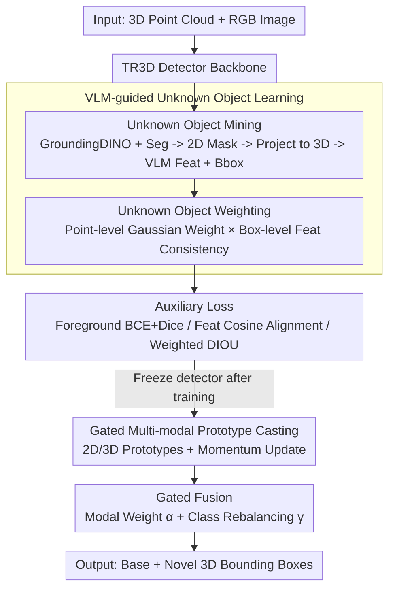

# Few-Shot Incremental 3D Object Detection in Dynamic Indoor Environments

**Conference**: CVPR 2026  
**arXiv**: [2604.07997](https://arxiv.org/abs/2604.07997)  
**Code**: [https://github.com/zyrant/FI3Det](https://github.com/zyrant/FI3Det)  
**Area**: 3D Vision  
**Keywords**: Few-shot incremental learning, 3D object detection, Vision-Language Models, Multi-modal prototypes, Indoor scene understanding

## TL;DR

This paper proposes FI3Det, the first few-shot incremental 3D object detection framework. It utilizes a VLM-guided unknown object learning module during the base training phase to perceive potential novel classes in advance. In the incremental phase, it employs a gated multi-modal prototype casting module to fuse 2D semantic and 3D geometric features for novel class detection. FI3Det achieves an average improvement of 17.37% in novel class mAP on ScanNet V2 and SUN RGB-D.

## Background & Motivation

1. **Background**: Current 3D object detection methods (e.g., VoteNet, TR3D, FCAF3D) achieve excellent performance on fixed category sets but follow a static paradigm, assuming all category labels are available during a single training session. Incremental 3D detection methods (SDCoT, AIC3DOD) can identify new classes step-by-step but still require large amounts of annotated data for novel classes.
2. **Limitations of Prior Work**: (a) Existing incremental 3D detection methods rely on abundant novel class annotations, which is unrealistic in dynamic indoor embodied environments where large-scale labeling is difficult when new objects appear; (b) While few-shot incremental detection exists in 2D (ONCE, Sylph, IL-DETR), the 3D domain remains blank; (c) Data-efficient 3D detection methods (GFS-VL, MixSup) focus mainly on pseudo-label generation and neglect feature-level learning.
3. **Key Challenge**: How to learn novel categories without forgetting previously learned ones under extremely limited novel class samples? In indoor 3D scenes, complex layouts and diverse object combinations lead to high intra-class variation, exacerbating this challenge.
4. **Goal**: (a) Define and solve the new task of few-shot incremental 3D object detection; (b) Establish early perception of novel classes during the base phase; (c) Efficiently adapt to novel categories in the incremental phase while maintaining performance on old classes.
5. **Key Insight**: The authors observe that in indoor 3D scenes, objects of novel classes often already exist in the training scenes but lack annotations (as shown in Fig. 2, unannotated novel objects frequently appear near base classes). Leveraging the zero-shot recognition capability of VLMs allows for mining these unknown objects during base training to establish early cognition of novel classes.
6. **Core Idea**: Use VLMs to mine unannotated unknown objects for feature-level and box-level learning in the base phase, and employ a gated multi-modal prototype casting module combining 2D semantics and 3D geometry for few-shot novel class detection in the incremental phase.

## Method

### Overall Architecture

The core objective of FI3Det is to detect new objects with extremely few samples (e.g., 5-shot) in dynamic indoor environments without forgetting learned base classes. The mechanism is based on the observation that novel objects often appear unannotated in base training scenes. The method is divided into two phases: the base training phase "pre-learns" these unannotated objects, and the incremental phase "identifies" them using few samples.

During the base training phase, a VLM-guided unknown object learning module is integrated into the TR3D detector. VLMs identify unannotated objects in the scene to serve as auxiliary supervision, while a weighting mechanism suppresses noise in these pseudo-labels. In the incremental phase, the detector backbone is frozen. A gated multi-modal prototype casting module uses limited novel class samples to generate 2D semantic and 3D geometric prototypes, which are adaptively fused for novel class scoring. The pipeline takes 3D point clouds and corresponding RGB images as input and outputs 3D bounding boxes for both base and novel classes.

### Key Designs

**1. VLM-guided Unknown Object Learning: Early Exposure to Future Novel Classes**

The difficulty in few-shot incremental learning lies in the lack of samples to learn robust features. The authors address this by mining unannotated novel objects already present in base training scenes. 
First, **Unknown Object Mining**: GroundingDINO generates 2D boxes, followed by a category-agnostic segmentation model to extract 2D masks $\mathbf{M}^{2D}$. These are projected to 3D to obtain $\mathbf{M}^{3D}$. For each instance, average VLM features $\mathbf{f}_j^{2D}$ and fitted 3D boxes $\mathbf{b}_j^{3D}$ are calculated. Simultaneously, an objectness head (for foreground perception) and a feature head (aligning 3D features to VLM 2D semantic space) are added to the detector. 

Second, **Unknown Object Weighting**: This handles noise in VLM pseudo-labels through spatial and semantic filtering. Point-level weighting uses a Gaussian function to assign higher weights to points near the box center:

$$w_{e,j}^{point} = \exp\!\left(-\frac{\|\mathbf{p}_e - \mathbf{c}_j\|_2^2}{2\sigma^2}\right)$$

Box-level weighting measures feature consistency within the box:

$$w_j^{box} = \left\|\frac{1}{|\mathcal{B}_j|}\sum_{e\in\mathcal{B}_j}\text{norm}(\hat{\mathbf{f}}_e^{2D})\right\|_2$$

Boxes with high semantic consistency and geometric centrality are considered more reliable.

**2. Gated Multi-modal Prototype Casting: Learning through Prototypes instead of Retraining**

In the incremental phase, fine-tuning the detector with few samples leads to catastrophic forgetting. Instead, FI3Det freezes the detector and adopts a "prototype casting" approach. It extracts modality-specific prototypes $\mathbf{T}^{2D}$ and $\mathbf{T}^{3D}$ from aligned 2D features $\hat{\mathbf{F}}^{2D}$ and 3D geometric features $\mathbf{F}^{3D}$, using momentum updates to stabilize them: $\mathbf{T}_c^{3D} \leftarrow \mu \mathbf{T}_c^{3D} + (1-\mu)\bar{\mathbf{F}}_c^{3D}$ ($\mu=0.999$). 

For fusion, two sets of learnable gates are used: $[\alpha^{3D}, \alpha^{2D}]$ assigns dynamic weights to modalities, while $\gamma$ rebalances classes to suppress overconfidence. The final score is:

$$\mathbf{S}^{fuse} = \gamma \odot (\alpha^{3D} \odot \mathbf{S}^{3D} + \alpha^{2D} \odot \mathbf{S}^{2D})$$

**3. Auxiliary Loss: Teaching Three Fundamental Capabilities**

To make unknown object learning effective, the detector must learn three things: foreground detection, semantic alignment, and localization. Foreground supervision $\mathcal{L}_{obj}$ uses BCE + Dice loss with continuous weighted scores. Feature supervision $\mathcal{L}_{feat}$ uses cosine similarity to align 3D features with VLM 2D semantics. Regression supervision $\mathcal{L}_{reg}^{unk}$ utilizes weighted DIOU loss for unknown object geometry.

### Loss & Training

The total base training loss is $\mathcal{L} = \mathcal{L}_{det} + \mathcal{L}_{aux}$, where $\mathcal{L}_{aux} = \mathcal{L}_{aux-obj} + \mathcal{L}_{aux-feat} + \mathcal{L}_{aux-box}$. In the incremental phase, all detector parameters are frozen, and only prototypes and gating functions are updated using $\mathcal{L}_{inc}$ on the limited novel class samples.

## Key Experimental Results

### Main Results

ScanNet V2 Batch Incremental Setting (1-way 5-shot):

| Method | Base mAP | Novel mAP | All mAP |
|------|----------|-----------|---------|
| AIC3DOD | 70.54 | 4.59 | 66.88 |
| VLM-vanilla | 71.81 | 14.09 | 68.60 |
| **FI3Det** | **72.84** | **38.48** | **70.94** |

SUN RGB-D Batch Incremental Setting (1-way 5-shot):

| Method | Base mAP | Novel mAP | All mAP |
|------|----------|-----------|---------|
| AIC3DOD | 58.83 | 0.02 | 52.95 |
| **FI3Det** | **63.05** | **73.17** | **64.07** |

### Ablation Study

| Configuration | Base | Novel | All |
|------|------|-------|-----|
| VLM-vanilla (baseline) | 71.81 | 14.09 | 68.60 |
| + UOM | 72.73 | 25.43 | 70.10 |
| + UOM + UOW | 72.83 | 32.46 | 70.61 |
| + UOM + UOW + GPI (Full) | 72.84 | 38.48 | 70.94 |

### Key Findings

- **UOM has the highest contribution**: Unknown Object Mining improves novel mAP from 14.09% to 25.43%, proving that early perception during the base phase is critical.
- Base class performance remains stable (~72.8%), indicating that the prototype casting strategy effectively avoids catastrophic forgetting.
- On SUN RGB-D 1-way 5-shot, FI3Det's Novel mAP (73.17%) even exceeds the Base mAP (63.05%), demonstrating superior adaptation capacity.

## Highlights & Insights

- **Unknown object learning in the Base phase** is a clever approach: novel objects are treated as "dark matter" in the training scene, allowing the detector to learn their geometry and semantics before they are officially introduced.
- **Two-level weighting (point + box)** provides a practical solution for handling noisy pseudo-labels from VLMs by considering both spatial centrality and semantic consistency.
- **Gated multi-modal fusion** is more flexible than simple concatenation, allowing the model to weigh 3D geometry (good for localization) and 2D semantics (good for identification) differently based on the instance.

## Limitations & Future Work

- The quality of unknown object mining is limited by the performance of the underlying VLM (e.g., GroundingDINO).
- The study focuses on indoor scenes; large-scale outdoor scenarios like autonomous driving have not been verified.
- Freezing the detector in the incremental phase means features are not further optimized for novel classes, which might be a limitation if novel classes differ significantly from base classes.

## Related Work & Insights

- **vs SDCoT++**: While SDCoT++ pioneered incremental 3D detection, it fails in few-shot settings (Novel mAP 0.09%). FI3Det avoids large-scale retraining through prototype casting.
- **vs AIC3DOD**: AIC3DOD performs well in full incremental settings but struggles in few-shot scenarios (Novel mAP 4.59%) due to a lack of VLM-guided pre-training.

## Rating

- Novelty: ⭐⭐⭐⭐ 
- Experimental Thoroughness: ⭐⭐⭐⭐⭐ 
- Writing Quality: ⭐⭐⭐⭐ 
- Value: ⭐⭐⭐⭐ 

<!-- RELATED:START -->

## Related Papers

- [\[CVPR 2026\] Zoo3D: Zero-Shot 3D Object Detection at Scene Level](zoo3d_zero-shot_3d_object_detection_at_scene_level.md)
- [\[CVPR 2026\] H²A²: Homogeneity-Aware and Heterogeneity-Aware Feature Perception for Unified Indoor 3D Object Detection](h2a2_homogeneity-aware_and_heterogeneity-aware_feature_perception_for_unified_in.md)
- [\[CVPR 2026\] RaGS: Unleashing 3D Gaussian Splatting from 4D Radar and Monocular Cue for 3D Object Detection](rags_unleashing_3d_gaussian_splatting_from_4d_radar_and_monocular_cue_for_3d_obj.md)
- [\[CVPR 2026\] Query2Uncertainty: Robust Uncertainty Quantification and Calibration for 3D Object Detection under Distribution Shift](query2uncertainty_robust_uncertainty_quantification_and_calibration_for_3d_objec.md)
- [\[CVPR 2025\] SCOPE: Scene-Contextualized Incremental Few-Shot 3D Segmentation](../../CVPR2025/3d_vision/scope_scene-contextualized_incremental_few-shot_3d_segmentation.md)

<!-- RELATED:END -->
