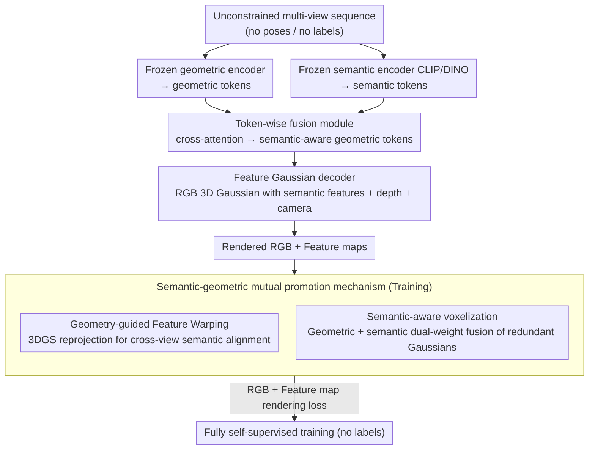

# FF3R: Feedforward Feature 3D Reconstruction from Unconstrained Views

**Conference**: CVPR 2026 Findings  
**arXiv**: [2604.09862](https://arxiv.org/abs/2604.09862)  
**Code**: [https://chaoyizh.github.io/ff3r_project](https://chaoyizh.github.io/ff3r_project)  
**Area**: 3D Vision  
**Keywords**: 3D Reconstruction, Semantic Understanding, Feedforward Architecture, 3D Gaussian, Unlabeled Training

## TL;DR

FF3R is the first fully unlabeled feedforward framework capable of simultaneous geometric reconstruction and open-vocabulary semantic understanding from unconstrained multi-view image sequences, processing 64+ images 180x faster than optimization-based methods.

## Background & Motivation

**Background**: Geometric reconstruction and semantic understanding are two pillars of 3D vision, but separating them into independent frameworks leads to redundant pipelines and accumulated errors.

**Limitations of Prior Work**: (1) Methods dependent on semantic labels are restricted by fixed categories and annotation costs; (2) Unlabeled methods face two core challenges: global semantic inconsistency (2D foundation models lack multi-view geometric priors) and local structural inconsistency (Gaussian fusion across semantic boundaries).

**Key Challenge**: Geometric foundation models are trained self-supervised via photometric loss, while semantic foundation models require labels or knowledge distillation—the difference in these two training paradigms makes building a unified system difficult.

**Goal**: Construct a fully self-supervised feedforward framework relying only on RGB and feature map rendering supervision.

**Key Insight**: Inject semantic context into geometric tokens through token-level fusion and resolve consistency issues via a semantic-geometric mutual promotion mechanism.

**Core Idea**: Geometry-guided semantic alignment (resolving global inconsistency) + Semantic-aware voxelization (resolving local inconsistency).

## Method

### Overall Architecture

FF3R aims to output geometry (depth, camera, 3D Gaussian) and open-vocabulary semantics in a single feedforward pass from unconstrained multi-view images (no poses, no labels), supporting long sequences of 64+ images. The pipeline first extracts geometric and semantic tokens using two frozen pretrained encoders, allows them to exchange information at the token level to decode pixel-aligned features, and finally predicts RGB 3D Gaussians with semantic features along with depth and camera parameters. The key is that no labels are used during training—geometry is self-supervised via photometric loss, while semantics are aligned across views via geometric priors, forming a "semantic-geometric mutual promotion" loop.

### Key Designs

**1. Token-wise Fusion Module: Injecting semantics into geometric tokens at the representation layer**

Geometric encoders perceive structure while semantic encoders perceive categories. Calculating them separately for post-processing concatenation leads to disconnected information. FF3R uses cross-attention at the token level to let geometric tokens query semantic tokens, injecting semantic context directly into the geometric representation to output "semantic-aware geometric tokens." All subsequent 3D decoding (Gaussians, depth, camera) is built upon these fused tokens. Because fusion occurs early in the representation rather than late in the output, geometry and semantics share the same context from the start.

**2. Geometry-guided Feature Warping Loss: Aligning cross-view semantics with geometric priors**

2D foundation models (e.g., CLIP/DINO) are trained on single images and lack multi-view geometric concepts, causing inconsistent features for the same object from different views (global semantic inconsistency). FF3R uses the reconstructed geometry as a reference: since 3D Gaussians can be reprojected, semantic features of two views observing the same 3D point should be identical. Specifically, semantic features from the current view are warped to a new view via 3DGS to render a feature map, which is supervised against the actual features of that view. Geometry acts as a signal source to supervise semantic alignment.

**3. Semantic-aware Voxelization: Avoiding semantic boundary crossing during redundant Gaussian fusion**

In long sequences with dense views, the number of Gaussian primitives explodes, requiring voxelization for fusion and compression. Traditional fusion only considers geometric confidence, potentially merging nearby Gaussians belonging to different semantic objects, resulting in blurred boundaries (local structural inconsistency). FF3R incorporates both geometric confidence and semantic consistency into the fusion weights. Only Gaussians that are both geometrically adjacent and semantically compatible are merged, preserving category boundaries while compressing redundancy.

### Loss & Training

Fully unlabeled: Supervision is provided only by RGB rendering loss (photometric consistency) and feature map rendering loss (semantic consistency). No camera poses, depth maps, or semantic labels are required. Semantic alignment is provided by the geometry-guided warping (Design 2), and geometric stability benefits from the semantic boundaries maintained by Design 3.

## Key Experimental Results

### Main Results

| Task/Dataset | Metric | FF3R | Prev. SOTA | Gain |
|------------|------|------|----------|------|
| ScanNet NVS | PSNR/SSIM | SOTA | - | Significant |
| ScanNet Sem. Seg. | mIoU | SOTA | - | Significant |
| DL3DV-10K Depth Est. | Error | SOTA | - | Significant |

### Ablation Study

| Configuration | Key Metric | Description |
|------|---------|------|
| w/o Token Fusion | Semantic quality dropped | Missing geometric-semantic interaction |
| w/o Geo-guided Warping | Cross-view inconsistency | Global semantic alignment failure |
| w/o Sem-aware Voxelization | Blurred local boundaries | Cross-category Gaussian merging |
| Full FF3R | Optimal | Complementary designs |

### Key Findings

- FF3R can handle 64+ images, whereas previous SOTA methods could only handle 6—a 10x improvement in scalability.
- The running speed is 180x faster than optimization methods, with the efficiency advantage of the feedforward architecture being more significant on long sequences.
- Strong generalization in in-the-wild scenes proves the scalability of the unlabeled training paradigm.

## Highlights & Insights

- **Fully Unlabeled Training Paradigm**: Relies only on RGB and feature map rendering supervision, achieving learning from arbitrary in-the-wild images.
- **Feedforward Processing Scalable to 64+ Images**: Breaks the input limitations of previous methods, paving the way for practical applications.
- **Bi-directional Gain from Semantic-Geometric Promotion**: Geometry assists semantic alignment, and semantics assist geometric fusion—the interaction produces effects beyond simple unidirectional transfer.

## Limitations & Future Work

- Dependency on the feature quality of 2D foundation models (CLIP/DINO).
- Voxelization may introduce quantization errors.
- Not yet validated in dynamic scenes.

## Related Work & Insights

- **vs LSM**: LSM is the first unlabeled feedforward method but lacks deep geometric-semantic interaction and cannot scale to long sequences.
- **vs SceneSplat**: SceneSplat relies on large-scale SAM2 annotation data, whereas FF3R is fully unlabeled.

## Rating

- Novelty: ⭐⭐⭐⭐ First implementation of fully unlabeled + long-sequence feedforward.
- Experimental Thoroughness: ⭐⭐⭐⭐ Comprehensive evaluation on ScanNet and DL3DV.
- Writing Quality: ⭐⭐⭐⭐ Clear problem analysis.
- Value: ⭐⭐⭐⭐⭐ Opens a scalable path for unified 3D understanding.

<!-- RELATED:START -->

## Related Papers

- [\[CVPR 2026\] H²A²: Homogeneity-Aware and Heterogeneity-Aware Feature Perception for Unified Indoor 3D Object Detection](h2a2_homogeneity-aware_and_heterogeneity-aware_feature_perception_for_unified_in.md)
- [\[CVPR 2026\] Hierarchical Visual Relocalization with Nearest View Synthesis from Feature Gaussian Splatting](hierarchical_visual_relocalization_with_nearest_view_synthesis_from_feature_gaus.md)
- [\[CVPR 2026\] Global Structure-from-Motion Meets Feedforward Reconstruction](global_structure-from-motion_meets_feedforward_reconstruction.md)
- [\[CVPR 2026\] iLRM: An Iterative Large 3D Reconstruction Model](ilrm_an_iterative_large_3d_reconstruction_model.md)
- [\[CVPR 2026\] HumanOrbit: 3D Human Reconstruction as 360° Orbit Generation](humanorbit_3d_human_reconstruction_as_360_orbit_generation.md)

<!-- RELATED:END -->
