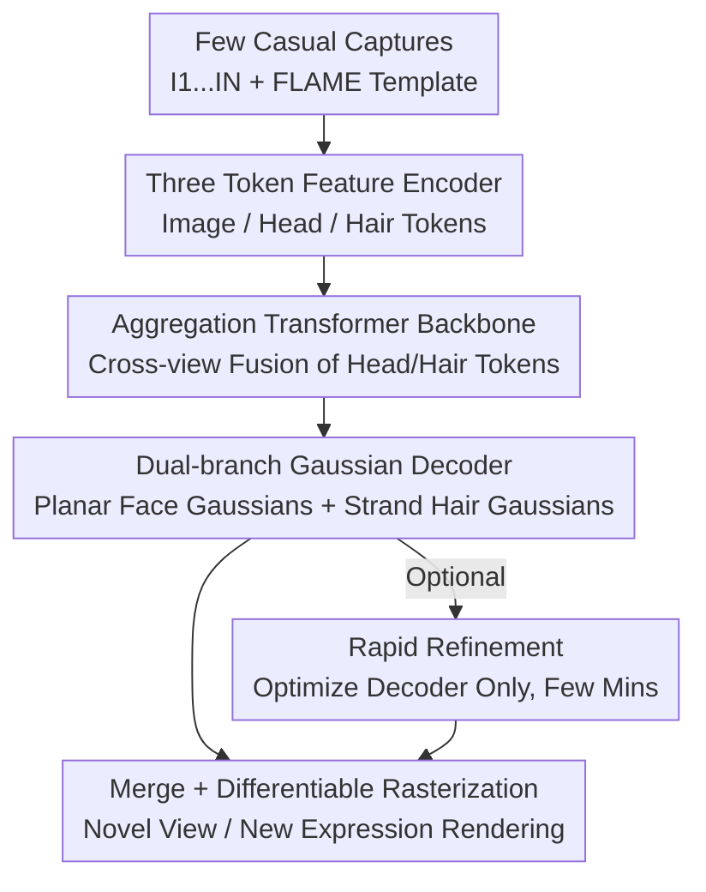

# FHAvatar: Fast and High-Fidelity Reconstruction of Face-and-Hair Composable 3D Head Avatar from Few Casual Captures

**Conference**: CVPR 2026  
**Paper**: [CVF Open Access](https://openaccess.thecvf.com/content/CVPR2026/html/Sun_FHAvatar_Fast_and_High-Fidelity_Reconstruction_of_Face-and-Hair_Composable_3D_Head_CVPR_2026_paper.html)  
**Code**: To be confirmed  
**Area**: 3D Vision  
**Keywords**: 3D head avatar, 3D Gaussian, face-hair decoupling, strand-based Gaussian, feed-forward reconstruction

## TL;DR
FHAvatar utilizes a feed-forward aggregation Transformer to reconstruct a face-and-hair composable/decomposable 3D Gaussian head avatar from a few casual mobile captures within minutes. Planar Gaussians in the UV space are used for the face, while scalp-anchored strand-based Gaussians are used for the hair. The two components are explicitly decoupled in the texture space, supporting real-time driving, hairstyle transfer, and texture stylized editing.

## Background & Motivation

**Background**: Drivable, photorealistic 3D head avatars are typically modeled using NeRF or 3D Gaussian Splatting (3DGS) in conjunction with parametric geometric models like FLAME. Recent years have seen significant improvements in quality.

**Limitations of Prior Work**: Both pathways present challenges. First, the majority of high-quality methods treat hair as an extension or deformation of the scalp, ignoring the drastic variations in style, density, and length, as well as the fine strand-level geometry of hair. This leads to blurry, clumped rendering results for long or curly hair, and fails to support downstream applications like hairstyle transfer and physical simulation. Second, most high-quality methods are identity-specific, relying on dense multi-view acquisition and lengthy per-person optimization (often taking 1 to 5 hours), making them entirely unsuitable for consumer-grade, casual mobile capture scenarios. Although the recent cohort of feed-forward generalizable models (trained on large-scale videos) is fast, they are often restricted to single-view or fixed-view inputs, rendering them non-robust under sparse inputs and prone to 3D inconsistent artifacts.

**Key Challenge**: The geometric prior for facial structures is stable across different identities and can be densely tiled using template Gaussians, whereas hair is highly diverse and demands strand-level modeling. Forcing both into a unified representation compromises either hair detail or efficiency and generalization.

**Goal**: To feed-forward reconstruct a high-fidelity 3DGS head avatar with explicitly separated face and hair, supporting real-time driving within minutes, from an arbitrary number (1 to 6 or more) of unstructured casual photos.

**Key Insight**: Since the geometric characteristics of the face and hair are fundamentally different, they should not be coupled in a unified model. Instead, they can be **explicitly decoupled** in the texture (UV) space—using planar Gaussians for the face and strand-based Gaussians for the hair. An aggregation Transformer capable of handling arbitrary numbers of views is then leveraged to fuse them by learning cross-view priors.

**Core Idea**: To replace the unified head representation with a dual representation of "planar Gaussians for the face + strand-based Gaussians for the hair". A feed-forward aggregation Transformer is leveraged to extract and fuse multi-view priors from a few casual captures, enabling reconstruction via a single forward pass with an optional lightweight refinement.

## Method

### Overall Architecture
FHAvatar is an end-to-end feed-forward pipeline that predicts a composite "face + hair" 3D Gaussian head entirely within the UV (texture) space of FLAME. Given several unstructured input images $I=\{I_1,\dots,I_N\}$, the model first uses a **feature encoder** to extract three types of tokens: image tokens, head geometry tokens, and hair tokens. These tokens are passed into an **aggregation Transformer backbone**, where head/hair tokens act as queries to perform cross-view attention over all image tokens, fusing geometry-aware cross-view priors. Finally, a **dual-branch Gaussian decoder** separately decodes the planar Gaussians for the face and the strand-based Gaussians for the hair, which are merged and rendered via differentiable rasterization according to the target expression and camera view. Once trained, reconstruction for a new identity requires only a single forward pass, with an **optional rapid refinement** (fine-tuning only the decoders for a few minutes) to further enhance personalized details.

The spine running through the entire process is the representation choice of "explicit decoupling of the face and hair in the texture space". This is reflected at both ends: in the encoder (independent hair tokens) and the decoder (independent dual branches), allowing the final Gaussians to naturally separate into two decomposable groups.

### Key Designs

**1. Explicit Decoupling of Face and Hair in Texture Space: Matching Dual Geometric Characteristics with Dual Representation**

This is the core foundation. Previous approaches treated hair as a scalp deformation and shared a unified Gaussian representation with the face, yielding blurry results for long or curly hair. FHAvatar decouples them within the FLAME UV texture space: **planar Gaussians are used for the face**, where a Gaussian is predicted for each pixel of the UV map and bound to the corresponding triangular faces, deforming with expressions via FLAME blendshapes. This dense tiling is sufficient to represent the relatively stable geometry of the face. **Strand-based Gaussians are used for the hair**, where each UV pixel in the scalp region grows a whole hair strand consisting of $S=256$ segments, with each segment attached to an elongated Gaussian, aligning with the physical structure of real hair. The two sets of Gaussians share the scalp UV space but remain mutually independent. This layout allows long and curly hair to be represented with precise strand-level geometry, and enables tasks like "hairstyle transfer" and "texture editing" to manipulate only one of the branches, serving as the basis for all downstream applications.

**2. Three-Token Feature Encoder: Injecting Appearance, Head Structure, and Hairstyle Priors into the Transformer**

On the input side, information is split into three channels of tokens. **Image tokens** are extracted as multi-scale representations using a frozen DINOv2 backbone, and then refined through a trainable, simplified DPTHead: $T_{image}=\mathrm{DPTHead}(\mathrm{DINOv2}(I))\in\mathbb{R}^{N\times P\times C}$, where shallow layers convey high-frequency textures and deep layers contain global appearance priors. **Head geometry tokens** originate from FLAME: the 3D coordinates of the canonical template mesh vertices are projected onto the UV space to form a position map, which undergoes pixel-wise positional encoding before passing through an MLP: $T_{head}=\mathrm{MLP}(\gamma(X))\in\mathbb{R}^{H_{uv}\times W_{uv}\times C}$ is obtained to provide the head structure prior. **Hair tokens** are initialized by selecting the most frontal image $I_f$ and extracting hairstyle features $f_{hair}$ using DiffLocks, a monocular hairstyle model pre-trained on synthetic data. To mitigate the structural errors inherent in monocular estimation, cross-attention is applied over image tokens to introduce multi-view consistency: $T_{hair}=\mathrm{CrossAttn}(T_{image},f_{hair})+T^{scalp}_{head}$, where $T^{scalp}_{head}$ represents the scalp subset serving as spatial positional encoding. The distinct roles of these three tokens correspond precisely to the three sources of priors: appearance, head structure, and hairstyle.

**3. Aggregation Transformer Backbone: Handling Arbitrary Numbers of Views with Query-based Head/Hair Tokens**

A major open challenge is that the count of casual captures $N$ is arbitrary and unstructured; thus, the model must be robust to the number of input views. The backbone consists of a stack of "aggregation blocks". In each block, the head (or hair) tokens serve as queries to perform cross-attention over **all** image tokens, thereby inferring the projection relationships across views and compensating for structural deviations from the template head mesh. Simultaneously, drawing inspiration from VGGT, the $N$ images are reshaped to the batch dimension to perform intra-frame self-attention. Taking the head token as an example:

$$T_{head}\leftarrow \mathrm{CrossAttn}(T_{head},T_{image};\psi),\quad T_{image_i}\leftarrow \mathrm{SelfAttn}(T_{image_i},T_{image_i})$$

where $\psi$ denotes the FLAME expression parameters tracked from the input images, concatenated onto the image tokens. The hair tokens follow an identical pipeline, but the cross-attention layers for head and hair remain separate, while **half of the self-attention layers are shared**. This balances the distinct characteristics of the two departments while promoting consistency between the head and hair representations. This design allows the model to learn priors from both monocular and multi-view data concurrently, making it inherently adaptive to varying input frame counts.

**4. Dual-branch Gaussian Decoder + Density Map Adaptive Strand Sampling: Separately Decoding and Adaptively Controlling Point Counts by Hairstyle**

Following backbone processing, outputs are decoded via dual branches. **Face Branch**: The decoder shares a convolutional backbone with independent MLP heads for each property, decoding the positional offset $\Delta p$, covariance, rotation, opacity, and color for one Gaussian per UV pixel from $T_{head}$. The offset is a local displacement relative to the tied triangular face. The total number of Gaussians can be adjusted by tuning the UV resolution, balancing quality and speed. **Hair Branch**: Since a single Gaussian per pixel cannot represent curly or long hair, each scalp UV pixel utilizes a frozen DiffLocks hair strand generator (several modulated SIREN layers) to decode $S=256$ direction vectors $d_{1:S}=D_{dir}(\gamma T_{hair}+f_{hair})$ (where $\gamma$ is a scaling coefficient for the correction term). These segments are cumulatively added from the scalp root point, $v_s=v_{s-1}+d_s$, to form a continuous hair strand. Each segment is associated with a strand Gaussian, positioned at the midpoint $p_s=\tfrac12(v_{s-1}+v_s)$, with the long axis equal to the half-segment length and the two short axes fixed to a small radius $r$, i.e., $\sigma_s=(\tfrac12\|d_s\|_2,\,r,\,r)^\top$. Color and opacity are also decoded from $T_{hair}$. To prevent an excessive number of Gaussians from overloading the rasterizer, a **scalp UV density map** is decoded from $T_{hair}$ to adaptively downsample the hair strands according to average hair length (short, medium, long) and reduce the number of segments $S$ per strand: when short hair is detected, $S$ is decreased and radius $r$ is increased to maintain scalp coverage. This branch acts as a critical adjustment valve between rendering cost and quality.

### Loss & Training
The total loss is composed of three components: $L_{total}=L_{hair}+L_{photo}+L_{reg}$. **Hair region loss** $L_{hair}=\lambda_{hair}\|\hat I_{hair}-I_{hair}\|^2+\lambda_{seg}\|\hat I_{seg}-I_{seg}\|^2$: analytical masks are used to extract the hair region, supervising the rendered images generated solely by the hair Gaussians, alongside L2 constraints on dual-branch semantic rendering. This prevents the "face Gaussians climbing onto the scalp to occupy the hair region" under short-hair scenarios, enforcing clean face/hair separation. **Photometric loss** $L_{photo}=L_1+\lambda_{ssim}L_{ssim}+\lambda_{lpips}L_{lpips}$ supervises the rendering under target views/expressions against ground truths. **Regularization** $L_{reg}$ imposes thresholded L2 penalties on positional offsets and scaling to suppress extreme values, preventing artifacts during reconstruction and driving. The weights are configured as $\lambda_{hair}=\lambda_{seg}=0.3,\ \lambda_{ssim}=0.5,\ \lambda_{lpips}=0.02,\ \lambda_{pos}=\lambda_{scale}=0.1$. Training uses the Adam optimizer with a cosine scheduler, learning rate 1e-4, batch size 1, and takes around 4 days for 50k steps on 2 × H20 GPUs. **Rapid Refinement**: The encoder and backbone are frozen, and only the predicted $T_{head},T_{hair}$ and the dual-branch decoders are jointly optimized. Fine-tuning on the input data for 100 epochs takes only a few minutes, improving personalized fidelity and adaptation to in-the-wild lighting.

## Key Experimental Results

### Main Results
The evaluation uses the NeRSemble dataset (202 identities, ~70k frames, 16-view system), training on 195 subjects and keeping 7 for testing. For each sample, 1 to 6 views are randomly selected as inputs, and 4 remaining views/expressions are used as supervision. Additionally, a self-collected in-the-wild mobile dataset of ~4k frames across 6 subjects is used for testing. Evaluation is conducted on a single RTX 4090. Metrics include PSNR, SSIM, LPIPS, alongside face-specific metrics such as AKD (average keypoint distance) and CSIM (ArcFace identity similarity). The table below showcases representative input settings (Ours refers to the full configuration):

| Input Views | Method | PSNR↑ | SSIM↑ | LPIPS↓ | AKD↓ | CSIM↑ | Modeling Time↓ | FPS↑ |
|--------|------|------|------|------|------|------|--------|------|
| 1 View | LAM | 16.41 | 0.662 | 0.409 | 48.64 | 0.461 | 0.31 s | 142.8 |
| 1 View | **Ours** | **22.80** | **0.797** | **0.303** | **3.66** | **0.665** | 49.0 s | 259.6 |
| 3 Views | GaussianAvatars | 21.68 | 0.747 | 0.328 | 13.00 | 0.347 | ∼1.2 h | 47.2 |
| 3 Views | **Ours** | **23.40** | **0.813** | **0.295** | **3.37** | **0.700** | 49.2 s | 258.2 |
| 6 Views | GaussianAvatars | 23.44 | 0.784 | 0.300 | 7.41 | 0.465 | ∼1.5 h | 48.2 |
| 6 Views | **Ours** | **23.71** | **0.825** | **0.296** | **3.08** | **0.721** | 52.2 s | 246.9 |
| 16 Views | GaussianAvatars | 23.50 | 0.769 | **0.152** | 5.54 | 0.629 | ∼4.2 h | 32.8 |
| 16 Views | **Ours** | **24.22** | **0.837** | 0.271 | **2.72** | **0.770** | 130.1 s | 242.2 |

PSNR leads the second-best by 1.72, 0.27, and 0.72 under 3, 6, and 16 views respectively. The AKD metric demonstrates a massive lead (3.66 for single-view, and down to 2.72 for multi-view, whereas baselines typically score between 5 and 85), reflecting highly accurate expression and pose reenactment. Modeling time is 10× to 100× faster than optimization-based methods (order of minutes vs. 1 to 5 hours), and because coordinate computation is decoupled from rendering, it supports real-time driving up to approximately 250 FPS. The only exception is the LPIPS of GaussianAvatars under 16 views (0.152), which is lower, but it requires 4.2 hours of optimization and still yields inferior AKD and CSIM.

### Ablation Study
(Note: The ablation table is evaluated under a separate setting; the PSNR baseline of 25.14 for Full uses a different calibration than the main table.)

| Configuration | PSNR↑ | SSIM↑ | LPIPS↓ | Explanation |
|------|------|------|------|------|
| Full | 25.14 | 0.796 | 0.333 | Full model |
| w/o Hair Branch | 23.32 | 0.782 | 0.421 | Remove hair branch, fallback to standard FLAME UV whole-head prediction |
| w/o Region Loss | 25.04 | 0.794 | 0.336 | Remove hair region loss |
| w/o Finetune | 23.85 | 0.780 | 0.382 | Remove rapid refinement (single forward pass only) |

### Key Findings
- **The Hair Branch is the most critical contributor**: Removing it causes PSNR/SSIM/LPIPS to drop by 1.82 / 0.014 / 0.088. Gaussians bound to the FLAME template fail to represent long hair areas, and the feed-forward model cannot adaptively scale the Gaussian count, causing the hair to render as blurry, non-strand geometry. This validates that "separate modeling for flexible hair and the rigid face" is a natural and highly effective choice.
- Although the **hair region loss** has limited impact on global PSNR (25.14 → 25.04), its absence prevents the hair (especially the crown) from decoupling cleanly from the scalp, directly degrading downstream applications like hairstyle transfer.
- **Rapid refinement** yields improvements of 1.29 / 0.016 / 0.049 in PSNR/SSIM/LPIPS, further recovering individual-specific details on top of the established single forward pass output.
- **Incremental reconstruction**: Quality ramps up quickly as the input view count increases from 1 to 6, and plateaus past 6 views. Additional frames primarily refine dynamic details like eye sockets and teeth, demonstrating high flexibility regarding the number of input views.

## Highlights & Insights
- **Thorough separation**: Rather than merely adding a loss term for hair, the method decouples the face and hair across the entire pipeline—from representations (planar Gaussians vs. strand Gaussians), encoding (independent hair tokens), and decoding (dual branches) to UV binding. This yields optimization-free downstream applications such as complete hairstyle replacement and direct 3D texture editing, which is the most impressive aspect.
- **Leveraging existing blocks instead of reinventing the wheel**: DINOv2 provides image priors, FLAME contributes head geometry, DiffLocks yields hairstyle priors, and a VGGT-style batch-wise self-attention ingests arbitrary views. The pipeline orchestrates several mature foundation models as priors in a feed-forward flow, using an aggregation Transformer to apply multi-view consistency corrections.
- **Density-map adaptive sampling** is a highly transferable engineering trick: a lightweight UV density map is utilized to dynamically control the number of hair strands and Gaussian radii depending on hair length, offering a continuous tune-up knob between quality and renderer overhead.
- **UV-space binding translates 2D editing directly into 3D**: Users can achieve 3D-consistent alterations across the avatar simply by editing the 2D texture map. This bypasses the need for re-inference or iterative training, rendering it highly user-friendly for content creation.

## Limitations & Future Work
- **Reliance on external prior models**: Hairstyle quality is bounded by the locked DiffLocks strand generator, while facial geometry is constrained by the FLAME topology. It may struggle with extreme hairstyles or accessories that are out-of-domain for these templates.
- **High training cost**: Despite minute-level inference, training requires 2 × H20 for approximately 4 days and depends on multi-view datasets like NeRSemble to learn generalizable priors.
- **In-the-wild generalization relies on refinement as a safety net**: While a single forward pass yields decent results, adapting to real-world illumination and highly diverse identities often mandates the optional refinement step. The performance ceiling for pure zero-shot forward-pass inference remains to be explored. ⚠️ Note that the paper does not provide quantitative comparisons before and after refinement on in-the-wild data; the original manuscript should be consulted for definitive details.
- **Future directions**: Making the hair strand generator end-to-end trainable, incorporating physical simulation constraints, or extending the model and its composable decoupling to full head accessories (including glasses or hats).

## Related Work & Insights
- **vs. GaussianAvatars / FlashAvatar / MeGA (Optimization-based)**: These methods rely on per-person optimization. While they deliver high quality, they require dense multi-view inputs and take 1 to 5 hours, often fitting poorly or collapsing under sparse inputs. In contrast, FHAvatar generates outputs feed-forwardly in minutes, exhibits robustness to sparse inputs, and comprehensively outperforms them in AKD and CSIM.
- **vs. GAGAvatar / LAM (Feed-forward)**: Although capable of generating drivable avatars from a single image, these struggle to maintain multi-view identity consistency and show poor control under novel poses (yielding reasonable SSIM but significantly worse AKD/PSNR). FHAvatar processes multi-view inputs through an aggregation Transformer and explicitly decouples hair, ensuring stronger consistency and controllability.
- **vs. DiffusionRig (Diffusion-based)**: While capable of synthesizing similar faces, these suffer from low resolution and frequently violate camera constraints, resulting in severe registration misalignment (AKD up to 56). FHAvatar utilizes explicit 3DGS, guaranteeing geometric consistency.
- **vs. Avat3r / Fixed-view Feed-forward**: These are restricted to a fixed number or configuration of input views, whereas FHAvatar supports an arbitrary number of unstructured casual captures, positioning it much closer to consumer-grade mobile acquisition.

## Rating
- Novelty: ⭐⭐⭐⭐⭐ Explicit face/hair decoupling in texture space + feed-forward aggregation Transformer; the composable and detachable avatar approach offers high distinctiveness.
- Experimental Thoroughness: ⭐⭐⭐⭐ Evaluation across variable frame settings + self-collected in-the-wild data + extensive ablations. However, the ablation baseline differs from the main table calibration, and quantitative in-the-wild data is somewhat lacking.
- Writing Quality: ⭐⭐⭐⭐ The pipeline and equations are clear, and the three token types/dual branches are well explained.
- Value: ⭐⭐⭐⭐⭐ Minute-level speed, sparse inputs, real-time driving + hairstyle transfer/texture editing render it highly valuable for practical consumer-grade avatar generation.

<!-- RELATED:START -->

## Related Papers

- [\[CVPR 2026\] UIKA: Fast Universal Head Avatar from Pose-Free Images](uika_fast_universal_head_avatar_from_pose-free_images.md)
- [\[CVPR 2026\] FACE: A Face-based Autoregressive Representation for High-Fidelity and Efficient Mesh Generation](face_a_face-based_autoregressive_representation_for_high-fidelity_and_efficient_.md)
- [\[CVPR 2026\] ShapeR: Robust Conditional 3D Shape Generation from Casual Captures](shaper_robust_conditional_3d_shape_generation_from_casual_captures.md)
- [\[CVPR 2026\] HyperGaussians: High-Dimensional Gaussian Splatting for High-Fidelity Animatable Face Avatars](hypergaussians_high-dimensional_gaussian_splatting_for_high-fidelity_animatable_.md)
- [\[CVPR 2026\] Skullptor: High Fidelity 3D Head Reconstruction in Seconds with Multi-View Normal Prediction](skullptor_high_fidelity_3d_head_reconstruction_in_seconds_with_multi-view_normal.md)

<!-- RELATED:END -->
