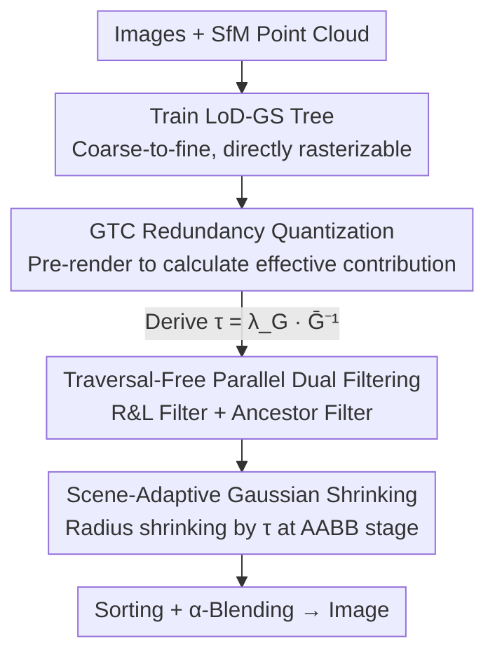

# FilterGS: Traversal-Free Parallel Filtering and Adaptive Shrinking for Large-Scale LoD 3D Gaussian Splatting

**Conference**: CVPR 2026  
**Paper**: [CVF Open Access](https://openaccess.thecvf.com/content/CVPR2026/html/Wang_FilterGS_Traversal-Free_Parallel_Filtering_and_Adaptive_Shrinking_for_Large-Scale_LoD_CVPR_2026_paper.html)  
**Code**: https://github.com/xenon-w/FilterGS  
**Area**: 3D Vision  
**Keywords**: 3D Gaussian Splatting, Level-of-Detail, Large-scale rendering acceleration, Parallel filtering, Redundant key-value pair pruning  

## TL;DR
FilterGS eliminates the two main bottlenecks in large-scale LoD 3DGS rendering—serial layer-by-layer traversal for Gaussian selection and massive invalid Gaussian-tile key-value pairs—by utilizing "Traversal-Free Parallel Dual Filters" and "Adaptive Gaussian Shrinking based on scene crowding." It achieves nearly 300 FPS (significantly surpassing the second-best method) across six large-scale scenes while maintaining reconstruction quality comparable to SOTA.

## Background & Motivation
**Background**: 3DGS employs a collection of anisotropic 3D Gaussian primitives for explicit scene representation and achieves real-time rendering via differentiable rasterization. However, in large-scale scenarios (kilometer-level, tens of millions of Gaussians), the primitive count explodes, making full rasterization computationally prohibitive. Consequently, mainstream approaches adopt Level-of-Detail (LoD) strategies, organizing scenes into coarse-to-fine Gaussian trees and selecting a subset of Gaussians that satisfy viewpoint-dependent accuracy for each frame (e.g., Octree-GS, FLoD, LoG, Hierarchical-GS).

**Limitations of Prior Work**: The authors' empirical tests reveal that while LoD methods control the number of rendered Gaussians, they are slowed down by two factors. First is the **expensive hierarchical traversal**: incrementally checking radius or child-node criteria from the root to select Gaussians incurs a time cost that grows linearly with tree depth, sometimes exceeding 60% of total rendering time. Methods like neural-Gaussian are even slower due to attribute fetching from neighbors. Second is the **redundant Gaussian-tile key-value pairs**: the multi-layer LoD structure generates massive pairs in the rasterization frontend, where over 70% contribute almost nothing to the final image. Although skipped during $\alpha$-blending, they still incur full costs for sorting and preprocessing.

**Key Challenge**: Existing mitigation methods are inadequate. **Fixed-threshold shrinking** (like FlashGS) fails to prune sufficiently in large-scale scenes, leaving numerous redundant pairs. Meanwhile, learning-based per-Gaussian shrinking coefficients cause hierarchical switching artifacts and overfitting on LoD trees because node sizes across layers vary dramatically, making it difficult for a single learned coefficient to handle such heterogeneity.

**Goal**: To simultaneously eliminate "serial traversal overhead" and "redundant key-value pair overhead" in LoD rendering without quality degradation.

**Key Insight**: The authors make two critical observations: (1) Layer-by-layer traversal is fundamentally constrained by serial dependencies on tree depth $L$. If a single criterion can allow all layers to simultaneously determine "whether to retain a node," the $O(L)$ inter-layer synchronization cost can be reduced to a constant. (2) The redundancy of a Gaussian should be determined by its **effective pixel contribution** to the image; the more crowded a scene, the lower the average contribution, necessitating more aggressive shrinking.

**Core Idea**: Use "Traversal-Free Parallel Dual Filters" to select the unique Gaussian for each branch in one step, then use a shrinking threshold "inversely proportional to scene crowding" to proactively prune redundant key-value pairs.

## Method

### Overall Architecture
FilterGS takes multi-view images of large-scale scenes and SfM point clouds as input, operating in three stages. First, **Training the LoD-GS tree**: Following a recursive construction, child nodes are placed at oriented offsets $o_k\in\{\pm \tfrac{s_{x,v}}{2},\pm \tfrac{s_{y,v}}{2},\pm \tfrac{s_{z,v}}{2}\}$ from the parent $v$ as $\mu_{u_k}=\mu_v+R(q_v)o_k$, with the scale reduced geometrically $s_{u_k}=\gamma s_v$ ($0<\gamma<1$), while orientation, color, and opacity are inherited. Each node is a standard, directly rasterizable Gaussian. Second, **Pre-rendering for shrinking threshold**: A standard 3DGS pipeline is run on all training views to calculate the proposed GTC redundancy metric $\bar G$, deriving a scene-adaptive threshold $\tau=f(\bar G)$. Third, **Formal rendering**: The pre-calculated $\tau$ and the tree model are fed into dual filters to select per-frame Gaussians in parallel. These Gaussians are adaptively shrunk by $\tau$ during AABB formation, significantly reducing redundant pairs before sorting and $\alpha$-blending.

### Key Designs

**1. Traversal-Free Parallel Dual Filtering: Replacing Serial Traversal with Parallel Determination**

This addresses the "hierarchical traversal consuming 60% of rendering time" issue. Traditional LoG/FLoD apply Radius & Child (R&C) rules layer-by-layer starting from level 0, with time $T_{serial}=\sum_{\ell=0}^{L-1}\big(T_{calcu.}(n_\ell)+T_{synch.}\big)$, bound by serial dependencies and inter-layer kernel synchronization. FilterGS splits the decision into two complementary filters that can be applied to all layers simultaneously within a single CUDA kernel.

- **R&L (Radius & Leaf) Filter**: For each Gaussian in the frustum, the screen-space pixel radius $R_{2D}=3\sigma$ (derived from 2D covariance $\Sigma_{2D}$ eigenvalues) is compared against threshold $\tau_R$ (default 3). $R_{2D}\le\tau_R$ indicates the node is fine enough and should be kept. To avoid holes where internal nodes fail the radius check, **all leaf nodes are exempt** and kept at least once to ensure no branch is empty.
- **Ancestor Filter**: Each node $N_{i,j}$ pre-stores an ancestor path $AP_{i,j}$ (an ordered list of indices from parent to root). If an internal node $N_{i^*,j^*}$ passes the R&L filter, all descendant nodes (including exempted leaves) are pruned based on their $AP$. This ensures that "any branch with a qualified coarse node retains only the highest-level Gaussian," eliminating multi-layer redundancy in the same branch.

With parallelization, filtering time becomes $T_{parallel}=T_{synch.}+T_{calcu.}(N)$, which **depends only on the total number of Gaussians $N$ in the frustum and is decoupled from tree depth $L$**, maximizing GPU SIMD concurrency. Crucially, the selected Gaussian set is **identical** to that of serial traversal (same key-value pairs, PSNR, SSIM), achieving speedup without quality loss.

**2. GTC Redundancy Metric: Quantifying Pruning via Effective Pixel Contribution**

This provides the basis for "how aggressively to shrink." The authors define several metrics:

- **Key-Value Pair Contribution (KPC)**: The contribution of Gaussian-tile pair $g_k\to t_i$ is defined as the sum of its weighted opacities across all pixels in the tile: $K^{t_i}_{g_k}=\sum_{j=1}^{B_x\times B_y}\alpha_{ij}T_{ij}$, where $\alpha_{ij}$ is the opacity of $g_k$ at pixel $j$ and $T_{ij}$ is the preceding transmittance. This represents the "actual number of effective pixels affected by $g_k$ in $t_i$"; **KPC < 0.01 marks a redundant pair**.
- **Tile-level GTC**: The average KPC of all Gaussians affecting tile $t_i$: $G_i=\tfrac{1}{n_{gs}}\sum_{j=1}^{n_{gs}}K^{t_i}_{g_j}$. A low $G_i$ indicates "Gaussian crowding," where many primitives contribute negligibly. Truly semi-transparent regions (leaves, fences) maintain higher KPC despite low individual opacity. GTC thus distinguishes **geometric redundancy** from **necessary low-transparency areas**.
- **View/Scene-level**: $\bar G_v=\tfrac{1}{n_{tile}}\sum_j G_j$ averages across tiles, and the scene-level $\bar G$ averages across $N$ views.

**3. Scene-Adaptive Gaussian Shrinking: Inverse Proportionality to Scene Crowding**

This addresses the "fixed-threshold pruning failure" in large scenes. For a 2D Gaussian, the effective radius is shrunk to where opacity decays to threshold $\tau$: $r=\sqrt{2\sigma_{max}\ln(\alpha_0/\tau)}$. The challenge is determining $\tau$. Fixed $\tau=1/255$ is too conservative for crowded scenes. Ours sets $\tau$ to be **inversely proportional** to scene-level GTC:

$$\tau=\lambda_G\cdot\bar G^{-1}$$

where $\lambda_G$ is a scaling factor (0.2 in experiments). Intuitively, $\bar G$ represents the "average contribution budget per Gaussian"; a lower $\bar G$ signifies a more crowded view, justifying a larger $\tau$ for aggressive pruning. Compared to fixed thresholds, GTC captures spatial variance in Gaussian utility, enabling content-aware shrinking for better efficiency-quality trade-offs.

### Loss & Training
Training utilizes the standard 3DGS differentiable rasterization objective without additional loss functions. The LoD tree is trained for 100–300k iterations based on input size, with shrinking factor $\lambda_G=0.2$. Models are trained on A100 (40G) and evaluated on RTX 4090 at 1080p.

## Key Experimental Results

### Main Results
FilterGS was compared against vanilla 3DGS and four LoD methods (H3DGS, FLoD, LoG, OctreeGS) across 6 scenes in MatrixCity, GauUScene, and UrbanScene. FilterGS achieves **SOTA in filtering time $t_f$ and FPS**, with quality comparable to the best methods.

| Scene | Metric | FilterGS | OctreeGS | FLoD | LoG |
|------|------|----------|----------|------|-----|
| Block Small | FPS↑ | **372** | 125 | 245 | 77 |
| Block Small | $t_f$(ms)↓ | **1.14** | 5.13 | 3.04 | 10.46 |
| Block Small | PSNR↑ | 26.31 | 26.43 | 25.06 | 26.52 |
| Sci-Art | FPS↑ | **234** | 83 | 147 | 67 |
| Residence(Urban) | FPS↑ | **297** | 91 | 174 | 66 |
| Modern-Building | FPS↑ | **354** | 120 | 203 | 81 |
| Modern-Building | PSNR↑ | 27.04 | 26.56 | 26.02 | 27.35 |

The filtering time $t_f$ for FilterGS is reduced to ~1ms (1/3 to 1/10 of second-best), FPS is typically more than double that of competitors, and PSNR consistently ranks in the top three, with differences of only 0.1-0.3 from the best.

### Ablation Study
Time cost breakdown (Residence[15], ms) for each module:

| Shrink | Parallel Filter | $T_{calcu.}$ | $T_{synch.}$ | $T_{sort}$ | $T_{alpha}$ | $T_{total}$ | FPS |
|------|---------|-------------|-------------|-----------|-------------|-------------|-----|
| ✗ | ✗ | 3.59 | 7.72 | 1.04 | 2.58 | 15.13 | 66 |
| ✓ | ✗ | 3.59 | 7.80 | 0.61 | 1.69 | 13.96 | 72 |
| ✗ | ✓ | 0.52 | 0.41 | 1.01 | 2.64 | 4.77 | 210 |
| ✓ | ✓ | **0.52** | **0.40** | **0.57** | **1.62** | **3.37** | **297** |

Parallel filtering cuts filtering time ($T_{calcu.}+T_{synch.}$) by 90%+ and inter-layer synchronization by 95%, independently boosting FPS by +218% (66→210). Adaptive shrinking reduces sorting and $\alpha$-blending by ~40% each by decreasing key-value pairs, adding another +20% to FPS.

### Key Findings
- **Parallel Filtering is the Primary Speedup**: It single-handedly improves FPS from 66 to 210. Serial traversal bottlenecks occur due to inter-layer synchronization and GPU underutilization when processing fewer Gaussians. Even with depth $L=5$, LoG's serial filtering takes 3.6x longer than the proposed method.
- **Minimal Quality Cost for Shrinking**: In both vanilla 3DGS and FilterGS, shrinking provides a stable ~20% FPS gain with only ~1% PSNR loss. It prunes 75% of residual redundant pairs in FilterGS.
- **$\lambda_G$ Sensitivity**: A good balance is found in the $[0.03, 0.2]$ range. $\lambda_G=0.2$ trades 1% PSNR for 20% frame rate.
- **Failure Cases**: When $\lambda_G$ is too high, tile boundaries become visible in low-frequency areas (roads, sand) because the low-contribution Gaussians responsible for smooth inter-tile transitions are aggressively pruned. High-frequency areas (building facades, leaves) are unaffected.
- **Value**: The ancestor path index introduces approximately 20% memory overhead (1.61GB to 6.33GB total model size), which is considered a worthwhile trade-off for significant speedups.

## Highlights & Insights
- **Reframing "Serial Traversal" as "All-Layer Parallel"**: Combining R&L ("keep if fine enough") and Ancestor Filter ("delete if a coarser ancestor exists") is equivalent to serial traversal selection but reduces $O(L)$ dependency to a depth-independent constant—with a proof of mathematical identity in the resulting set.
- **GTC Quantifies Redundancy via Effective Pixel Contribution**: $KPC=\sum{\alpha T}$ reuses standard $\alpha$-blending variables, offering a clear physical meaning and distinguishing geometric redundancy from necessary low-transparency structures like leaves.
- **Content-Aware Shrinking via $\tau\propto\bar G^{-1}$**: Pruning more aggressively in crowded areas is more robust than fixed thresholds or learning per-Gaussian coefficients, as it avoids fragility to LoD tree heterogeneity. This "global statistic-driven pruning" logic is transferable to other adaptive scene tasks.

## Limitations & Future Work
- **Memory Overhead**: The ancestor path index increases memory usage by ~20%, reaching 6.33GB for large scenes—a recognized trade-off for speed.
- **Low-Frequency Tile Boundaries**: Aggressive shrinking can cause visible artifacts in roads or sand. $\lambda_G$ currently requires manual tuning rather than automatic selection.
- ⚠️ **Representation Dependency**: The method relies on "nodes as complete Gaussians." Its applicability to neural-Gaussian LoD (which requires decoding neighbor attributes) is not explored.
- Evaluation is concentrated on kilometer-level urban/aerial scenes; generalization to indoor or dynamic scenes remains unverified.

## Related Work & Insights
- **vs LoG / FLoD (Serial LoD Traversal)**: These apply R&C rules layer-by-layer; synchronization accounts for 40%+ of rendering time. FilterGS decouples this from depth, reducing synchronization by 95% for 3.6x speedup with identical results.
- **vs FlashGS (Fixed-Threshold Shrinking)**: FlashGS uses fixed $\tau=1/255$, which is insufficient for crowded areas; FilterGS uses adaptive $\tau$ to prune 75% more redundant pairs.
- **vs Learning-based Shrinking**: Learning per-Gaussian coefficients on LoD trees causes artifacts due to scale differences across layers; FilterGS uses a single global statistic $\bar G$ to drive stable shrinking.

## Rating
- Novelty: ⭐⭐⭐⭐ Parallel dual-filtering and GTC adaptive shrinking target real LoD 3DGS bottlenecks with clever, provably lossless designs.
- Experimental Thoroughness: ⭐⭐⭐⭐ Comprehensive comparison across 3 datasets and 6 scenes, with detailed time breakdowns and parameter sweeps.
- Writing Quality: ⭐⭐⭐⭐ Clear bottleneck identification and well-structured derivation of the GTC metric.
- Value: ⭐⭐⭐⭐ Achieves nearly 300 FPS large-scale LoD rendering with identical quality, offering significant direct engineering value.

<!-- RELATED:START -->

## Related Papers

- [\[CVPR 2026\] BA-GS: Bayesian Adaptive Gaussian Splatting for SFM-Free 3D Reconstruction](ba-gs_bayesian_adaptive_gaussian_splatting_for_sfm-free_3d_reconstruction.md)
- [\[CVPR 2026\] E2EGS: Event-to-Edge Gaussian Splatting for Pose-Free 3D Reconstruction](e2egs_event-to-edge_gaussian_splatting_for_pose-free_3d_reconstruction.md)
- [\[CVPR 2026\] AeroGS: Scale-Aware Gaussian Splatting for Pose-Free Dynamic UAV Scene Reconstruction](aerogs_scale-aware_gaussian_splatting_for_pose-free_dynamic_uav_scene_reconstruc.md)
- [\[CVPR 2026\] Prune Wisely, Reconstruct Sharply: Compact 3D Gaussian Splatting via Adaptive Pruning and Difference-of-Gaussian Primitives](prune_wisely_reconstruct_sharply_compact_3d_gaussian_splatting_via_adaptive_prun.md)
- [\[CVPR 2026\] Learning Differentiable Hierarchies in 3D Gaussian Splatting](learning_differentiable_hierarchies_in_3d_gaussian_splatting.md)

<!-- RELATED:END -->
