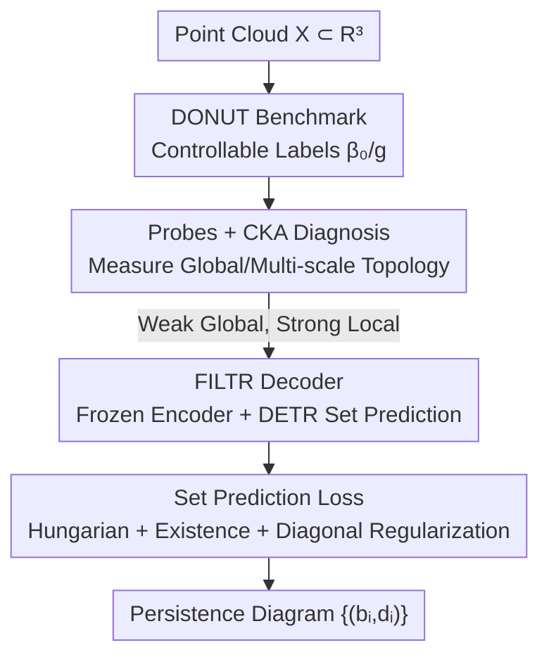

# FILTR: Extracting Topological Features from Pretrained 3D Models

**Conference**: CVPR 2026  
**Paper**: [CVF Open Access](https://openaccess.thecvf.com/content/CVPR2026/html/Martinez_FILTR_Extracting_Topological_Features_from_Pretrained_3D_Models_CVPR_2026_paper.html)  
**Code**: https://filtr-topology.github.io/  
**Area**: 3D Vision  
**Keywords**: Topological Data Analysis, Persistence Diagrams, Point Cloud Encoders, Set Prediction, DETR  

## TL;DR
This paper first probes "how much topology pretrained 3D point cloud encoders actually understand" using DONUT, a synthetic dataset with topological labels. The findings reveal that while encoders have weak understanding of global topology (connected components, genus), they possess implicit perception of multi-scale structures. Subsequently, the authors propose FILTR—the first set-prediction model that adapts DETR to predict persistence diagrams directly from frozen encoder features, transforming persistence diagram extraction from a classical algorithm into a learnable, one-step feed-forward process integrable with other networks.

## Background & Motivation
**Background**: Transformer-based 3D point cloud encoders, such as Point-BERT, Point-MAE, PointGPT, and PCP-MAE, are self-supervisedly pretrained on large-scale data via masked reconstruction or semantic alignment, showing strong performance in geometric and semantic downstream tasks. In parallel, persistence diagrams in Topological Data Analysis (TDA) provide concise characterizations of a shape's multi-scale structure and have proven highly informative in fields like protein research, materials science, and geosciences.

**Limitations of Prior Work**: These two research lines rarely intersect. On one hand, it remains unknown **whether or where** topological information is encoded within these features, as their training loss functions never explicitly encourage topological awareness. On the other hand, obtaining persistence diagrams relies on classical algorithms ($\alpha$-filtration, Vietoris-Rips), which are **decoupled** from end-to-end learning pipelines, computationally expensive, and cannot be jointly optimized with downstream networks.

**Key Challenge**: Topological invariants (number of connected components $\beta_0$, genus $g$) are **global and deformation-invariant** quantities, making them difficult to infer from local features. Since current encoders process point clouds by partitioning them into patches, they are inherently local-biased. Whether global topology exists in encoder features remains an open and difficult-to-measure question, hindered by the lack of datasets with topological labels and protocols to align persistence diagrams (unordered, variable-length point sets) with feature vectors.

**Goal**: This paper aims to solve two sub-problems: (1) Quantify the amount of topological information captured by pretrained 3D encoder features; (2) Develop an estimator that directly performs feed-forward estimation of persistence diagrams based on this analysis.

**Key Insight**: Instead of treating persistence diagrams as downstream inputs (the mainstream TDA+ML approach), the authors treat the **persistence diagram as a prediction target**. This allows for measuring the topological information captured by the encoder while providing an efficient, differentiable topological extractor compatible with other architectures.

**Core Idea**: The authors first diagnose the topological capabilities of encoders using "Probing + CKA." They then formalize persistence diagram prediction as a **set prediction** problem, utilizing DETR's query mechanism, cross-attention, and Hungarian matching to solve persistence diagrams from frozen encoder features.

## Method

### Overall Architecture
The paper follows a two-stage "Diagnosis-then-Construction" framework. The first stage (Diagnosis) asks "Do 3D encoders understand topology?" For this, they created **DONUT**, a synthetic dataset with controllable topological labels. They probe it using two complementary methods: **Linear Probes** for global quantities ($\beta_0, g$) and **CKA Alignment** for multi-scale similarity between features and vectorized diagrams. Conclusion: Global signals are weak, but non-trivial CKA alignment reveals implicit perception of multi-scale structures. The second stage (Construction) follows the logic of extracting these signals by proposing **FILTR**: freezing a 3D encoder as a feature extractor and attaching a DETR-adapted decoder to solve the persistence diagram as an unordered set of points $\{(b_i,d_i)\}$, trained with a loss comprising Hungarian matching, existence probability, and diagonal regularization.

### Key Designs

**1. DONUT Benchmark: Creating a synthetic dataset with controllable topology and diverse geometry**

Diagnosis requires ground-truth topological labels, which existing datasets lack. ShapeNet/ModelNet are organized by semantics without topological annotations. ABC and Thingi10K often contain single components or non-manifold meshes, leading to unreliable invariants. The authors built DONUT (Dataset Of maNifold strUctures), where each sample consists of 1–6 connected components ($\beta_0$) as manifold meshes with a total genus $g$ ranging from 0 to 10. The dataset includes 29,517 objects with balanced label distributions (Fig. 3) to avoid bias. Diversity is achieved by combining parametric shapes (cones, tori, etc.) and applying **topology-preserving geometric transformations** to ensure the task remains difficult and cannot be solved by simple retrieval-based shortcuts.

**2. Probing + CKA Dual Diagnosis: Quantifying "how much topology the encoder knows" from two complementary perspectives**

Two orthogonal probes are used. **Linear Probes** freeze the encoder and add two independent linear layers to each Transformer block output to predict $\beta_0$ and $g$ via cross-entropy. Layer-wise probing reveals where topological information is strongest—generally in deeper blocks, though overall accuracy remains low. **CKA Alignment** (Centered Kernel Alignment) is a **non-parametric** measure of similarity between encoder features and $H_1$ persistence diagrams. Diagrams are vectorized in multiple ways (Betti curves, Landscapes, Silhouette, Top-128, and ATOL) before calculating CKA. While probes test if global invariants are linearly readable, CKA tests if multi-scale structures are implicitly present. The diagnosis concludes that global signals are weak, but stable CKA alignment (especially in Point-MAE) suggests local signals are preserved.

**3. FILTR Decoder: Transforming persistence diagram prediction into DETR-style set prediction**

Since encoders preserve useful local geometric structures, FILTR uses a non-linear decoder to "mine" persistence diagrams. A persistence diagram of dimension $q$ is treated as a set of pairs $\{(b_i,d_i)\}_{i=1}^{M}$. This is formulated as a set prediction problem using the DETR architecture. The input is point cloud features, targets are persistence pairs, and 2D positional encodings are replaced with 3D patch centers. Significantly, the **encoder is frozen and not trained end-to-end**.

Specifically, the frozen 3D backbone encodes the point cloud into patch features $F=\{f_i\}$. The decoder takes $N$ learnable queries which interact with encoder features via cross-attention. Two MLP heads output persistence logits $(\hat{p}_i^{(1)},\hat{p}_i^{(2)})$ and existence logits $\hat{l}_i$. Persistence pairs are derived as $\hat{b}_i=\sigma(\hat{p}_i^{(1)})$ and $\hat{d}_i=\hat{b}_i+\mathrm{softplus}(\hat{p}_i^{(2)})$, where the softplus ensures the $d>b$ constraint. Unlike methods that hard-code homology calculations, FILTR is entirely data-driven and computationally lightweight.

**4. Set Prediction Loss: Hungarian Matching + Existence + Diagonal Regularization**

While the 2-Wasserstein loss is a natural choice for diagrams, it proved unstable for point clouds with large sets of pairs ($>10^2$). FILTR uses a cumulative loss:

$$L = \mu_{recon}L_{recon} + \mu_{exist}L_{exist} + \mu_{diag}L_{diag}.$$

Hungarian matching finds the optimal assignment $\pi^*$ between $N$ predictions and $M$ targets using a cost $L_{match}$ considering both coordinate distance and existence scores. The reconstruction loss $L_{recon}$ is the MSE over matched pairs. The existence loss uses BCE. The diagonal regularization pushes all unmatched predictions toward the diagonal $\Delta$: $L_{diag}=\frac{1}{N-M}\sum_{i=M+1}^{N}(\hat{d}_i-\hat{b}_i)^2$. This design makes the prediction robust and renders thresholding nearly optional during inference.

### Loss & Training
Models are trained on 23K DONUT meshes, each sampled with 1024 points. $H_1$ persistence diagrams are calculated via $\alpha$-filtration, keeping the top 10% most persistent pairs for noise reduction. Input features have two variants: using only the last encoder layer (L) or the sum of all block features (C).

## Key Experimental Results

### Main Results: Topological awareness of encoders (Probe Accuracy)
Linear probes were tested on frozen pretrained encoders (best layer reported) and compared to backbones trained from scratch.

| Model | Component Acc | Genus Acc | Description |
|------|------|------|------|
| PointGPT | 43.8 | 22.5 | Worst among pretrained |
| Point-MAE | 50.0 | 23.1 | MAE-based |
| PCP-MAE | 51.4 | 24.8 | Current SOTA reconstruction |
| Point-BERT (Patch) | 51.5 | 22.8 | — |
| **Point-BERT (CLS)** | **57.2** | **25.9** | Best among pretrained |
| PointNet (Scratch) | 53.2 | 20.4 | Baseline |
| PointNet++ (Scratch) | 75.7 | 51.0 | — |
| DGCNN (Scratch) | 80.8 | 43.5 | — |
| **RepSurf (Scratch)** | **83.3** | **57.7** | Best end-to-end (Surface features) |

Key Findings: Pretrained encoders show low topological accuracy, with the best (Point-BERT CLS) barely outperforming a simple PointNet. End-to-end models like RepSurf lead significantly, suggesting current 3D pretraining strategies do not strongly encode global topology.

### FILTR Persistence Diagram Reconstruction (W2 / dB / PIE, lower is better)
Models trained on DONUT and evaluated on DONUT (hold-out), ModelNet40, and ABC.

| Feature Extractor | DONUT W2(×10⁻²) | DONUT dB(×10⁻³) | DONUT PIE | ModelNet40 W2 | ABC W2 |
|------|------|------|------|------|------|
| Point-MAE (C) | **16.02** | 9.838 | 1.214 | 47.26 | 47.99 |
| Point-BERT (L) | 16.18 | 9.901 | 1.371 | 43.04 | 43.37 |
| PointGPT (C) | 17.59 | 10.08 | 1.289 | 48.89 | 40.47 |
| PointGPT (L) | 17.86 | 10.03 | 1.192 | 39.80 | 40.19 |
| DGCNN (Scratch) | 16.62 | 10.15 | 1.213 | 43.27 | 45.21 |
| PointNet (Scratch) | 24.85 | 10.61 | 1.442 | 51.32 | 57.44 |
| PointNet++ (Scratch) | 39.37 | 13.64 | 10.39 | 78.86 | 95.39 |

Key Findings: FILTR with frozen encoders **matches or exceeds** end-to-end baselines with significantly fewer trainable parameters. Interestingly, PointGPT and Point-BERT, which performed poorly in probes, show stronger generalization on out-of-distribution data (ModelNet40/ABC).

### Key Findings
- **Probe vs. FILTR Performance**: Encoders do not linearly expose topology (poor probes), but preserve useful local geometry (CKA alignment), which FILTR's non-linear decoder can extract.
- **Metric Insights**: W2 reflects overall quality, dB is sensitive to worst-case outliers, and PIE is dominated by high-persistence points. 
- **Generalization**: Using frozen pretrained backbones allows FILTR to migrate to unseen distributions, a practical advantage over end-to-end scratch models.

## Highlights & Insights
- **Operational Diagnosis Protocol**: The combination of probes (global) and CKA (multi-scale) provides a systematic way to quantify topological awareness in 3D encoders.
- **Inverted Perspective**: Unlike traditional TDA+ML that uses diagrams as inputs, this paper treats diagrams as outputs, creating a differentiable, feed-forward extractor.
- **Clean DETR Adaptation**: The mapping between object detection and topological pair prediction is well-executed, including the softplus constraint for $d>b$ and diagonal regularization for stability.
- **Transferable Paradigm**: The "Frozen Foundation Model + Lightweight Set-Prediction Head" paradigm can be applied to other tasks involving variable-length unordered sets.

## Limitations & Future Work
- The method is inherently limited by the **availability and quality of pretrained encoders**.
- Global topological probe accuracy is low, possibly because global invariants are inherently difficult to infer from local features or due to the synthetic-to-real gap.
- The paper focus on $H_1$ diagrams and $\alpha$-filtration; higher-dimensional features are not fully explored in the main text.
- Future work: Extending analysis to multimodal foundation models to see how other modalities might encode structural/relational information.

## Related Work & Insights
- **vs. Classical TDA Estimation**: Classical methods are precise but slow and decoupled from learning; FILTR provides a fast approximation compatible with end-to-end architectures.
- **vs. Diagram Vectorization**: Methods like ATOL or Landscapes convert diagrams into vectors for **input**; this work uses them as **output targets**.
- **vs. Graph Persistence Prediction**: Unlike methods that hard-code homology steps into graph networks, FILTR is data-driven and utilizes set prediction losses for scalability on large point cloud diagrams.
- **vs. DETR/Set Prediction**: While DETR trains end-to-end, FILTR is lightweight, freezing the encoder and training only the decoder.

## Rating
- Novelty: ⭐⭐⭐⭐⭐ First systematic measure of 3D encoder topology and first feed-forward diagram predictor from frozen features.
- Experimental Thoroughness: ⭐⭐⭐⭐ Comprises probes/CKA/reconstruction across three datasets; however, high-dimensional topology is relegated to the appendix.
- Writing Quality: ⭐⭐⭐⭐⭐ Clear "Diagnosis-then-Construction" narrative with detailed metric analysis.
- Value: ⭐⭐⭐⭐ Establishes the DONUT benchmark and FILTR extractor for the TDA × 3D Representation Learning intersection.

<!-- RELATED:START -->

## Related Papers

- [\[CVPR 2026\] TopoMesh: High-Fidelity Mesh Autoencoding via Topological Unification](topomesh_high-fidelity_mesh_autoencoding_via_topological_unification.md)
- [\[CVPR 2026\] SE(3)-Equivariance with Geometric and Topological Guidance for Category-Level Object Pose Estimation](se3-equivariance_with_geometric_and_topological_guidance_for_category-level_obje.md)
- [\[CVPR 2026\] SGSoft: Learning Fused Semantic-Geometric Features for 3D Shape Correspondence via Template-Guided Soft Signals](sgsoft_learning_fused_semantic-geometric_features_for_3d_shape_correspondence_vi.md)
- [\[CVPR 2026\] Content-Aware Frequency Encoding for Implicit Neural Representations with Fourier-Chebyshev Features](content-aware_frequency_encoding_for_implicit_neural_representations_with_fourie.md)
- [\[ICLR 2026\] A Scene is Worth a Thousand Features: Feed-Forward Camera Localization from a Collection of Image Features](../../ICLR2026/3d_vision/a_scene_is_worth_a_thousand_features_feed-forward_camera_localization_from_a_col.md)

<!-- RELATED:END -->
