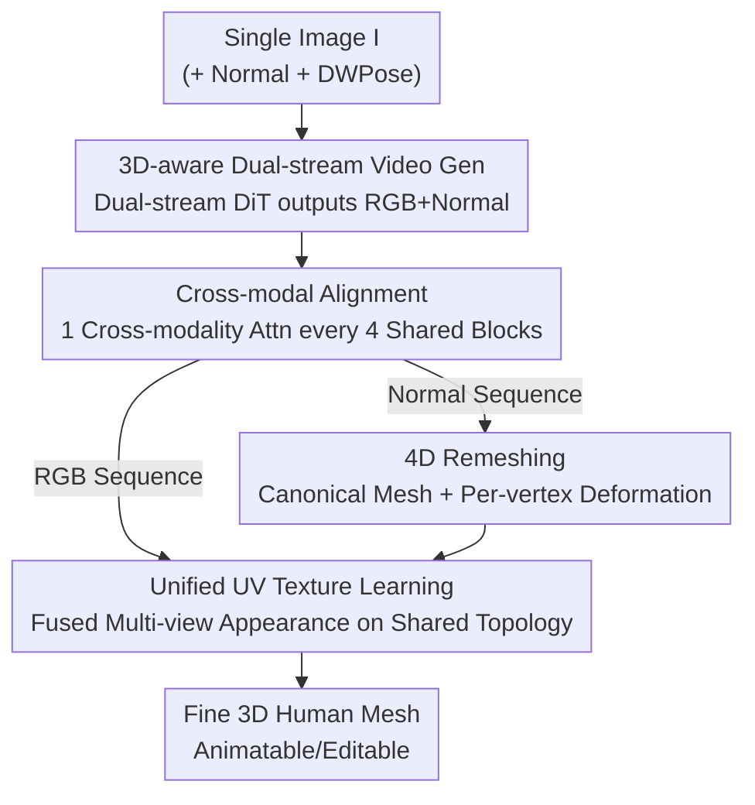

# FISHuman: Fine-grained Single-image 3D Human Reconstruction via Multi-view 4D Remeshing

**Conference**: CVPR 2026  
**Paper**: [CVF Open Access](https://openaccess.thecvf.com/content/CVPR2026/html/Liu_FISHuman_Fine-grained_Single-image_3D_Human_Reconstruction_via_Multi-view_4D_Remeshing_CVPR_2026_paper.html)  
**Code**: None  
**Area**: 3D Vision  
**Keywords**: Single-image human reconstruction, multi-view video diffusion, 4D Remeshing, vertex deformation, unified UV texture  

## TL;DR
FISHuman utilizes a "3D-aware dual-stream video diffusion model" to expand a single photo into multi-view aligned RGB+normal sequences. It then employs a "4D Remeshing" module to transform pixel drifts from **inconsistent** multi-view frames into controllable per-vertex deformations. This allows for the reconstruction of 3D humans with fine geometry, realistic textures, and animation-ready meshes from a single image, outperforming SOTAs like PSHuman and Human3Diffusion in geometry and appearance metrics on 2K2K / Sizer.

## Background & Motivation
**Background**: Mainstream single-image 3D human reconstruction follows two paths. One consists of pixel-aligned implicit functions (PIFu / ECON) or explicit human priors (SMPL). The other leverages 2D multi-view diffusion models to generate auxiliary views for 3D reconstruction (PSHuman, SiTH, etc.).

**Limitations of Prior Work**: Implicit/SMPL-based methods produce severe artifacts in regions not visible from the input view (self-occlusion, back side). Multi-view diffusion methods are limited by memory and architecture, typically generating only **sparse** views with insufficient coverage of occluded areas. Furthermore, generated views **lack explicit 3D constraints** and are inconsistent; direct reconstruction from these views leads to distorted geometry and blurred textures. Some methods (Human3Diffusion) use native 3D generators (transformers/diffusion) to enforce consistency but suffer from limited resolution and poor generalization.

**Key Challenge**: Generated multi-view frames are inherently "inconsistent" (color perturbations, pose jitter, spatial misalignment). Naive 3D reconstruction forces the model to **average these conflicting supervisory signals**, resulting in smoothed-out geometry and blurred textures. Consistency and fine detail are in conflict during the "2D generated frames $\to$ 3D reconstruction" step.

**Goal**: To produce **production-ready** (extractable mesh, riggable, editable) fine 3D humans from a single image, achieving high-fidelity appearance, detailed geometry, and cross-style generalization.

**Key Insight**: Instead of pursuing "absolute consistency" between generated frames (which is unachievable), it is better to acknowledge their inconsistency and **explicitly model pixel-level drift as dynamic vertex deformations**. By learning a set of offsets for each view on a globally shared canonical mesh, conflicting signals are no longer averaged but decoupled into "shared geometry + view-dependent details."

**Core Idea**: Use "3D-aware dual-stream video diffusion" to generate dense aligned RGB+normal sequences as priors, followed by "4D Remeshing" to convert multi-view inconsistencies into a joint optimization of a canonical mesh and per-view deformation fields. Finally, a unified UV texture is learned on the shared topology.

## Method

### Overall Architecture
Given a single image $I$, FISHuman produces a textured 3D mesh in two main stages. The first stage is **3D-aware dual-stream video generation**: taking the reference RGB image, its estimated normal map, and 2D poses extracted by DWPose as conditions, it feeds them into a dual-stream DiT fine-tuned on multi-view renderings of synthetic 3D humans. This generates an arbitrary number of cross-modally aligned multi-view RGB sequences $\mathcal{F}^{rgb}_{1:T}$ and normal sequences $\mathcal{F}^{norm}_{1:T}$ (view changes are treated as rigid body rotations). The second stage is **Dynamic 3D Human Carving**, consisting of two steps: using **4D Remeshing** to reconstruct topology-consistent geometry from inconsistent normal sequences, and performing **Unified UV Texture Learning** on the shared topology to fuse multi-view appearances. The deformation mesh corresponding to the front view is taken as the final output asset.

### Key Designs

**1. 3D-aware Dual-stream Video Diffusion: Simultaneous Output of Aligned RGB and Normal**

To address the limitations of sparse views and lack of 3D consistency in multi-view diffusion, the authors fine-tuned a dual-stream DiT based on the Wan2.1 image-to-video model. By treating "rotating the camera around the human" as the video timeline, it generates an **arbitrary number** of coherent multi-view frames, providing denser coverage than sparse view methods. It deliberately **avoids** using SMPL-X conditions (since monocular 3D pose estimation is often inaccurate), relying instead on the model's own 3D prior to infer reasonable novel view poses. The target distribution is $p(\mathcal{F}^{rgb}_{1:T}, \mathcal{F}^{norm}_{1:T} \mid \mathbf{c}^{rgb}_{ref}, \mathbf{c}^{norm}_{ref}, \mathbf{c}^{pose})$. Structurally, it uses dual streams: RGB and Normal have dedicated head/tail transformer blocks for domain modulation, while middle layers are shared for cross-modal fusion. LoRA is injected into all attention linear layers to enable "multi-view 3D awareness + dual-stream differentiation" while preserving the base model's generative power. Reference images can optionally be reposed to a canonical A-pose to reduce self-occlusion.

**2. Cross-modal Alignment: Forcing RGB and Normal to "Grow Together"**

To prevent structural misalignment between parallel RGB and Normal streams—which causes texture-geometry bleeding in reconstruction (especially at silhouettes and surface details)—the authors replace one out of every four shared DiT blocks with a **cross-modal attention module**. In this module, RGB and Normal tokens are **concatenated** before standard self-attention, forcing correlations between domains. In the cross-attention layer, they are split back to their respective streams. This injects "strong coupling supervision," ensuring body outlines and clothing wrinkles remain aligned across modalities, eliminating reconstruction artifacts from unaligned multi-view guidance.

**3. 4D Remeshing: Decoupling Inconsistency into "Canonical Mesh + Per-view Vertex Deformation"**

This is the core of the paper, addressing the issue where video models lack explicit 3D constraints, causing naive reconstruction to average conflicting signals and distort geometry. Inspired by dynamic scene reconstruction, the geometry is split into two parts: ① A **canonical mesh**, encoding shared structures across all views; ② A **dynamic deformation field**, capturing view-dependent instantaneous surface details.

The canonical mesh is optimized via continuous explicit remeshing: vertex positions are optimized through differentiable rendering under normal map supervision, with topology maintained via edge split/collapse/flip operations. Adaptive vertex density is controlled by an estimated optimal edge length. View-dependent deformation is provided by an MLP $\Psi_d$, taking canonical vertex coordinates and view embeddings as input to output vertex offsets: $\delta x_i = \Psi_d(\gamma(x_c), \gamma(i))$, where $\gamma(\cdot)$ is positional encoding and $i$ is the view index (0 for front). Crucially, $x_c$ is **detached** before being fed into the MLP, ensuring the deformation module only learns "view-dependent changes" without interfering with the global canonical geometry optimization—this is where the "decoupling" is implemented.

During joint optimization, the canonical mesh is initialized with static remeshing, followed by iterative updates of canonical positions and the deformation field. The deformed vertices for view $v_i$ are $x^i_d = x_c + \delta x_i$. Normal maps $\hat{\mathcal{N}}_i$ and masks $\hat{\mathcal{S}}_i$ are rendered via differentiable rasterization, using the following loss:
$$L_{rec} = \lVert \hat{\mathcal{N}}_i - \mathcal{F}^{norm}_{i} \rVert_1 + \lVert \hat{\mathcal{S}}_i - \mathcal{S}_i \rVert_1.$$
Additional terms include Laplacian smoothing $L_{lap}$ and an ARAP (as-rigid-as-possible) loss. ARAP constrains the distance between deformed vertex pairs across two random views to be as equal as possible, forcing the deformation network to learn **near-rigid** dynamics and preventing geometric distortion under single-view normal guidance. The total geometric objective is $L_{geo} = L_{rec} + \lambda_{lap}L_{lap} + \lambda_{arap}L_{arap}$.

**4. Unified UV Texture Representation: Fusing Multi-view RGB into a Conflict-free Texture**

RGB frames also exhibit multi-view inconsistency. However, since all deformed meshes are derived from the canonical mesh, they **share the same topology**. This allows learning a unified UV texture map $\mathcal{T}$ to fuse appearances. $\mathcal{T}$ is initialized from noise. For view $v_i$, the deformed mesh $M_i$ is used for differentiable rendering to obtain $\hat{C}_i = R(M_i, \mathcal{T}, v_i)$. The pixel loss is $L_{rgb} = w_i \lVert \hat{C}_i \cdot S_i - \mathcal{F}^{rgb}_i \cdot S_i \rVert_2$, where head/back views receive higher weights $w_i$. A total-variation loss $L_{tv}$ smoothens the texture, making the total loss $L_{tex} = L_{rgb} + \lambda_{tv}L_{tv}$. Because texture optimization is performed on top of aligned geometric deformations, it effectively utilizes the geometric prior to eliminate artifacts caused by RGB inconsistency.

### Loss & Training
- **Geometry Stage**: $L_{geo} = L_{rec} + \lambda_{lap}L_{lap} + \lambda_{arap}L_{arap}$, with $\{\lambda_{lap}, \lambda_{arap}\} = \{0.4, 0.03\}$.
- **Texture Stage**: $L_{tex} = L_{rgb} + \lambda_{tv}L_{tv}$, with $\lambda_{tv}=0.5$.
- **Progressive Two-stage Training (Video Gen)**: First, use domain-specific attention to establish view consistency, then introduce cross-modal attention for alignment. Cross-modal attention is randomly dropped (30%) during training to prevent over-fusion.
- **Optimization Flow**: 300 steps of pure canonical initialization, 200 steps of joint optimization with the deformation field, and 500 steps of unified texture optimization after UV unwrapping with Xatlas. Inference times on an A6000: Video Gen ~5 min / 4D Remeshing ~2 min / Texture ~10 sec.

## Key Experimental Results

### Main Results
On 2K2K (100 subjects) and Sizer (50 subjects) for arbitrary pose reconstruction, using CD / P2S / NC for geometry and PSNR / SSIM / LPIPS for appearance. FISHuman outperforms all baselines across **all six metrics on both datasets** (Note: Human3Diffusion's training set includes 2K2K, yet it was still surpassed).

| Dataset | Metric | Ours | Prev. SOTA (Baseline) | Gain |
|--------|------|------|----------------|------|
| 2K2K | CD (cm) ↓ | **0.817** | 1.052 (Human3Diffusion) | -0.235 |
| 2K2K | P2S (cm) ↓ | **0.778** | 1.062 (PSHuman) | -0.284 |
| 2K2K | NC ↑ | **0.858** | 0.828 (PSHuman) | +0.030 |
| 2K2K | PSNR ↑ | **24.49** | 23.35 (Human3Diffusion) | +1.14 |
| 2K2K | LPIPS ↓ | **0.086** | 0.104 (Human3Diffusion) | -0.018 |
| Sizer | CD (cm) ↓ | **1.243** | 1.331 (Human3Diffusion) | -0.088 |
| Sizer | NC ↑ | **0.768** | 0.753 (PSHuman) | +0.015 |
| Sizer | PSNR ↑ | **20.38** | 19.61 (PSHuman) | +0.77 |

### Ablation Study
Verifying core modules on appearance metrics (2K2K setup):

| Config | PSNR ↑ | SSIM ↑ | LPIPS ↓ | Description |
|------|--------|--------|---------|------|
| w/o CMA | 23.14 | 0.9064 | 0.1015 | No cross-modal alignment (RGB/Normal misalignment) |
| w/o 4DR | 23.87 | 0.9142 | 0.0970 | No 4D Remeshing (degrades to static reconstruction) |
| Full model | **24.49** | **0.9173** | **0.0858** | Complete model |

### Key Findings
- **Cross-modal Alignment (CMA) provides the largest contribution**: Removing it drops PSNR from 24.49 to 23.14 (-1.35), showing it is the most critical component for quality.
- **4D Remeshing (4DR) is key for geometric robustness**: Static remeshing variants fail on exaggerated poses, causing surface cracks and loss of facial detail.
- **Progressive Training (PT) is essential**: Directly training both streams together leads to degradation (noise in unseen areas).
- **Challenging Scenarios**: While PSHuman suffers from distortions in human-object occlusions or rare back-view poses, FISHuman correctly reconstructs these using dense coherent video guidance.

## Highlights & Insights
- **"Acknowledge inconsistency, then explicitly model it"**: Instead of trying to force multi-view consistency, this work treats pixel drifts as 4D deformations, decoupling conflicting signals.
- **Detaching canonical vertices**: Detaching $x_c$ before the MLP ensures the deformation network only learns view-dependent offsets without polluting the global geometry.
- **Shared topology enables unified UV**: Since deformations are just offsets on a canonical mesh, all views share the same topology, making texture fusion seamless without extra registration.
- **Robustness without SMPL-X**: The decision to rely on 2D DWPose + 3D priors instead of error-prone monocular SMPL-X estimation improves generalization to rare poses.

## Limitations & Future Work
- Small training scale: The 3D-aware video generator was fine-tuned on only **1,559** high-quality scans from THuman2.1. ⚠️
- Heavy dependence on Stage 1: Errors in the video generation (e.g., severe self-occlusion) propagate to the 4D remeshing stage.
- Per-instance optimization: The 7-minute optimization flow is not real-time.
- ARAP assumes "near-rigid" dynamics, which may struggle with extremely loose/drifting cloth. ⚠️
- No code link provided yet; reproducibility is unconfirmed.

## Related Work & Insights
- **vs PSHuman**: PSHuman uses SMPL-X guided sparse multi-view diffusion, which suffers from estimation errors. FISHuman's dense video guidance + no-SMPL approach is superior in challenging scenarios.
- **vs Human3Diffusion**: Human3Diffusion uses 3DGS, resulting in limited resolution and unstructured meshes. FISHuman outputs standard textured meshes and outperforms it even on its own training set (2K2K).
- **vs Universal 3D Gen (StdGen/Hunyuan3D 2.0)**: These methods often lose the identity of the reference human; FISHuman is much closer to reality in appearance and geometric sharpness.

## Rating
- Novelty: ⭐⭐⭐⭐⭐ Explicitly modeling inconsistency as 4D vertex deformation + shared topology UV is a novel solution.
- Experimental Thoroughness: ⭐⭐⭐⭐ Full comparison across two datasets, though geometric quantitative results for ablations are missing.
- Writing Quality: ⭐⭐⭐⭐⭐ Clear derivation and pipeline descriptions.
- Value: ⭐⭐⭐⭐⭐ High value for production-ready assets in film/gaming/VR.

<!-- RELATED:START -->

## Related Papers

- [\[CVPR 2026\] 3D-Fixer: Coarse-to-Fine In-place Completion for 3D Scenes from a Single Image](3d-fixer_coarse-to-fine_in-place_completion_for_3d_scenes_from_a_single_image.md)
- [\[CVPR 2026\] Intrinsic Image Fusion for Multi-View 3D Material Reconstruction](intrinsic_image_fusion_for_multi-view_3d_material_reconstruction.md)
- [\[CVPR 2026\] iSplat: Iterative Learning for Fine-Grained Gaussian Splatting](isplat_iterative_learning_for_fine-grained_gaussian_splatting.md)
- [\[CVPR 2026\] CrowdGaussian: Reconstructing High-Fidelity 3D Gaussians for Human Crowd from a Single Image](crowdgaussian_reconstructing_high-fidelity_3d_gaussians_for_human_crowd_from_a_s.md)
- [\[CVPR 2026\] HumanNOVA: Photorealistic, Universal and Rapid 3D Human Avatar Modeling from a Single Image](humannova_photorealistic_universal_and_rapid_3d_human_avatar_modeling_from_a_sin.md)

<!-- RELATED:END -->
