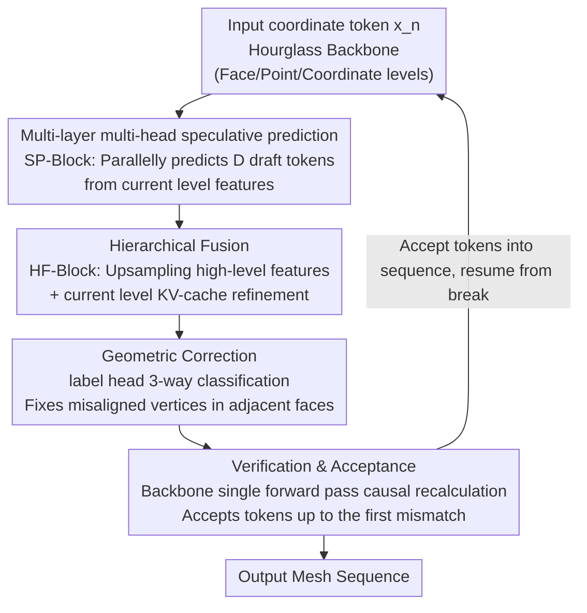

# FlashMesh: Faster and Better Autoregressive Mesh Synthesis via Structured Speculation

**Conference**: CVPR 2026  
**Paper**: [CVF Open Access](https://openaccess.thecvf.com/content/CVPR2026/html/Shen_FlashMesh_Faster_and_Better_Autoregressive_Mesh_Synthesis_via_Structured_Speculation_CVPR_2026_paper.html)  
**Code**: Not open-sourced (No repository link provided in the paper)  
**Area**: 3D Vision  
**Keywords**: Autoregressive mesh synthesis, speculative decoding, Hourglass Transformer, parallel decoding, geometric consistency  

## TL;DR
FlashMesh adapts "speculative decoding" from large language models to autoregressive mesh generation. By designing a predict–correct–verify framework tailored for the hierarchical structure of the Hourglass Transformer, the model predicts multiple tokens in parallel per step with geometric error correction. It achieves approximately 2× inference speedup on Meshtron-2B while reducing the Chamfer Distance from 0.092 to 0.089.

## Background & Motivation

**Background**: High-quality 3D mesh generation is a core task in VR, gaming, and digital content creation. Compared to voxels or implicit fields, meshes explicitly represent surfaces using vertices and faces, making them compact, editable, and rendering-friendly. Recent mainstream approaches utilize **autoregressive generation**—such as Meshtron, DeepMesh, and BPT—which decompose meshes into "face → vertex → coordinate" token sequences. Predicting tokens sequentially allows for the precise capture of topological and geometric structures.

**Limitations of Prior Work**: The strict sequential decoding of autoregressive models creates a fundamental bottleneck—each token must wait for the previous one to be generated. Since a mesh often consists of tens of thousands of tokens, token-by-token decoding results in extremely slow inference, making it impractical for interactive or large-scale pipelines.

**Key Challenge**: The trade-off between quality and speed. While autoregressive models ensure precision (as each step is conditioned on the full preceding context), the cost is the inability to parallelize. Existing mesh acceleration methods (such as Iflame's interleaved decoding or XSpecMesh's LoRA draft models) often improve speed at the expense of geometric fidelity and structural consistency.

**Key Insight**: The authors noted that **speculative decoding** in large language models offers a potential solution—using a lightweight draft model to predict multiple tokens in parallel, which are then verified by a primary model in a single pass. However, a direct application is insufficient: text is a flat sequence, whereas meshes have a hierarchical "face–vertex–coordinate" structure with strong geometric and topological dependencies. Furthermore, mesh models use Hourglass Transformers that compress and then expand hierarchical features, which fundamentally differs from the flat decoder architectures used in text. Consequently, speculative decoding must be **redesigned** to fit these hierarchical mesh characteristics.

**Core Idea**: Hierarchical mesh tokens contain predictable structural patterns. Provided the speculation process respects geometric consistency and the architectural feature hierarchy, the model can confidently "bet" on multiple future tokens simultaneously. FlashMesh implements this via a three-phase cycle: **predict (speculative prediction) → correct (geometric correction) → verify (backbone verification)**.

## Method

### Overall Architecture

FlashMesh is built upon Meshtron’s Hourglass Transformer. This decoder organizes mesh tokens into three levels—face, point (vertex), and coordinate. It first **compresses** coordinate-level embeddings into higher-level vertex and face embeddings to capture global geometry, then gradually **upsamples** them back to lower-level fine-grained representations to recover local details. During upsampling, transition nodes across levels are termed **split nodes**, which are responsible for expanding coarse features into finer mesh representations.

The inference process follows a predict–correct–verify loop:

- **Predict**: The backbone (original Hourglass Transformer) predicts the next token, termed the main token. Simultaneously, two lightweight modules, the SP-Block and HF-Block, work together to predict several subsequent draft tokens in parallel. Given input token $x_n$ at position $n$, while the backbone outputs $x_{n+1}$, the SP/HF-Blocks concurrently produce $x_{n+2:n+D+1}$ (where $D$ is the number of draft tokens).
- **Correct**: In parallelly generated adjacent faces, vertices that should be shared might be misaligned. A correction algorithm utilizes vertex-sharing priors to resolve these inconsistencies, modifying only draft tokens while leaving the main token untouched.
- **Verify**: The backbone Performs a **single forward pass** to recalculate the corrected draft tokens using a causal mask. It accepts tokens that match the recalculated results up to the first point of divergence, discards the rest, and resumes the next cycle from the break point.

Through this tri-stage collaboration, the model outputs multiple tokens per step while maintaining the fidelity advantages of autoregressive modeling. The overall framework flow is as follows:

### Key Designs

**1. Multi-layer multi-head speculative prediction (SP-Block): Predicting multiple future tokens at split nodes**

This addresses the "token-by-token" bottleneck of autoregressive models. The SP-Block (Speculative Prediction Block) consists of multiple Transformer layers. Suppose the first $N-1$ backbone layers process position $s$ to obtain hidden state $h_s = h_s^{(N-1)}$ (before the $N$-th backbone layer produces the final hidden state $h_s^{(N)}$). The SP-Block takes $h_s$ as input and, through $D$ **parameter-independent** transformer blocks, the $d$-th decoding head predicts the token feature for position $s+d$:

$$h_{s+d}^{(d)} = \text{Linear}\!\left(\text{CA}^{(d)}\!\left(\text{SA}^{(d)}(h_s),\, c\right)\right) + h_s$$

Where $\text{SA}^{(d)}$ and $\text{CA}^{(d)}$ are the self-attention and cross-attention (injecting generation condition $c$) for the $d$-th head. "Multi-head" refers to $D$ independent heads each betting on a future position, and "multi-layer" indicates that this speculation occurs across the face, point, and coordinate levels. Crucially, this happens at the split nodes—the natural branching points where upsampling expands coarse features into fine ones—allowing one high-level feature to generate multiple low-level tokens in parallel.

**2. Hierarchical Fusion Block (HF-Block): Reconnecting speculative high-level features to local context**

The $h_{s+d}^{(d)}$ produced by the SP-Block is a high-level representation lacking local detail, making it inaccurate if used in isolation. The HF-Block (Hierarchical Fusion Block) first uses an hourglass-style upsampling operator to expand a single high-level feature into a sequence of low-level features:

$$\left(h_{s+3d}^{(3d)\prime},\, h_{s+3d+1}^{(3d+1)\prime},\, h_{s+3d+2}^{(3d+2)\prime}\right) = \text{Upsample}\!\left(h_{s+d}^{(d)}\right)$$

Then, each upsampled feature $h_{s+t}^{(t)\prime}$ interacts with the current level's KV-cache: it computes a query $Q_{s+t}^{(t)} = W_q^{(t)} h_{s+t}^{(t)\prime}$ and reuses the shared Key-Value pairs $K_{<s}=W_k X_{<s}^k$ and $V_{<s}=W_v X_{<s}^v$ produced by the backbone on historical tokens. Finally, refined low-level features are obtained via attention, output projection, and residual connections:

$$\tilde{h}_{s+t}^{(t)} = h_{s+t}^{(t)\prime} + \text{FFN}^{(t)}\!\left(\text{Attn}\!\left(Q_{s+t}^{(t)},\, K_{<s},\, V_{<s}\right)\right)$$

This fusion of "high-level structural cues ⊕ local context" makes multi-token prediction accurate. Ablations show that adding only the SP-Block yields limited speedup (TPS 95.5 → 109.7), while adding the HF-Block pushes it to 176.5. Different levels use different numbers of blocks: the face level uses 1 SP-Block + 2 HF-Blocks, the point level uses 1 SP + 1 HF, and the coordinate level uses only 1 SP-Block.

**3. Structure-Aware Correction: Fixing misaligned parallel faces using vertex sharing priors**

A fundamental issue when generating multiple faces in parallel is that the exact coordinates of other faces in the same batch are unknown. Consequently, adjacent faces that should share a common vertex may produce misaligned points (e.g., in Figure 4 of the original paper, vertex 8 should coincide with vertex 6, and vertex 9 with vertex 3, but they are offset).

FlashMesh attaches a **label head (a single linear layer)** to each point-level feature, classifying each generated point into three categories: (1) **Historic Point**—coincident with a vertex from a previously generated batch; (2) **New Point**—a completely new spatial position; (3) **Intra-batch Point**—a repetition of a new point generated earlier in the current batch. For each intra-batch point, the system checks for overlapping vertices within the same batch. If none are found, it copies the closest new point from the current triangle to ensure local geometric consistency. Finally, vertices are reordered along the z–y–x axes to maintain the order required for autoregression. All corrections apply only to draft tokens. The label head is supervised using standard cross-entropy:

$$L_{label} = -\frac{1}{N_p}\sum_{t=1}^{N_p} \log p_t(y_t)$$

The total training objective is the coordinate prediction loss $L_{coord}$ (cross-entropy for both main and draft tokens) plus the weighted label loss: $L_{total} = L_{coord} + \gamma L_{label}$, with $\gamma=0.3$. This step is key to distinguishing FlashMesh from methods like XSpecMesh—it explicitly leverages mesh connectivity priors to preserve structure.

**4. Verification Mechanism (Verify): Backbone adjudication of draft tokens**

Draft tokens may be inaccurate, and appending them directly would degrade overall quality. FlashMesh borrows the verification logic from LLM speculative decoding: let $s$ be the position of the last accepted token. In the previous round, the backbone predicted main token $x_{s+1}$, and the SP/HF-Blocks predicted draft tokens $x_{s+2:s+D+1}$. After correction, these are fed into a single backbone forward pass using a **causal mask** to recalculate $x'_{s+2:s+D+2}$. Since $x_{s+1}$ was generated by the backbone itself, it is accepted immediately. Each subsequent draft token $x_{s+2:s+D+1}$ is compared against its recalculated counterpart $x'_{s+2:s+D+1}$ to find the **last matching position** $x_{s^*}$. Tokens are accepted up to $x_{s^*}$, and the cycle repeats from $x_{s^*+1}$ with $D$ new draft tokens. This ensures the output remains faithful to the underlying autoregressive model—correct speculations provide "free" speedup, while incorrect ones are corrected by the backbone.

### Loss & Training
The total loss is $L_{total} = L_{coord} + \gamma L_{label}$. The coordinate loss is the average cross-entropy of the main/draft token predicted distributions against ground truth, and the label loss supervises the three-way point classification with $\gamma=0.3$ (ablations show little difference for $\gamma \in \{0.1, 0.3, 0.5\}$). The implementation is based on the Hourglass Transformer with a hierarchical configuration of 4–8–12 and a learning rate of $8 \times 10^{-5}$. During speculative decoding, 18 tokens are predicted at the face level and 15 at the point level. Training was conducted on 16 H20 GPUs.

## Key Experimental Results

### Main Results

The training data consists of ShapeNetV2 + Toys4K + approximately 100,000 meshes from licensed internal data (filtering out meshes with >10,000 faces). Evaluation was performed on 500 out-of-distribution ShapeNetV2 meshes and 500 gObjaverse meshes. Metrics include BBox-IoU, Chamfer Distance (CD), Hausdorff Distance (HD), Tokens per Second (TPS), and speedup ratio, all measured on H20 GPUs.

| Method | Params (B) | CD ↓ | HD ↓ | BBox-IoU ↑ | TPS ↑ | Gain |
|------|-----------|------|------|------------|-------|--------|
| BPT | 0.7 | 0.128 | 0.280 | 0.894 | 29.1 | - |
| DeepMesh | 0.5 | 0.139 | 0.297 | 0.870 | 40.6 | - |
| Mesh-RFT | 1.1 | 0.114 | 0.254 | 0.912 | 95.5 | - |
| Meshtron (1B) | 1.1 | 0.121 | 0.269 | 0.901 | 98.6 | - |
| Meshtron (2B) | 2.3 | 0.092 | 0.206 | 0.942 | 67.3 | - |
| **Ours (Mesh-RFT)** | 1.6 | 0.114 | 0.252 | 0.913 | 179.2 | ×1.87 |
| **Ours (Meshtron 1B)** | 1.6 | 0.120 | 0.267 | 0.905 | 180.4 | ×1.83 |
| **Ours (Meshtron 2B)** | 3.4 | **0.089** | **0.198** | **0.949** | 136.6 | **×2.03** |

FlashMesh is a "pluggable" framework: integrated into Meshtron and Mesh-RFT, it achieves nearly 2× speedup while **simultaneously improving** quality (Ours Meshtron-2B CD 0.089 is superior to the original 0.092). BPT and DeepMesh were not integrated because they use token compression techniques incompatible with this framework.

### Ablation Study

Incremental component additions (Baseline: Meshtron 1B) to evaluate the contributions of speculative decoding and correction:

| Configuration | CD ↓ | HD ↓ | BBox-IoU ↑ | TPS ↑ |
|------|------|------|------------|-------|
| A. Meshtron 1B | 0.121 | 0.269 | 0.901 | 95.5 |
| B. + SP-Block | 0.122 | 0.269 | 0.903 | 109.7 |
| C. + SP-Block + HF-Block | 0.120 | 0.268 | 0.904 | 176.5 |
| D. + SP + HF + Correction | 0.120 | 0.267 | 0.905 | 180.4 |

Trade-offs in draft token quantity (n–m denotes n face tokens and m point tokens; Face/Point-Acc is the average number of draft tokens accepted per step):

| Configuration | Face-Acc | Point-Acc | CD ↓ | HD ↓ | TPS ↑ | Gain |
|------|----------|-----------|------|------|-------|--------|
| Original Meshtron 1B | - | - | 0.121 | 0.269 | 98.6 | ×1.00 |
| 9–9 | 6.43/9 | 6.97/9 | 0.121 | 0.270 | 139.9 | ×1.52 |
| 27–27 | 8.24/27 | 8.39/27 | 0.127 | 0.278 | 114.4 | ×1.16 |
| 18–18 | 9.84/18 | 10.35/18 | 0.120 | 0.269 | 179.9 | ×1.82 |
| **18–15** | 9.80/18 | 10.04/15 | 0.120 | 0.267 | **180.4** | **×1.83** |

### Key Findings
- **HF-Block is the primary speedup driver**: Adding only the SP-Block increased TPS from 95.5 to 109.7; adding the HF-Block pushed it to 176.5. Connecting high-level structural cues back to local context is essential for accurate multi-token prediction. The correction module mainly improves/preserves quality (slight increases in CD/HD/IoU) with negligible impact on speed (176.5 → 180.4).
- **More draft tokens are not always better**: With a 27–27 configuration, although the acceptance count per step was highest, predictions further into the future became inaccurate, causing the CD to rise to 0.127 and TPS to drop to 114.4. A configuration of 18 face tokens and 15 point tokens was optimal. Note: face draft counts must be multiples of 9, and point draft counts multiples of 3.
- **Larger models yield higher gains**: FlashMesh speedup ratios at 0.5B, 1B, and 2B are ×1.47, ×1.83, and ×2.03, respectively. Quality slightly decreased at 0.5B (CD 0.137 → 0.140), likely because the smaller model lacks sufficient representation/reasoning capacity for multi-token prediction—consistent with findings in LLM speculative decoding where stronger draft models yield higher gains.
- The label loss weight $\gamma$ is robust within the 0.1–0.5 range.

## Highlights & Insights
- **"Translating" LLM speculative decoding to hierarchical geometry**: The core insight is that mesh tokens have strong structural/geometric correlations sufficient to support confident multi-token speculation. The Hourglass split node is a natural branching point where hierarchical speculation fits seamlessly into the architecture.
- **Transferable predict-correct-verify paradigm**: Decoupling acceleration (speculation) from quality (verification + correction) allows for "faster and better" results instead of speed-quality trade-offs. This paradigm is valuable for any high-dimensional structured sequence generation (e.g., point clouds, scene graphs, molecules).
- **Structure as a resource, not a burden**: While other parallel methods ignore or struggle with the topological constraint of shared vertices between adjacent faces, FlashMesh leverages it through the label head and vertex replication, which is the key to improving quality.
- **Pure speedup with zero quality cost**: Since the verification phase uses the backbone, the final output distribution is theoretically faithful to the original autoregressive model. This makes the gain "cleaner" than mesh acceleration methods (like XSpecMesh or Iflame) that compromise fidelity.

## Limitations & Future Work
- The model still inherits the inherent flaws of autoregressive models, such as sensitivity to early prediction errors that propagate through the sequence. Future work could explore hybrid decoding or more explicit geometric priors to improve robustness.
- The "up to 2×" speedup was achieved on the 2B model; it is ×1.83 for 1B and only ×1.47 for 0.5B with a slight quality drop. The 2× marketing claim should be interpreted alongside model scale.
- Evaluation was limited to 500 meshes each from ShapeNetV2 and gObjaverse, and complex meshes (>10,000 faces) were excluded. Performance on high-face-count or non-manifold topologies is unknown.
- The correction mechanism relies on the assumption of shared vertices in adjacent faces. Its validity for mesh styles that intentionally do not share vertices (e.g., some CAD/hard-surface parts) was not discussed.
- Key details (split node definitions, specific three-layer speculation workflows) were relegated to the supplementary material, making the main text less self-contained and increasing reproduction difficulty, exacerbated by the lack of open-source code.

## Related Work & Insights
- **vs Meshtron**: Meshtron introduced the Hourglass Transformer to decompose generation into face/vertex/coordinate hierarchies and serves as the baseline for FlashMesh. FlashMesh adds parallelization via speculation and correction without altering the generative foundation, allowing quality to hold steady or improve.
- **vs XSpecMesh / Iflame**: These also aim to accelerate mesh synthesis. XSpecMesh uses LoRA-tuned draft models, and Iflame uses interleaved decoding, but both often sacrifice geometric fidelity. FlashMesh's correct + verify stages are specifically designed to preserve geometric consistency.
- **vs LLM Speculative Decoding**: They share the same origin—parallel draft prediction verified by a main model. The difference lies in the mesh's hierarchical structure and Hourglass architecture, requiring FlashMesh to redesign the SP/HF-Blocks and add a geometric correction step absent in text.
- **vs BPT / TreeMeshGPT / EdgeRunner (Token Compression)**: These methods accelerate by shortening sequences via compression, which fundamentally loses quality and is currently incompatible with the FlashMesh framework. Theoretically, these "orthogonal" approaches could be combined in the future.

## Rating
- Novelty: ⭐⭐⭐⭐ Systematically adapts speculative decoding to hierarchical mesh architectures with geometric correction; clear logic, though the paradigm is inherited from LLMs.
- Experimental Thoroughness: ⭐⭐⭐⭐ Includes 4 baselines, 3 scales, and multiple ablations for speed/quality; however, the evaluated mesh scale is small, complex meshes were filtered, and details are hidden in supplementary material.
- Writing Quality: ⭐⭐⭐⭐ The predict-correct-verify narrative is clear and formulas are complete, though pushing core definitions like split nodes to the supplement affects self-consistency.
- Value: ⭐⭐⭐⭐ Provides a plug-and-play route for nearly 2× speedup without quality loss in autoregressive mesh generation, offering significant utility for interactive 3D content creation.

<!-- RELATED:START -->

## Related Papers

- [\[CVPR 2026\] From Rays to Projections: Better Inputs for Feed-Forward View Synthesis](from_rays_to_projections_better_inputs_for_feed-forward_view_synthesis.md)
- [\[CVPR 2026\] Faster-GS: Analyzing and Improving Gaussian Splatting Optimization](faster-gs_analyzing_and_improving_gaussian_splatting_optimization.md)
- [\[CVPR 2026\] LongStream: Long-Sequence Streaming Autoregressive Visual Geometry](longstream_long-sequence_streaming_autoregressive_visual_geometry.md)
- [\[CVPR 2026\] ExMesh: EXplicit Mesh Reconstruction with Topology Adaptation](exmesh_explicit_mesh_reconstruction_with_topology_adaptation.md)
- [\[CVPR 2026\] Anny-Fit: All-Age Human Mesh Recovery](anny-fit_all-age_human_mesh_recovery.md)

<!-- RELATED:END -->

## Related Papers

- [\[CVPR 2026\] From Rays to Projections: Better Inputs for Feed-Forward View Synthesis](from_rays_to_projections_better_inputs_for_feed-forward_view_synthesis.md)
- [\[ICLR 2026\] Efficient-LVSM: Faster, Cheaper, and Better Large View Synthesis Model via Decoupled Co-Refinement Attention](../../ICLR2026/3d_vision/efficient-lvsm_faster_cheaper_and_better_large_view_synthesis_model_via_decouple.md)
- [\[CVPR 2026\] PixARMesh: Autoregressive Mesh-Native Single-View Scene Reconstruction](pixarmesh_autoregressive_mesh-native_single-view_scene_reconstruction.md)
- [\[CVPR 2026\] MeshWeaver: Sparse-Voxel-Guided Surface Weaving for Autoregressive Mesh Generation](meshweaver_sparse-voxel-guided_surface_weaving_for_autoregressive_mesh_generatio.md)
- [\[CVPR 2026\] Unified Primitive Proxies for Structured Shape Completion](unified_primitive_proxies_for_structured_shape_completion.md)

<!-- RELATED:END -->
