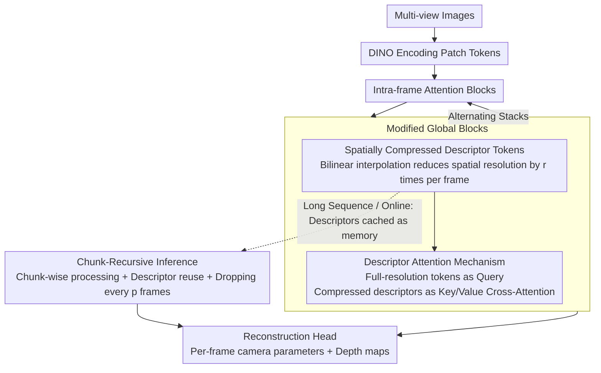

# FlashVGGT: Efficient and Scalable Visual Geometry Transformers with Compressed Descriptor Attention

**Conference**: CVPR 2026  
**arXiv**: [2512.01540](https://arxiv.org/abs/2512.01540)  
**Code**: [Project Page](https://wzpscott.github.io/flashvggt_page/)  
**Area**: 3D Vision  
**Keywords**: 3D Reconstruction, Efficient Transformer, Descriptor Attention, Online Inference, Multi-view Geometry

## TL;DR

By replacing the global self-attention in VGGT with descriptor-based cross-attention, the inference time for 1,000 images is reduced to 9.3% of VGGT while maintaining competitive reconstruction accuracy and scalability to sequences of 3,000+ images.

## Background & Motivation

VGGT is a milestone model for multi-view 3D reconstruction, achieving high-fidelity reconstruction through alternating intra-frame and global attention blocks. However, global attention requires self-attention over all image tokens, resulting in a complexity of $O(S^2N^2)$ (where $S$ is the number of images and $N$ is the number of tokens per frame). When processing 1,000 images, the total token count exceeds 1 million, creating a severe computational bottleneck.

The authors propose a solution based on two key observations:
1. Classical methods (such as SfM) demonstrate that sparse keypoints are sufficient to infer precise inter-frame associations, suggesting that dense token-to-token attention may be unnecessary.
2. VGGT's global attention maps are inherently extremely sparse—most attention scores are concentrated near zero, meaning a large amount of computation is wasted on irrelevant token pairs.

## Method

### Overall Architecture

FlashVGGT aims to replace the most expensive component of VGGT—the global self-attention across all image tokens—without altering the overall VGGT structure, thereby bringing the reconstruction of thousands of images into a practical range of "minutes and tens of GBs of VRAM." The backbone remains consistent with VGGT: multi-view images are first encoded into patch tokens via DINO, then pass through alternating intra-frame and global attention blocks, finally outputting camera parameters and depth maps for each frame via a reconstruction head. The sole modification occurs in the global blocks: instead of performing self-attention among all $S \times N$ tokens, each frame is first compressed into a small set of "descriptors," and full-resolution tokens then perform cross-attention only with these descriptors. Inspired by classical SfM—where sparse keypoints suffice for inter-frame inference and noting VGGT's sparse attention maps—this substitution reduces quadratic complexity with minimal loss in accuracy. For long sequences and online scenarios, a chunk-recursive inference layer is added to reuse descriptors as memory buffers.

### Key Designs

**1. Spatially Compressed Descriptor Tokens: Using interpolation to compress each frame into compact descriptors instead of discarding details**

Global attention is costly due to the excessive number of tokens; the most direct optimization is to "downsample" each frame into a set of representative tokens. FlashVGGT reduces the spatial resolution of each frame from $(H, W)$ to $(H/r, W/r)$ via bilinear interpolation. When $r=4$, the number of tokens is compressed 16-fold. The key lies in the choice of compression: each DINO token corresponds to a $14 \times 14$ pixel patch. Radical aggregation like pooling or Top-k tends to flatten local spatial structures, whereas bilinear interpolation performs weighted smoothing within neighborhoods, preserving fine-grained cues more completely—ablation results showing interpolation's Acc of 0.436 significantly outperforming pooling (0.560) and Top-k (0.569) validate this.

**2. Descriptor Attention Mechanism: Querying descriptors with full-resolution tokens to retain global receptive fields while removing quadratic complexity**

With compressed descriptors, global blocks no longer require all-to-all token computation. FlashVGGT treats full-resolution tokens as Queries and compressed descriptors as Keys/Values for cross-attention. Each token still indirectly observes the global context of the entire sequence through the descriptors, but the number of Keys involved in matching drops from $K$ to $K_d = K/r^2$. Complexity consequently drops from $O(K^2)$ to $O(K \cdot K_d) = O(K^2/r^2)$. In other words, the global receptive field is maintained, but "observing all raw tokens" is replaced by "observing condensed summaries of each frame," providing over 10x computational savings.

**3. Chunk-Recursive Inference: Using descriptors as memory buffers to support unbounded online reconstruction**

Processing thousands of images offline at once still exceeds VRAM limits, and real-time streaming requires on-the-fly reconstruction. FlashVGGT partitions long sequences into continuous chunks for sequential processing. After a chunk is processed, its descriptor tokens are cached as "memory" for subsequent chunks. Since descriptors are already compressed by $r^2$, the caching overhead is only $1/r^2$ of StreamVGGT (which caches full-resolution tokens), reducing memory usage by over 20 times. To prevent memory from growing infinitely, a "dropping" strategy is added—retaining only one descriptor every $p$ frames—keeping memory growth linear but low, enabling processing of 3,000+ frames.

### Loss & Training

A two-stage curriculum training is adopted: Phase 1 involves training on 2–24 randomly shuffled views (aligned with VGGT). Phase 2 transitions to ordered sequences for fine-tuning with causal masks enabled, ensuring memory reuse during chunk-recursive inference aligns with the training distribution. The training data uses a subset of VGGT (7 datasets) covering diverse synthetic/real, indoor/outdoor scenes.

## Key Experimental Results

### Main Results (Long Sequence Reconstruction, 1000 Images)

| Method | Abs Rel↓ | CD↓ | APE↓ | Inference Time(s) | VRAM (GB) |
|------|----------|-----|------|------------|----------|
| VGGT | 0.048 | 1.521 | 6.519 | 372.8 | 68.4 |
| FastVGGT | 0.034 | 1.206 | 5.651 | 78.2 | 72.6 |
| FlashVGGT | 0.032 | 1.128 | 5.237 | 35.3 | 60.7 |

### Online Reconstruction (500 Images)

| Method | Abs Rel↓ | APE↓ | Time(s) | VRAM (GB) |
|------|----------|------|---------|----------|
| StreamVGGT | 0.086 | 6.543 | 209.5 | 70.7 |
| CUT3R | 0.375 | 23.456 | 34.2 | 6.2 |
| FlashVGGT | 0.047 | 4.792 | 12.5 | 13.1 |

### Ablation Study

| Compression Method | Abs Rel | Acc↓ | Explanation |
|----------|---------|------|------|
| Pooling | 0.019 | 0.560 | Loss of local information |
| Top-k | 0.019 | 0.569 | Unstable assumptions |
| Bilinear Interpolation | 0.014 | 0.436 | Optimal spatial detail retention |

### Key Findings

- VGGT performance degrades significantly at 1,000 images (due to attention dilution), whereas FlashVGGT remains stable.
- Auxiliary descriptor tokens (first frame full tokens + keyframes + camera tokens) are crucial for geometric consistency.
- FlashVGGT produces more calibrated confidence maps, avoiding the overconfidence issues observed in VGGT.

## Highlights & Insights

- Descriptor attention is a principled design that integrates the "keypoint/descriptor" concept from classical CV into Transformers.
- The chunk-recursive scheme for online inference is elegant and simple, with minimal cache volume.
- Inference time for 1,000-image sequences is only 35s (vs. 373s for VGGT), representing an 10x+ speedup.
- Scalable to 3,000+ images, successfully overcoming the scalability bottleneck of VGGT.

## Limitations & Future Work

- Compression inevitably loses fine-grained information, potentially resulting in performance loss in scenes heavily dependent on local details.
- Keyframe selection is based on k-means clustering, which might not be the optimal strategy.
- Training uses a subset of VGGT data rather than the full set.
- The dropping strategy for chunk-recursive inference (retaining one descriptor every $p$ frames) is heuristic.

## Related Work & Insights

- **vs VGGT**: Global self-attention $O(N^2) \rightarrow$ descriptor cross-attention $O(N^2/r^2)$, 10x speedup with comparable accuracy.
- **vs FastVGGT**: Token merging introduces additional computational overhead; FlashVGGT is more concise and efficient via interpolation compression.
- **vs StreamVGGT**: Caching full-resolution tokens causes massive memory overhead; FlashVGGT caches only descriptors, reducing memory usage by over 20x.

## Rating

- Novelty: ⭐⭐⭐⭐ Descriptor attention and chunk-recursive inference designs are simple yet effective.
- Experimental Thoroughness: ⭐⭐⭐⭐⭐ Comprehensive coverage across multi-scale sequences, online/offline scenarios, ablation studies, and visualizations.
- Writing Quality: ⭐⭐⭐⭐ Clear structure, detailed experimental tables, and high-quality visualizations.
- Value: ⭐⭐⭐⭐⭐ Successfully addresses the core scalability bottleneck of VGGT, offering high practical application value.

<!-- RELATED:START -->

## Related Papers

- [\[CVPR 2026\] Block-Sparse Global Attention for Efficient Multi-View Geometry Transformers](block-sparse_global_attention_for_efficient_multi-view_geometry_transformers.md)
- [\[CVPR 2026\] Emergent Outlier View Rejection in Visual Geometry Grounded Transformers](emergent_outlier_view_rejection_in_visual_geometry_grounded_transformers.md)
- [\[CVPR 2026\] Flow3r: Factored Flow Prediction for Scalable Visual Geometry Learning](flow3r_factored_flow_prediction_for_scalable_visual_geometry_learning.md)
- [\[CVPR 2026\] Sculpt4D: Generating 4D Shapes via Sparse-Attention Diffusion Transformers](sculpt4d_generating_4d_shapes_via_sparse-attention_diffusion_transformers.md)
- [\[CVPR 2026\] KV-Tracker: Real-Time Pose Tracking with Transformers](kv-tracker_real-time_pose_tracking_with_transformers.md)

<!-- RELATED:END -->
