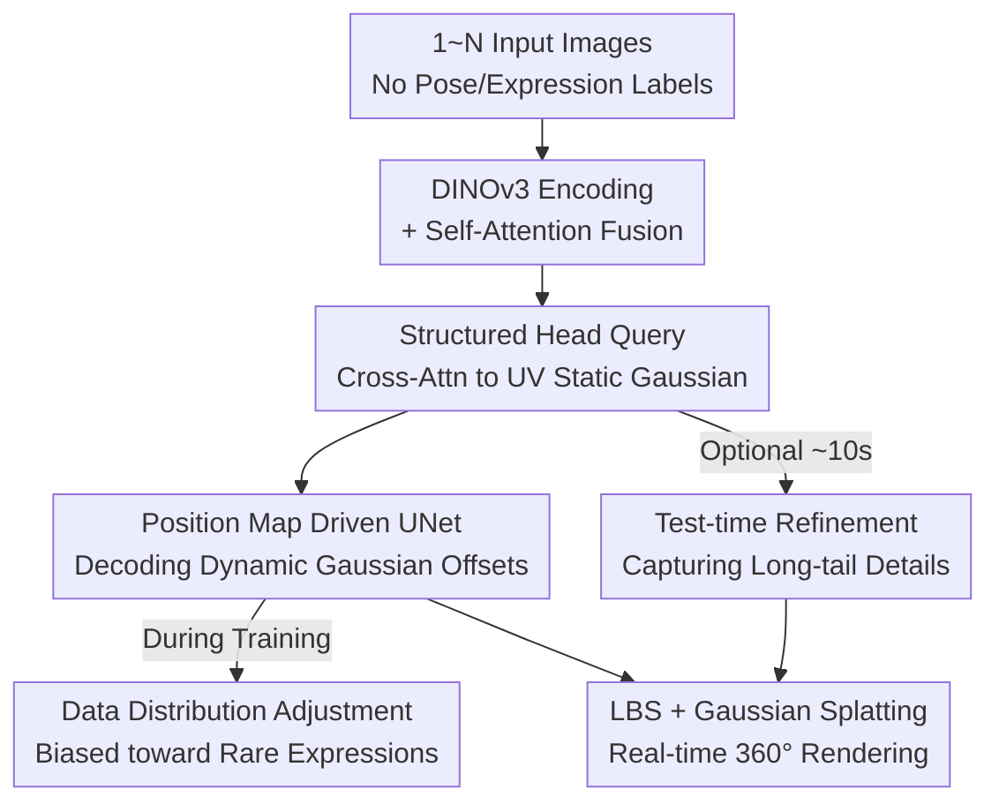

# FlexAvatar: Flexible Large Reconstruction Model for Animatable Gaussian Head Avatars with Detailed Deformation

**Conference**: CVPR 2026  
**Paper**: [CVF Open Access](https://openaccess.thecvf.com/content/CVPR2026/html/Peng_FlexAvatar_Flexible_Large_Reconstruction_Model_for_Animatable_Gaussian_Head_Avatars_CVPR_2026_paper.html)  
**Code**: Project Page pengc02.github.io/flexavatar (Open-source repository not yet available)  
**Area**: 3D Vision  
**Keywords**: Gaussian Head Avatar, Large Reconstruction Model, Animatable Avatar, FLAME, Test-time Refinement

## TL;DR
FlexAvatar utilizes a transformer-based Large Reconstruction Model (LRM) combined with Structured Head Query tokens to aggregate an arbitrary number of single or sparse input images—without camera poses or expression labels—into a unified UV-space Gaussian avatar. A lightweight UNet driven by UV position maps decodes expression-related deformations in real-time. Together with data distribution adjustment and a 10-second test-time refinement, it achieves SOTA 3D consistency and dynamic detail realism.

## Background & Motivation
**Background**: Since 3D Gaussian Splatting (3DGS) enabled real-time rendering of complex scenes, animatable 3D head avatar reconstruction has seen significant progress. Mainstream approaches roughly fall into three categories: 2D-driven generators (GAGAvatar, Portrait4D), 3D prior systems (HeadGAP, One2Avatar), and Large Reconstruction Models (LRM, LAM, Avat3r).

**Limitations of Prior Work**: Each of these three categories has critical drawbacks. 2D generators produce visually appealing images but lack 3D geometric consistency (e.g., artifacts in profile views) and cannot reproduce fine dynamic deformations. 3D prior systems offer geometric coherence but are limited by low identity diversity in 3D data (usually in the low thousands) and often rely on time-consuming inversion or per-identity fine-tuning, hindering rapid deployment. LRM-based models achieve strong generalization through data and model scale but usually **only accept single-image or fixed-count inputs**. Their outputs often fail to align with driving signals or capture fine-grained dynamic deformations, and many utilize cross-attention for expression changes, leading to poor real-time performance.

**Key Challenge**: There exists a trade-off between scalability (handling arbitrary inputs and cross-identity generalization), expression fidelity (down to wrinkles and teeth), and real-time performance. Increasing cross-attention improves expression accuracy but is computationally expensive, while lightweight MLPs are fast but produce blurry details. Furthermore, multi-view constraints typically require known camera parameters and consistent expressions, which are neither pose-free nor expression-free.

**Goal**: To build a drivable Gaussian avatar framework that is camera-pose-free, expression-free, and input-count-free, capable of reconstructing 360° avatars with realistic details from 1 to N randomly captured images.

**Key Insight**: The authors rely on the generalization capabilities of attention mechanisms. By projecting images with varied input counts, camera poses, and expressions into a canonical representation, the dependency on explicit camera and expression labels is removed. For deformation, rather than using expensive cross-attention, it is compressed into a 2D-to-2D mapping in UV space, resolved in real-time using a lightweight UNet.

**Core Idea**: A set of learnable **Structured Head Query tokens** serves as canonical anchors to aggregate arbitrary inputs into a static UV-space Gaussian. Subsequently, a **FLAME UV position map + UNet** decodes expression-related dynamic Gaussian offsets in real-time. Finally, a 10-second test-time refinement stage is included to capture long-tail identity details.

## Method

### Overall Architecture
FlexAvatar is a feed-forward Large Reconstruction Model. The input consists of 1 to N images with varying expressions and viewpoints, **without camera poses or expression labels**. The output is a drivable Gaussian head avatar in UV space, which can be rendered in 360° in real-time given any driving expression. The pipeline consists of two stages: first, an attention transformer aggregates images into a canonical static Gaussian and identity features; second, a UNet decodes the driving expression into dynamic Gaussian offsets. During training, a data distribution adjustment strategy is used to favor rare expressions, and a 10-second refinement is optional during inference.

Each image is first processed by a frozen DINOv3 vision foundation model encoder $E(\cdot)$ to extract features $f_i = E(I_i),\ i\in\{1,\dots,N\}$. These features implicitly encode camera perspectives and expression changes, eliminating the need for explicit inputs. The pipeline follows this flow:

### Key Designs

**1. Structured Head Query Tokens + Transformer Aggregation: Unifying Arbitrary Counts/Poses/Expressions into a Canonical 3D Representation**

This addresses the "flexibility" of FlexAvatar, specifically targeting the limitations of LRMs that require fixed inputs and known poses. It involves two steps. First, **number-agnostic fusion**: features from N images are concatenated into a variable-length token sequence and processed via a global self-attention layer $F_{\text{agg}} = \text{SelfAttn}(f_1,\dots,f_N),\ F_{\text{agg}}\in\mathbb{R}^{(N\times L)\times D}$. Since attention handles variable-length sequences naturally, the network remains agnostic to the number of inputs. Second, **Head Query anchors**: a set of learnable structured tokens $Q_H\in\mathbb{R}^{N_H\times D}$ are introduced as canonical anchors. Cross-attention aligns the variable-length fused features to a fixed dimension:

$$F_Q = \text{CrossAttn}(Q_H, F_{\text{agg}}) = \text{softmax}\!\left(\frac{Q_H K_{\text{agg}}^\top}{\sqrt{D}}\right)V_{\text{agg}}$$

The resulting $F_Q$ encodes canonical, pose-free, and expression-free head features. This is reshaped into a UV feature map $F_{\text{UV}}\in\mathbb{R}^{H\times W\times D}$ ($N_H = H\cdot W$). The UV space provides a natural mapping from 2D observations to 3D Gaussian decoding. Finally, convolutional heads decode $F_{\text{UV}}$ into identity feature maps $F_{\text{id}}$ and static Gaussian attribute maps $G_{\text{st}}=\{P,\alpha,S,C,R\}$ (position, opacity, scale, color, rotation).

**2. UV Position Map Driven UNet Dynamic Decoding: Real-time Fine-grained Deformation via 2D-to-2D Mapping**

To achieve real-time animation, the authors substitute heavy cross-attention with UV-space driving. Given FLAME expression coefficients, template vertices are deformed and sampled into UV space via barycentric interpolation to generate a driving position map $P_{\text{driving}}$, which encodes local vertex displacements. This is concatenated with identity features $\tilde{F}_{UV} = F_{\text{id}}\oplus P_{\text{driving}}$. The "driving" task thus becomes a UV-to-UV map translation, which a UNet handles efficiently by aggregating local and global features while preserving spatial neighborhoods. The UNet outputs dynamic offsets $\Delta G_{\text{dyn}} = \text{UNet}(\tilde{F}_{UV})$, which are added to static Gaussians only in predefined dynamic regions (face, mouth, eyes) specified by a UV mask $M_{\text{dyn}}$:

$$G_{\text{dyn}} = G_{\text{st}} + M_{\text{dyn}}\odot\Delta G_{\text{dyn}}$$

Final rendering is performed using Linear Blend Skinning (LBS) on Gaussian positions and rotations followed by differentiable rendering $I=\mathcal{R}(\text{LBS}(G_{\text{dyn}}),\Theta)$. This approach captures micro-dynamics like wrinkles and eyelids while maintaining ~45 fps (approx. 22 ms for UNet+LBS+splatting).

**3. Data Distribution Adjustment: Addressing Long-tail Imbalance in Training Sets**

Standard training sets are dominated by neutral expressions and transition frames, causing models to struggle with **rare but critical** dynamics like deep wrinkles or showing teeth. The authors implement active rebalancing: 20 expressive anchor expressions are selected. For each anchor, similar frames across all IDs are retrieved using cosine similarity of FLAME coefficients, and 6 random expressions are added per ID. PCA visualization demonstrates that this rebalanced set covers the expression space more uniformly, particularly for extreme expressions (e.g., rolling eyes, open mouth). This "on-demand sampling" ensures faster convergence and more realistic dynamic rendering.

**4. Efficient Test-time Refinement: 10-second Personalization**

While the feed-forward backbone is scalable, it may struggle with highly personalized long-tail appearance (unique hairstyles, clothing). A test-time refinement stage is introduced: **the dynamic UNet is frozen, and only the reconstruction model parameters $\theta_E$ are optimized** using photometric and perceptual losses to align the rendering with the input images:

$$\theta_E^\star \leftarrow \arg\min_{\theta_E}\ \mathcal{L}_{l1,ssim,lpips}\big(\mathcal{R}(\text{LBS}(G_{\theta_E}),\Theta),\ I_{gt}\big)$$

Gradients for the mouth region are detached to prevent complex oral shadows from interfering with the optimization. Since the feed-forward result is already strong, 20 iterations (approx. 10s) significantly improve personalization without affecting the real-time driving capability.

### Loss & Training
Supervision uses standard photometric and perceptual losses: $\mathcal{L}_{l1}=\|I_{pred}-I_{gt}\|_1$, $\mathcal{L}_{ssim}=\text{SSIM}(I_{pred},I_{gt})$, and $\mathcal{L}_{lpips}=\text{LPIPS}(I_{pred},I_{gt})$. To preserve mouth details, an additional LPIPS loss is applied to the mouth region $M_{mouth}$ defined by face-parsing: $\mathcal{L}_{m\text{-}lpips}=\text{LPIPS}(I_{pred}\odot M_{mouth},\ I_{gt}\odot M_{mouth})$. Gaussians are initialized on the FLAME mesh surface $P_{init}$ with initial scales $S_{init}$ set to 0. L2 regularization is applied to position and scale: $\mathcal{L}_{xyz}=\|P_{pred}-P_{init}\|_2^2$, $\mathcal{L}_{scale}=\|S_{pred}-S_{init}\|_2^2$. The model is trained end-to-end on 16 GPUs for 4 days using Adam with a learning rate of $3\times10^{-5}$.

## Key Experimental Results

### Main Results
Training involved NeRSemble (150 subjects) + in-house FaceCap (2000 subjects). Evaluation was conducted on NeRSemble and FaceCap test sets against SOTA single-image reconstruction methods (LAM, Portrait4D-v1/v2, GAGAvatar).

| Method | Self PSNR↑ | Self SSIM↑ | Self LPIPS↓ | Self CSIM↑ | Cross CSIM↑ | Cross AED↓ |
|------|-----------|-----------|------------|-----------|------------|-----------|
| LAM | 17.83 | 0.8031 | 0.2730 | 0.8213 | 0.8278 | 4.8838 |
| Portrait4D-v1 | 19.37 | 0.8121 | 0.2410 | 0.8390 | 0.8399 | 4.1993 |
| Portrait4D-v2 | 19.63 | 0.8184 | 0.2360 | 0.8385 | 0.8389 | 4.2359 |
| GAGAvatar | 19.17 | 0.8283 | 0.2567 | 0.8474 | 0.8479 | 4.0454 |
| **Ours (Feed-forward)** | **21.15** | **0.8335** | **0.2193** | **0.8490** | **0.8501** | **3.6415** |
| **Ours (+Refine)** | **22.63** | **0.8491** | **0.1833** | **0.8532** | **0.8549** | **3.5879** |

Even the feed-forward model alone outperforms all competitors (approx. 1.5dB higher PSNR than Portrait4D-v2). With 10s refinement, PSNR reaches 22.63 and LPIPS drops to 0.1833.

### Ablation Study
Ablations on FaceCap (Feed-forward results):

| Configuration | PSNR↑ | LPIPS↓ | SSIM↑ | Description |
|------|-------|--------|-------|------|
| w/o Position Map | 22.51 | 0.1845 | 0.8772 | Using id features + coefficients; blurred dynamic textures/loss of wrinkles. |
| w/o Distri. Adj. | 22.74 | 0.1868 | 0.8745 | Standard training; degraded wrinkle and teeth dynamics. |
| w/o Mouth Loss | 23.10 | 0.1810 | 0.8890 | Dropping mouth LPIPS; decreased tooth sharpness. |
| **Ours Full** | **23.32** | **0.1797** | **0.8895** | Full Model |

### Key Findings
- **Position maps are vital for dynamic details**: Without them, PSNR drops and LPIPS rises, with outputs becoming smooth and losing local dynamics like teeth.
- **Distribution adjustment aids rare dynamics**: "w/o Distri. Adj." showed the worst LPIPS in ablation, confirming the need for rebalancing.
- **Strong scalability**: Performance improves and convergence accelerates as the number of training IDs increases.
- **Efficiency**: Feed-forward encoding takes ~0.4s; real-time driving at ~45fps; refinement only 10s.

## Highlights & Insights
- **Driving as a 2D-to-2D UV mapping**: This is the most clever design. By resolving expression driving as a UNet task in UV space, the model achieves spatial alignment and fine details (wrinkles/teeth) while maintaining real-time performance. This "UV-unified" approach can translate to other parametric objects like bodies or hands.
- **Head Queries as Anchors**: Using structured query tokens with cross-attention to absorb variations in input count, pose, and expression into a fixed-dimension representation is a clean solution for the LRM paradigm.
- **Division of labor (Generalist + Specialist)**: Allowing the backbone to handle general priors while using a short optimization for long-tail personalization is a pragmatic engineering choice.

## Limitations & Future Work
- Rare features (glasses, hats) may produce artifacts due to under-representation in training data. Complex hairstyles, clothing, and full-body modeling are not yet included. Lighting generalization is moderate; full relighting remains a future goal.
- Quality continues to scale with 3D data; authors envision a two-stage "Large-scale 3D + Massive 2D" training approach.

## Related Work & Insights
- **vs LAM / LRMs**: These often use pure FLAME driving or fixed inputs, failing to capture fine-grained deformation. FlexAvatar improves PSNR from 17.83 to 21.15 via Head Queries and UV UNet.
- **vs GAGAvatar / Portrait4D**: These lack 3D consistency in profile views. FlexAvatar uses explicit UV Gaussians to ensure 360° stability.
- **vs Avat3r**: Avat3r uses heavy cross-attention that prevents real-time performance; FlexAvatar achieves ~45fps with UV UNet decoding.

## Rating
- Novelty: ⭐⭐⭐⭐ First pose-/expression-/count-free Gaussian avatar framework; the "UV position map + UNet" driving is highly effective.
- Experimental Thoroughness: ⭐⭐⭐⭐ Complete results across multiple metrics, though qualitative "in-the-wild" evaluation could be more extensive.
- Writing Quality: ⭐⭐⭐⭐ Clear motivation and methodology; well-justified design choices.
- Value: ⭐⭐⭐⭐ Provides a practical engineering solution by combining scalable reconstruction with real-time Gaussian driving.

<!-- RELATED:START -->

## Related Papers

- [\[CVPR 2026\] ProgressiveAvatars: Progressive Animatable 3D Gaussian Avatars](progressiveavatars_progressive_animatable_3d_gaussian_avatars.md)
- [\[CVPR 2026\] Motion-Aware Animatable Gaussian Avatars Deblurring](motion-aware_animatable_gaussian_avatars_deblurring.md)
- [\[CVPR 2026\] PhysHead: Simulation-Ready Gaussian Head Avatars](physhead_simulation-ready_gaussian_head_avatars.md)
- [\[CVPR 2026\] Tavatar: Topology-Aware Gaussian Attribute Derivation for Animatable Human Avatars](tavatar_topology-aware_gaussian_attribute_derivation_for_animatable_human_avatar.md)
- [\[CVPR 2026\] Zero-Shot Reconstruction of Animatable 3D Avatars with Cloth Dynamics from a Single Image](zero-shot_reconstruction_of_animatable_3d_avatars_with_cloth_dynamics_from_a_sin.md)

<!-- RELATED:END -->
