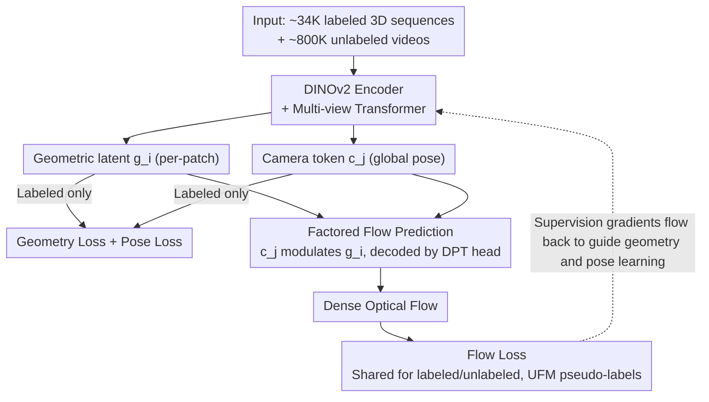

# Flow3r: Factored Flow Prediction for Scalable Visual Geometry Learning

**Conference**: CVPR2026  
**arXiv**: [2602.20157](https://arxiv.org/abs/2602.20157)  
**Code**: [flow3r-project.github.io](https://flow3r-project.github.io/)  
**Area**: 3D Vision  
**Keywords**: visual geometry, factored flow, 3D reconstruction, unlabeled video, correspondence learning, dynamic scenes

## TL;DR

Ours introduces a "Factored Flow" prediction module that predicts optical flow using the geometric latents of the source view and the pose latents of the target view. This enables unlabeled videos to serve as supervision for 3D geometry learning, achieving SOTA performance across 8 benchmarks in both static and dynamic scenes.

## Background & Motivation

1. **Feed-forward 3D reconstruction relies on expensive labels**: Methods like DUSt3R, VGGT, and π³ require dense depth and camera pose supervision, which are costly to acquire, especially for in-the-wild dynamic scenes where they are nearly unavailable.
2. **Labeled data cannot scale effectively**: Unlike LLMs or ViTs that use self-supervised objectives on massive unlabeled datasets, 3D geometry learning is limited by the scale of supervised data, making it difficult to achieve the same scaling effects as language or vision models.
3. **Existing flow supervision (the VGGT tracking head) is insufficient**: VGGT uses a patch-feature matching-based tracking head to predict flow, which only encourages discriminative visual features and does not directly facilitate the learning of pose and geometry.
4. **Projective flow is unstable and cannot handle dynamic scenes**: Computing flow via projection using predicted pointmaps and camera parameters is extremely sensitive to geometric errors and cannot model scene motion.
5. **Unlabeled videos are a massive potential resource**: There are vast amounts of unlabeled monocular videos on the internet. Utilizing 2D correspondences within them as supervision could significantly scale training data.
6. **2D dense correspondence models are maturing**: Models such as UFM, RoMa, and CoTracker can provide high-quality pseudo-label flow for arbitrary image pairs, laying the foundation for utilizing unlabeled videos.

## Method

### Overall Architecture

Flow3r aims to address the dependency of feed-forward 3D reconstruction on expensive 3D labels and its inability to scale with massive data like language or vision models. The approach adds a **Factored Flow Prediction Head** to standard multi-view Transformers (VGGT/π³), allowing existing 2D dense correspondences in unlabeled videos to serve as supervision for 3D geometry. The data flow is as follows: each input image is processed by a DINOv2 encoder and a multi-view Transformer to output per-patch geometric latents $\mathbf{g}_i$ and global camera tokens $\mathbf{c}_j$. Labeled data directly uses 3D labels to supervise these paths. Unlabeled videos enter the Factored Flow head, where the target view's $\mathbf{c}_j$ modulates the source view's $\mathbf{g}_i$. A DPT head then decodes the dense flow, which is supervised by UFM pseudo-labels. Training involves joint optimization of ~34K labeled 3D sequences and ~800K unlabeled videos, with flow supervision gradients flowing through this head back to the geometry and pose branches.

### Key Designs

**1. Factored Flow Prediction: Directing Flow Supervision to Geometry and Pose Branches**

The tracking head in VGGT predicts flow using patch feature matching between two views, which enhances visual discriminability but does not facilitate geometry/pose learning. Conversely, using predicted pointmap projections to calculate flow is sensitive to errors and restricted to static scenes. Flow3r leverages a key observation: in static scenes, the optical flow from a source view to a target view depends solely on the **source view's scene geometry** and the **target view's camera pose**. Based on this, it designs an asymmetric prediction:

$$\hat{\mathbf{F}}_{i \rightarrow j} = \Phi_{\text{flow}}(\mathbf{g}_i, \mathbf{c}_j)$$

where $\mathbf{g}_i$ represents the per-patch geometric features from the source view output by the multi-view Transformer, and $\mathbf{c}_j$ is the camera token (global pose feature) of the target view. $\mathbf{g}_i$ is modulated by $\mathbf{c}_j$ and then decoded into dense flow via a DPT head. The advantage of this asymmetric design is that the flow supervision gradients are forced into the geometry and pose branches, compelling the former to learn true 3D structure and the latter to learn true camera motion. Since the process occurs in the latent space without relying on explicit geometric decoding, it is more robust than projective methods and naturally extends to dynamic scenes (where flow implicitly encodes camera motion + scene motion). The trade-off is an information bottleneck that makes the standalone flow accuracy lower than patch matching, but its supervisory effect on geometry is optimal. This is the fundamental difference between Flow3r and alternative designs:

| Design | Mechanism | Limitations |
|------|------|------|
| flow-tracking (VGGT) | Predicts flow via two-view patch feature matching | Only enhances visual discriminability; does not facilitate geometry/pose learning |
| flow-projective | Uses predicted pointmap + camera parameters for projection | Sensitive to errors; restricted to static scenes |
| **flow-factored (Ours)** | Geometric latent + Pose latent decoding | Information bottleneck limits standalone flow accuracy, but provides optimal geometry supervision |

### Loss & Training

Supervision signals consist of two parts: labeled data use camera pose loss $\mathcal{L}_{\text{cam}}$ and geometry loss $\mathcal{L}_{\text{geo}}$ (including optimally aligned pointmap loss). The flow loss applies to both labeled and unlabeled data, using robust Charbonnier regression weighted by a co-visibility mask:

$$\mathcal{L}_{\text{flow}} = \frac{1}{\sum_p \mathbf{C}[p]} \sum_p \mathbf{C}[p] \cdot \ell_{\text{robust}}(\|\hat{\mathbf{u}}_{i\to j}[p] - \mathbf{u}_{i\to j}[p]\|_2)$$

Pseudo-labels for unlabeled data are generated by a pre-trained UFM. Training occurs in two stages: first, the backbone is frozen while the new flow prediction head is trained (on labeled data); then, the entire model is unfrozen for end-to-end fine-tuning using both labeled and unlabeled data.

## Key Experimental Results

### Dynamic Scenes

| Method | Kinetics RPE-t↓ | EPIC RPE-t↓ | Sintel MSE↓ | Bonn f-score↑ |
|------|:---:|:---:|:---:|:---:|
| DUSt3R | 0.063 | 0.110 | 0.622 | 0.800 |
| CUT3R | 0.027 | 0.081 | 0.676 | 0.899 |
| VGGT | 0.038 | 0.049 | 0.595 | 0.884 |
| π³ | 0.023 | 0.043 | 0.523 | 0.905 |
| **Flow3r** | **0.018** | **0.037** | **0.426** | **0.954** |

Flow3r achieves the best results across all metrics on all 4 dynamic datasets, with significant improvements in both pose and geometry.

### Static Scenes

| Method | 7-Scenes RTA↑ | 7-Scenes MSE↓ | NRGBD f-score↑ | ScanNet RTA↑ |
|------|:---:|:---:|:---:|:---:|
| π³ | 87.69 | 0.169 | 0.983 | 91.14 |
| **Flow3r** | **91.66** | **0.102** | **0.992** | 92.89 |

Gains from dynamic data transferred to static scenes, with MSE on 7-Scenes dropping from 0.169 to 0.102 (↓40%).

### Ablation Study: Scaling Unlabeled Data

| Labeled | Unlabeled | RRA@30↑ | MSE↓ |
|:---:|:---:|:---:|:---:|
| 11K | 0 | 66.01 | 0.637 |
| 11K | 3K | 76.26 | 0.598 |
| 11K | 10K | 78.45 | 0.560 |
| 11K | 20K | 81.12 | 0.532 |
| 44K (Purely Labeled) | 0 | 78.68 | 0.565 |

11K labeled + 20K unlabeled performs better than 44K purely labeled data, proving that unlabeled videos supervised by flow can replace expensive 3D labels.

### Ablation Study: Comparison of Flow Prediction Mechanisms

- flow-tracking (VGGT-style) barely improves geometry quality.
- flow-projective even leads to performance degradation.
- flow-factored consistently outperforms the baseline and alternative designs in both static and dynamic scenes.

## Highlights

- **Factored Flow Prediction** is an elegant and effective design, using an information bottleneck to force the geometric latent to learn true 3D structure and the pose latent to learn true camera motion.
- The method demonstrates high **versatility**: it can be integrated into both VGGT and π³ architectures and yields improvements in both.
- **Clear scaling behavior**: Performance increases monotonically with the amount of unlabeled data, proving the scalability of the approach.
- Comprehensive SOTA across 8 static/dynamic benchmarks, with the largest gains observed in in-the-wild dynamic videos where labels are scarce.

## Limitations & Future Work

- Dependency on pre-trained models like UFM for flow pseudo-labels; the method is limited if 2D correspondence models fail in certain domains.
- May still lack robustness in complex dynamic scenes containing multiple independently moving objects.
- Current experiments scaled to ~800K sequences; the effect of scaling to 10M-100M remains unverified.
- The accuracy of the factored flow itself is lower than direct patch matching (the cost of the information bottleneck), making it unsuitable as a standalone flow estimator.

## Related Work & Insights

| Method | Supervision | Dynamic Support | Pose Labels Required | Core Idea |
|------|---------|:-----------:|:--------------:|---------|
| DUSt3R | Fully Supervised | ✗ | ✓ | Two-view pointmap regression |
| VGGT | Fully Supervised + tracking head | ✓ | ✓ | Multi-view Transformer + patch matching flow |
| π³ | Fully Supervised | ✓ | ✓ | Local coordinate prediction + Permutation Equivariance |
| CUT3R | Fully Supervised | ✓ | ✓ | Streaming multi-view inference |
| MegaSAM | Optimization-based | ✓ | ✗ | Monocular depth priors + per-video optimization |
| **Flow3r** | **Semi-supervised** | **✓** | **Partial** | **Factored flow + unlabeled video scaling** |

## Rating

- Novelty: ⭐⭐⭐⭐ — The insight behind factored flow prediction is concise and profound, with theoretical support for the asymmetric design.
- Experimental Thoroughness: ⭐⭐⭐⭐⭐ — 8 benchmarks, comparison of 3 designs, scaling curves, multi-backbone validation, and qualitative comparisons.
- Writing Quality: ⭐⭐⭐⭐ — Clear structure, rich charts, and well-articulated motivation.
- Value: ⭐⭐⭐⭐⭐ — Demonstrates a feasible path for scaling 3D geometry learning, providing a significant contribution to the field.

<!-- RELATED:START -->

## Related Papers

- [\[CVPR 2026\] FlashVGGT: Efficient and Scalable Visual Geometry Transformers with Compressed Descriptor Attention](flashvggt_efficient_and_scalable_visual_geometry_transformers_with_compressed_descr.md)
- [\[CVPR 2026\] Fast Spatial Tracking with Visual Geometry Transformer](fast_spatial_tracking_with_visual_geometry_transformer.md)
- [\[CVPR 2026\] GAP: Action-Geometry Prediction with 3D Geometric Prior for Bimanual Manipulation](action-geometry_prediction_with_3d_geometric_prior_for_bimanual_manipulation.md)
- [\[CVPR 2026\] Action–Geometry Prediction with 3D Geometric Prior for Bimanual Manipulation](actiongeometry_prediction_with_3d_geometric_prior.md)
- [\[CVPR 2026\] LongStream: Long-Sequence Streaming Autoregressive Visual Geometry](longstream_long-sequence_streaming_autoregressive_visual_geometry.md)

<!-- RELATED:END -->
