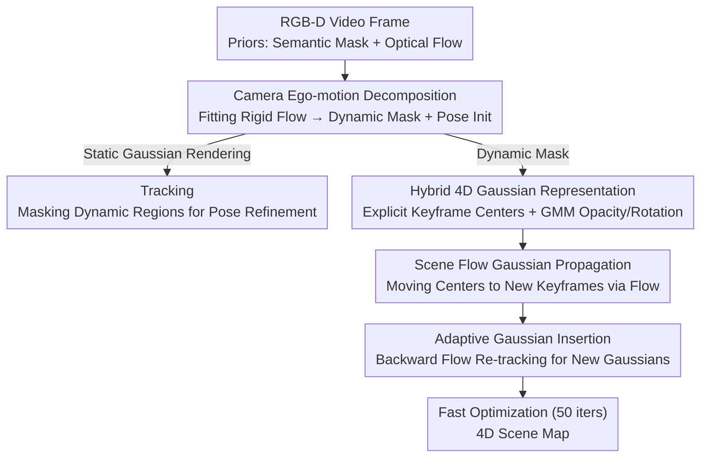

# Flow4DGS-SLAM: Optical Flow-Guided 4D Gaussian Splatting SLAM

**Conference**: CVPR 2026  
**Paper**: [CVF Open Access](https://openaccess.thecvf.com/content/CVPR2026/html/Wang_Flow4DGS-SLAM_Optical_Flow-Guided_4D_Gaussian_Splatting_SLAM_CVPR_2026_paper.html)  
**Code**: https://github.com/wangys16/Flow4DGS-SLAM  
**Area**: 3D Vision  
**Keywords**: Dynamic SLAM, 4D Gaussian Splatting, Optical Flow Guidance, Motion Decomposition, Camera Tracking

## TL;DR
Addressing 3DGS-SLAM in dynamic scenes, this paper employs "camera ego-motion + optical flow" for category-agnostic dynamic/static decomposition. It proposes a hybrid 4D Gaussian representation featuring "explicit keyframe Gaussian centers + GMM time-varying opacity/rotation," combined with scene flow propagation and adaptive insertion to accelerate dynamic Gaussian training. It significantly outperforms 4DGS-SLAM in tracking accuracy, rendering quality, and speed (mapping time reduced from 110s/step to 6s/step).

## Background & Motivation
**Background**: Integrating 3D Gaussian Splatting (3DGS) into SLAM has enabled real-time, photo-realistic rendering and explicit mapping. However, most GS-SLAMs (MonoGS, SplaTAM, WildGS-SLAM, etc.) assume a static world, treating moving objects as outliers to be removed, which results in maps containing only static backgrounds.

**Limitations of Prior Work**: It is challenging to **track the camera while simultaneously reconstructing dynamic objects** in SLAM. Most dynamic reconstruction methods extending 3DGS to the temporal domain (MLP deformation fields, parameterized trajectories, explicit temporal offsets) rely on pre-computed multi-view poses and hours of offline training, making them unsuitable for online execution. The closest predecessor, 4DGS-SLAM, utilizes the sparse control point deformation field from SC-GS for online dynamic reconstruction, but has three major drawbacks: ① The deformation MLP training is extremely slow (mapping takes over 100 seconds per step, FPS is only 0.04); ② Its dynamic segmentation depends on **category-based** semantic models, failing on non-human moving objects (e.g., balloons); ③ Its reconstruction capability is weak, requiring manual specification of dynamic starting times for complex scenarios like "human leaving and re-entering the field of view," or it fails.

**Key Challenge**: Dynamic SLAM requires **efficient** reconstruction of dynamic regions from **sparse keyframes**. However, a trade-off exists between "reconstruction quality/temporal consistency" and "online training speed"—implicit deformation fields are consistent but slow, while pure explicit offsets are fast but lack temporal smoothness and cannot handle newly appearing objects.

**Goal**: (1) Achieve **category-agnostic** dynamic segmentation independent of object categories; (2) Provide a fast and continuous 4D representation for dynamic Gaussians; (3) Attain accurate tracking and high-quality dynamic reconstruction simultaneously within an online SLAM pipeline.

**Key Insight**: The authors observe that **optical flow naturally encodes motion information**. The "rigid flow" induced by camera ego-motion can be analytically calculated using depth and camera intrinsics (Image Jacobian). Pixels deviating from this rigid flow are truly dynamic. Similarly, optical flow can **explicitly propagate** Gaussian centers from the previous frame to the current frame, bypassing expensive deformation MLPs.

**Core Idea**: Utilize optical flow throughout both "tracking" and "mapping" stages. The front-end employs a camera ego-motion model to solve for rigid flow, achieving category-agnostic motion decomposition and camera pose initialization. The back-end uses optical flow to propagate/insert explicit Gaussian centers into new keyframes, utilizing a GMM to model time-varying opacity and rotation, thereby significantly accelerating the online training of dynamic 3DGS.

## Method

### Overall Architecture
The system takes an RGB-D video stream as input and alternates between **camera tracking** and **4D scene mapping** online. For each incoming frame, semantic masks (YOLOv9) and optical flow (RAFT) are extracted as priors. These are fed into the **camera ego-motion decomposition** module, which fits a 6-DoF camera motion to solve for the rigid flow. Pixels deviating from the rigid flow are labeled as dynamic, yielding a category-agnostic motion mask $M_{dy}$, while providing a flow-guided initial camera pose. During the tracking stage, only static Gaussians are rendered, and dynamic mask regions are excluded to refine the pose. In the mapping stage, dynamic Gaussians are maintained via a **hybrid 4D representation**: positions are explicit centers at keyframes (linearly interpolated), while opacity and rotation are modeled continuously over normalized time using a **GMM**. Before entering a new keyframe, **scene flow Gaussian propagation** moves existing dynamic centers to new positions for initialization, followed by **adaptive Gaussian insertion** to seed Gaussians in newly appeared dynamic regions. Finally, a fast optimization of only 50 iterations is performed.

### Key Designs

**1. Camera Ego-motion Decomposition: Category-Agnostic Dynamic Segmentation + Pose Initialization**

Addressing the limitation where 4DGS-SLAM fails on non-human objects due to category-based segmentation, this work judging motion geometrically. Given frame $t$, optical flow $F(u,v)$ is computed via RAFT. For a static 3D point $x=(u,v,Z)^\top$ ($Z$ from depth), its motion field on the image under small motion assumptions is given linearly by the camera twist $\xi=[\rho^\top,\theta^\top]^\top\in\mathbb{R}^6$ (translation + rotation) through the $2\times6$ image Jacobian $J(x)$: $F(u,v)=J(x)\,\xi$. The translation terms in the Jacobian scale with $1/Z$, while rotation terms are depth-independent. Most pixels where the semantic mask $M_s=0$ (judged non-dynamic by YOLOv9) are assumed static. Equations for these pixels are stacked to solve a weighted least squares problem using IRLS (Cauchy weights): $\hat\xi=\arg\min_\xi\sum_i w_i\|F_i-J_i\xi\|^2$, yielding the rigid flow $\hat F=J\hat\xi$. Residuals $r(u,v)=\|F-\hat F\|_2$ are evaluated: dynamic pixels deviate from the rigid flow. A category-agnostic dynamic mask is extracted using a robust threshold: $M_{ca}=\mathbb{1}(r>\mathrm{median}(r)+k\cdot\mathrm{MAD}(r))$, where MAD is the Median Absolute Deviation. The final dynamic mask is $M_{dy}=M_s\cup M_{ca}$. This step also provides camera initialization: solving again using only clean static pixels ($M_{dy}=0$) yields $\hat\xi^*$. The pose is updated via the $\mathfrak{se}(3)$ exponential map: $T^t_{cw}=T^{t-1}_{cw}\exp_{\mathfrak{se}(3)}(\hat\xi^*)$ for coarse initialization, followed by fine-tuning via rendering alignment. This coarse-to-fine approach eliminates category dependence and enhances robustness against drift in complex dynamic scenes.

**2. Hybrid 4D Gaussian Representation: Explicit Keyframe Centers for Speed, GMM for Temporal Smoothness**

To resolve the conflict between "implicit deformation fields (consistent but slow)" and "pure explicit offsets (fast but non-smooth)," the authors decompose dynamic Gaussians into two parts. Each dynamic Gaussian possesses static attributes $\{s_i,\sigma_i,c_i\}$ (scale, static opacity, color) plus two types of dynamic attributes. **Position** is handled explicitly: time is discretized into keyframes $\{t_k\}$, and each Gaussian learns a 3D center $x_i^k$ at each keyframe. The position at any time $t$ is obtained via linear interpolation. Explicit centers can be directly manipulated by optical flow, saving MLP forward passes during training—the key to speed. **Opacity and rotation** are parameterized using a GMM over normalized time $\hat t\in[0,1]$. Each Gaussian learns $K$ components (weights $w_{i,k}$, means $\mu_{i,k}$, scales $\tau_{i,k}$). The time-varying opacity coefficient is $m_i(t)=1-\exp(-A_i\sum_k w_{i,k}\mathcal{N}(\hat t;\mu_{i,k},\tau_{i,k}^2))$ ($A_i$ is learnable amplitude), with final opacity $\sigma_i(t)=\sigma_i\cdot m_i(t)$. Rotation is a normalized blend of control quaternions $q_{i,k}$ weighted by Gaussian activation: $q_i(t)=\frac{\sum_k w_{i,k}\mathcal{N}(\cdot)q_{i,k}}{\|\sum_k w_{i,k}\mathcal{N}(\cdot)q_{i,k}\|}$ (experimentally $K=3$). This maintains training efficiency while using GMM to ensure smooth temporal changes, allowing the expression of complex dynamics (e.g., objects fading in/out) without significantly increasing model size.

**3. Optical Flow-Guided 4D Mapping: Scene Flow Propagation + Adaptive Insertion**

The value of explicit centers is realized here. **Scene Flow Gaussian Propagation** addresses the slowness of optimizing new keyframes from scratch: before mapping keyframe $k$, the previous dynamic center $x_i^{k-1}$ is projected to the image via $P_{k-1}$ to get $u_i^{k-1}$. Optical flow $F_{t_{k-1},t_k}$ propagates this to $u_i^k=u_i^{k-1}+F(u_i^{k-1})$, and back-projection yields a coarse 3D deformation estimate $\Delta x_i^k=R_k^\top(D_i^k K^{-1}\bar u_i^k - t_k)-x_i^{k-1}$. To handle flow noise and maintain local rigidity, KNN Gaussian-weighted smoothing is applied: $\Delta\hat x_i^k=\sum_{j\in\mathcal{N}(i)}w_{ij}^{knn}\Delta x_j^k$. The initialization $x_i^k=x_i^{k-1}+\Delta\hat x_i^k$ provides motion-aware, spatially consistent starting values, leading to much faster convergence. **Adaptive Gaussian Insertion** handles new or reappearing objects: backward flow $F_{t_k,t_{k-1}}$ warps the current dynamic mask $M_{dy}^{t_k}$ to the previous frame. Pixels within the current dynamic mask that were not dynamic in the previous frame, $\mathcal{M}_{insert}^{t_k}=\{u_p^k\in M_{dy}^{t_k}\mid u_p^{k-1}\notin M_{dy}^{t_{k-1}}\}$, represent newly appeared dynamic regions. New dynamic Gaussians are seeded here via back-projection and random sampling based on a density factor $1/D_{init}$. This allows the system to handle complex dynamics like "human leaving and coming back" without manual intervention.

### Loss & Training
The tracking loss is a masked L1 between the static Gaussian rendering and input: given the valid mask $\mathcal{M}_v=(\neg M_{dy})\cap M_o$ ($M_o$ is the region where opacity $\ge\alpha$), $\mathcal{L}_{track}=\frac{1}{|\mathcal{V}|}\sum_{u\in\mathcal{V}}\mathcal{M}_v(u)(\lambda_1 L_1(\hat C)+\lambda_2 L_1(\hat D))$. The mapping loss is $\mathcal{L}_{map}=\lambda_1\mathcal{L}_c+\lambda_2\mathcal{L}_d+\lambda_f\mathcal{L}_f+\lambda_m\mathcal{L}_{m}+\lambda_{iso}\mathcal{L}_{iso}$ (color, depth, flow, binary mask for alpha-motion consistency, and isotropic regularization). Flow loss is added only in the last 25 iterations. Each mapping step runs for **50 iterations** (vs. 200 in 4DGS-SLAM) with a window size of 8. Online training is followed by 1500 iterations of color refinement. Experiments were performed on an RTX A6000.

## Key Experimental Results

### Main Results
Evaluated on TUM RGB-D and BONN datasets. Evaluation metrics: ATE RMSE (cm) for tracking; PSNR/SSIM/LPIPS for rendering.

| Dataset | Metric | Ours | 4DGS-SLAM | MonoGS |
|--------|------|------|-----------|--------|
| TUM Dynamic (Avg.) | ATE RMSE↓ | **1.9** | 2.1 | 15.8 |
| TUM Dynamic (Avg.) | PSNR↑ | **26.55** | 22.55 | 17.74 |
| TUM Dynamic (Avg.) | LPIPS↓ | **0.177** | 0.229 | 0.382 |
| BONN Dynamic (Avg.) | ATE RMSE↓ | **3.5** | 3.9 | 33.1 |
| BONN Dynamic (Avg.) | PSNR↑ | **29.71** | 23.81 | 21.06 |
| BONN Dynamic (Avg.) | LPIPS↓ | **0.193** | 0.240 | 0.342 |

Ours achieves better ATE with significantly fewer mapping iterations than 4DGS-SLAM. For rendering, Ours leads 4DGS-SLAM by approximately 4.0 dB and 5.9 dB PSNR across the two datasets. SC-GS failed to reconstruct "ps_track/ps_track2" sequences in BONN.

### Runtime Analysis

| Method | Dynamic Seg. (ms) | Tracking (ms) | Mapping (ms) | FPS |
|------|---------------|-----------|-----------|-----|
| MonoGS | - | 476 | 557 | 1.93 |
| 4DGS-SLAM | 16 | 445 | 110562 | 0.04 |
| Ours | 68 | 427 | **6285** | **0.50** |

4DGS-SLAM requires 100 deformation MLP training steps + 100 joint optimizations per mapping step, leading to 110s per step (0.04 FPS). By using explicit flow-guided centers, Ours reduces mapping to 6.3s per step, increasing FPS by over 10x to 0.50. Although dynamic segmentation is slightly slower (68ms vs 16ms), it is crucial for category-agnostic accuracy.

### Ablation Study (fr3/walk_xyz and ballon2)

| Configuration | walk_xyz ATE↓ | walk_xyz PSNR↑ | ballon2 ATE↓ | ballon2 PSNR↑ |
|------|--------------|----------------|--------------|---------------|
| w/o Motion Decomposition | 2.7 | 24.40 | 7.4 | 27.59 |
| w/o Flow Propagation | 2.6 | 23.91 | 4.2 | 26.86 |
| w/o Adaptive Insertion | 3.4 | 23.53 | 3.9 | 27.93 |
| w/o GMM | 2.7 | 24.04 | 3.7 | 27.91 |
| w/o KNN Smoothing | 2.5 | 24.47 | 3.5 | 28.14 |
| Full | **2.5** | **24.60** | **3.4** | **28.36** |

### Key Findings
- **Motion Decomposition contributes most**: Removing it caused ATE on "ballon2" (category-unknown moving object with fast motion) to jump from 3.4 to 7.4. This proves that category-agnostic segmentation + flow-based initialization are decisive for tracking robustness.
- **Flow Propagation + Adaptive Insertion drive reconstruction**: These contribute significantly to rendering quality in fast-motion ("ballon2") and re-entry ("walk_xyz") scenarios. Without adaptive insertion, ATE for "walk_xyz" rose from 2.5 to 3.4 and PSNR dropped.
- **GMM and KNN Smoothing provide refinement**: GMM improves modeling of complex dynamics, while KNN smoothing preserves local rigidity of propagated Gaussians, each improving PSNR by 0.2–0.6 dB.

## Highlights & Insights
- **Turning "Camera Geometry" into a Free Dynamic Segmenter**: Using Image Jacobian + depth to analytically predict rigid flow is lighter than training a semantic/uncertainty network and is naturally category-agnostic.
- **Divesting Explicit vs. Parameterized roles**: Using explicit centers for position (allowing direct flow manipulation for speed) and GMM for opacity/rotation (for temporal smoothness) captures the benefits of both approaches.
- **Dual Use of Optical Flow**: Forward flow propagates existing Gaussians, and backward flow identifies new dynamic regions. This single prior handles both "updating old" and "seeding new," removing the need for manual dynamic start-times.
- **Order-of-Magnitude Speedup via Architecture**: Reducing mapping from 110s to 6s by replacing deformation MLPs with explicit propagation initialization suggests that online SLAM should favor explicit initialization using existing priors wherever possible.

## Limitations & Future Work
- **Strong Dependency on Prior Quality**: Relies on RAFT (flow) and YOLOv9 (mask). Flow errors in large-displacement, low-texture, or occluded areas can contaminate motion decomposition.
- **Small Motion Assumption**: The linearization of the Jacobian assumes small motion between frames, which may fail during sudden camera movements or at low frame rates.
- **Sub-real-time Speed**: Even at 0.5 FPS, it is far from real-time (>10 FPS). The bottleneck has shifted to the 6.3s mapping process.
- **Limited Dataset Scope**: Validated primarily on indoor human-centric datasets. Its category-agnostic performance in complex multi-object outdoor street scenes remains to be seen.

## Related Work & Insights
- **vs. 4DGS-SLAM**: The direct competitor. 4DGS-SLAM uses implicit MLPs and category-specific masks, requiring 110s/step and manual intervention. Ours uses explicit centers and flow-guided decomposition to achieve 6s/step with superior metrics across the board.
- **vs. SC-GS**: SC-GS ensures rigidity but requires hours of offline training. It often fails to reconstruct BONN sequences in an online SLAM setting. Ours splits "continuity" (GMM) and "efficiency" (explicit) to adapt to online reconstruction.
- **vs. Static GS-SLAM (MonoGS/SplaTAM)**: These treat dynamics as outliers. Ours explicitly reconstructs them into 4D maps, leading to vastly superior ATE and PSNR on dynamic sequences.
- **Inspiration from GFlow**: The idea of explicitly propagating Gaussian centers via flow draws from GFlow; this work migrates it to an online SLAM pipeline with added adaptive insertion and KNN constraints.

## Rating
- Novelty: ⭐⭐⭐⭐ 
- Experimental Thoroughness: ⭐⭐⭐⭐ 
- Writing Quality: ⭐⭐⭐⭐ 
- Value: ⭐⭐⭐⭐ 

<!-- RELATED:START -->

## Related Papers

- [\[CVPR 2026\] Dynamic Visual SLAM using a General 3D Prior](dynamic_visual_slam_using_a_general_3d_prior.md)
- [\[CVPR 2026\] Energy-GS: Image Energy-guided Pose Alignment Gaussian Splatting with redesigned pose gradient flow](energy-gs_image_energy-guided_pose_alignment_gaussian_splatting_with_redesigned_.md)
- [\[CVPR 2026\] 4C4D: 4 Camera 4D Gaussian Splatting](4c4d_4_camera_4d_gaussian_splatting.md)
- [\[CVPR 2026\] Mark4D: Temporally-Consistent Watermarking for 4D Gaussian Splatting](mark4d_temporally-consistent_watermarking_for_4d_gaussian_splatting.md)
- [\[CVPR 2026\] GP-4DGS: Probabilistic 4D Gaussian Splatting from Monocular Video via Variational Gaussian Processes](gp-4dgs_probabilistic_4d_gaussian_splatting_from_monocular_video_via_variational.md)

<!-- RELATED:END -->
