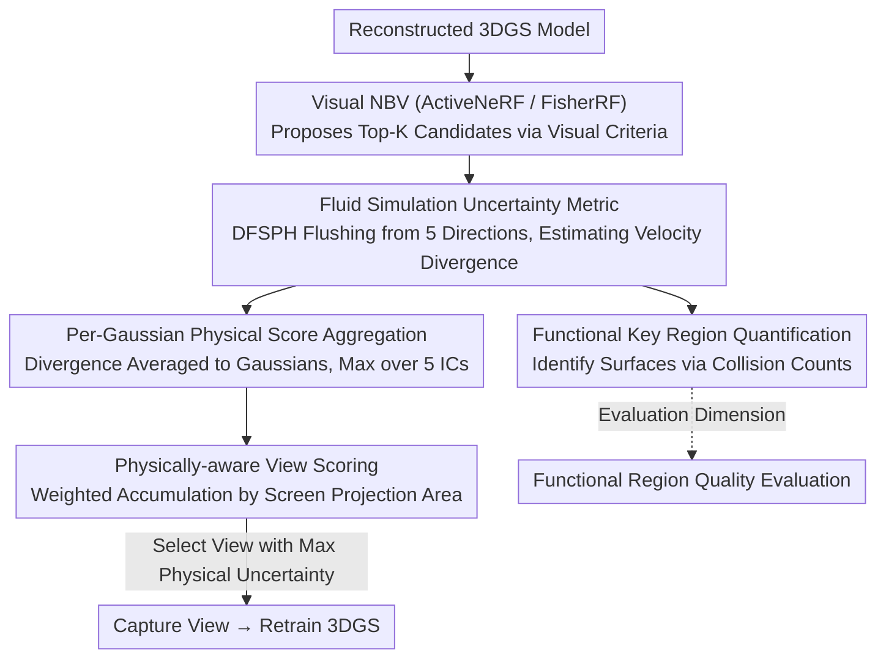

# FluidGaussian: Propagating Simulation-Based Uncertainty Toward Functionally-Intelligent 3D Reconstruction

**Conference**: CVPR 2026  
**arXiv**: [2603.21356](https://arxiv.org/abs/2603.21356)  
**Code**: [GitHub](https://github.com/delta-lab-ai/FluidGaussian)  
**Area**: 3D Vision / 3D Reconstruction  
**Keywords**: 3D Gaussian Splatting, Physics-aware Reconstruction, Fluid Simulation, Active View Selection, Uncertainty Quantification

## TL;DR

FluidGaussian is proposed to guide active view selection in 3D reconstruction through uncertainty metrics propagated via fluid simulation, ensuring that reconstruction results are not only visually realistic but also physically plausible for interactions.

## Background & Motivation

**Background**: Current 3D reconstruction methods (NeRF, 3DGS) primarily optimize visual fidelity using photometric losses, achieving realistic rendering. Active view selection methods (e.g., ActiveNeRF, FisherRF) select optimal views through variance reduction or Fisher information.

**Limitations of Prior Work**: These methods focus exclusively on appearance, ignoring the plausibility of physical interactions. Reconstructed 3D models may be visually perfect but perform poorly in physical simulations—for instance, producing excessive velocity field divergence in fluid simulations, indicating that the geometry is physically unreliable.

**Key Challenge**: A gap exists between visual fidelity (PSNR) in pixel space and physical interaction fidelity. A model with high PSNR may be an inadequate digital twin, failing in scenarios involving force or fluid coupling.

**Goal**: How can 3D reconstruction transcend pure visual cues to perceive real-world physical interactions and functionality?

**Key Insight**: Fluid simulation is utilized as a "probe" to expose defects in reconstructed geometry. The coupling between the fluid and the object surface covers the entire surface, providing dense feedback signals of quality.

**Core Idea**: A fluid simulation-based uncertainty measure is defined and coupled with existing vision-driven NBV strategies to select optimal views that simultaneously improve visual and physical fidelity.

## Method

### Overall Architecture

To address the limitation that existing Next-Best-View (NBV) methods only consider "what is unclear" rather than "what is physically incorrect," FluidGaussian attaches a fluid simulation probe as a posterior process to existing NBV pipelines. It specifically identifies views where the geometry is most physically untenable for additional capture. The process consists of two steps: first, an existing visual NBV (ActiveNeRF / FisherRF) proposes Top-K candidate camera poses; second, FluidGaussian calculates a physical uncertainty score for each candidate pose to select the view with the poorest physical quality. The scoring algorithm follows three layers: exposing geometric defects via fluid divergence $\rightarrow$ aggregating particle divergence to each Gaussian $\rightarrow$ converting Gaussian scores into camera scores based on visibility. Furthermore, the same fluid simulation produces a functional key region metric—identifying critical surfaces (e.g., aerodynamic/hydrodynamic) by fluid collision frequency—serving as an evaluation dimension more pertinent than global PSNR. This workflow requires no changes to training or architecture; it simply inserts a re-ranking layer during view selection, making it plug-and-play.

### Key Designs

**1. Simulation Uncertainty Metric: Exposing Geometric Defects via Fluid Divergence**

Photometric loss cannot determine physical correctness—a surface with small self-intersections or gaps might render well but fail during simulation. FluidGaussian uses a DFSPH (Divergence-Free SPH) simulator to "flush" the reconstructed object from five directions (4 horizontal + 1 top) and monitors the velocity divergence of fluid particles $D_i = |(\nabla \cdot \mathbf{v})_i|$, estimated via SPH kernel weighted summation:

$$(\nabla \cdot \mathbf{v})_i \approx \sum_{j \in \mathcal{N}_{h_r}(i)} V_j \cdot (\mathbf{v}_j - \mathbf{v}_i) \cdot \nabla W(\mathbf{x}_i - \mathbf{x}_j, h_k)$$

The effectiveness of this metric stems from DFSPH theoretically enforcing zero divergence. Numerical errors emerge only at the interface where fluid hits the structure; less accurate or rougher surfaces lead to larger interface divergence. Thus, divergence naturally serves as a heatmap for surface defects without requiring extra ground-truth supervision.

**2. Per-Gaussian Physical Score Aggregation: Mapping Particle Divergence to Gaussians**

Divergence is defined on fluid particles, but guiding view selection requires identifying problematic geometry (Gaussians). Divergence from nearby fluid particles is averaged to obtain a Gaussian's score under a specific initial condition (IC) $D_g^{(IC)} = \frac{1}{|\mathcal{P}_g^{(IC)}|} \sum_{i \in \mathcal{P}_g^{(IC)}} D_i^{(IC)}$, followed by taking the maximum across five initial conditions $D_g = \max_{IC} D_g^{(IC)}$. Multi-directional flushing eliminates bias from single directions—where defects on the back might be missed—while taking the maximum captures the worst-case scenario: if any direction exposes a geometric issue, it is marked as high uncertainty.

**3. Physically-aware View Scoring: Converting Gaussian Defects to Camera Scores**

Given physical scores for each Gaussian, the next step is determining which camera view to capture. For a candidate camera $\mathbf{T}$, visible Gaussians are accumulated using visibility weights:

$$S(\mathbf{T}) = \sum_{g \in \mathcal{G}_\mathbf{T}} w_g(\mathbf{T}) D_g$$

The weight $w_g(\mathbf{T}) = \frac{\pi R_g(\mathbf{T})^2}{HW}$ is the projection area of the Gaussian in screen space. Larger Gaussians contribute more to the view's score. The view with the highest score (maximum physical uncertainty) is selected as the next acquisition target, prioritizing the budget on regions with serious physical defects.

**4. Functional Key Region Quantification: Identifying Critical Surfaces via Collision Counts**

Not all surfaces are of equal importance—the aerodynamic front of a vehicle is critical, whereas leeward corners may be less significant. FluidGaussian uses the collision count $|\mathcal{P}_g|$ of fluid particles per Gaussian to mark functional key regions. Frequent collisions indicate higher importance in real physical interactions. This provides a more relevant evaluation dimension than global PSNR, allowing for the isolation of reconstruction quality on surfaces that simulation actually depends upon.

### Loss & Training

- Basic training still employs standard 3DGS photometric losses (L1 + SSIM).
- FluidGaussian does not modify the training loss but only alters the view selection strategy, maintaining its plug-and-play nature.
- Starting from 2 initial offset views with a total budget of 10 views.

## Key Experimental Results

### Main Results

| Method | Method | PSNR↑ | SSIM↑ | LPIPS↓ |
|--------|------|-------|-------|--------|
| Blender | FisherRF | 23.42 | 0.876 | 0.107 |
| Blender | +FluidGaussian | **24.74** | **0.891** | **0.092** |
| DrivAerNet++ | ActiveNeRF | 17.38 | 0.908 | 0.160 |
| DrivAerNet++ | +FluidGaussian | **18.87** | **0.930** | **0.127** |
| MipNeRF360 | FisherRF | 15.32 | 0.471 | 0.456 |
| MipNeRF360 | +FluidGaussian | **15.55** | **0.472** | **0.452** |

Visual PSNR achieved a maximum Gain of +8.6%, while velocity field divergence was reduced by up to -62.3%.

### Ablation Study

| Configuration | Description |
|------|------|
| 5 ICs vs. Single Direction | Multi-directional flushing eliminates bias; single directions may miss defects in certain areas. |
| Functional Region PSNR | A +7.7% PSNR Gain was observed in fluid interaction regions. |
| High/Low Reynolds Numbers | Physical defects are more apparent under high turbulence, where FluidGaussian shows greater advantages. |

### Key Findings

- Optimizing only for visual fidelity systematically underestimates physical quality—visual appeal does not equal physical plausibility.
- Fluid simulation as a "probe" exposes geometric defects (gaps, self-intersections, thin structures) at a fine-grained level.
- Improving physical fidelity also enhances visual quality, suggesting the two are not contradictory.

## Highlights & Insights

- First to introduce fluid simulation into 3D reconstruction uncertainty quantification, initiating a "functionally intelligent" reconstruction paradigm.
- Plug-and-play design—no changes to architecture or training, only to view selection.
- Metric design is versatile—divergence can be replaced by other physical quantities like vorticity.
- Provides a new direction for "simulation-ready" reconstruction in digital twin applications.

## Limitations & Future Work

- High computational overhead for fluid simulation; each NBV evaluation requires running SPH five times.
- Currently considers only incompressible fluids; not yet extended to compressible or multi-phase scenarios.
- View budget is fixed at 10; adaptive budget strategies were not explored.
- Supports only rigid boundaries; flexible objects are not handled.

## Related Work & Insights

- Bridges the gap between 3D reconstruction (3DGS/NeRF) and physical simulation (SPH fluid mechanics).
- Offers new insights for digital twins in engineering and scientific fields—reconstructions must not only "look right" but also "work right."
- Insight: Other physical interactions (collisions, deformations) can also serve as signals for reconstruction quality evaluation.

## Rating

- Novelty: ⭐⭐⭐⭐⭐ Introduces fluid simulation uncertainty into 3D reconstruction, pioneer defining "physics-aware" reconstruction.
- Experimental Thoroughness: ⭐⭐⭐⭐ Three datasets cover synthetic, real, and scientific scenarios, though large-scale data validation is lacking.
- Writing Quality: ⭐⭐⭐⭐⭐ Clear motivation, coherent logic, and complete physical derivations.
- Value: ⭐⭐⭐⭐ High application value for digital twins and simulation-ready assets.

<!-- RELATED:START -->

## Related Papers

- [\[CVPR 2026\] Uncertainty-driven 3D Gaussian Splatting Active Mapping via Anisotropic Visibility Field](uncertainty-driven_3d_gaussian_splatting_active_mapping_via_anisotropic_visibili.md)
- [\[ICML 2026\] Trust3R: Evidential Uncertainty for Feed-Forward 3D Reconstruction](../../ICML2026/3d_vision/trust_it_or_not_evidential_uncertainty_for_feed-forward_3d_reconstruction_with_t.md)
- [\[ICLR 2026\] Uncertainty-Aware 3D Reconstruction for Dynamic Underwater Scenes](../../ICLR2026/3d_vision/uncertainty-aware_3d_reconstruction_for_dynamic_underwater_scenes.md)
- [\[CVPR 2026\] PhysHead: Simulation-Ready Gaussian Head Avatars](physhead_simulation-ready_gaussian_head_avatars.md)
- [\[CVPR 2026\] GaussianFluent: Gaussian Simulation for Dynamic Scenes with Mixed Materials](gaussianfluent_gaussian_simulation_for_dynamic_scenes_with_mixed_materials.md)

<!-- RELATED:END -->
