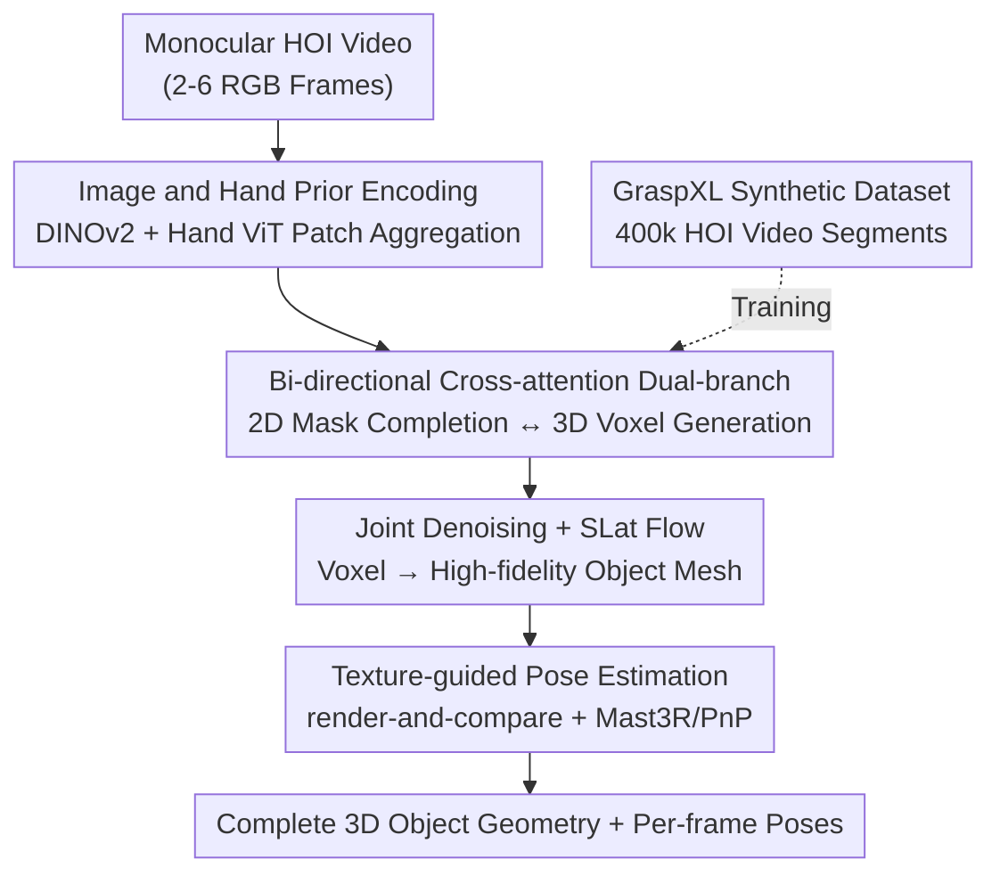

# ForeHOI: Feed-forward 3D Object Reconstruction from Daily Hand-Object Interaction Videos

**Conference**: CVPR 2026  
**Paper**: [CVF Open Access](https://openaccess.thecvf.com/content/CVPR2026/html/Chen_ForeHOI_Feed-forward_3D_Object_Reconstruction_from_Daily_Hand-Object_Interaction_Videos_CVPR_2026_paper.html)  
**Code**: https://github.com/Tao-11-chen/ForeHOI  
**Area**: 3D Vision  
**Keywords**: Hand-Object Interaction, Feed-forward Reconstruction, 3D Shape Completion, Diffusion Models, Occlusion Completion  

## TL;DR
ForeHOI utilizes an end-to-end feed-forward network to directly reconstruct the geometry of objects heavily occluded by hands from monocular hand-object interaction videos. By leveraging a dual-branch diffusion model that simultaneously predicts "completed 2D object masks" and "complete 3D voxels" with bi-directional interaction, it compresses tasks that previously required hours of optimization to under one minute, while surpassing optimization-based methods in accuracy.

## Background & Motivation
**Background**: Daily monocular videos are filled with footage of hands grasping objects, serving as a precious data source for embodied intelligence. 3D hand reconstruction has matured significantly in recent years (MANO + data-driven regression models), but the reconstruction of the "grasped object" in these videos has been largely overlooked.

**Limitations of Prior Work**: Reconstructing hand-held objects is challenging for two reasons: ① Hand occlusion and object self-occlusion mean the object is never fully visible in any single frame; ② The relative motion between the camera, hand, and object in monocular video is difficult to estimate. Existing approaches have significant flaws: EasyHOI simplifies the problem to single-image input and uses 2D inpainting + 3D generation models, losing multi-view/temporal information from the video; MagicHOI embeds pre-trained novel-view synthesis models into radiance field optimization, but the pipeline is complex, viewpoint inconsistency errors accumulate across stages, and optimizing the radiance field takes hours; Methods that use VGGT for initial reconstruction followed by completion fail because the initial VGGT results collapse under heavy occlusion.

**Key Challenge**: To reconstruct under severe occlusion, both the 2D observation and the 3D shape must be completed simultaneously. However, existing methods either only complete 2D (losing video info via single-image routes) or split 2D completion and 3D reconstruction into serial multi-stage processes (causing error accumulation and slowness). Two tasks that should naturally assist each other are currently disconnected.

**Goal**: Eliminate all preprocessing (SfM, separate hand/object masks, radiance field optimization) and create a feed-forward model that takes video segments and outputs object geometry in less than a minute.

**Key Insight**: The authors observe that 2D mask completion and 3D shape completion are highly coupled and mutually reinforcing. A complete 2D object contour informs the 3D branch about "where the boundary is behind the hand," while the 3D geometry in turn constrains the 2D mask to remain self-consistent. By placing them in a joint diffusion framework for joint prediction and bi-directional information exchange, occlusion issues can be effectively resolved.

**Core Idea**: Utilize a dual-branch Diffusion Transformer (DiT) structure where the 2D mask completion branch and the 3D voxel generation branch feed features to each other via bi-directional cross-attention for end-to-end joint denoising. A high-fidelity synthetic hand-object interaction dataset with 400,000 samples was created to train this model.

## Method

### Overall Architecture
The input is a monocular RGB hand-object interaction video with limited viewpoints (randomly taking 2–6 frames during training), and the output consists of a complete 3D object mesh and object poses for each frame. The entire pipeline is fully feed-forward: first, each frame is encoded into features containing both image semantics and hand priors; then, a dual-branch DiT structure performs joint denoising for "2D object mask completion" and "3D voxel generation" via bi-directional cross-attention; after voxel generation, it is refined into a high-fidelity mesh using a structured latent (SLat) flow; finally, object poses per frame are estimated via render-and-compare + Mast3R matching.

### Key Designs

**1. Image and Hand Prior Encoding: Explicitly informing the model "where the hand is and what it blocks"**

Hands are the source of occlusion, so the model must understand the shape and position of the hand. The authors extract two sets of features for each frame: image patch features via DINOv2 and hand features $F_{hand}\in\mathbb{R}^{n\times1024}$ via the ViT backbone of a SOTA hand pose estimation model. These are concatenated patch-to-patch into $F_{input}\in\mathbb{R}^{n\times2048}$ and projected back to $\mathbb{R}^{n\times1024}$ via a two-layer MLP. Crucially, these features are pixel-aligned with each frame, naturally carrying implicit local camera-space information and bypassing scale inconsistency issues between multiple frames. This encoding eliminates the need for separate hand/object mask inputs during inference.

**2. Bi-directional Cross-attention Dual-branch: Cross-feeding features between 2D mask and 3D shape completion**

This is the core of the work. Early experiments showed that directly regressing complete geometry is extremely difficult. The authors split the problem into two complementary tasks: per-frame completion of the full object mask (2D) and generation of the full object voxel (3D), trained jointly in the same DiT. The geometry branch starts from a $64\times64\times64$ noisy latent variable and denoises it into coarse geometry. Unlike ReconViaGen which uses image features as conditions, the authors **replace the geometric branch's conditioning in each DiT block with features from the mask branch** (layer-to-layer correspondence), allowing the mask branch to guide shape reconstruction. Conversely, 3D features from the geometry branch are fed back to the mask branch as contextual signals via additional cross-attention:

$$y_{j+1}=\sum_{k=1}^{N}\mathrm{CrossAttn}\big(Q(y_j),K(x_i^n),V(x_i^n)\big)\cdot w_n,\quad x_{i+1}=\mathrm{CrossAttn}\big(Q(x_i),K(y_j),V(y_j)\big)$$

where $y_j$ is the 3D feature of the $j$-th block in the geometry branch, $x_i$ is the image feature after the $i$-th block in the mask branch, $N$ is the number of frames, and $w_n$ is the fusion weight for the $n$-th frame. An engineering benefit: multi-view features are merged using weighted cross-attention rather than concatenation, ensuring GPU memory grows moderately as sequence length increases. The mask branch provides the 3D branch with "complete object contours" for each view, while 3D geometry constrains the mask completion to be consistent.

**3. Conditional Flow Matching Joint Training + SLat Mesh Refinement: Synchronous 2D and 3D denoising**

The two branches are trained end-to-end using Conditional Flow Matching (CFM), with synchronous supervision on 2D masks and 3D latents using the **same random time step $t$**:

$$\mathcal{L}_{CFM}(\theta)=\mathbb{E}_{t,x_0,\epsilon}\big\|v_\theta(x,t)-(\epsilon-x_0)\big\|_2^2,\qquad \mathcal{L}=\mathcal{L}^{2D}_{CFM}+\beta\,\mathcal{L}^{3D}_{CFM}$$

where $v_\theta(x,t)$ is the predicted velocity field. At inference, given noisy 3D voxels or 2D maps $x_0\sim p_0$, masks and voxels are deniosed synchronously using Euler sampling. The generated voxels then pass through a masked multi-view SLat flow (finetuned on this paper's data) to refine into high-fidelity surfaces (following TRELLIS). A key modification for occlusion: the SLat stage replaces "complete object image" inputs with "occluded object images" and uses DINOv2 features instead of VGGT features, as the latter are unreliable under heavy occlusion.

**4. Texture-guided Pose Estimation: Back-calculating per-frame poses using the textured model**

Many real-world objects are highly symmetric, causing rotational ambiguity if using only geometry. The authors use texture-based render-and-compare. 30 reference images are rendered from viewpoints uniformly distributed on a sphere and paired with input frames through VGGT to obtain coarse camera poses. Since the rendered viewpoints are known, the transformation to object space can be solved. Mast3R is then used to find 2D correspondences between input frames and rendered views (chosen for its robustness to imperfect textures), followed by PnP + RANSAC for iterative refinement.

### Loss & Training
The objective is the joint CFM loss $\mathcal{L}=\mathcal{L}^{2D}_{CFM}+\beta\,\mathcal{L}^{3D}_{CFM}$. The SLat refinement stage follows the loss from TRELLIS phase two. Both DiT stages are finetuned using LoRA (rank 64, alpha 128, inserted in qkv and output projections). Training uses 2–6 random viewpoints, images resized to $518\times518$ ($47\times47$ patches). The model was **trained only on self-constructed synthetic data and not finetuned on real data**, yet it generalizes to real benchmarks. Training took 4 days on 8 NVIDIA L20 40G GPUs with a total batch size of 32.

### Dataset Construction
Lacking large-scale HOI data, the authors created the first high-fidelity synthetic dataset based on GraspXL: adding parametric textures and random skin tones to MANO hands, filtering high-quality grasp sequences from Objaverse based on texture and motion, and rendering multi-view videos in Blender with randomized lighting. This resulted in 400,000 samples with full annotations for hand masks, object masks, hand poses, object poses, and depth maps.

## Key Experimental Results

### Main Results
Evaluated on HO3D (14 sequences) and the challenging egocentric HOT3D (6 segments). Metrics include Chamfer Distance (CD, cm) and F-score@5mm/@10mm (%).

| Method | HO3D CD↓ | HO3D F@5↑ | HO3D F@10↑ | HOT3D CD↓ | HOT3D F@5↑ | HOT3D F@10↑ | Avg Time (min) |
|------|---------|----------|-----------|----------|-----------|------------|------------|
| EasyHOI | 1.83 | 46.35 | 69.24 | 1.21 | 18.46 | 34.25 | 175 |
| HOLD | 1.36 | 66.42 | 82.43 | N/A | N/A | N/A | 330 |
| HORT | N/A | N/A | N/A | 2.32 | 16.52 | 20.43 | 0.8 |
| MagicHOI | 0.86 | 64.53 | 91.87 | N/A | N/A | N/A | 58 |
| **Ours** | **0.79** | **68.95** | **93.72** | **1.03** | **60.5** | **89.1** | **1.1** |

Geometric accuracy leads in both datasets, with processing time around 1 minute—approximately a 100× speedup compared to MagicHOI and HOLD. The advantage is particularly large on HOT3D (F@5 jumped from 18.46 to 60.5) because it contains fast interaction and heavy occlusion where SfM often fails; HOLD/MagicHOI rely on SfM poses.

Pose Estimation (HO3D) vs. HOLD and Dynhor:

| Method | RPE(cm)↓ | RPE(°)↓ | ATE(m)↓ |
|------|---------|--------|--------|
| HOLD | 5.87 | 6.24 | 0.27 |
| Dynhor | 4.25 | 5.25 | 0.24 |
| **Ours** | **1.42** | **2.64** | **0.13** |

### Ablation Study
Ablating key designs and data impact (HO3D):

| Config | CD(cm)↓ | F@5(%)↑ | F@10(%)↑ | Description |
|------|--------|--------|---------|------|
| MV data | 1.23 | 25.54 | 68.54 | ReconViaGen backbone + General data + random occlusion |
| our data | 0.91 | 53.64 | 80.63 | Trained on our HOI data |
| + hand feats | 0.88 | 54.53 | 85.43 | Added hand feature input |
| + mask comp. | **0.79** | **68.95** | **93.72** | Added 2D mask completion branch (Full) |

### Key Findings
- **Data is the primary driver**: Switching to the proposed HOI data (without architecture changes) increased F@5 from 25.54 to 53.64. General multi-view data cannot replace real HOI scenarios where hands grasp and rotate objects.
- **2D mask completion branch contributes most**: Adding it pushed F@5 from 54.53 to 68.95 (+14.4).
- **Hand features resolve "finger imprints"**: Without hand features, the model mistakenly completes objects with concave "finger imprints" at contact points.

## Highlights & Insights
- **Leveraging 2D mask completion as free supervision for 3D reconstruction**: 2D mask completion is a relatively simple task that forces the network to understand interaction boundaries, which then benefits 3D via bi-directional attention.
- **Weighted cross-attention instead of concatenation**: Using $w_n$ prevents memory explosions for long sequences, a practical trick for feed-forward multi-view reconstruction.
- **Abandoning VGGT in occlusion**: Replacing VGGT with DINOv2 features during the SLat stage because VGGT is unreliable when objects are heavily blocked.

## Limitations & Future Work
- The model **relies entirely on synthetic data training**. While it generalizes well, it is unclear if synthetic grasp (GraspXL) distributions cover all real-world long-tail cases; ⚠️ complex bimanual interactions or deformable objects were not evaluated.
- HOT3D evaluation used only 6 short segments (5–15 frames), which might limit statistical robustness.
- Pose estimation depends on generated texture quality; if textures are poor, pose accuracy may suffer.

## Related Work & Insights
- **vs EasyHOI**: EasyHOI is single-image and serial; the proposed method uses video and a joint 2D/3D feed-forward framework to avoid error accumulation.
- **vs MagicHOI**: MagicHOI uses radiance field optimization (slow, 58 min); this method uses native 3D diffusion to ensure consistency in 1 minute.
- **vs ReconViaGen / TRELLIS**: This work adapts single-image native 3D generation to video HOI occlusion by extending it to a dual-branch architecture and swapping features for better occlusion handling.

## Rating
- Novelty: ⭐⭐⭐⭐⭐ First feed-forward method for HOI video reconstruction; clever dual-branch design.
- Experimental Thoroughness: ⭐⭐⭐⭐ Strong results and ablation, though HOT3D sample size is small.
- Writing Quality: ⭐⭐⭐⭐ Clear motivation and mechanism descriptions.
- Value: ⭐⭐⭐⭐⭐ 100× speedup and large-scale 400k dataset release are highly practical for embodied AI.

<!-- RELATED:START -->

## Related Papers

- [\[CVPR 2026\] Glove2Hand: Synthesizing Natural Hand-Object Interaction from Multi-Modal Sensing Gloves](glove2hand_synthesizing_natural_hand-object_interaction_from_multi-modal_sensing.md)
- [\[CVPR 2026\] CARI4D: Category Agnostic 4D Reconstruction of Human-Object Interaction](cari4d_category_agnostic_4d_reconstruction_of_human_object_interaction.md)
- [\[CVPR 2026\] DuoMo: Dual Motion Diffusion for World-Space Human Reconstruction](duomo_dual_motion_diffusion_for_world-space_human_reconstruction.md)
- [\[CVPR 2026\] FunREC: Reconstructing Functional 3D Scenes from Egocentric Interaction Videos](funrec_reconstructing_functional_3d_scenes_from_egocentric_interaction_videos.md)
- [\[CVPR 2026\] Fast3Dcache: Training-free 3D Geometry Synthesis Acceleration](fast3dcache_training-free_3d_geometry_synthesis_acceleration.md)

<!-- RELATED:END -->
