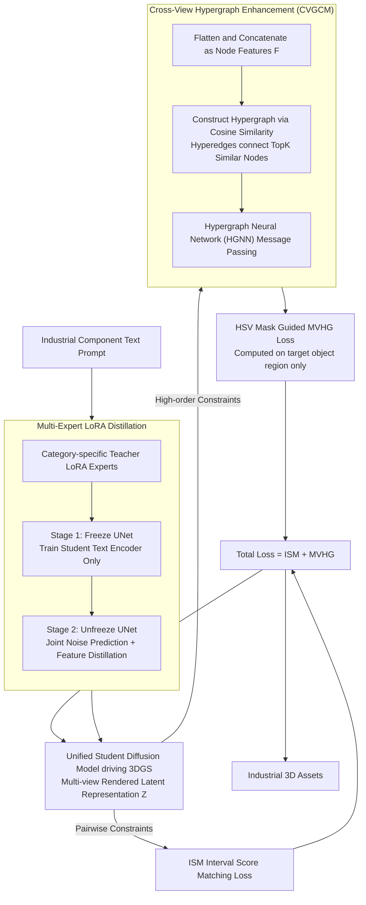

# ForgeDreamer: Industrial Text-to-3D Generation with Multi-Expert LoRA and Cross-View Hypergraph

**Conference**: CVPR 2026 Findings  
**arXiv**: [2603.09266](https://arxiv.org/abs/2603.09266)  
**Code**: [GitHub](https://github.com/Junhaocai27/ForgeDreamer)  
**Area**: 3D Vision  
**Keywords**: Text-to-3D, Industrial 3D Generation, LoRA Distillation, Hypergraph Geometric Consistency, 3D Gaussian Splatting

## TL;DR

The ForgeDreamer framework is proposed to address semantic adaptation in the industrial domain via multi-expert LoRA teacher-student distillation. By integrating high-order geometric consistency constraints through cross-view hypergraph geometric enhancement, it outperforms existing methods in industrial text-to-3D generation tasks.

## Background & Motivation

Text-to-3D generation technologies (e.g., DreamFusion, ProlificDreamer) have achieved significant progress in natural scenes but face two critical bottlenecks in industrial applications:

**Background**: Pre-trained diffusion models are trained on natural scenes and lack sufficient semantic understanding of industrial components (screws, nuts, electronic components, etc.). 

**Limitations of Prior Work**: Conventional LoRA fusion schemes suffer from knowledge interference when merging multiple category-specific adapters. 

**Key Challenge**: Existing methods rely on pairwise consistency constraints, failing to capture the high-order structural dependencies required for precision manufacturing. This leads to artifacts in details such as thread textures and connector interfaces.

Existing industrial 3D datasets (e.g., MVTec 3D-AD, Real-IAD) have limited viewpoints and inconsistent imaging conditions, making them unsuitable for text-to-3D generation. Consequently, the authors also constructed a controlled multi-view industrial dataset.

## Method

### Overall Architecture

ForgeDreamer is based on 3D Gaussian Splatting and addresses two bottlenecks: poor semantic understanding of industrial components and the inadequacy of pairwise geometric constraints for precision details. The framework uses two sequential modules: a Multi-Expert LoRA Ensemble to instill multi-category industrial semantics into a unified diffusion model, followed by Cross-View Hypergraph Geometric Enhancement (CVGCM) to impose high-order geometric constraints across multiple views. The system is driven by the joint optimization of ISM and MVHG losses:

$$\mathcal{L}_{\text{total}} = \lambda_{\text{ISM}} \mathcal{L}_{\text{ISM}} + \lambda_{\text{MVHG}} \mathcal{L}_{\text{MVHG}}$$

### Key Designs

**1. Multi-Expert LoRA Distillation: Integrating multi-category industrial knowledge without interference**

Pre-trained models lack semantics for industrial components, and simply stacking LoRAs ($\boldsymbol{W}_{\text{combined}} = \boldsymbol{W}_{\text{base}} + \sum_i \boldsymbol{W}_{\text{LoRA}}^{(i)}$) causes knowledge interference. ForgeDreamer trains a LoRA expert for each category as a Teacher, then uses two-stage distillation to integrate knowledge into a unified Student model. Stage 1 freezes the UNet and trains the text encoder to prevent catastrophic forgetting, using text feature alignment $\mathcal{L}_{\text{text}} = \sum_l \alpha_l \cdot \text{MSE}(\text{Pool}(\boldsymbol{f}_T^l), \text{Pool}(\boldsymbol{f}_S^l))$. Stage 2 unfreezes the UNet for joint optimization with UNet feature distillation $\mathcal{L}_{\text{unet}} = \sum_m \beta_m \cdot \text{MSE}(\boldsymbol{u}_T^m, \boldsymbol{u}_S^m)$, using round-robin training to ensure balanced transfer.

**2. CVGCM: Upgrading pairwise consistency to high-order multi-view consistency**

Details like industrial screw threads require simultaneous consistency across multiple views, which pairwise constraints cannot ensure. CVGCM models geometric consistency as hypergraph learning. Latent representations $\boldsymbol{Z} = \{\boldsymbol{z}^{(i)} \in \mathbb{R}^{H \times W \times C}\}_{i=1}^N$ are flattened into node features $\boldsymbol{F} \in \mathbb{R}^{(N \cdot H \cdot W) \times C}$. A hypergraph $\mathcal{H} = (\mathcal{V}, \mathcal{E})$ is constructed where hyperedges connect TopK similar nodes $e_i = \{v_j : v_j \in \text{TopK}(\text{sim}(\boldsymbol{f}_i, \boldsymbol{f}_j), k)\}$. Message passing in the HGNN is defined as $\boldsymbol{h}_v^{(l+1)} = \sigma(\boldsymbol{W}^{(l)} \sum_{e \in \mathcal{E}(v)} \frac{1}{|\mathcal{E}(v)|} \text{AGG}(\{\boldsymbol{h}_u^{(l)} : u \in e\}))$, capturing high-order structural dependencies.

**3. HSV Mask Guided MVHG Loss: Focusing geometric constraints on the target object**

To prevent background noise from diluting geometric signals, an HSV mask $\mathcal{M}$ isolates the target object. The loss is computed only within the object region of the cross-view feature space:

$$\mathcal{L}_{\text{MVHG}} = \frac{1}{|\mathcal{M}|} \sum_{(h,w) \in \mathcal{M}} \|\boldsymbol{F}_z^{\text{masked}}[h,w,:] - \boldsymbol{F}_{\text{pred}}^{\text{masked}}[h,w,:]\|_2^2$$

### Loss & Training

- Distillation training follows a two-stage strategy: Stage 1 stabilizes semantics, and Stage 2 performs joint optimization.
- The 3D generation phase uses a joint optimization of ISM and MVHG losses.
- During inference, the process iteratively renders views, processes them via CVGCM, and updates 3DGS parameters.

## Key Experimental Results

### Main Results

The self-built industrial dataset includes 10 categories (6 mechanical parts + 4 electronic components), with 20 multi-view high-resolution images per category.

| Method | Avg. Time | Avg. T3Bench Quality Score |
|------|---------|-------------------|
| ProlificDreamer (w/o LoRA) | ~10 hours | 25.13 |
| DreamFusion (w/o LoRA) | 6 hours | 41.91 |
| DreamFusion (w/ LoRA) | 6 hours | 44.83 |
| RichDreamer (w/o LoRA) | 120 min | 28.27 |
| LucidDreamer (w/o LoRA) | 110 min | 47.10 |
| LucidDreamer (w/ LoRA) | 110 min | 46.75 |
| **ForgeDreamer (Ours)** | **190 min** | **50.88** |

### Ablation Study

| Configuration | 2 LoRAs | 4 LoRAs | 6 LoRAs | Note |
|------|---------|---------|---------|------|
| Addition Fusion | 0.938 | 0.814 | 0.633 | CLIP similarity drops sharply as LoRAs increase |
| Distillation Fusion | 0.965 | 0.949 | 0.952 | Distillation maintains stable concept preservation |

### Key Findings

- Distillation fusion maintains a concept preservation score >0.95 as the number of LoRAs increases, whereas additive fusion drops to 0.633.
- MVHG loss significantly improves geometric fidelity and spatial consistency, eliminating cross-view topological inconsistencies and distortions in fine structures.
- The combination of distilled LoRA and MVHG loss achieves the best results, demonstrating synergy.

## Highlights & Insights

- **From Pairwise to High-Order**: Shifting geometric consistency from pairwise constraints to hypergraph-based high-order constraints is an elegant paradigm shift.
- **Distillation over Stacking**: The teacher-student distillation strategy for multiple LoRAs effectively resolves knowledge interference issues compared to simple addition.
- **Semantic First**: The progressive logic of enhancing semantic understanding before optimizing geometric precision is theoretically sound.

## Limitations & Future Work

- The self-built dataset is small (20 images/category); generalization needs further verification.
- The generation time of 190 minutes remains high for industrial real-time applications.
- Hypergraph construction relies on TopK similarity, which may fail for drastically different viewpoints.
- Validated only on industrial scenes; impact on natural scenes remains unexplored.

## Related Work & Insights

- SDS/ISM from DreamFusion/LucidDreamer serve as the foundation, with this work providing systematic improvements for industrial scenarios.
- The application of Hypergraph Neural Networks (HGNN) in 3D generation is noteworthy; Hyper-3DG explores similar concepts.
- The multi-LoRA distillation framework may be applicable to other generative tasks requiring multi-domain adaptation.

## Rating

- Novelty: ⭐⭐⭐⭐ The combination of hypergraph geometric consistency and Multi-Expert LoRA distillation is innovative.
- Experimental Thoroughness: ⭐⭐⭐ The dataset scale is small, and comparisons with more baselines are needed.
- Writing Quality: ⭐⭐⭐⭐ Method descriptions are clear with logical progression.
- Value: ⭐⭐⭐ Industrial 3D generation is a valuable direction, though the application niche is relatively narrow.

<!-- RELATED:START -->

## Related Papers

- [\[CVPR 2026\] Cross-Instance Gaussian Splatting Registration via Geometry-Aware Feature-Guided Alignment](cross-instance_gaussian_splatting_registration_via_geometry-aware_feature-guided.md)
- [\[CVPR 2026\] Coverage Optimization for Camera View Selection](coverage_optimization_for_camera_view_selection.md)
- [\[CVPR 2026\] 3D-Aware Multi-Task Learning with Cross-View Correlations for Dense Scene Understanding](3d-aware_multi-task_learning_with_cross-view_correlations_for_dense_scene_unders.md)
- [\[CVPR 2026\] DropAnSH-GS: Dropping Anchor and Spherical Harmonics for Sparse-view Gaussian Splatting](dropping_anchor_and_spherical_harmonics_for_sparse-view_gaussian_splatting.md)
- [\[CVPR 2026\] Learning Multi-View Spatial Reasoning from Cross-View Relations](learning_multi-view_spatial_reasoning_from_cross-view_relations.md)

<!-- RELATED:END -->
