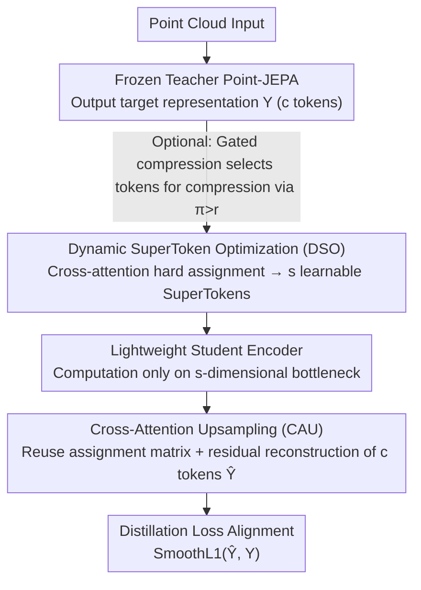

# Foundry: Distilling 3D Foundation Models for the Edge

**Conference**: CVPR 2026  
**arXiv**: [2511.20721](https://arxiv.org/abs/2511.20721)  
**Code**: None  
**Area**: 3D Vision / Model Compression  
**Keywords**: Foundation model distillation, 3D point clouds, SuperToken, representation space compression, edge deployment

## TL;DR

This paper proposes the Foundation Model Distillation (FMD) paradigm and the Foundry framework. By utilizing a "compress-and-reconstruct" objective, the student model learns a set of learnable SuperTokens to compress the teacher's latent space basis vectors. The resulting single distilled model maintains universality across multiple tasks such as classification, segmentation, and few-shot learning, while reducing FLOPs from 478G to as low as 137G.

## Background & Motivation

**Background**: Self-supervised learning (SSL) pre-trained foundation models have become powerful universal feature extractors, particularly in the 3D point cloud domain (e.g., Point-BERT, Point-JEPA), and are widely applied in robotics, autonomous driving, and AR/VR. These models acquire strong generalization capabilities for various downstream tasks through pre-training on large-scale unlabeled data.

**Limitations of Prior Work**: These foundation models are massive (hundreds of millions of parameters with quadratic attention complexity), making them unusable on edge devices like robots or AR headsets. Even on modern GPUs, processing medium-scale point clouds of 300k points can result in OOM (Out of Memory). although existing knowledge distillation (KD) methods can create efficient student models, they typically produce "expert models"—specialized in specific tasks but losing the core task-agnostic universality of foundation models.

**Key Challenge**: Standard knowledge distillation trains students on task-specific logits, creating students that only inherit the teacher's behavior for that specific task without cross-task transferability. This contradicts the core value of foundation models—universal representation capability. An ideal distillation method should preserve the teacher's entire representation space rather than just its output for a specific task.

**Goal**: Design a new distillation paradigm to compress large SSL foundation models into compact, efficient, and faithful proxy models that retain their universal representation capabilities.

**Key Insight**: Instead of directly imitating teacher feature embeddings (feature mimicry), the student is forced to learn compact basis vectors of the teacher's latent space through an information bottleneck—first compressing into a few SuperTokens and then reconstructing the teacher's full token-level representation.

**Core Idea**: Replace "imitation" with "compression-reconstruction," allowing the student to learn not just a specific output but a set of basis vectors that can efficiently represent the teacher's entire latent space.

## Method

### Overall Architecture

Foundry addresses a specific problem: compressing a 3D self-supervised teacher with hundreds of millions of parameters into a student that fits on edge devices while **preserving the teacher's "task-agnostic" universal representation**. Instead of mimicking outputs for a specific task, it forces the student to learn how to "contain" and "restore" the teacher's entire latent space using a narrow set of SuperTokens.

The forward pass consists of three steps. First, the frozen teacher processes the point cloud and outputs the target representation $\mathbf{Y} \in \mathbb{R}^{c \times d}$ ($c$ tokens). Next, the DSO module compresses these $c$ tokens into $s \ll c$ learnable SuperTokens, which are processed by a lightweight student encoder. The CAU module then reconstructs the full token-level representation $\hat{\mathbf{Y}} \in \mathbb{R}^{c \times d}$ from these SuperTokens. Finally, the two are aligned using a single objective: $\mathcal{L}_{distillation} = \text{SmoothL1}(\hat{\mathbf{Y}}, \mathbf{Y})$. Specifically: the teacher provides $c$ tokens, DSO hard-assigns them into $s=16$ bins and takes the mean to obtain 16 SuperTokens, the student computes only on this 16-dimensional bottleneck, and CAU "stretches" it back to $c$ tokens. The narrower the bottleneck, the more the student is forced to learn the "principal components" of the teacher's latent space. Additionally, optional gated compression predicts a fusion probability for each token before compression, allowing a single student to adjust accuracy/speed as needed during deployment.

### Key Designs

**1. Dynamic SuperToken Optimization (DSO): Compressing $c$ tokens into learnable latent space basis vectors**

Direct L2 imitation of teacher features causes the student to copy the surface level without learning the structure of the representation space. DSO takes a different approach by maintaining a set of randomly initialized, end-to-end learnable SuperTokens $\mathbf{S} \in \mathbb{R}^{s \times d}$ as basis vectors. During compression, a cross-attention mechanism (SuperTokens as query, input tokens as key/value) calculates a hard assignment matrix—assigning token $j$ to its best-matching SuperToken: $\text{CAM}_{j,i} = 1$ when $i = \arg\max_k \frac{\mathbf{q}_k \cdot \mathbf{k}_j}{\sqrt{d}}$. The SuperToken is then updated by averaging all values assigned to it:

$$\mathbf{S}_{updated} = \frac{\text{CAM}^T \mathbf{V}}{\text{sum}(\text{CAM}^T, \text{axis}=1)}$$

To handle the non-differentiable hard $\arg\max$, Gumbel-Softmax is utilized. The key difference from static K-Means clustering is "learnability": K-Means centroids only reflect geometric distribution, whereas SuperTokens are optimized alongside the distillation objective, ultimately residing in information-dense directions (leading to a 13.6% improvement in ablation). Furthermore, semantic grouping is performed before adding positional encodings so that compression is based on content rather than coordinates.

**2. Cross-Attention Upsampling (CAU): High-fidelity reconstruction from SuperTokens**

Compression is a means to an end; since the distillation objective requires token-wise alignment, the $s$ SuperTokens must be "stretched" back to $c$ tokens. CAU reuses the DSO assignment matrix (CAM) as a router: each original token position follows the CAM to retrieve its corresponding SuperToken (updated by the student encoder), adds it to the original input token via a residual connection, and maps it back to the teacher's dimension through an MLP:

$$\hat{\mathbf{Y}} = \text{MLP}(\mathbf{T} + \text{CAM} \cdot \mathbf{S}_{encoder\_out})$$

The residual connection is critical—the SuperToken bottleneck naturally loses local high-frequency details, and injecting the original tokens $\mathbf{T}$ back restores this information for high-fidelity reconstruction. Reusing the CAM ensures upsampling adds almost no overhead.

**3. Gated Compression (Optional): Adjusting accuracy vs. speed at deployment**

Different scenarios require different trade-offs between accuracy and latency, but retraining is costly. The gating mechanism adds a 2-layer MLP to predict a fusion probability $\pi_i$ for each token: only tokens with $\pi_i > r$ (a user-defined threshold) pass through DSO for compression, while others bypass compression and enter the student encoder alongside SuperTokens. Training includes a regularization term $\mathcal{L}_{gate} = -\lambda_{gate} \sum_i \pi_i$ to encourage compression. During deployment, the threshold $r$ can be adjusted to slide between accuracy and computation without retraining.

### Loss & Training

- Core Distillation Loss: $\mathcal{L}_{distillation} = \text{SmoothL1}(\hat{\mathbf{Y}}, \mathbf{Y})$
- Gated version: $\mathcal{L} = \mathcal{L}_{distillation} + \mathcal{L}_{gate}$
- Training on ShapeNet55 for 150 epochs. Student encoder is initialized from teacher weights (optional freezing).
- Teacher models are Point-JEPA with ViT-S architecture.

## Key Experimental Results

### Main Results (Universal Model vs. Expert Model)

| Method | ShapeNet55 Classification Acc | ShapeNetPart Seg mIoU_C/mIoU_I |
|--------|------|------|
| Teacher (Point-JEPA) | 90.54 | 83.91/85.73 |
| Foundry (Universal, 16 SuperTokens) | 89.87 | 81.87/84.82 |
| Expert-Classification (KD Distill) | 75.09 | - |
| Expert-Segmentation (KD Distill) | - | 61.88/65.72 |

### Ablation Study on SuperToken Mechanism

| Method | ShapeNet55 Acc |
|------|---------|
| Foundry (Learnable DSO+CAU) | 89.68 |
| KMeans-Student (Static Clustering) | 76.08 |
| FPS-Student (Pre-sampling) | 87.56 |

### Key Findings

- **FMD Universal Model outperforms Expert Distillation**: A single universal student maintains high performance across both tasks (89.87%/81.87%), while expert students collapse on their native tasks (75.09% for classification, 61.88% for segmentation), proving the superiority of the FMD paradigm.
- **Learnable SuperTokens are superior to static methods**: DSO outperforms K-Means by 13.6% (89.68 vs 76.08), proving the necessity of end-to-end learnable basis vectors.
- **Extreme compression remains effective**: With only 1 SuperToken, Foundry still achieves 91.8% in 10-shot classification, close to the teacher's 96.1%.
- **Edge deployment viability**: FLOPs are reduced from 478G to 137-178G ($s$=1~16), and latency drops from 0.09s to 0.05-0.06s. Processing 300k points on a 6GB GPU, both the teacher and ToMe result in OOM, while Foundry requires only 4.0GB.
- Distillation loss is highly correlated (inversely) with downstream accuracy; diminishing returns appear after $s \geq 4$, suggesting very few SuperTokens are sufficient to span the teacher's latent space.

## Highlights & Insights

- **Paradigm Shift: From task-specific KD to representation distillation**: This is the most significant contribution. Traditional KD creates task experts, while FMD creates a miniature proxy of the foundation model. This paradigm shift is relevant for all edge deployment scenarios of foundation models.
- **Information Bottleneck Design via compress-and-reconstruct**: Forcing the student to reconstruct teacher representations through an extremely narrow SuperToken bottleneck captures latent space structure better than direct L2 feature mimicry. This approach could be transferred to 2D foundation models (e.g., DINOv2, SAM).
- **Compatibility with existing token compression methods**: The Foundry FMD framework can be combined with ToMe, PiToMe, and PatchMerger to further enhance performance.

## Limitations & Future Work

- Validated only on a single teacher (Point-JEPA ViT-S); generalization to other 3D foundation models (e.g., Point-MAE, PointGPT) and larger architectures (ViT-B/L) remains unknown.
- Currently limited to 3D point clouds; expansion to 2D image and video foundation models is an important future direction.
- While the gating mechanism offers inference flexibility, performance is sensitive to the choice of $\lambda_{gate}$ during training.
- Hard assignment in DSO might limit representation quality—misassigned tokens cannot be corrected (though CAU residuals partially compensate for this).
- End-to-end performance evaluation on actual edge devices (e.g., Jetson, smartphones) was not included.

## Related Work & Insights

- **vs. TinyCLIP/CLIP-KD**: These methods distill CLIP's cross-modal alignment (a specific capability), whereas Foundry distills the SSL model's entire representation space (universal capability), reflecting a fundamentally different philosophy.
- **vs. ToMe/PiToMe**: ToMe merges tokens online during inference for acceleration, whereas Foundry is offline distillation to create a new student model. They are complementary—experiments show that distilling a ToMe student using the FMD framework yields the best results.
- **vs. 3DLST**: 3DLST also uses learnable supertokens, but its goal is inference acceleration for specific segmentation tasks, not creating a universal proxy. Foundry upgrades this idea into a distillation objective.

## Rating

- Novelty: ⭐⭐⭐⭐⭐ Proposed the new FMD paradigm and clearly demonstrated the essential difference from traditional KD and direct feature mimicry.
- Experimental Thoroughness: ⭐⭐⭐⭐⭐ Tested on 6+1 datasets, universal vs. expert comparisons, varying SuperToken counts, gated variants, computational analysis, and large-scene tests.
- Writing Quality: ⭐⭐⭐⭐⭐ Concise problem definition, clear experimental hierarchy, and well-defined differentiation from related work.
- Value: ⭐⭐⭐⭐⭐ Directly facilitates edge deployment of 3D foundation models; the FMD paradigm has broad transfer potential.

<!-- RELATED:START -->

## Related Papers

- [\[CVPR 2026\] ESAM++: Efficient Online 3D Perception on the Edge](esam_efficient_online_3d_perception_on_the_edge.md)
- [\[CVPR 2026\] E2EGS: Event-to-Edge Gaussian Splatting for Pose-Free 3D Reconstruction](e2egs_event-to-edge_gaussian_splatting_for_pose-free_3d_reconstruction.md)
- [\[CVPR 2026\] MD2E: Modeling Depth-to-Edge Cues for Monocular Metric Depth Estimation](md2e_modeling_depth-to-edge_cues_for_monocular_metric_depth_estimation.md)
- [\[CVPR 2026\] Edges Compete for Trust: Group Relative Edge Optimization for Building Reconstruction from Point Clouds](edges_compete_for_trust_group_relative_edge_optimization_for_building_reconstruc.md)
- [\[CVPR 2026\] Depth Any Panoramas: A Foundation Model for Panoramic Depth Estimation](depth_any_panoramas_a_foundation_model_for_panoramic_depth_estimation.md)

<!-- RELATED:END -->
