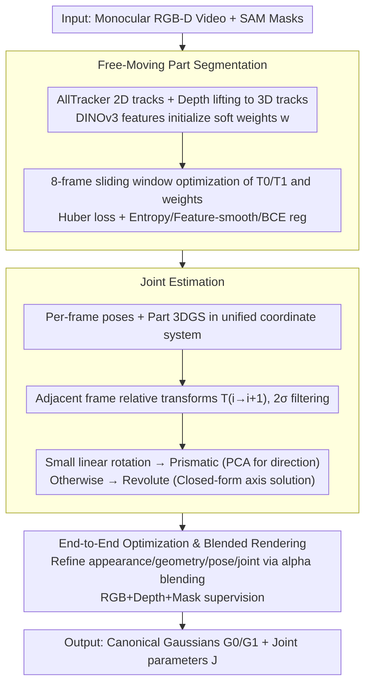

# FreeArtGS: Articulated Gaussian Splatting Under Free-Moving Scenario

**Conference**: CVPR 2026  
**arXiv**: [2603.22102](https://arxiv.org/abs/2603.22102)  
**Code**: [https://freeartgs.github.io/](https://freeartgs.github.io/)  
**Area**: 3D Vision  
**Keywords**: Articulated Object Reconstruction, Gaussian Splatting, Free-Moving, Joint Estimation, Motion Segmentation

## TL;DR
FreeArtGS proposes a method for reconstructing articulated objects from monocular RGB-D videos in "free-moving scenarios" (where object pose and joint states vary simultaneously). By utilizing a three-stage pipeline comprising motion-driven part segmentation, robust joint estimation, and end-to-end 3DGS optimization, it significantly outperforms all baselines on the self-produced FreeArt-21 benchmark and existing datasets.

## Background & Motivation

1. **Background**: Articulated object reconstruction is a critical problem in 3D vision with significant value for augmented reality and robotic simulation. Existing methods generally follow three directions: (a) foundation model-based single-image generation, which lacks generalization; (b) reconstruction from fixed multi-view cameras across two articulated states, requiring axis alignment; (c) reconstruction from monocular video, assuming a fixed base part.
2. **Limitations of Prior Work**: Single-image generation lacks post-optimization and generalizes poorly; multi-view dual-state methods suffer from difficult axis alignment, limiting practicality; monocular video methods rely on a "static base" assumption that is frequently violated in practice (e.g., both parts of scissors or pliers move during use) and suffer from incomplete coverage.
3. **Key Challenge**: In real-world scenarios, articulated objects are often manipulated freely—object poses and joint states change simultaneously without a fixed base reference. Existing methods cannot handle this natural usage scenario.
4. **Goal** To reconstruct the complete appearance, geometry, and joint parameters of articulated objects from monocular RGB-D video alone under free-moving scenarios.
5. **Key Insight**: Combine dense 2D point tracking priors with 3DGS optimization—using point tracking to provide motion cues for part segmentation and optimization for high-precision final reconstruction.
6. **Core Idea**: Use point tracking and feature priors for free-moving part segmentation, relative transformation estimation for joint type and axis identification, and end-to-end 3DGS optimization to jointly refine appearance, geometry, and joints.

## Method

### Overall Architecture
FreeArtGS addresses a setting previously avoided: when a person manipulates an object like scissors or pliers while recording, the global pose and joint state both vary throughout the video, and no part acts as a fixed reference. The input is a monocular RGB-D video and foreground masks generated by SAM, while the output consists of canonical Gaussians $\mathcal{G}_c^0, \mathcal{G}_c^1$ for the two parts and the connecting joint parameters $\mathcal{J}$.

The pipeline follows a "coarse-to-fine" three-step approach: first, the object is partitioned into two rigid parts based on motion differences; second, joint types (revolute or prismatic) and axes are inferred from the relative motion between parts; finally, appearance, geometry, camera poses, and joint parameters are refined together via differentiable rendering to eliminate errors from the initial steps. This logic utilizes off-the-shelf models (point tracking, features, pose) for a noisy but reasonable initialization, while optimization ensures convergence to high precision.

### Key Designs

**1. Free-Moving Part Segmentation: Partitioning by "Who Moves Differently"**

Previous monocular methods assume a static base part as an anchor, but this fails when both parts move during manipulation. FreeArtGS assumes that within a short time window, the motion of each rigid part can be approximated as an independent rigid transform. Segmentation thus becomes determining which transform each point follows. Specifically, pixel-level 2D tracks from AllTracker are lifted to 3D using depth, and DINOv3 features initialize a soft part weight $w_{t,p} \in [0,1]$ for each point. Within an 8-frame sliding window, two rigid transforms $T^0, T^1$ and the soft weights are optimized, using a Huber loss to measure which transform better explains each point's relative motion.

To handle point tracking noise, three regularizations are applied: an entropy loss to push soft weights toward binary values (0/1), a smoothness loss on the feature-space neighbor graph to ensure consistency for spatially and semantically similar points, and a BCE loss against initial weights to maintain alignment with DINOv3 semantic priors.

**2. Joint Estimation: Using Relative Transforms to Mitigate Track Noise**

After segmentation, joint parameters are identified. Off-the-shelf pose estimators provide part-to-camera transforms $E_i^k \in SE(3)$ for each frame. Parts are reconstructed as 3DGS, poses are refined, and both parts are unified into a single coordinate system. From the sequence of relative transforms $\{T_i\}$, the joint is classified: prismatic if the rotation span is small and linear, otherwise revolute. Revolute axes are computed using closed-form solutions from paired relative rotations, while prismatic directions use PCA.

Robustness is achieved by: (1) using adjacent-frame relative transforms $T_{i \to (i+1)}$ instead of absolute transforms $T_i$ to avoid cumulative noise across the trajectory; (2) applying a $2\sigma$ threshold to filter outlier transforms that might contaminate the closed-form solution.

**3. End-to-End Optimization and Blended Rendering: Refining via Differentiable Rendering**

The third stage jointly refines all variables: appearance, geometry, camera poses, and joint parameters. Joints are parameterized as $(u, o, \theta_i)$ for revolute and $(u, d_i)$ for prismatic. A critical technique is Blended Rendering: after applying rigid transforms to canonical Gaussians, they are rendered using alpha blending based on soft weights $w \in [0,1]$,

$$\mathcal{G}_i = w(\mathcal{G}_c \circ I) \cup (1-w)(\mathcal{G}_c \circ \mathcal{J}_i)$$

This allows part assignments to be adjust at a fine-grained level during optimization. Supervision comes from RGB ($L_1$+SSIM), Depth ($L_1$), and foreground masks ($L_1$):

$$\mathcal{L}_{E2E} = \sum_i \left(\mathcal{L}_{rgb}^i + \lambda_{depth}\mathcal{L}_{depth}^i + \lambda_{mask}\mathcal{L}_{mask}^i\right)$$

Differentiable rendering couples appearance and kinematics; photometric consistency forces joint parameters toward correct values.

### Loss & Training
Part segmentation: $\mathcal{L} = 200\mathcal{L}_{main} + 10\mathcal{L}_{smooth} + 0.01\mathcal{L}_{ent} + 5\mathcal{L}_{init}$, with 100 iterations per frame pair. Part reconstruction and end-to-end optimization each take 30,000 iterations, implemented via NeRFStudio. The full process takes approximately 25 minutes (100 frames, 640×360 video, RTX 4090).

## Key Experimental Results

### Main Results (FreeArt-21, Revolute Joint)

| Method | Axis↓ (deg) | Position↓ (cm) | State↓ (deg) | CD-w↓ (cm) | CD-m↓ (cm) | PSNR↑ (dB) |
|------|-------------|----------------|--------------|------------|------------|------------|
| ArticulateAnything | 42.00 | 59.38 | - | - | - | - |
| Video2Articulation | 20.00 | 16.31 | 27.37 | 2.29 | 10.74 | - |
| **Ours** | **1.04** | **0.29** | **1.43** | **0.14** | **0.28** | **24.02** |

### Ablation Study (FreeArt-21, Revolute Joint)

| Configuration | Axis↓ | Position↓ | State↓ | CD-w↓ | PSNR↑ |
|------|-------|-----------|--------|-------|-------|
| Full model | 1.04 | 0.29 | 1.43 | 0.14 | 24.02 |
| w/o Smooth Loss | 28.01 | 17.73 | 18.74 | 5.72 | 10.60 |
| w/o Init Loss | 9.35 | 19.58 | 14.64 | 0.75 | 13.07 |
| w/o Noise Resistance | 4.75 | 2.22 | 1.30 | 0.17 | 22.65 |
| w/o Blended Rendering | 1.72 | 1.88 | 1.88 | 0.12 | 22.23 |

### Key Findings
- FreeArtGS improves joint axis accuracy by ~20x (1.04° vs 20.00°) and position accuracy by ~56x compared to Video2Articulation.
- **Smooth Loss is most critical**: Removing it increases axis error from 1.04° to 28.01°, proving that point tracking instability must be mitigated via feature-space regularization.
- **Init Loss is essential**: Removing it increases position error from 0.29cm to 19.58cm, as DINOv3 semantic priors are vital for correct partitioning.
- Noise Resistance (outlier filtering) significantly improves the robustness of joint estimation.
- Blended Rendering improves PSNR by ~2dB while maintaining joint accuracy.
- Performance exceeds all methods on the Video2Articulation-S dataset (static base setting), demonstrating versatility.

## Highlights & Insights
- **Value of Problem Definition**: First to define the "Free-Moving Scenario" for articulated object reconstruction, which is more practical than existing assumptions (static base, dual-state).
- **Prior + Optimization Strategy**: Uses off-the-shelf models (AllTracker, DINOv3, SAM) for initialization priors and optimization for precision. Neither is sufficient alone—priors are noisy, and pure optimization is hard to initialize.
- **FreeArt-21 Benchmark Construction**: Generated free-moving data in Sapien using VR teleoperation of PartNet-Mobility objects, covering 7 categories and 21 objects.
- **25-minute Pipeline**: Processing 100 frames in 25 minutes (6min segmentation + 1min joint estimation + 18min optimization) offers high practical utility.

## Limitations & Future Work
- Assumes only two rigid parts; multi-part structures (e.g., robotic arms) require sequential expansion.
- Dependent on multiple off-the-shelf models; cascaded errors might amplify in complex scenes. A unified feed-forward model is a potential future direction.
- Requires RGB-D input; pure RGB video is currently unsupported due to insufficient depth prediction accuracy.
- Hand occlusion during manipulation is handled to some extent, but severe occlusion remains a failure mode.

## Related Work & Insights
- **vs Video2Articulation**: V2A relies on feed-forward reconstruction (Monst3R) which fails in free-moving scenarios; Ours uses optimization-based segmentation.
- **vs ArticulateAnything**: AA uses VLM for URDF generation but suffers from hallucinations, often predicting incorrect axes.
- **vs RSRD**: RSRD assumes unique motion patterns per part, which is unsuitable for articulated objects with joint constraints.
- **vs Dynamic Reconstruction**: Feed-forward dynamic methods (e.g., Monst3R) cannot recover precise motion in free-moving scenarios.

## Rating
- Novelty: ⭐⭐⭐⭐ The free-moving setting is a new problem definition; the method effectively combines existing techniques non-trivially.
- Experimental Thoroughness: ⭐⭐⭐⭐⭐ Validation across self-built benchmarks, existing datasets, and real objects with detailed ablations.
- Writing Quality: ⭐⭐⭐⭐ Clear problem definition and methodology structure.
- Value: ⭐⭐⭐⭐⭐ High utility for digital twins and robot learning.

<!-- RELATED:START -->

## Related Papers

- [\[CVPR 2026\] E2EGS: Event-to-Edge Gaussian Splatting for Pose-Free 3D Reconstruction](e2egs_event-to-edge_gaussian_splatting_for_pose-free_3d_reconstruction.md)
- [\[CVPR 2026\] Clay-to-Stone: Phase-wise 3D Gaussian Splatting for Monocular Articulated Hand-Object Manipulation Modeling](clay-to-stone_phase-wise_3d_gaussian_splatting_for_monocular_articulated_hand-ob.md)
- [\[CVPR 2026\] AeroGS: Scale-Aware Gaussian Splatting for Pose-Free Dynamic UAV Scene Reconstruction](aerogs_scale-aware_gaussian_splatting_for_pose-free_dynamic_uav_scene_reconstruc.md)
- [\[CVPR 2026\] ART: Articulated Reconstruction Transformer](art_articulated_reconstruction_transformer.md)
- [\[CVPR 2026\] Artiverse: A Diverse and Physically Grounded Dataset for Articulated Objects](artiverse_a_diverse_and_physically_grounded_dataset_for_articulated_objects.md)

<!-- RELATED:END -->
