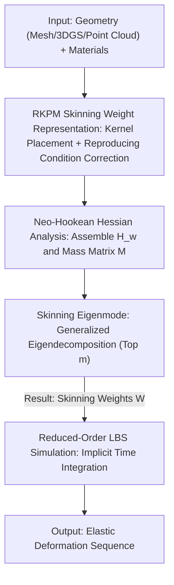

# FreeForm: Reduced-Order Deformable Simulation from Particle-Based Skinning Eigenmodes

**Conference**: CVPR 2026  
**arXiv**: [2605.29318](https://arxiv.org/abs/2605.29318)  
**Code**: None (not provided by the paper)  
**Area**: 3D Vision / Physics Simulation / Elastodynamics  
**Keywords**: Reduced-order simulation, meshless methods, RKPM, Skinning Eigenmode, Gaussian Splatting simulation

## TL;DR
The Reproducing Kernel Particle Method (RKPM) is utilized to parameterize the skinning weights of elastic bodies. Optimal skinning eigenmodes are then directly solved via a generalized eigenvalue problem on the elastic energy Hessian, enabling meshless, reduced-order elasticity simulation. This approach is approximately 40× faster to train than Simplicits (which uses per-object neural field optimization) while achieving accuracy closer to the FEM gold standard.

## Background & Motivation
**Background**: Deformable elastic simulation is widely used in engineering, visual effects, and robotics, with the Finite Element Method (FEM) being the dominant approach. However, FEM requires high-quality volumetric meshes as input, whereas modern point-cloud representations (e.g., 3D Gaussian Splatting, 3DGS) make it difficult or impossible to define valid meshes. Furthermore, high-resolution FEM involves many degrees of freedom (DoF) and slow solvers.

**Limitations of Prior Work**: To bypass meshes, the industry has turned to two paths. First, meshless particle methods (MPM, SPH, used by PhysGaussian/PhysDreamer for 3DGS simulation), which are highly sensitive to spatio-temporal discretization and prone to numerical fracture or imprecise boundaries under large deformations. Second, reduced-order simulation, which expresses motion using a small set of DoF and complex basis functions. However, traditional reduced-order methods are almost exclusively tied to meshes. The only meshless reduced-order work, Simplicits, uses neural fields to represent skinning weights—but it requires per-object optimization, which is slow. Additionally, its accuracy is often limited, likely due to the inherent difficulties of variational optimization for elastic energy.

**Key Challenge**: To achieve "meshless + reduced-order + high precision + speed," neural fields hide skinning weights in an implicit representation requiring gradient optimization, which is slow and hard to converge. Particle methods are fast but not reduced-order and unstable under large deformations. Meshless representation and the ability to "directly solve for optimal bases" have not coexisted previously.

**Goal**: Find a meshless representation that allows for volume integration and elastic energy definition, while enabling the "optimal reduced-order basis" to be calculated **directly and analytically** rather than via iterative optimization.

**Key Insight**: The authors noted that the Reproducing Kernel Particle Method (RKPM), a meshless, particle-based function representation, has never been applied to this scenario. RKPM is an explicit representation, meaning the Hessian of the elastic energy can be written analytically, transforming the task of "finding optimal skinning bases" into a standard eigenanalysis problem.

**Core Idea**: Use RKPM to discretize the skinning weight field and translate the classic skinning eigenmode concept to the meshless domain. By performing a generalized eigendecomposition of the elastic energy Hessian with a mass matrix constraint, the first $m$ eigenvectors are obtained as the optimal skinning weights. A single step of linear algebra replaces iterative neural field optimization.

## Method

### Overall Architecture
The method consists of two stages: training (basis construction) and simulation. Training stage: Given an arbitrary object geometry (mesh, 3DGS, or point cloud) capable of volume integration and material parameters, a set of RKPM particle kernels is distributed. The weight-space Hessian $\mathbf{H}_w$ of the elastic energy and the RKPM mass matrix $\mathcal{M}$ are assembled. The generalized eigenvalue problem $\mathbf{H}_w \mathbf{v} = \lambda \mathcal{M} \mathbf{v}$ is solved, taking the first $m$ eigenvectors as skinning weights $\mathbf{W}$. Simulation stage: With $\mathbf{W}$ fixed, Linear Blend Skinning (LBS) maps $m$ affine transformation DoFs to the displacements of all points, advancing via standard implicit time integration to minimize incremental potential energy. No part of the pipeline requires a mesh, nor is there any per-object neural network training.

### Key Designs

**1. Representing Skinning Weights with RKPM: "Smooth and Linearly Reproducible" Meshless Bases**

A challenge in meshless reduced-order simulation is the need for high-quality, smooth basis functions. Naive Radial Basis Functions (RBFs) produce irregular, non-smooth low-order modes even with uniform nodal sampling. The authors utilize RKPM, where any vector field is expressed as $\mathbf{u}(\mathbf{X};\mathbf{c})=\sum_{k=1}^{K}\phi_k(\mathbf{X})\mathbf{c}_k$. The reproducing kernel $\phi_k(\mathbf{X})=\varphi_k(\mathbf{X})\mathbf{P}^T(\mathbf{p}_k)\mathbf{C}(\mathbf{X})$ multiplies a standard Gaussian RBF $\varphi_k$ by a correction term. The correction function $\mathbf{C}(\mathbf{X})$ is determined by the "reproducing condition" $\sum_k \phi_k(\mathbf{X})\mathbf{P}(\mathbf{p}_k)=\mathbf{P}(\mathbf{X})$. Using a first-order polynomial basis $\mathbf{P}(\mathbf{X})=[1,x,y,z]^T$ leads to a point-wise linear equation $\mathbf{M}(\mathbf{X})\mathbf{C}(\mathbf{X})=\mathbf{P}(\mathbf{X})$ that can be solved analytically. This condition ensures the kernels can exactly reproduce up to first-order polynomial fields, making the skinning bases naturally smooth and capable of approximating linear fields—as shown in Fig. 3, where RKPM is significantly closer to an ideal linear field compared to RBF or partition-of-unity RBF.

**2. Skinning Eigenmode: Transforming the Optimal Basis Search into a Generalized Eigenvalue Problem**

This replaces the Simplicits neural field. Instead of performing full-order simulation on displacement $\mathbf{u}$ (which is expensive with many kernels), the authors discretize the skinning weight field $\mathbf{W}^j(\mathbf{X})=\sum_k \phi_k(\mathbf{X})\mathbf{c}_k^j$. The problem reduces to determining the nodal value matrix $\mathbf{c}\in\mathbb{R}^{K\times m}$ for each skinning function. The full-order elastic potential is expanded to second order near the rest configuration $E_{\text{pot}}^{\text{full}}(\mathbf{d})\approx \tfrac12\mathbf{d}^T\mathbf{H}\mathbf{d}$, using the weight-space Hessian $\mathbf{H}_w=\mathbf{H}_{xx}+\mathbf{H}_{yy}+\mathbf{H}_{zz}$. Seeking weights that best express deformation while remaining orthogonal leads to the optimization:

$$\arg\min_{\mathbf{c}\in\mathbb{R}^{K\times m}}\ \operatorname{tr}(\mathbf{c}^T\mathbf{H}_w\mathbf{c}),\quad \text{s.t.}\ \ \mathbf{c}^T\mathcal{M}\mathbf{c}=\mathbf{I}$$

The orthogonality constraint arises from the inner product of skinning weights $\langle\mathbf{W}^i,\mathbf{W}^j\rangle=\delta_{ij}$, which discretizes precisely into the RKPM mass matrix $\mathcal{M}$. This is equivalent to the generalized eigenvalue problem $\mathbf{H}_w\mathbf{v}=\lambda\mathcal{M}\mathbf{v}$. This is effective because: first, a single step of dense linear algebra replaces per-object iterative optimization (40× faster than neural fields); second, the weights are **exactly orthogonal** (within numerical precision), whereas Simplicits treats orthogonality as a soft penalty, directly affecting the numerical condition of the Hessian during simulation.

**3. Analytical Simplification of the Neo-Hookean Hessian: "Material-Aware Laplacian Eigenmodes"**

To solve the eigenvalue problem, $\mathbf{H}_w$ must be assembled efficiently. For the standard Neo-Hookean energy $\Psi(\mathbf{F})=\tfrac12[\bar\lambda(\det\mathbf{F}-\gamma)^2+\bar\mu\operatorname{tr}(\mathbf{F}^T\mathbf{F})-E_0]$, the authors derive (Proposition 1) a simplified form for the $(i,j)$ element of the weight-space Hessian:

$$(\mathbf{H}_w)_{ij}=\int_\Omega (\lambda(\mathbf{X})+4\mu(\mathbf{X}))\,\nabla\phi_i(\mathbf{X})^T\nabla\phi_j(\mathbf{X})\,d\mathbf{X}$$

This depends only on the inner product of kernel gradients weighted by Lamé coefficients. Under uniform material properties, $\lambda$ and $\mu$ are constant, and the Hessian degrades to $(\lambda+4\mu)\mathbf{L}_{ij}$, where $\mathbf{L}$ is the weak-form Laplacian matrix of the RKPM. Thus, the elastic Hessian shares eigenmodes with the Laplacian matrix, which are minimizers of the Dirichlet energy. For non-uniform materials, the method naturally produces "material-aware Laplacian eigenmodes," yielding distinct deformation behaviors for regions of different stiffness—a capability rare outside of Simplicits.

### Loss & Training
The "training" here is not gradient descent but a direct solution to a generalized eigenvalue problem; thus, there is no traditional loss. However, ablation studies compare three dimensions: (1) Loss form—Simplicits uses expected elastic energy $\mathcal{L}_{\text{elastic}}$ over random transformations $\mathbf{z}\sim\mathcal{N}(\mathbf{0},\sigma\mathbf{I})$, while this work uses a quadratic Hessian approximation; (2) Integration sampling—Simplicits samples points randomly, while this work uses fixed uniform grid sampling; (3) Solver—gradient iteration vs. generalized eigendecomposition. The results indicate that the Hessian approximation with grid sampling in RKPM yields superior accuracy, and eigendecomposition reduces training time from hundreds of seconds to approximately 4 seconds.

## Key Experimental Results

### Main Results
Standard beam deformation test (5m×1m×1m cantilever, Young's modulus $5\times10^6$ Pa, Poisson's ratio 0.45), using tetrahedral mesh FEM as the gold standard. Normalized point-wise MSE is reported. $m$ denotes the number of affine transformations (DoF):

| Test | $m$ | Simplicits | Ours | MPM | SPH |
|------|-----|-----------|------|-----|-----|
| Bend | 6 | 1.20e-02 | 7.80e-03 | 1.42e-03 | 6.57e-04 |
| Bend | 16 | 1.53e-03 | 4.10e-04 | — | — |
| Bend | 32 | 1.17e-04 | 2.93e-06 | — | — |
| Twist | 6 | 2.54e-03 | 1.56e-04 | 2.34e-05 | 1.33e-04 |
| Twist | 16 | 1.30e-04 | 3.46e-06 | — | — |
| Twist | 32 | 4.21e-05 | 6.64e-06 | — | — |

Ours consistently outperforms Simplicits at the same DoF. Accuracy improves steadily as $m$ increases, matching or exceeding the full-order MPM/SPH methods when DoFs are sufficient.

Thingi10K (20 shapes) + Simready (19 shapes) datasets, $m=32$, normalized MSE/max error across three boundary conditions, and training time:

| Boundary Condition | Metric | Simplicits | Ours | Gain |
|----------|------|-----------|------|------|
| Fix Side | MSE | 8.97e-03 | 6.87e-03 | 34.2% |
| Pull Farthest | MSE | 5.58e-02 | 3.75e-02 | 29.8% |
| Pull Boundary | MSE | 3.37e-02 | 3.11e-02 | 37.5% |
| Training Time (s) | — | 121.44 ±10.15 | 3.19 ±2.48 | 97.4% |

Accuracy is superior across the board, with training time accelerated by approximately 40× (~121s to ~3s).

### Ablation Study
Ablation of training strategies (standard beam, $m=16/32$):

| Loss | Sampling | Drop MSE | Twist MSE | Time (s) | Description |
|------|------|---------|----------|---------|------|
| Simplicits | Random | 1.53e-3 | 1.30e-3 | 114.28 | Neural field baseline |
| Random $\mathbf{z}$ | Random | 1.58e-2 | 2.50e-2 | 160.12 | RKPM + Random energy loss + Random sampling |
| Random $\mathbf{z}$ | Grid | 1.24e-2 | 7.29e-3 | 412.38 | Grid sampling switch |
| Hessian | Random | 4.86e-3 | 5.07e-4 | 103.66 | Hessian loss switch |
| Hessian | Grid | 4.45e-4 | 3.49e-5 | 145.96 | Gradient-optimized version (same formula as Ours) |
| Ours | Grid | 4.10e-4 | 3.46e-5 | 3.93 | Eigendecomposition solver |

### Key Findings
- Hessian loss + grid sampling is critical: Switching to Hessian loss reduced Twist MSE from 2.50e-2 to 5.07e-4, and grid sampling further reduced it to 3.49e-5.
- The "Hessian-Grid" gradient-optimized version yields comparable accuracy to the proposed analytical solver (4.45e-4 vs 4.10e-4), but the eigendecomposition reduces time from ~146s to ~4s, proving speedups come from the solver rather than accuracy trade-offs.
- While random sampling during testing degrades both methods, ours remains consistently superior, showing less sensitivity to integration sampling.
- Qualitatively, the method directly simulates 3DGS objects (e.g., 13 splash containers, 18 Gaussian dog toys) and supports interaction with robotic arms.

## Highlights & Insights
- **From Optimization to Eigendecomposition**: The primary contribution is recognizing that RKPM's explicit representation allows the elastic energy Hessian to be written analytically, replacing per-object neural field optimization with a single generalized eigenvalue solution.
- **Proposition 1 Simplification**: Expressing the Neo-Hookean Hessian as a weighted integral of kernel gradient inner products is elegant. It connects the method to classical modal analysis in uniform materials while providing "material-aware" capabilities for non-uniform ones.
- **Hard Orthogonality**: Eigendecomposition outputs satisfy $\mathbf{c}^T\mathcal{M}\mathbf{c}=\mathbf{I}$ exactly, avoiding numerical conditioning issues common in Simplicits' soft penalty approach.
- **Transferability**: Any task using neural fields to implicitly represent bases requiring orthogonality/physical constraints can potentially be replaced by an explicit differentiable representation and a direct linear/eigen-system solver.

## Limitations & Future Work
- **Reduced-Order Artifacts**: As a reduced-order model, global smooth bases struggle to express high-frequency details like wrinkles or sharp non-linear effects (e.g., localized contact).
- **RKPM Sensitivity**: Basis quality depends on kernel radius, sampling density, and particle distribution, requiring careful tuning of hyperparameters.
- **Robustness**: Evaluation primarily focused on "clean" manifold shapes to obtain FEM gold standards; robustness to noisy real-world 3DGS or partial point clouds is demonstrated only qualitatively.
- **Future Work**: Adding local high-frequency correction bases; extending to multiple configuration-based bases for large deformations; exploring adaptive kernel placement.

## Related Work & Insights
- **vs. Simplicits**: Both are meshless reduced-order methods, but Simplicits optimizes skinning weights via neural fields. This work uses RKPM + eigendecomposition, replacing iterative optimization with analytical solving for 40× speedup and higher accuracy.
- **vs. MPM / SPH**: These are full-order meshless methods. While they handle more constitutive models, they are sensitive to discretization. This work approximates low-frequency deformation but can match their accuracy with fewer DoFs.
- **vs. Classic Skinning Eigenmode**: This work adopts the weight-space Hessian concept from mesh-based methods (Benchekroun et al.) but translates it to the meshless domain using RKPM.

## Rating
- Novelty: ⭐⭐⭐⭐⭐ 
- Experimental Thoroughness: ⭐⭐⭐⭐ 
- Writing Quality: ⭐⭐⭐⭐⭐ 
- Value: ⭐⭐⭐⭐ 

<!-- RELATED:START -->

## Related Papers

- [\[CVPR 2026\] Learning a Particle Dynamics Model with Real-world Videos](learning_a_particle_dynamics_model_with_real-world_videos.md)
- [\[CVPR 2026\] Hyper-PCN: Hypergraph-Based Point Cloud Completion via High-Order Correlation Modeling](hyper-pcn_hypergraph-based_point_cloud_completion_via_high-order_correlation_mod.md)
- [\[CVPR 2026\] FastEventDGS: Deformable Gaussian Splatting for Fast Dynamic Scenes from a Single Event Camera](fasteventdgs_deformable_gaussian_splatting_for_fast_dynamic_scenes_from_a_single.md)
- [\[CVPR 2026\] Generalized-CVO: Fast and Correspondence-Free Local Point Cloud Registration with Second Order Riemannian Optimization](generalized-cvo_fast_and_correspondence-free_local_point_cloud_registration_with.md)
- [\[CVPR 2026\] DiffusionHarmonizer: Bridging Neural Reconstruction and Photorealistic Simulation with Online Diffusion Enhancer](diffusionharmonizer_bridging_neural_reconstruction_and_photorealistic_simulation.md)

<!-- RELATED:END -->
## Related Papers

- [\[CVPR 2026\] Z-Order Transformer for Feed-Forward Gaussian Splatting](z-order_transformer_for_feed-forward_gaussian_splatting.md)
- [\[CVPR 2026\] Learning a Particle Dynamics Model with Real-world Videos](learning_a_particle_dynamics_model_with_real-world_videos.md)
- [\[CVPR 2026\] Order Matters: 3D Shape Generation from Sequential VR Sketches](order_matters_3d_shape_generation_from_sequential_vr_sketches.md)
- [\[CVPR 2026\] PhysHead: Simulation-Ready Gaussian Head Avatars](physhead_simulation-ready_gaussian_head_avatars.md)
- [\[CVPR 2026\] UTrice: Unifying Primitives in Differentiable Ray Tracing and Rasterization via Triangles for Particle-Based 3D Scenes](utrice_unifying_primitives_in_differentiable_ray_tracing_and_rasterization_via_t.md)

<!-- RELATED:END -->
