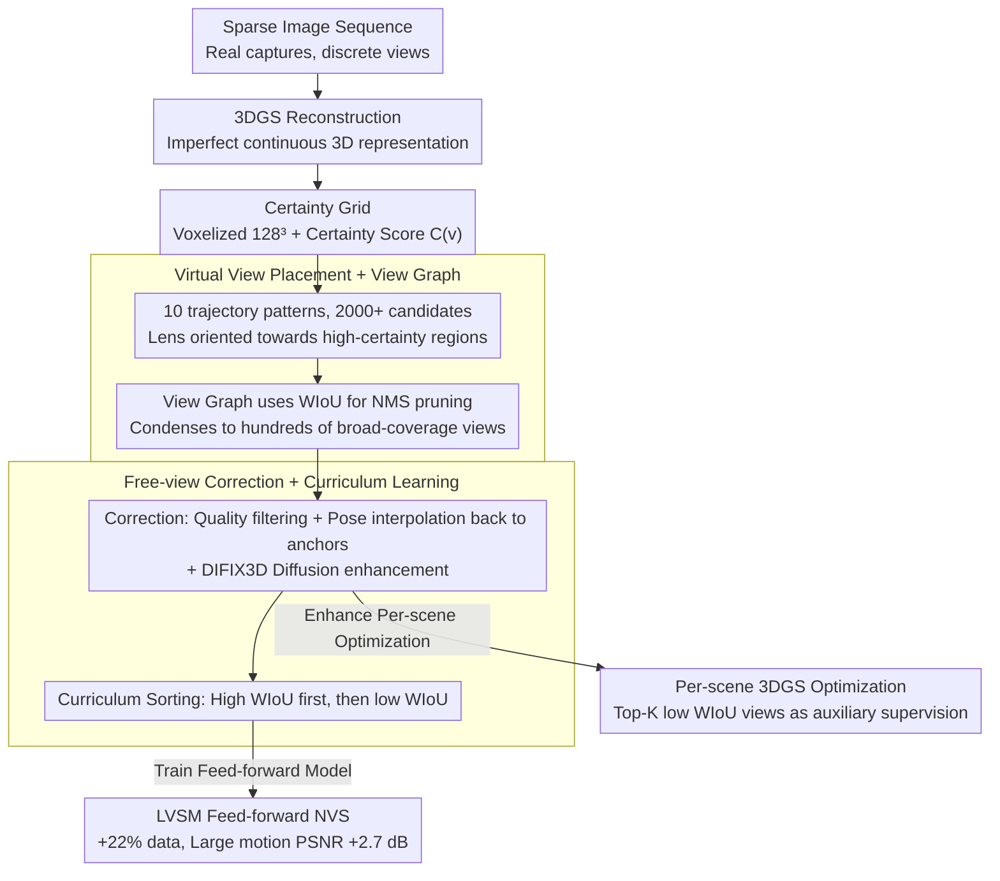

# FreeScale: Scaling 3D Scenes via Certainty-Aware Free-View Generation

**Conference**: CVPR 2026  
**arXiv**: [2604.10512](https://arxiv.org/abs/2604.10512)  
**Code**: [https://mvp-ai-lab.github.io/FreeScale](https://mvp-ai-lab.github.io/FreeScale)  
**Area**: 3D Vision  
**Keywords**: Novel View Synthesis, Data Augmentation, 3D Gaussian Splatting, Feed-forward Reconstruction, Certainty-aware Sampling

## TL;DR
FreeScale scales limited real-world data into large-scale training data by sampling high-quality free-view images in a certainty-guided manner from existing scene reconstructions, achieving a 2.7 dB PSNR improvement for feed-forward novel view synthesis models.

## Background & Motivation

**Background**: Novel View Synthesis (NVS) is shifting from per-scene optimization (NeRF, 3DGS) to generalizable feed-forward models (e.g., LVSM), which learn cross-scene priors from large-scale data to achieve efficient 3D reconstruction during inference.

**Limitations of Prior Work**: The bottleneck for feed-forward models is the lack of large-scale training data with diverse and precise camera trajectories. Real-world data is realistic but sparse and expensive to collect, synthetic data suffers from domain gaps, and data generated by diffusion models cannot provide precise camera poses.

**Key Challenge**: Real-world scene captures only provide discrete and sparse view coverage. While continuous 3D representations after reconstruction can theoretically sample arbitrary views, directly sampling from imperfect reconstructions amplifies artifacts.

**Goal**: Design a data generation engine to generate diverse, high-quality free-view images with precise poses from existing real-scene reconstructions.

**Key Insight**: Imperfectly reconstructed scenes can serve as rich geometric proxies. The key is to identify which novel views are informative without being contaminated by reconstruction errors.

**Core Idea**: Utilize a certainty-aware free-view sampling strategy to identify high-certainty regions from 3DGS reconstructions, generating high-quality training data to scale feed-forward model training.

## Method

### Overall Architecture
FreeScale addresses the "insufficient training data" issue for feed-forward NVS models: real-world captures are sparse and discrete, while diffusion-generated images lack precise camera poses. It treats a standard 3DGS reconstruction as a "data factory"—first performing conventional reconstruction on a sparse image sequence, then placing a large number of virtual cameras back into this imperfect 3D representation to sample novel views. The core of the pipeline is the use of a "certainty grid" throughout the process: the grid guides camera placement, helps filter redundant views, and finally enables pose correction and diffusion enhancement for views that do not meet quality standards. It outputs a set of free-view images with precise poses that avoid reconstruction artifacts, which are used to train feed-forward models or enhance per-scene optimization as auxiliary targets.

### Key Designs

**1. Certainty Grid: Quantifying "Reliable Geometry" Before Sampling**

Sampling new views directly from 3DGS is problematic because well-reconstructed areas are clean while poorly reconstructed areas are full of artifacts, yet the renderer itself does not distinguish between them. FreeScale discretizes the scene bounding box into a $128^3$ voxel grid and calculates a certainty score for each voxel:

$$\mathcal{C}(v_i) = \sum_j \frac{\alpha_j}{\text{Vol}_j + \epsilon}$$

This accumulates the opacity $\alpha_j$ of all Gaussians falling into the voxel, normalized by their volume $\text{Vol}_j$. The intuition is straightforward: small, opaque Gaussians correspond to well-observed, geometrically converged areas (high score), while sparse, translucent, large Gaussians represent poorly reconstructed "floaters" (low score). This grid provides a unified geometric basis for decisions on "where to look, which to keep, and what to learn first."

**2. Virtual View Placement + View Graph: Massive Sampling and Geometric IoU Pruning**

FreeScale designs 10 camera trajectory patterns (orbit, spiral, fly-through, etc.) extending from training cameras as anchors, with lenses oriented towards high-certainty regions in the grid, generating over 2000 candidate views. To remove high redundancy, it uses a "View Graph." The set of high-certainty voxels visible to each candidate view is treated as its "information coverage." Weighted IoU (WIoU) measures the overlap between two views, and NMS is performed on the graph to suppress redundant views. Compared to image-feature matching, WIoU is computed entirely at the geometric level, saving rendering costs and quickly selecting a broad, non-redundant subset.

**3. Free-View Correction + Curriculum Learning: Reclaiming Low-Quality Candidates**

Some filtered views may still fail quality standards due to being too far from anchors or falling into low-certainty edges. Instead of discarding them, FreeScale "saves" these views by interpolating poses back toward the nearest anchor and using the DIFIX3D diffusion model to enhance image quality. During feed-forward model training, these views are introduced via curriculum learning: starting with views that have high WIoU with training cameras (similar views, easier to learn) and gradually adding low WIoU, large-motion views. This prevents training instability while eventually covering more difficult view distributions.

### Key Experimental Results

#### Main Results

| Dataset/Setting | Metric | LVSM Baseline | LVSM + FreeScale | Gain |
|-------------|------|-----------|-------------------|------|
| DL3DV (Large Motion) | PSNR | 18.75 | 21.45 | +2.7 dB |
| DL3DV (Small Motion) | PSNR | 22.20 | 24.20 | +2.0 dB |
| MipNeRF360 (Large Motion) | PSNR | 13.88 | 17.27 | +3.39 dB |

#### Ablation Study

| Configuration | Description |
|------|------|
| w/o Certainty Guidance | Sampling low-quality regions leads to performance degradation |
| w/o View Graph Pruning | Redundant views increase, training efficiency and quality drop |
| w/o Curriculum Learning | Large camera motion makes training unstable |

### Key Findings
- Adding only approximately 22% of generated data significantly improves the generalization capability of sparse-view reconstruction.
- In per-scene 3DGS optimization, using exploratory views from non-certain regions as auxiliary targets also yields consistent improvements.
- The View Graph is more suitable for guiding training batch selection than simple frame-distance sampling.

## Highlights & Insights
- **Elegant Reuse of Certainty Grid**: A simple voxel statistic is simultaneously used for view filtering, View Graph construction, and exploratory training, resulting in a very unified design.
- **Data Engine Perspective**: Treating 3D reconstruction as a data factory rather than an end product is a mindset that can be extended to data augmentation for more 3D tasks.

## Limitations & Future Work
- Performance is limited when the initial 3DGS reconstruction is poor due to extremely sparse inputs.
- Generated data still has a synthetic-to-real domain gap, especially in peripheral regions.
- Future work could integrate stronger generative models to further improve the quality of free-view images.

## Related Work & Insights
- **vs. Megasynth**: Megasynth uses non-morphic geometry with stacked textures, which is data-inefficient; FreeScale utilizes real-scene reconstructions to maintain semantic consistency.
- **vs. DIFIX3D**: DIFIX3D is a single-scene post-processing enhancement; FreeScale is a data generation engine aimed at scaling training data.

## Rating
- Novelty: ⭐⭐⭐⭐ The certainty-guided data scaling approach is novel, though it involves engineering integration.
- Experimental Thoroughness: ⭐⭐⭐⭐⭐ Well-validated in both feed-forward and per-scene application scenarios.
- Writing Quality: ⭐⭐⭐⭐ Clear structure and detailed method description.
- Value: ⭐⭐⭐⭐ Effectively addresses the data bottleneck in 3D vision with strong practicality.

<!-- RELATED:START -->

## Related Papers

- [\[CVPR 2026\] Scaling View Synthesis Transformers (SVSM)](scaling_view_synthesis_transformers.md)
- [\[CVPR 2026\] MoVieS: Motion-Aware 4D Dynamic View Synthesis in One Second](movies_motion-aware_4d_dynamic_view_synthesis_in_one_second.md)
- [\[CVPR 2026\] Gaussian Mapping for Evolving Scenes](gaussian_mapping_for_evolving_scenes.md)
- [\[CVPR 2026\] ManifoldNeuS: Manifold-aware View Optimizability for Pose-Free Neural Surface Reconstruction](manifoldneus_manifold-aware_view_optimizability_for_pose-free_neural_surface_rec.md)
- [\[CVPR 2026\] VAD-GS: Visibility-Aware Densification for 3D Gaussian Splatting in Dynamic Urban Scenes](vad-gs_visibility-aware_densification_for_3d_gaussian_splatting_in_dynamic_urban.md)

<!-- RELATED:END -->
