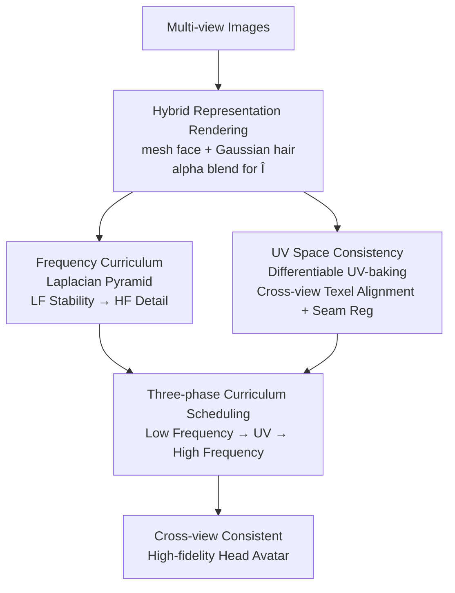

# Fresco: Frequency-Spatial Consistent Optimization for Fine-Grained Head Avatar Modeling

**Conference**: CVPR 2026  
**Paper**: [CVF Open Access](https://openaccess.thecvf.com/content/CVPR2026/html/Zhang_Fresco_Frequency-Spatial_Consistent_Optimization_for_Fine-Grained_Head_Avatar_Modeling_CVPR_2026_paper.html)  
**Code**: https://github.com/saralkun/Fresco  
**Area**: 3D Vision  
**Keywords**: Head Avatar, Frequency Curriculum Learning, UV Space Consistency, Laplacian Pyramid, Cross-View Consistency  

## TL;DR
Fresco does not modify the underlying representation of head avatars but focuses on training dynamics: it employs a Laplacian pyramid for a "low-to-high" frequency curriculum and incorporates differentiable UV-baking to align multi-view renderings to a shared texture atlas. This suppresses early pseudo high-frequency artifacts and eliminates cross-view drifting, achieving SOTA results in both novel-view and self-reenactment metrics (PSNR/LPIPS) on the NeRSemble dataset.

## Background & Motivation
**Background**: Currently, drivable head avatar research follows two main paths: NeRF/Implicit volumetric representations (strong cross-view consistency, but slow training and difficult local control) and 3D Gaussian/Explicit point representations (fast rendering, drivable, high detail, but sensitive to point placement/density). Recent hybrid representations (mesh + Gaussian, e.g., MeGA, HERA) attach Gaussians to mesh vertices to balance semantic control with high-fidelity rendering, becoming a popular compromise.

**Limitations of Prior Work**: Almost all these methods rely on **per-view photometric loss** for training. This introduces two issues: first, unstable gradients in early training cause the model to fit local textures before establishing consistent global geometry or color, leading to **pseudo high-frequency artifacts** and early over-sharpening; second, as each camera overfits local appearances without explicit geometric correspondence, regions like wrinkles, the mouth, and hair strands suffer from **cross-view drifting**.

**Key Challenge**: Jointly modeling head geometry, expressions, and dynamic details is highly under-constrained. Per-view photometric supervision lacks both frequency constraints and cross-view correspondence. Consequently, "stable convergence" and "detail fidelity" become conflicting goals—adding regularization (like spatial or normal regularizers in GaussianAvatar/PointAvatar) suppresses noise but at the cost of over-smoothing and slower convergence.

**Key Insight**: The authors observe a crucial fact—**different head regions exhibit distinct spectral characteristics**: facial surfaces evolve best under low-frequency regularization, while regions like hair and boundaries require targeted high-frequency refinement. Existing frequency-domain methods (BARF, FreNeRF, FreGS) use global Fourier statistics, treating all spatial locations equally and losing spatial locality and geometric correspondence. Thus, the authors advocate that frequency constraints should be applied in the **spatial domain** (using local Laplacian filters) and optimized alongside **geometric correspondence in UV space**.

**Core Idea**: Keep the representation, adjust the training—employ a Laplacian pyramid for a frequency curriculum to stabilize optimization and use differentiable UV-baking to align multi-view inputs to a shared texture coordinate system for cross-view consistency, synergizing the image frequency domain and UV geometric domain.

## Method

### Overall Architecture
Fresco is an **optimization framework** rather than a new representation: the underlying structure uses a hybrid mesh + Gaussian representation (parametric mesh for the face, anisotropic 3D Gaussians for hair/periphery). During rendering, the rasterized face mesh and splatted hair Gaussians are synthesized via depth-sorted alpha blending to produce $\hat{I}$. Fresco's contribution lies entirely in "how to supervise this rendering": it splits training into three phases and imposes constraints across two domains.

The data flow is: multi-view images → CNN estimates 3DMM parameters + MLP refines Gaussian hair parameters $\{x, r, s, o, sh\}$ → mesh and Gaussian rendering synthesis $\hat{I}$ → (Frequency Branch) Laplacian pyramid decomposes images into bands for progressive supervision + (UV Branch) differentiable UV-baking maps multi-view renderings to a shared atlas for cross-view texel alignment → A three-phase curriculum schedules these branches.

### Key Designs

**1. Frequency Curriculum: Laplacian Pyramid for Spectral Scheduling**

To address early pseudo high-frequency artifacts, the authors perform Laplacian pyramid decomposition in the **image spatial domain** using differentiable Gaussian/DoG filters instead of the global Fourier domain. Supervision is expanded progressively by frequency band. The low-frequency (LF) branch uses a Gaussian kernel $G_\sigma$ to smooth both the rendering and GT, calculating L1 loss solely on low frequencies: $\hat{I}_{LF} = G_\sigma(\hat{I})$, $L_{LF} = \|\hat{I}_{LF} - I_{LF}\|_1$. Its temporal weight $\lambda_{LF}(t)$ **decreases** during iterations, forcing the model to capture global structure and color consistency first. The high-frequency (HF) branch extracts band-pass responses using Difference-of-Gaussian $H(\cdot) = G_{\sigma_1}(\cdot) - G_{\sigma_2}(\cdot)$ and concentrates supervision on high-structure regions using an edge mask $M_{edge}=\mathrm{normalize}(\|\nabla I\|)$: $L^{edge}_{HF} = M_{edge}\cdot\|H(\hat{I}) - H(I)\|_1$. A Gradient Difference Loss $L_{GDL}=\sum_{i,j}\big||\nabla\hat{I}_{i,j}| - |\nabla I_{i,j}|\big|_1$ is added to prevent over-sharpening, resulting in $L_{HF}=\lambda_{h1}L^{edge}_{HF}+\lambda_{h2}L_{GDL}$, whose weight $\lambda_{HF}(t)$ **increases** during training.

The total frequency loss is a weighted sum of bands:

$$L_{freq}(t)=\sum_{i=1}^{N} w_i(t)\,\|\hat{I}_i - I_i\|_1,$$

where band weights $w_i(t)$ are activated via smooth cosine annealing. This avoids the limitations of global spectral methods by respecting the spatial-spectral differences (e.g., smooth skin vs. detailed hair).

**2. UV Space Consistency: Transforming Per-view Supervision into Texel-level Correspondence**

While the frequency curriculum stabilizes the image domain, view-dependent shading still allows for cross-view inconsistency. The authors introduce a differentiable UV-baking operator $B(\cdot)$ that "bakes" each view's rendering onto the mesh atlas to obtain a UV texture $\hat{T}^v = B(\hat{I}^v; \Pi^v, M)$, upgrading supervision from "per-pixel" to "per-texel cross-view correspondence." Alignment is performed only for texels **visible in both views** (visibility-constrained pairing):

$$L_{UV}=\frac{1}{|\Omega_{vis}|}\sum_{(u,v)\in\Omega_{vis}} w(u,v)\,\big\|\hat{T}^a(u,v)-\mathrm{sg}(\hat{T}^b(u,v))\big\|_1,$$

where $\mathrm{sg}[\cdot]$ is the stop-gradient operator applied to the target branch to prevent "bidirectional chasing." The confidence weight $w(u,v)$ prioritizes texels that are both visible and facing the camera, suppressing the influence of self-occlusion and grazing angles.

**3. Seam Regularization: Stitching Atlas Boundaries**

UV unfolding inevitably creates charts with disconnected boundaries, leading to cracks in high-curvature areas like hair or ears. The authors add $L_{seam}=\lambda_{pair}L^{pair}_{seam}+\lambda_{tv}L^{tv}_{seam}$. The pairing item $L^{pair}_{seam}$ constrains consistency for duplicated 3D vertices across different charts based on the FLAME topology. The Total Variation item $L^{tv}_{seam}$ smooths local fluctuations in a narrow band $\Omega_s$ dilated from the seam mask. Notably, this term primarily improves qualitative boundary continuity rather than global metrics like PSNR.

### Loss & Training
The components are **activated in phases** to form a "Stabilize Structure → Force Consistency → Enhance Detail" trajectory. For iteration $t\in[0,T]$, the total objective is:

$$L_{total}(t)=\begin{cases}\alpha\,L^{low}_{freq}(t), & t<T_1,\\[2pt]\alpha\,L^{low}_{freq}(t)+\beta\,L_{UV}(t), & T_1\le t<T_2,\\[2pt]\alpha\,L^{high}_{freq}(t)+\beta\,L_{UV}(t)+L_{seam}, & t\ge T_2.\end{cases}$$

Phase 1 ($t<T_1$) stabilizes geometry; intermediate Phase 2 ($T_1\le t<T_2$) introduces UV consistency; final Phase 3 ($t\ge T_2$) enables high-frequency enhancement and seam regularization.

## Key Experimental Results

### Main Results
Testing on NeRSemble (16-camera calibrated multi-view video), following GaussianAvatars/MeGA settings with 8 subjects and 11 sequences each.

| Task | Metric | Fresco | GaussianAvatars (Runner-up) | MeGA |
|------|------|--------|------|------|
| Novel-View | PSNR↑ | **31.80** | 31.50 | 30.79 |
| Novel-View | SSIM↑ | **0.938** | 0.935 | 0.932 |
| Novel-View | LPIPS↓ | **0.058** | 0.060 | 0.066 |
| Self-Reenactment | PSNR↑ | **30.30** | 29.75 | 29.62 |
| Self-Reenactment | LPIPS↓ | **0.064** | 0.066 | 0.071 |

Fresco achieves the highest PSNR and lowest LPIPS across both tasks. Qualitative results show more faithful mouth opening, blinking, and tooth details in self-reenactment scenarios.

### Ablation Study
Ablation on subject #253:

| Configuration | NV-PSNR↑ | NV-LPIPS↓ | SR-PSNR↑ | Description |
|------|------|------|------|------|
| Ours (Full) | 34.02 | 0.036 | 32.46 | Full model |
| w/o $L_{HF}$ | 32.60 | 0.044 | 31.11 | No HF: over-smoothed results |
| w/o $L_{UV}$ | 32.71 | 0.041 | 31.47 | No UV: cross-view drifting/artifacts |
| w/o $L_{LF}$ | 33.48 | 0.039 | 32.07 | No LF: early instability |
| w/o Seam | 33.86 | 0.038 | 32.29 | No seam: negligible impact on global metrics |

### Key Findings
- **HF branch and UV consistency are the primary contributors**: Removing $L_{HF}$ caused the largest PSNR drop (−1.42), followed by $L_{UV}$ (−1.31), which also introduced view-dependent artifacts.
- **Seam regularization is "metric-insensitive but visually critical"**: Removing it barely changed PSNR but caused obvious cracks and color discontinuities in qualitative images.
- **LF regularization primarily manages early stability**: Its removal had the smallest performance impact, confirming its role in ensuring convergence rather than final detail.

## Highlights & Insights
- **"Adjust training, not representation"**: By focusing on supervision and curriculum logic without altering the underlying mesh+Gaussian structure, the method is easily portable to other per-view photometric pipelines.
- **Spatial vs. Global Frequency constraints**: The motivation that head structures are spatially heterogeneous (smooth skin vs. sharp hair hair) justifies using local Laplacian filters over global Fourier transforms.
- **UV-baking with Stop-Gradient**: Converting photometric consistency into explicit geometric correspondence on a shared atlas, while preventing "bidirectional chasing," provides a robust mechanism for cross-view alignment.

## Limitations & Future Work
- **Reliance on calibrated multi-view data**: The method was validated on controlled studio data (NeRSemble). Whether it generalizes to monocular or in-the-wild scenarios remains unverified.
- **Heuristic hyperparameters**: The phase boundaries ($T_1, T_2$) and loss weights involve empirical tuning, which might increase the cost of reproduction.
- **Limited scale**: Evaluation on only 8 subjects may hide edge cases; cross-identity reenactment results were only briefly touched upon in the supplementary material.
- **Future directions**: Exploring adaptive frequency band partitioning and extending UV consistency to the temporal domain for improved dynamic stability.

## Related Work & Insights
- **vs FreGS/FreNeRF/BARF**: Unlike global spectral methods that treat all pixels equally, Fresco uses **spatial-domain** Laplacian filtering to preserve local geometric correspondence.
- **vs GaussianAvatars/MeGA**: Fresco complements these hybrid representations. By fixing the weaknesses of per-view photometric loss, it achieves higher fidelity on the same underlying architectures.
- **vs Spatial/Normal Regularization**: Instead of broad smoothing, Fresco's curriculum enables a better balance between noise suppression and detail preservation.

## Rating
- Novelty: ⭐⭐⭐⭐
- Experimental Thoroughness: ⭐⭐⭐
- Writing Quality: ⭐⭐⭐⭐
- Value: ⭐⭐⭐⭐

<!-- RELATED:START -->

## Related Papers

- [\[CVPR 2026\] iSplat: Iterative Learning for Fine-Grained Gaussian Splatting](isplat_iterative_learning_for_fine-grained_gaussian_splatting.md)
- [\[CVPR 2026\] GeoDiff4D: Geometry-Aware Diffusion for 4D Head Avatar Reconstruction](geodiff4d_geometry-aware_diffusion_for_4d_head_avatar_reconstruction.md)
- [\[CVPR 2026\] Feed-forward Gaussian Registration for Head Avatar Creation and Editing](feed-forward_gaussian_registration_for_head_avatar_creation_and_editing.md)
- [\[CVPR 2026\] HumanNOVA: Photorealistic, Universal and Rapid 3D Human Avatar Modeling from a Single Image](humannova_photorealistic_universal_and_rapid_3d_human_avatar_modeling_from_a_sin.md)
- [\[CVPR 2026\] Faster-GS: Analyzing and Improving Gaussian Splatting Optimization](faster-gs_analyzing_and_improving_gaussian_splatting_optimization.md)

<!-- RELATED:END -->
