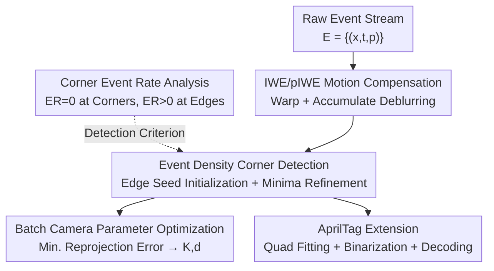

# From Corners to Fiducial Tags: Revisiting Checkerboard Calibration for Event Cameras

**Conference**: CVPR 2026  
**Paper**: [CVF Open Access](https://openaccess.thecvf.com/content/CVPR2026/html/Ryu_From_Corners_to_Fiducial_Tags_Revisiting_Checkerboard_Calibration_for_Event_CVPR_2026_paper.html)  
**Code**: [Project Page](https://vision3dlab.github.io/corner2tag/)  
**Area**: 3D Vision  
**Keywords**: Event camera, camera calibration, checkerboard corners, IWE, AprilTag  

## TL;DR
This paper proposes the first event camera calibration framework that detects checkerboard corners directly in the event domain without relying on intensity reconstruction. By mathematically proving that "almost no events are generated at corners," the method uses edge cues to initialize corners and refines them to sub-pixel accuracy at local minima of event density. The same detection scheme is extended to AprilTags, achieving stable calibration on both self-collected and public datasets.

## Background & Motivation
**Background**: Calibration for frame-based cameras is mature—capturing checkerboards, detecting corners with Harris/Shi-Tomasi, and solving for parameters by minimizing reprojection error. Checkerboards are the de facto standard due to their well-defined geometry and sub-pixel localizability, and they naturally extend to fiducial markers like ARTag/AprilTag.

**Limitations of Prior Work**: Event cameras (neuromorphic sensors) offer high temporal resolution and dynamic range but do not preserve image structure. Each pixel asynchronously records binary events of relative brightness changes, making checkerboards difficult to use. Existing calibration methods follow three problematic paths: (1) using learning-based event-to-video networks (E2VID) for reconstruction, where artifacts pollute corner accuracy; (2) using active targets like flashing LEDs/LCDs, which require specialized hardware; (3) using dot or ring grids, which are sensitive to lens distortion and offer poor localization.

**Key Challenge**: While checkerboards are accurate and extensible, they pose two conflicts with event imaging: (1) events are triggered asynchronously along motion trajectories, causing temporal misalignment and blurred edges when stacked; (2) corners exhibit local intensity symmetry where the event rate approaches zero, resulting in no signal precisely where accurate localization is required.

**Goal**: Detect checkerboard corners and identify AprilTags directly from event representations without intensity reconstruction. This requires solving two sub-problems: how to align asynchronous events into sharp edges and how to leverage the "lack of events" at corners for localization.

**Key Insight**: The authors observe that the "absence of events at corners" can be treated as a prior. By proving that the event rate at corners is strictly zero while edges yield high rates, they utilize "edges for direction and zero density for corners."

**Core Idea**: Use Motion Compensation (IWE) to sharpen blurred edges. Based on the analytical conclusion that "edges have strong events while corners have none," corners are initialized via edge seeds and refined to sub-pixel accuracy by pushing them toward local minima of event density—all without image reconstruction.

## Method

### Overall Architecture
The input is a raw event stream $E=\{e_k\}$, where each event $e_k=(x_k,t_k,p_k)$ contains pixel position, timestamp, and polarity ($\pm1$). The output consists of the intrinsic matrix $K$ and distortion coefficients $d$. The pipeline consists of four stages: motion compensation of asynchronous events into sharp IWE/pIWE representations; extraction of corner candidate patches on pIWE followed by initialization and refinement on IWE (guided by the event rate analysis in §3.2); batch optimization of camera parameters using the sub-pixel corners; and expansion to AprilTag recognition using the same detection logic.

### Key Designs

**1. Mathematical Analysis of Corner Event Rate: Turning "No Signal" into a Detection Criterion**

This addresses the issue where traditional detectors fail due to lack of events at corners. The authors model the ideal intensity of a checkerboard corner using two Gaussian-smoothed sigmoid functions $\tilde I(x)\approx S(n_1^\top x,\sigma)\,S(n_2^\top x,\sigma)$. Using a first-order Taylor expansion near the corner $|x|\ll1$, the intensity becomes $\tilde I(x)\approx\frac{1}{4\sigma^2}(n_1^\top x)(n_2^\top x)$, leading to $\nabla\tilde I(x)\approx Gx$.

The Event Rate (ER), defined as events per unit time, is proportional to the projection of the log-intensity gradient along the motion direction $v$: $R_e(x)\approx\frac1C|\nabla L(x)\cdot v|$. Substituting the corner model (where $\tilde I\approx0$ makes the coefficient a constant):

$$R_e(x)\approx\gamma\,\big|(Gv)^\top x\big|,\qquad x=0\;\Rightarrow\;R_e(0)=0.$$

Thus, the **ER at the corner is strictly zero**. For edges, the model yields $R_e(x)\approx\kappa|n\cdot v|$, which is high as long as the motion is not parallel to the edge. This provides the theoretical foundation for "initialization by edges and refinement by zero density."

**2. IWE / pIWE Motion Compensation: Aligning Asynchronous Blur into Sharp Representations**

To solve the edge blurring caused by asynchronous stacking, an Image of Warped Events (IWE) is used. The event stream is divided into coherent windows. Within each window, a linear planar motion is assumed. Events are warped to a reference time $t_{ref}$ using a motion vector $v$: $x_k'=x_k+(t_{ref}-t_k)v$, and accumulated as $H(x;v)=\sum_k p_k\,\delta(x-x_k')$. The optimal motion vector is found by **maximizing IWE variance**: $v^*=\arg\max_v \mathrm{Var}(H(x;v))$.

Two representations are created using $v^*$: **IWE** accumulates all events with polarity 1 to map the event density "terrain," used for corner localization; **pIWE** preserves polarity $p_k$ to capture black-white transitions, used for patch extraction and AprilTag binarization.

**3. Event Density Corner Detection & Sub-pixel Refinement: Initialization by Edges, Refinement to Minima**

This four-step algorithm implements the theory:
- **Patch Extraction**: On pIWE, circular boundaries with both positive and negative polarities identify candidate black-white intersections.
- **Corner Initialization**: Since corners lack signal, edge cues are used. Pixels in the IWE higher than their 8-neighbors are defined as seeds $S=\{x\mid H(x)>H(y),\forall y\in N_8(x)\}$. These are clustered until exactly four clusters (corresponding to the four edges of a corner) remain at step $s^*$. Fitting lines to the odd and even clusters, the initial corner is $c_0=l_{odd}\times l_{even}$.
- **Corner Refinement**: Guided by the zero-density theory, $c_0$ is refined via gradient descent toward a local minimum. To avoid converging to empty squares, the optimization is **constrained within a narrow intersection of the two fitted lines**:

$$c^*=\arg\min_{c} H(c)\quad\text{s.t.}\;|c^\top l_{odd}|\le\epsilon,\;|c^\top l_{even}|\le\epsilon.$$

**4. AprilTag Extension: Robust ID-aware Recognition**

The authors extend corner detection to AprilTags using pIWE polarity:
- **Quad Fitting**: Refined corners are combined into quad candidates, filtered by geometric constraints (angles, area, edge consistency), and cleaned via NMS.
- **Binarization**: Quads are warped to normalized coordinates. The gradient of pIWE projected along the motion vector yields a contrast map $g=\nabla H_p\cdot v$, which is binarized using Otsu's threshold on an $N\times N$ grid.
- **Decoding**: Bit patterns are matched against the AprilTag dictionary using Hamming distance across four rotations to ensure rotation invariance.

## Key Experimental Results

### Experimental Setup
Data was captured using a DAVIS346 sensor (346×260, events + gray frames). Trials included three checkerboard sizes. Baselines included **E2Calib (E2VID reconstruction + calibration)** and **Frame-Based calibration** (using gray frames as pseudo-ground truth).

### Main Results: Calibration Stability (Table 1, RMSE in pixels)
Ours significantly outperformed E2Calib in reprojection RMSE and exhibited much lower standard deviations (higher stability), though it still lagged slightly behind the Frame-Based pseudo-ground truth.

| Checkerboard | Method | Calibration RMSE↓ |
|--------------|--------|------------------|
| 5×6 | E2Calib | 0.747 |
| 5×6 | **Ours** | **0.487** |
| 5×6 | Frame-Based | 0.199 |
| 6×8 | E2Calib | 0.647 |
| 6×8 | **Ours** | **0.516** |
| 6×8 | Frame-Based | 0.192 |
| 7×10 | E2Calib | 0.559 |
| 7×10 | **Ours** | **0.503** |
| 7×10 | Frame-Based | 0.153 |

### Corner Localization Accuracy (Table 2, Corner RMSE in pixels)

| Checkerboard | E2Calib | Ours |
|--------------|---------|------|
| 5×6 | 1.3979 ± 0.8350 | **0.8504 ± 0.3203** |
| 6×8 | 1.0377 ± 0.4879 | **0.8356 ± 0.4776** |
| 7×10 | 0.7808 ± 0.2742 | **0.7791 ± 0.2742** |

### Key Findings
- **Superior Stability**: Lower standard deviations across parameters indicate that localization is more repeatable because it relies on theoretical density minima rather than unstable reconstructions.
- **Diminishing Returns with Density**: The advantage over E2Calib is largest for sparse boards (5x6) and decreases for dense ones (7x10), likely because dense constraints in E2Calib average out reconstruction errors.
- **Traditional Detector Failure**: Qualitative results show Harris/Shi-Tomasi cannot reliably find corners on IWE, confirming the ER≈0 analysis.
- **AprilTag Robustness**: Correct ID indexing is achieved even when tags are partially out of the FOV.

## Highlights & Insights
- **Turning "Weakness" into "Feature"**: By proving $R_e(0)=0$, zero event density becomes a meaningful detection prior rather than just a lack of signal.
- **De-blurring via IWE Variance**: Using contrast maximization to align asynchronous events effectively solves temporal blur for calibration.
- **Unified Extension**: Integrating checkerboard corners and AprilTags into one pipeline allows for high-precision calibration with ID-based robustness at near-zero extra cost.

## Limitations & Future Work
- **Linear Motion Assumption**: IWE generation assumes a single global motion vector, which degrades under spatially varying motion (e.g., large parallax or multiple moving objects).
- **Resolution and Ground Truth**: Evaluation relied on a low-resolution DAVIS346 with pseudo-ground truth. Testing on high-resolution Gen4/Gen5 sensors is needed.
- **Constraint Requirements**: Requires specific motion patterns where all edges are visible, making it slightly more restrictive than "point-and-shoot" frame-based calibration.

## Related Work & Insights
- **Vs. E2Calib**: Direct detection in the event domain avoids reconstruction artifacts, leading to more stable parameters and better corner RMSE without training a network.
- **Vs. Active Targets**: Achieves comparable utility using simple printed targets (checkerboards/AprilTags) instead of specialized LED/LCD hardware.
- **Vs. Circle Grids**: Returns to geometrically well-defined corners which are more robust to lens distortion than circular patterns.

## Rating
- Novelty: ⭐⭐⭐⭐⭐ 
- Experimental Thoroughness: ⭐⭐⭐⭐ 
- Writing Quality: ⭐⭐⭐⭐⭐ 
- Value: ⭐⭐⭐⭐

<!-- RELATED:START -->

## Related Papers

- [\[CVPR 2026\] 4D Reconstruction from Sparse Dynamic Cameras](4d_reconstruction_from_sparse_dynamic_cameras.md)
- [\[CVPR 2026\] Bidirectional Cross-Modal Prompting for Event-Frame Asymmetric Stereo](bidirectional_cross-modal_prompting_for_event-frame_asymmetric_stereo.md)
- [\[CVPR 2026\] AIMDepth: Asymmetric Image-Event Mamba for Monocular Depth Estimation](aimdepth_asymmetric_image-event_mamba_for_monocular_depth_estimation.md)
- [\[CVPR 2026\] E2EGS: Event-to-Edge Gaussian Splatting for Pose-Free 3D Reconstruction](e2egs_event-to-edge_gaussian_splatting_for_pose-free_3d_reconstruction.md)
- [\[CVPR 2026\] EventHub: Data Factory for Generalizable Event-Based Stereo Networks without Active Sensors](eventhub_data_factory_for_generalizable_event-based_stereo_networks_without_acti.md)

<!-- RELATED:END -->
