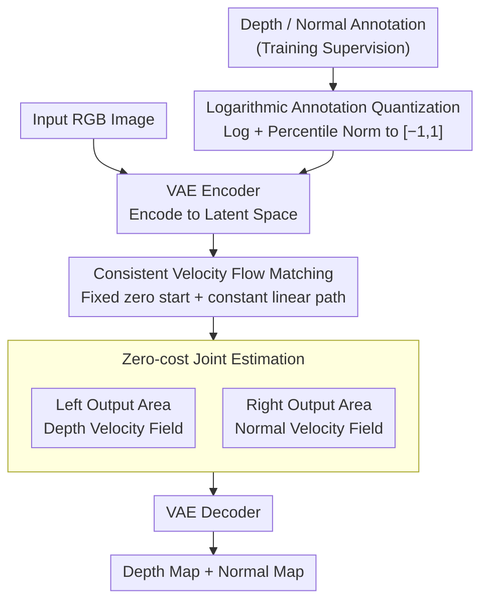

# FE2E: From Editor to Dense Geometry Estimator

**Conference**: CVPR 2026  
**arXiv**: [2509.04338](https://arxiv.org/abs/2509.04338)  
**Code**: None  
**Area**: 3D Vision  
**Keywords**: Depth estimation, normal estimation, image editing models, diffusion models, DiT

## TL;DR
This paper systematically analyzes the differences in fine-tuning behavior between image editing models and generative models for dense geometry estimation tasks. It discovers that editing models possess a natural structural prior advantage. Based on this, the FE2E framework is proposed, which for the first time adapts a DiT-based image editing model into a joint depth and normal estimator, significantly outperforming existing SOTA in zero-shot scenarios (reducing AbsRel by 35% on ETH3D).

## Background & Motivation

1. **Background**: Monocular dense geometry estimation (depth and normal) is a core task in 3D vision. Recently, methods represented by Marigold have achieved impressive zero-shot prediction results with limited data by leveraging pre-trained generative priors from Stable Diffusion. Another class of methods, represented by the DepthAnything series, follows a data-driven approach, using large-scale data (62.6M images) to train general-purpose estimators.

2. **Limitations of Prior Work**: Generative models (text-to-image) are designed to generate images from text; their internal features are not naturally aligned with geometric structures. During fine-tuning, features must be "reshaped" from scratch, leading to unstable learning and performance bottlenecks. Data-driven methods are effective but limited in generalization due to dependence on large-scale annotated data.

3. **Key Challenge**: Dense geometry estimation is essentially an image-to-image task, yet existing methods fine-tune T2I generative models—a mismatch between task and model paradigms.

4. **Goal**: (1) Verify whether image editing models are better suited for dense geometry estimation than generative models; (2) Resolve issues related to training objectives, numerical precision, and computational efficiency when adapting editing models into deterministic predictors.

5. **Key Insight**: The authors start from an intuition—image editing models naturally understand the structure of input images while maintaining the capabilities of generative models, thus they should be more suitable for dense prediction than T2I models. This hypothesis is verified through systematic feature evolution analysis and training dynamics comparison.

6. **Core Idea**: Replace generative models with image editing models as the foundation for dense geometry estimation. The editor is adapted into an estimator using consistent velocity flow matching, logarithmic quantization, and zero-cost joint estimation.

## Method

### Overall Architecture
FE2E is based on Step1X-Edit (a SOTA image editing model based on the DiT architecture). The input is an RGB image, and the outputs are corresponding depth and normal maps. The process is: a VAE encoder encodes the input image and geometric labels into latent space; the DiT learns a constant-velocity linear path from a fixed starting point to the target latent representation; finally, the VAE decoder decodes the predicted results back to pixel space. During training, depth/normal annotations are compressed into a BF16-friendly range via logarithmic quantization before encoding. During inference, the left and right output regions of the DiT are used as depth and normal predictors respectively, producing two maps simultaneously without additional computational overhead.

### Key Designs

**1. Systematic Analysis of Editing vs. Generative Models: Why use an Editor?**

The premise is that "editing models are better for dense estimation than generative models," but evidence is required beyond intuition. The authors fine-tuned Step1X-Edit (editor) and FLUX (generator) under identical settings to observe internal DiT feature evolution and training loss convergence. Visualizing feature maps across different layers (Block 1 / 20 / 35) revealed distinct differences: editing model features **align with the image's geometric structure from the start**, where fine-tuning merely "refines" inherent capabilities. In contrast, generative model features start from chaos and must be "reshaped" from scratch; their training curves oscillate and stall at a loss bottleneck of approximately 0.08.

This comparison explains why editing models consistently lead in all experiments: it is not necessarily a better algorithm, but a **better starting point**. Fine-tuning a model that already understands image structure saves data and ensures stable convergence compared to extracting geometry from text-generation priors. This serves as the theoretical basis for the "From Editor to Estimator" pipeline.

**2. Consistent Velocity Flow Matching: Transforming Generative Diversity into Deterministic Prediction**

Directly applying flow matching objectives from editing models to estimation causes issues: original flow matching learns instantaneous velocity fields across all possible paths, resulting in non-linear global fields and curved integration paths that accumulate errors in discrete solvers. Since geometry estimation is a deterministic task (one RGB image has one unique GT), the diversity of generative models is unnecessary. FE2E "straightens" the path: first, by requiring the direction and magnitude of velocity to **remain constant** along the entire path, making the training objective

$$\mathcal{L} = \mathbb{E}\left[\|\mathbf{v} - f_\theta(\mathbf{z}^x)\|^2\right]$$

completely independent of the time step $t$; second, by fixing the random Gaussian starting point as a zero vector $\mathbf{z}_0^y = \mathbf{0}$ to eliminate sampling randomness. The path becomes a constant-velocity straight line from a fixed start to the target, allowing inference in a single step $\mathbf{z}_1^y = f_\theta(\mathbf{z}^x)$ without iteration. By straightening the path, discretization errors are eliminated at the root, and inference speed is significantly increased.

**3. Logarithmic Annotation Quantization: High Precision Depth for BF16-weighted Models**

Modern editing models are trained using BF16, which is sufficient for RGB output (approx. 1/256 precision) but reveals severe quantization errors when encoding depth annotations. The issue lies in the high dynamic range of depth: in Virtual KITTI (0–80m), uniform quantization to $[-1, 1]$ leads to an AbsRel error of 1.6 for near distances (e.g., 0.1m). Conversely, inverse depth (disparity) is precise for near objects but fails for far ones—mapping 39m and 78m to the same value. FE2E solves this by first using a log transform to compress the dynamic range,

$$D_{log} = \ln(D_{GT} + 1\mathrm{e}{-6})$$

combined with percentile normalization (clipping extremes at 2nd and 98th percentiles)

$$\mathbf{y}_D = \left\langle\left(\frac{D_{log} - D_{log,2}}{D_{log,98} - D_{log,2}} - 0.5\right) \times 2\right\rangle$$

to map log-depth to $[-1, 1]$. The logarithmic scale is naturally more compatible with depth distributions, yielding balanced low errors across all distances (AbsRel approx. 0.013). This avoids the need for FP32 training, saving costs while preserving pre-trained priors.

**4. Zero-cost Joint Estimation: Recovering the Wasted Half of Editor Outputs**

DiT editing models concatenate the conditional image and the target image along the sequence dimension. Consequently, half of the output sequence (corresponding to the conditional side) is discarded in standard editing tasks. FE2E utilizes this wasted output by having the left output region predict the depth velocity field and the right region predict the normal velocity field. The supervision objective is split: $\mathcal{L}_{fm} = \mathbb{E}(\|\mathbf{v}_D - p_l\|^2 + \|\mathbf{v}_N - p_r\|^2)$. A single forward pass produces both maps without increasing parameters or computations. Beyond efficiency, depth and normals provide complementary geometric constraints, improving quality on difficult structures like thin planes or distant buildings.

### Loss & Training
- The primary loss is the constant velocity flow matching loss, calculated in latent space.
- For joint estimation, the left output region is supervised for depth and the right for normals: $\mathcal{L}_{fm} = \mathbb{E}(\|\mathbf{v}_D - p_l\|^2 + \|\mathbf{v}_N - p_r\|^2)$.
- An additional dispersion loss is used to encourage latent feature dispersion across samples.
- Training uses LoRA (rank=64, α=32), freezing all parameters except DiT. AdamW optimizer, learning rate 1e-4, 30 epochs.
- Trainable on a single RTX 4090 (with gradient checkpointing); took approx. 1.5 days on H20 GPUs.

## Key Experimental Results

### Main Results

| Dataset | Metric(AbsRel↓) | FE2E | Lotus-D (Prev. SOTA) | DepthAnything V2 | Gain |
|--------|------|------|----------|------|------|
| NYUv2 | AbsRel | **4.1** | 5.1 | 4.5 | 19.6% vs Lotus-D |
| KITTI | AbsRel | **6.6** | 8.1 | 7.4 | 18.5% |
| ETH3D | AbsRel | **3.8** | 6.1 | 13.1 | **37.7%** |
| ScanNet | AbsRel | **4.4** | 5.5 | - | 20.0% |
| DIODE | AbsRel | **22.8** | 22.8 | 26.5 | Parity |

Training data used only 71K images, significantly less than the 62.6M used by DepthAnything V2.

### Ablation Study

| ID | Configuration | KITTI AbsRel | ETH3D AbsRel | Description |
|------|---------|------|------|------|
| 2 | DirectAdapt (Step1X-Edit) | 9.5 | 5.6 | Baseline |
| 3 | + Consistent Velocity | 8.8 | 5.0 | CV contrib -7%/-10% |
| 4 | + Fixed Start | 8.6 | 4.8 | FS further gain |
| 6 | + Logarithmic Quant | **6.8** | **3.9** | Log Quant contrib -19%/-13% |
| 7 | FLUX + Improved Method | 7.1 | 4.5 | Editor still beats Generator |
| 8 | FE2E Complete (+Joint) | **6.6** | **3.8** | Joint estimation gain |
| 9 | FLUX-Kontext + Complete | 6.7 | 3.6 | Scalable to other editors |

### Key Findings
- Logarithmic quantization is the most significant single improvement, contributing a 19% error reduction on KITTI.
- The performance gap between editing and generative models is consistent across all settings (ID2 vs ID1, ID6 vs ID7).
- Joint estimation is zero-cost and yields visible quality improvements in difficult scenarios (e.g., thin plane structures, distant buildings).
- The method scales to other editors like FLUX-Kontext (ID9), performing even better.

## Highlights & Insights
- **Systematic demonstration of the "From Editor to Estimator" paradigm**: This is not just a model swap; the analysis of feature evolution and training dynamics explains why editing models are better suited for dense estimation. This may inspire more I2I tasks to utilize editing model priors.
- **Clever Zero-cost Joint Estimation**: By leveraging the concatenation mechanism of DiT editing models, FE2E uses traditionally "discarded" outputs for a second task, achieving multi-task learning with zero additional cost.
- **Logarithmic Quantization for BF16**: Provides a solution to the engineering challenge of high-precision tasks using BF16 weights. The scheme is highly generalizable.

## Limitations & Future Work
- Training data is limited to synthetic sets (Hypersim + Virtual KITTI), without real-world data inclusion.
- Normal estimation performance gains are less significant compared to depth.
- Supports only affine-invariant depth; not yet extended to metric depth.
- While balanced, logarithmic quantization is not optimal for extreme near or far distances; piecewise adaptive quantization could be explored.

## Related Work & Insights
- **vs. Marigold/Lotus**: These are based on Stable Diffusion (T2I). FE2E is based on Step1X-Edit (Editor). With similar data scales, FE2E leads significantly, proving foundation model choice is more critical than algorithmic tweaks.
- **vs. DepthAnything V2**: The latter uses 100x more data. FE2E still leads on ETH3D, suggesting editing priors compensate for data scarcity.
- **vs. Diffusion-E2E-FT**: E2E-FT proposed end-to-end fine-tuning for denoising; FE2E advances this to editing models and constant velocity flow matching.

## Rating
- Novelty: ⭐⭐⭐⭐⭐ First systematic demonstration and implementation of the "Editor → Estimator" paradigm shift.
- Experimental Thoroughness: ⭐⭐⭐⭐⭐ Comprehensive benchmarks (5 depth, 4 normal) and detailed ablations.
- Writing Quality: ⭐⭐⭐⭐ Excellent visualization and in-depth analysis.
- Value: ⭐⭐⭐⭐⭐ Provides a new paradigm and theoretical support for foundation model selection in dense prediction.

<!-- RELATED:START -->

## Related Papers

- [\[CVPR 2026\] MotionCrafter: Dense Geometry and Motion Reconstruction with a 4D VAE](motioncrafter_dense_geometry_and_motion_reconstruction_with_a_4d_vae.md)
- [\[CVPR 2026\] Unblur-SLAM: Dense Neural SLAM for Blurry Inputs](unblur-slam_dense_neural_slam_for_blurry_inputs.md)
- [\[CVPR 2026\] Fast3Dcache: Training-free 3D Geometry Synthesis Acceleration](fast3dcache_training-free_3d_geometry_synthesis_acceleration.md)
- [\[AAAI 2026\] Free-Form Scene Editor: Enabling Multi-Round Object Manipulation like in a 3D Engine](../../AAAI2026/3d_vision/free-form_scene_editor_enabling_multi-round_object_manipulation_like_in_a_3d_eng.md)
- [\[CVPR 2026\] TextFM: Robust Semi-dense Feature Matching with Language Guidance](textfm_robust_semi-dense_feature_matching_with_language_guidance.md)

<!-- RELATED:END -->
