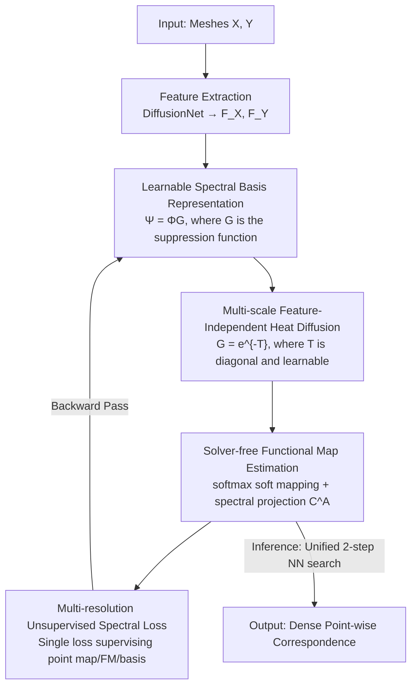

# From Feature Learning to Spectral Basis Learning: A Unifying and Flexible Framework for Efficient and Robust Shape Matching

**Conference**: CVPR 2026  
**Paper**: [CVF Open Access](https://openaccess.thecvf.com/content/CVPR2026/html/Luo_From_Feature_Learning_to_Spectral_Basis_Learning_A_Unifying_and_CVPR_2026_paper.html)  
**Code**: https://github.com/LuoFeifan77/Unsupervised-Spectral-Basis-Learning  
**Area**: 3D Vision / Self-supervised Representation Learning  
**Keywords**: Shape Matching, Functional Maps, Spectral Basis Learning, Heat Diffusion, Unsupervised Learning

## TL;DR
Addressing the long-standing blind spot in deep functional map matching—where only "features" are optimized while the "spectral basis" remains fixed—this paper proposes Advanced Functional Maps. By utilizing a set of learnable "suppression functions" $G$, the fixed Laplacian basis $\Phi$ is transformed into a learnable basis $\Psi=\Phi G$. Features and the spectral basis are jointly optimized end-to-end via a lightweight multi-scale heat diffusion network. This approach significantly outperforms feature-only SOTA methods in difficult scenarios such as non-isometry and topological noise, while being faster and more stable by eliminating the functional map solver.

## Background & Motivation

**Background**: The mainstream paradigm for non-rigid 3D shape matching (establishing dense correspondence between two meshes) is the "deep functional map." it compresses point-to-point mappings into a small $k\times k$ matrix $C_{XY}$, solved in a low-frequency spectral space spanned by Laplacian bases, and later restored to dense correspondence by algorithms like ZoomOut. Since FMNet introduced this differentiable paradigm, subsequent works have primarily focused on using stronger feature extraction backbones (e.g., DiffusionNet) or adding more regularizations (bijectivity, orthogonality, point-functional map coupling consistency) to optimize **features** $F_X=\mathcal{F}_\Theta(X)$.

**Limitations of Prior Work**: Two costs in this pipeline have been overlooked. First, **the spectral basis is fixed from start to finish**—while features are optimized through data-driven methods, the Laplacian basis $\Phi$ is treated as an immutable constant. Regardless of feature quality, final matching is projected onto these fixed bases; thus, the representational power of the basis acts as a bottleneck, leading to sub-optimal results in large deformation, non-isometric, and topological noise scenarios. Second, most SOTA methods (ULRSSM, HybridFMaps, DeepFAFM, etc.) rely on **least-squares functional map solvers** coupled with numerous auxiliary losses, resulting in complex training paradigms, high computational overhead, and numerical instability.

**Key Challenge**: The quality of functional maps is determined by the product of "features × spectral basis," yet the community has only addressed one factor. Making the spectral basis learnable could theoretically allow the basis to adaptively suppress noisy frequency bands for downstream tasks. However, the difficulty lies in making the basis differentiable and learnable while maintaining its invertibility, orthogonality, and geometric priors without introducing excessive parameters.

**Goal**: (1) Provide a theoretical framework for functional maps that generalizes "fixed bases" to "learnable bases"; (2) develop the first unsupervised, end-to-end method for jointly optimizing features and spectral bases; (3) eliminate solvers and auxiliary losses to improve efficiency and robustness.

**Core Idea**: Multiply the Laplacian basis $\Phi_k$ on the right by a diagonal **suppression function matrix** $G=\mathrm{diag}\{g_1,\dots,g_k\}$ ($g_i\in(0,1]$) to obtain a learnable basis $\Psi_k=\Phi_k G$. $G$ acts as an "attention/filter" on the spectrum, suppressing or retaining frequency bands as needed. The authors further prove that learning this basis is mathematically **equivalent to performing spectral convolution**, where $G$ serves as the spectral filter—bridging the gap between shape matching and spectral graph neural networks.

## Method

### Overall Architecture

The method aims to "learn both features and spectral bases." It utilizes a **single-branch, solver-free** differentiable pipeline: Input two triangular meshes $X,Y$ → Extract vertex-wise features $F_X,F_Y$ using DiffusionNet (using established practices as a scaffold) → The **basis learning module** transforms the fixed basis $\Phi$ into a learnable basis $\Psi$ via multi-scale heat diffusion → **Mapping estimation** directly obtains a soft point-to-point mapping $\Pi_{YX}$ via softmax, then calculates the Advanced Functional Map $C^A_{XY}$ through spectral projection → Use a **multi-resolution unsupervised spectral loss** to simultaneously supervise point maps, functional maps, and basis functions; during inference, a unified two-step nearest neighbor search restores dense correspondence.

Compared to the old architecture in Fig. 1 ("dual-branch + solver + spectral projection + multiple consistency losses"), this paper (Fig. 2) retains only the spectral projection path and a single loss, significantly streamlining the structure. The pipeline is as follows:

### Key Designs

**1. Learnable Spectral Basis Representation (Advanced Functional Maps): Transforming Fixed Bases into Learnable Bases**

This is the theoretical foundation, addressing the "unoptimizable basis" pain point. Given the top $k$ Laplacian bases $\Phi_k=[\phi_1,\dots,\phi_k]$ and a set of suppression functions $G=\mathrm{diag}\{g_1,\dots,g_k\}$ ($g_i:\mathbb{R}\to(0,1]$), define the learnable basis:

$$\Psi_k := \Phi_k G,\qquad \psi_i=g_i\phi_i.$$

The suppression function applies "band-wise attenuation," essentially acting as spectral attention/filtering. The authors prove this simple construction preserves all desirable properties of the functional map pipeline: **invertibility** ($\Psi_k^\dagger=G^{-1}\Phi_k^\top M$, since $\Psi_k^\dagger\Psi_k=I$), **orthogonality preservation** ($\langle\psi_i,\psi_j\rangle_M=g_ig_j\langle\phi_i,\phi_j\rangle_M=0,\ i\neq j$), **learnability** ($G$ is a data-driven parameter), and **structural prior invariance** (low-frequency information originally encoded in $\phi_1$ remains in $\psi_1$ after multiplication by $G$, preserving geometric semantics). Based on this, standard functional map optimization (Eq. 1) is rewritten as an "Advanced Functional Map" $C^A_{XY}$ based on $\Psi$ (Theorem 4.2), and can be calculated directly via spectral projection $C^A_{XY}=\Psi_{Y,k}^\dagger\,\Pi_{YX}\,\Psi_{X,k}$ (Eq. 9). Unlike traditional operations on fixed bases, this step includes the "basis" as an optimizable variable.

**2. Multi-scale Feature-Independent Heat Diffusion: Generating $G$ with Minimal Parameters**

Defining a learnable basis is insufficient; the key is parameterizing $G$ to be both lightweight and expressive. A naive approach would use classic heat diffusion, truncating the basis to the first $k$ eigenfunctions as $\Psi_k=h_t(\Phi_k)=\Phi_k e^{-t\Lambda_k}$ (Eq. 17). However, the authors identify two major drawbacks: (a) a single diffusion time $t$ limits multi-scale expression; (b) eigenvalues $\Lambda_k$ act as fixed weights, **over-suppressing high frequencies indiscriminately**, whereas frequency attenuation should ideally be adaptively determined by the downstream task.

To address this, the paper proposes **multi-scale, eigenvalue-independent** heat diffusion:

$$\Psi_k=\Phi_k\,e^{-T},\qquad T=\mathrm{diag}\{t_1,t_2,\dots,t_k\},$$

substituting the single scalar diffusion time $t\Lambda_k$ with a **per-band learnable diagonal matrix** $T$ (Eq. 18), completely unlinking it from eigenvalues. Two clever details: $T$ is initialized to zero, making $G=e^{-T}=I$ act as an identity mapping at the start of training to preserve all original bases equally, providing a gentle starting point for optimization; also, $T$ is **shared between source and target domains** ($\Psi_{X,k}=\Phi_{X,k}G$, $\Psi_{Y,k}=\Phi_{Y,k}G$), which saves parameters and promotes spectral consistency between shapes. The entire basis learning network uses only one set of shared diagonal parameters.

**3. Solver-free Advanced Functional Map Estimation: Using Spectral Projection + Softmax Soft Mapping**

This addresses the "reliance on slow and unstable least-squares solvers." Point-to-point mapping no longer requires solving linear systems; instead, a differentiable soft correspondence matrix is generated via softmax:

$$\Pi_{YX}=\mathrm{Softmax}(F_Y F_X^\top/\alpha),$$

where $\alpha$ controls the sharpness (Eq. 19). The Advanced Functional Map is obtained **only** via spectral projection (Eq. 9), without calling any functional map solver. The authors prove that spectral projection is equivalent to the least-squares solution under certain conditions (Sec. 10.2), making the solver redundant. This avoids the numerical instability and overhead of least-squares.

**4. Multi-resolution Unsupervised Spectral Loss: A Single Loss for Unified Supervision**

Prior methods typically utilize multiple losses (bijectivity, orthogonality, coupling consistency) to manage point maps, functional maps, and basis functions separately. This paper **unifies them into a single loss across multiple eigenvector resolutions**:

$$L_{mrs}=\sum_{k=k_{init}}^{k_{end}}\big\|\Psi_{Y,k}-\Pi_{YX}\Psi_{X,k}(C^A_{XY})^\top\big\|_F^2.$$

It constrains the structural consistency of point maps $\Pi_{YX}$, functional maps $C^A_{XY}$, and learnable bases $\Psi$ simultaneously across multiple spectral resolutions $k$ from $k_{init}$ to $k_{end}$ (Eq. 20). Replacing a set of losses with one simplifies the training paradigm. The inference stage is also unified: first, perform nearest neighbor in feature space $\Pi_{YX}=\mathrm{NS}(F_Y,F_X)$ (Eq. 21), then use the learned basis for a restoration step $\Pi^{end}_{YX}=\mathrm{NS}(\Psi_{Y,k_{end}},\Psi_{X,k_{end}}(C^A_{XY})^\top)$ (Eq. 22). Notably, while ULRSSM/HybridFMaps require manual switching between feature matching for non-isometric and functional map restoration for near-isometric, **a single unified pipeline** here covers all scenarios by adaptively suppressing spectral noise.

> Theoretical Insight: The authors prove $\Psi=\Phi f(\Lambda)=(\Phi * f)$ (Eq. 16), meaning **learning basis functions = performing spectral convolution on the original basis, with $G$ as the spectral filter.** This provides a unified interpretation of spectral graph/manifold convolutions (e.g., ChebyNet, MoNet, GRAND, DiffusionNet) and heat diffusion frameworks as mechanisms for "directly optimizing basis functions."

## Key Experimental Results

Evaluation covers four scenarios: near-isometric, cross-dataset generalization, anisotropic remeshing, and non-isometric. The metric is average geodesic error (×100, lower is better). Baselines include axiomatic methods (ZoomOut/SmoothShells/...), supervised methods (FMNet/GeomFmaps), and various unsupervised SOTA. ULRSSM and HybridFMaps are also tested with test-time fine-tuning (w.FT).

### Main Results (Near-isometric + Cross-dataset, selected from Tab. 4, ×100 Geodesic Error)

| Training→Testing | F→F | S→S | S→S19 | F→S19 |
|------|------|------|------|------|
| GeomFmaps (Supervised) | 2.6 | 3.0 | 12.2 | 9.9 |
| AttentiveFMaps | 1.9 | 2.2 | 9.9 | 6.4 |
| RFMNet | 1.7 | 2.1 | 6.9 | 6.3 |
| ULRSSM | 1.6 | 1.9 | 18.5 | 14.5 |
| ULRSSM (w.FT) | 1.6 | 1.9 | 6.7 | 5.7 |
| HybridFMaps | 1.4 | 1.8 | 13.0 | 9.5 |
| DiffZO | 1.9 | 2.4 | 6.9 | 4.2 |
| **Ours** | 1.8 | 2.3 | **5.9** | 6.2 |

The cross-dataset columns highlight the difference: ULRSSM/HybridFMaps errors spike on S→S19 and F→S19 without fine-tuning (e.g., ULRSSM 18.5, HybridFMaps 13.0), revealing poor generalization and high dependence on test-time fine-tuning. Ours achieves 5.9 on S→S19 without fine-tuning, **outperforming even fine-tuned ULRSSM (6.7)**. On isometric distributions, Ours is competitive with SOTA (slight gap).

### Robustness to Non-isometry (SMAL / DT4D-H inter-class / Anisotropic, ×100)

| Method | SMAL | DT4D-H (inter) | S→F a | S a→S a |
|------|------|------|------|------|
| ULRSSM | 4.5 | 5.2 | 8.9 | 1.9 |
| ULRSSM (w.FT) | 4.2 | 4.1 | 2.4 | 1.9 |
| HybridFMaps | 3.5 | 3.9 | 4.6 | 1.8 |
| HybridFMaps (w.FT) | 2.8 | 3.5 | 2.2 | 1.7 |
| DeepFAFM | 3.9 | 4.2 | 2.9 | 1.9 |
| **Ours** | **2.6** | **3.5** | 3.6 | 2.3 |

Non-isometry is the core strength: On SMAL (2.6) and DT4D-H inter-class (3.5), it **outperforms all non-fine-tuned baselines and even surpasses the fine-tuned version of HybridFMaps on SMAL/DT4D-H**. While HybridFMaps relies on extrinsic elastic bases, Ours achieves superior results using only optimized **intrinsic Laplacian bases**, proving that learnable suppression functions can compensate for non-isometric distortion.

### Key Findings
- **Spectral basis is the overlooked bottleneck**: Optimizing features alone results in cross-dataset failure; making the basis adaptive improves both generalization and non-isometric robustness.
- **No fine-tuning > others with fine-tuning**: Ours surpasses the test-time fine-tuning results of ULRSSM/HybridFMaps on multiple difficult benchmarks, highlighting that its generalization is structural rather than based on test-set adaptation.
- **Efficiency**: The exclusion of solvers and use of a single loss lead to faster computation.
- Note: Major ablation studies on individual module contributions are found in the Supplemental Materials rather than the main text.

## Highlights & Insights
- **Pivotal Innovation via a Simple Formula**: $\Psi = \Phi G$ is minimal yet moves the "spectral basis" from a constant to a learnable variable while preserving key mathematical properties.
- **Theoretical Elegance**: proving "learning basis = spectral convolution" connects shape matching to GNN frameworks (ChebyNet, DiffusionNet), providing a bridge for future basis designs.
- **Simplicity Wins**: Removing functional map solvers and unifying the pipeline with a single multi-resolution loss reduces complexity while improving performance.
- **Transferable Trick**: The lightweight parameterization of $T$ (learnable diagonal diffusion time, zero-initialized, shared across source/target) can be applied to any task requiring adaptive spectral weighting.

## Limitations & Future Work
- The authors acknowledge that under **extreme non-isometric deformation** and **partial shape matching**, the structural information in Laplacian bases is severely damaged, which learnable suppression functions cannot fully resolve. Future work may involve deformation-aware representations or extrinsic information.
- Observation: The method still relies on the fixed top $k$ Laplacian bases as a foundation; $G$ can only scale existing frequency bands and cannot generate entirely new basis directions.
- In near-isometric scenarios, improvements are marginal compared to existing SOTA; the primary benefits appear in difficult or cross-domain scenarios.

## Related Work & Insights
- **vs. ULRSSM / HybridFMaps**: These focus on features, rely on solvers and multiple losses, and require test-time fine-tuning. Ours optimizes the basis, is solver-free, and outperforms them without fine-tuning.
- **vs. HybridFMaps Extrinsic Elastic Basis**: Ours outperforms HybridFMaps on non-isometric benchmarks like SMAL using only optimized intrinsic Laplacian bases, suggesting that learnable intrinsic bases can resist distortion without extrinsic data.
- **vs. DiffFMaps (Supervised Spectral Embedding)**: DiffFMaps relies on labels and is point-cloud oriented. Ours is unsupervised, jointly optimizes features/bases, and is designed for mesh data.
- **vs. Spectral Graph CNNs**: This paper unifies these methods under the "optimized basis" perspective, allowing their filtering strategies to be used for constructing stronger bases for matching.

## Rating
- Novelty: ⭐⭐⭐⭐⭐ First unsupervised spectral basis learning method for matching with a unified theory.
- Experimental Thoroughness: ⭐⭐⭐⭐ Extensive comparisons across benchmarks, though module-wise ablations are in the supplement.
- Writing Quality: ⭐⭐⭐⭐⭐ Clear progression from theory to motivation.
- Value: ⭐⭐⭐⭐⭐ Simple, reusable framework with strong theoretical ties to spectral GNNs.

<!-- RELATED:START -->

## Related Papers

- [\[CVPR 2026\] AsymLoc: Towards Asymmetric Feature Matching for Efficient Visual Localization](asymloc_towards_asymmetric_feature_matching_for_efficient_visual_localization.md)
- [\[CVPR 2026\] TextFM: Robust Semi-dense Feature Matching with Language Guidance](textfm_robust_semi-dense_feature_matching_with_language_guidance.md)
- [\[CVPR 2026\] RigMo: Unifying Rig and Motion Learning for Generative Animation](rigmo_unifying_rig_and_motion_learning_for_generative_animation.md)
- [\[CVPR 2026\] Learning Convex Decomposition via Feature Fields](learning_convex_decomposition_via_feature_fields.md)
- [\[CVPR 2026\] GM-R²: Generative Matching Learning for Unsupervised Geometric Representation and Registration](gm-r2_generative_matching_learning_for_unsupervised_geometric_representation_and.md)

<!-- RELATED:END -->
