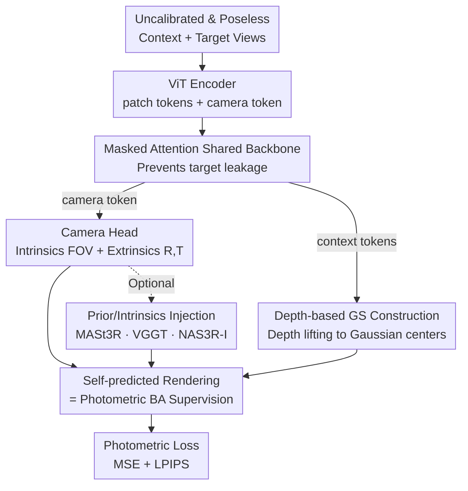

# From None to All: Self-Supervised 3D Reconstruction via Novel View Synthesis

**Conference**: CVPR 2026  
**Paper**: [CVF Open Access](https://openaccess.thecvf.com/content/CVPR2026/html/Huang_From_None_to_All_Self-Supervised_3D_Reconstruction_via_Novel_View_CVPR_2026_paper.html)  
**Code**: https://ranrhuang.github.io/nas3r/  
**Area**: 3D Vision  
**Keywords**: Self-Supervised 3D Reconstruction, Novel View Synthesis, 3D Gaussian Splatting, Camera Pose Estimation, Photometric BA  

## TL;DR
NAS3R is a **completely self-supervised** feed-forward 3D reconstruction framework. Without using any ground-truth (GT) labels or pre-trained priors during training, it jointly learns 3D Gaussians, camera intrinsics/extrinsics, and depth from uncalibrated, poseless multi-view images using only photometric loss signal from rendered target views. Its novel view synthesis (NVS) quality approaches supervised methods, while its pose and depth estimation outperform several supervised baselines.

## Background & Motivation
**Background**: Recovering 3D structures and camera parameters from 2D images is a fundamental goal of computer vision. Classical approaches rely on iterative optimization like Bundle Adjustment (BA). Recent feed-forward models (e.g., DUSt3R, MASt3R, VGGT) utilize transformers to directly regress 3D coordinates from large-scale annotated data, largely bypassing geometric post-processing.

**Limitations of Prior Work**: The bottleneck of this data-driven path is that **GT 3D data is expensive**. Collecting large-scale high-quality depth/pose labels is costly, limiting scalability. To circumvent labels, self-supervised NVS methods use predicted poses to render target views for photometric consistency. However, without GT supervision, the **"chicken-and-egg" problem** between 3D reconstruction and camera estimation (accurate reconstruction requires precise poses, and vice-versa) is amplified, often leading to training divergence or degenerate solutions.

**Key Challenge**: Existing self-supervised methods often rely on constraints to stabilize training: either performing reconstruction in **latent space** (e.g., RayZer) to avoid explicit 3D optimization (which fails to produce transferable poses or support geometric tasks), or relying on **supervised pre-trained priors** (e.g., NoPoSplat/SPFSplat initialized with MASt3R or DUSt3R distillations). Furthermore, **almost all methods require GT intrinsics** to well-condition the training, preventing extension to uncalibrated in-the-wild data.

**Goal / Core Idea**: The authors explore whether a network can **completely** learn explicit 3D geometry and camera poses from 2D images **without any GT labels or pre-trained priors**. NAS3R ("From None to All") achieves this by integrating reconstruction and camera heads into a **shared transformer constrained by masked attention** and utilizing a **depth-based Gaussian construction** to anchor Gaussian centers on visual rays, providing a well-conditioned initialization for joint optimization via a differentiable GS renderer acting as a "photometric BA."

## Method

### Overall Architecture
NAS3R is a feed-forward network. It takes a set of uncalibrated, poseless context views $I_C$ as input. During training, a target view $I_T$ is added. Images are partitioned into patch tokens, concatenated with a learnable camera token, and processed through a shared ViT encoder followed by a **masked-attention decoder** for cross-view interaction. Finally, three parallel heads predict **camera parameters, depth, and Gaussian attributes**. Depth maps are "lifted" into 3D Gaussian centers using predicted intrinsics/extrinsics. The Gaussians are then rendered into the target view using predicted target poses to compute photometric loss against the real target image. The entire pipeline is trained end-to-end without 3D/pose GT.

The mechanism can be viewed as: the transformer backbone extracts cross-view feature correspondences through attention (implicit feature matching), while the differentiable GS renderer performs **photometric Bundle Adjustment**, forcing Gaussian primitives to produce consistent pixel observations across views to optimize poses, intrinsics, depth, and attributes simultaneously.

### Key Designs

**1. Masked Attention Shared Backbone: Blind Reconstruction, Global Pose**

In self-supervised NVS training, the target view acts as the supervision signal but is also fed into the network. Without constraints, the reconstruction head might "cheat" by looking at target information (target information leakage), resulting in low loss without learning true geometry. NAS3R places both heads in **the same transformer backbone** but uses **masked attention** to control information flow: context tokens **can only attend to context tokens**, ensuring reconstruction is independent of the target view, while target tokens **can attend to both context and target tokens** to utilize global scene cues for accurate pose estimation. Formally, for view $v$: $G_v = \text{MaskedDecoder}(F_v, F_{1:K})$ where $K$ depends on whether it is a context or target view.

**2. Depth-based Local-to-Global Gaussian Construction: Well-conditioned Optimization**

Determining Gaussian centers $\mu \in \mathbb{R}^3$ is critical for convergence. Prior methods often use a **canonical-space paradigm**, regressing 3D points directly. However, these points are an implicit combination of pose, intrinsics, and depth without explicit constraints, leading to failure under random initialization. NAS3R adopts a **local-to-global paradigm**: a DPT head predicts per-pixel depth $D_v$ from refined tokens, which is then **lifted** to 3D space using predicted camera parameters $P_v, K_v$ to define Gaussian centers. This anchors centers **strictly on the visual rays of the input**, providing physics-based, well-conditioned geometric constraints that allow stable convergence from scratch ("From None").

**3. Self-predicted Rendering = Photometric BA Loop**

Without GT, NAS3R relies on image-level supervision. The camera head predicts intrinsics (parameterized by FOV) and extrinsics $P_v=[R_v|T_v]$ relative to the first frame. Using these **self-predicted** parameters, the reconstructed Gaussians are rendered into $\hat I_T$ to compute:

$$\mathcal{L}_{render} = \frac{1}{V_T}\sum \lVert I - \hat I\rVert^2 + \gamma\,\text{LPIPS}(I, \hat I)$$

Since the differentiable 3DGS renderer supports gradients back to camera poses and intrinsics, the loss optimizes poses, intrinsics, depth, and Gaussian attributes together. This implementation is an end-to-end, learnable **photometric Bundle Adjustment**. To avoid collapse due to non-convexity, camera heads are initialized to output identity poses and focal lengths equal to image dimensions.

**4. Compatibility and Prior Injection: Tuning "From None to All"**

NAS3R is compatible with existing SOTA 3D models. For VGGT, it adds masked attention and a Gaussian head. For MASt3R, it adds depth, Gaussian, and camera heads (MLP-based). When pre-trained weights are available, they can be used for initialization (NAS3R(MASt3R)/NAS3R(VGGT)). When GT intrinsics are available, they are embedded via linear layers and concatenated with tokens (NAS3R-I) to resolve scale ambiguity. This covers the spectrum from "zero prior" to "full prior"—the "to All" aspect of the title.

### Loss & Training
- The primary objective is the photometric consistency loss $\mathcal{L}_{render}$ (MSE + $\gamma\cdot$LPIPS), optimized end-to-end.
- Training employs curriculum learning by **gradually increasing the interval** between context frames.
- Models are trained on a single A100. VGGT variants use 224×224 resolution; MASt3R variants use 256×256. It is assumed that views within the same scene share intrinsics.

## Key Experimental Results

### Main Results
**Novel View Synthesis (Zero-shot test after RE10K training; best self-supervised in bold, ⭐ indicates random initialization):**

| Dataset | Metric | NAS3R | SPFSplat⁎(Self-SOTA) | SelfSplat | MVSplat(Supervised) |
|--------|------|-------|------------|-----------|------------------|
| RE10K | PSNR↑ | **23.130** | 21.306 | 19.152 | 24.012 |
| RE10K | LPIPS↓ | **0.193** | 0.248 | 0.328 | 0.175 |
| ACID | PSNR↑ | **25.030** | 23.354 | 22.204 | 25.525 |
| DTU | PSNR↑ | **15.229** | 14.042 | 13.249 | 14.542 |
| DTU | LPIPS↓ | **0.317** | 0.426 | 0.441 | 0.324 |

NAS3R outperforms other self-supervised methods and **approaches or exceeds** supervised baselines like MVSplat (e.g., higher PSNR on DTU) without any GT pose/intrinsics.

**Relative Pose Estimation (AUC %, zero-shot after RE10K training):**

| Method | RE10K Overall@10° | RE10K Overall@20° | DL3DV Overall@10° |
|------|-------------------|-------------------|-------------------|
| SP+SG (Supervised matching) | 40.6 | 56.9 | 37.2 |
| SelfSplat | 18.4 | 31.8 | 6.1 |
| SPFSplat⁎ | 23.9 | 39.8 | 7.1 |
| **NAS3R** | **51.0** | **64.9** | **20.5** |

NAS3R significantly improves pose estimation, tripling the AUC of self-supervised baselines on DL3DV and **outperforming supervised SuperPoint+SuperGlue** on RE10K, indicating strong self-learned feature correspondences.

### Ablation Study

**Depth Estimation (BlendedMVS):**

| Method | rel↓ | τ↑ |
|------|------|------|
| MVSplat (Supervised, cost volume) | 0.405 | 54.0 |
| NoPoSplat (Supervised) | 0.508 | 34.1 |
| SPFSplat⁎ | 0.255 | 60.3 |
| **NAS3R** | **0.206** | **71.4** |

The standard transformer in NAS3R, supervised only by pixels, produces depth that surpasses supervised cost-volume-based MVSplat.

**Data and View Scaling:**

| Config | NVS PSNR↑ | Pose@20°↑ | Depth rel↓ |
|------|-----------|-----------|------------|
| RE10K | 15.146 | 34.1 | 0.206 |
| RE10K+DL3DV | 16.316 | 41.6 | 0.145 |
| 2 Views | 23.130 | 64.9 | — |
| 10 Views | 27.093 | 75.5 | — |

Indices for NVS, pose, and depth consistently improve with more data and views.

**Self-supervised weights for Downstream Fine-tuning:**

| Setting | Depth rel↓ | Pose@20°↑ |
|------|-----------|-----------|
| (1) Self-supervised only (NAS3R) | 0.145 | 66.8 |
| (2) Supervised from scratch | 0.177 | 39.4 |
| (3) Supervised FT from (1) | **0.119** | **71.3** |

### Key Findings
- **Depth construction (Design 2) is the key to removing prior dependency**: Anchoring centers on visual rays allows stable convergence without "warm-up" priors.
- **Pose improvement > NVS improvement**: The geometric gains from self-predicted poses are more pronounced than pixel-level rendering gains, demonstrating that the photometric BA loop learns transferable geometry.
- **Priors and intrinsics provide monotonic gains**: NAS3R(VGGT/MASt3R) outperforms its base backbones; adding GT intrinsics (NAS3R-I) further resolves scale ambiguity.
- **Strong initialization**: Weights from self-supervised NAS3R serve as superior initializations for supervised fine-tuning.

## Highlights & Insights
- **NVS as Generalized Masked Modeling**: Viewing the reconstruction of target views from context as masked modeling provides a clean conceptual framework for self-supervision.
- **Asymmetric Masked Attention (Design 1)**: The design prevents target leakage for reconstruction while allowing global context for pose estimation, a versatile trick for tasks where input contains supervision signals.
- **Differentiable GS as Learnable BA**: Framing the renderer as an explicit Bundle Adjustment bridge links classical geometric optimization with feed-forward deep learning.
- **Scaling to Unlabeled Data**: The ability to learn from uncalibrated in-the-wild data "from None" enables scaling 3D models using vast amounts of unlabeled video.

## Limitations & Future Work
- High-quality surface geometry reconstruction still requires GT depth fine-tuning due to inherent GS limitations and lack of point-based GT supervision.
- The framework has not yet been tested on "ultra-large-scale" diverse datasets; scaling to broader, messier data is future work.
- The stability of "self-predicted pose + photometric BA" in extreme baseline or highly dynamic scenarios has not been fully pressure-tested.
- Intrinsics assumptions (centered principal point, uniform FOV) may introduce bias for cameras with high distortion.

## Related Work & Insights
- **vs NoPoSplat / SPFSplat**: These require MASt3R/DUSt3R priors and GT intrinsics; NAS3R removes these dependencies with depth-based construction and joint estimation.
- **vs SelfSplat**: SelfSplat requires CroCoV2 pre-training and GT intrinsics; NAS3R outperforms it without either.
- **vs RayZer**: RayZer renders in latent space, failing to produce transferable poses; NAS3R provides explicit geometry and transferable poses.
- **vs DUSt3R / MASt3R / VGGT**: These are supervised; NAS3R provides a self-supervised paradigm to extend these backbones to unlabeled data.

## Rating
- Novelty: ⭐⭐⭐⭐⭐ First fully zero-prior, zero-label, uncalibrated self-supervised framework for joint 3D recon and camera estimation.
- Experimental Thoroughness: ⭐⭐⭐⭐⭐ Comprehensive coverage across NVS, pose, depth, zero-shot transfer, and scaling.
- Writing Quality: ⭐⭐⭐⭐ Clear motivation and technical deconstruction; some dense layouts in the appendix.
- Value: ⭐⭐⭐⭐⭐ Significantly expands the potential for scaling 3D models using massive unlabeled datasets.

<!-- RELATED:START -->

## Related Papers

- [\[CVPR 2026\] E-RayZer: Self-supervised 3D Reconstruction as Spatial Visual Pre-training](e-rayzer_self-supervised_3d_reconstruction_as_spatial_visual_pre-training.md)
- [\[CVPR 2026\] Dynamic-Static Decomposition for Novel View Synthesis of Dynamic Scenes with Spiking Neurons](dynamic-static_decomposition_for_novel_view_synthesis_of_dynamic_scenes_with_spi.md)
- [\[CVPR 2026\] Cross-View Splatter: Feed-Forward View Synthesis with Georeferenced Images](cross-view_splatter_feed-forward_view_synthesis_with_georeferenced_images.md)
- [\[CVPR 2026\] From Rays to Projections: Better Inputs for Feed-Forward View Synthesis](from_rays_to_projections_better_inputs_for_feed-forward_view_synthesis.md)
- [\[CVPR 2026\] Anny-Fit: All-Age Human Mesh Recovery](anny-fit_all-age_human_mesh_recovery.md)

<!-- RELATED:END -->
