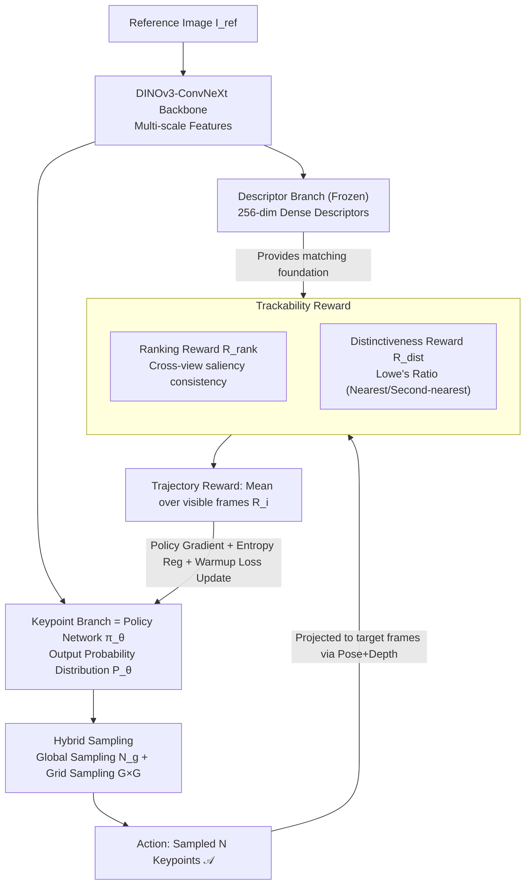

# From Pairs to Sequences: Track-Aware Policy Gradients for Keypoint Detection

**Conference**: CVPR 2026  
**arXiv**: [2602.20630](https://arxiv.org/abs/2602.20630)  
**Code**: None  
**Area**: 3D Vision  
**Keywords**: Keypoint detection, Reinforcement learning, Long-term trackability, Sequential decision making, Feature matching

## TL;DR

Shift keypoint detection from the "image pair matching" paradigm to "sequence-level trackability optimization" using the reinforcement learning framework TraqPoint to directly optimize the long-term tracking quality of keypoints over image sequences. It surpasses SOTA in pose estimation, visual localization, visual odometry, and 3D reconstruction.

## Background & Motivation

**Historical Context**: Existing learned keypoint detection methods (SuperPoint, DISK, ALIKED, RDD, etc.) are trained on **image pairs**, with the optimization target being "matchability" between two images.  
**Limitations of Prior Work**: Core requirements for practical applications like SfM and SLAM involve **long-term trackability**. In long sequences, keypoints that perform well on a single pair might drift or be lost due to extreme viewpoint variations, illumination changes, and motion blur, directly impacting system stability.  
**Key Challenge**: While previous RL methods (RFP, DISK, RIPE) introduced reinforcement learning to handle discrete selection, their reward functions remain based on individual image pairs and fail to explicitly model temporal dynamics.  
**Goal**: This paper proposes a paradigm shift from "pairwise matchability" to "long-term trackability."

## Method

### Overall Architecture

TraqPoint addresses the mismatch where current keypoint detection optimizes pairwise matchability without focusing on trackability within long sequences. It adopts a "describe-then-detect" dual-branch architecture (inherited from RDD): the descriptor branch is pre-trained and frozen, while the keypoint branch serves as the RL policy network $\pi_\theta$. The state $s$ is the reference image $I^{ref}$, and the action $\mathcal{A} = \{\mathbf{x}_i\}_{i=1}^N$ consists of $N$ keypoints sampled from the probability distribution $P_\theta$ output by the policy. The optimization objective is to maximize the expected tracking quality reward over the entire sequence. The pipeline flows as follows: the backbone extracts features $\rightarrow$ the keypoint branch (policy) samples actions $\rightarrow$ sampled points are projected onto sequence frames and trackability rewards are calculated using frozen descriptors $\rightarrow$ the policy is updated via policy gradients.

### Key Designs

**1. DINOv3-ConvNeXt Backbone: Strong semantic backbone for the dual-branch architecture**

TraqPoint replaces the ResNet-50 in RDD with DINOv3-ConvNeXt (base) to provide multi-scale features and stronger semantic representations. The descriptor branch uses a multi-scale deformable Transformer to aggregate features across four scales, outputting 256-dimensional dense descriptor maps; this branch is frozen after pre-training to provide a stable matching foundation. The keypoint branch acts as the policy network $\pi_\theta$, outputting a pixel-wise probability distribution $P_\theta$. Freezing the descriptors ensures reward signals do not drift, enabling stable optimization.

**2. Hybrid Sampling Strategy: Preventing keypoint clustering in high-probability regions**

Sampling keypoints directly from $P_\theta$ can lead to clustering in a few high-probability areas, sacrificing spatial coverage. TraqPoint splits sampling into two parts: global sampling draws $N_g$ points from the global distribution $P_\theta$, while grid sampling divides the image into a $G \times G$ grid and samples one point per cell according to local softmax distributions. Probabilities for both types are unified by the global $P_\theta(\mathbf{x}_i)$ for policy gradient calculation, maintaining spatial uniformity while ensuring consistent gradient estimation.

**3. Trackability Reward: Direct utilization of long-sequence tracking quality**

This is the core of the paradigm shift—replacing "pairwise matchability" with "sequence trackability." For each keypoint $\mathbf{x}_i$, it is projected into all target frames in the sequence using ground-truth pose and depth. A composite reward is calculated over the set of visible frames $\mathcal{V}_i$. The Ranking Reward $R_{\text{rank}}$ measures cross-view saliency consistency by calculating the percentile rank of the point's logit within a $K \times K$ local region in target frames, linearly scaled as $R_{\text{rank},i}^t = \max(0, \frac{\text{rank\_prop} - \tau_{\text{rank}}}{1.0 - \tau_{\text{rank}}})$ ($\tau_{\text{rank}} = 0.2$). The Distinctiveness Reward $R_{\text{dist}}$ uses frozen descriptors to compute the Lowe’s ratio $\text{ratio} = d_1/d_2$, rewarding points where $R_{\text{dist},i}^t = \max(0, \frac{\tau_{\text{dist}} - \text{ratio}}{\tau_{\text{dist}}})$ ($\tau_{\text{dist}} = 0.85$). The final trajectory reward $R_i = \frac{1}{|\mathcal{V}_i|} \sum_{t \in \mathcal{V}_i} R_i^t$ is the mean across visible frames.

### Loss & Training

The total loss combines policy gradients, spatial entropy regularization, and a warmup loss:

$$\mathcal{L}(\theta) = -\mathcal{R}(\mathcal{A}) \cdot \left(\frac{1}{N} \sum_{i=1}^N \log P_\theta(\mathbf{x}_i)\right) - \lambda \mathcal{H}(P_\theta) + \alpha_t \mathcal{L}_w$$

- Mean reward $\mathcal{R}(\mathcal{A}) = \frac{1}{N}\sum_i R_i$ serves as a baseline to reduce variance.
- Entropy regularization coefficient $\lambda = 0.001$ prevents mode collapse.
- Warmup loss $\mathcal{L}_w$ provides weak supervision using FAST detector keypoints for the first 10% of training iterations.
- Training data: 5-frame sequences constructed from MegaDepth, $N=256$ keypoints per step.

## Key Experimental Results

### Main Results

| Dataset | Metric | Ours | Prev. SOTA (RDD) | Gain |
|--------|------|-----------|----------------|------|
| MegaDepth | AUC@5° | **55.8** | 51.9 | +3.9 |
| MegaDepth | AUC@10° | **71.3** | 68.0 | +3.3 |
| MegaDepth | AUC@20° | **83.0** | 79.9 | +3.1 |
| ScanNet | AUC@5° | **16.6** | 13.7 | +2.9 |
| ScanNet | AUC@10° | **32.8** | 29.3 | +3.5 |
| ScanNet | AUC@20° | **49.5** | 45.3 | +4.2 |
| KITTI Seq-01 | ATE↓ | **29.9** | 35.3 | -5.4 |
| KITTI Seq-01 | AKTL↑ | **7.3** | 4.6 | +2.7 |
| ETH Madrid | Reg.Img↑ | **693** | 632 | +61 |
| ETH Madrid | Sparse Pts↑ | **254k** | 154k | +100k |
| ETH Madrid | Track Len↑ | **11.14** | 9.40 | +1.74 |

### Ablation Study

| Configuration | AUC@5°(MegaDepth) | AKTL(KITTI) | Description |
|------|-------------------|-------------|------|
| TraqPoint-Full | **55.8** | **6.6** | Full Method |
| Pairwise RL | 53.3 | 4.3 | Degenerated to 2-frame training |
| Match Reward | 49.7 | 2.8 | Replaced with basic matching reward |
| w/o Ranking Reward | 52.6 | 4.0 | Removed ranking reward |
| w/o Distinctiveness | 54.6 | 5.9 | Removed distinctiveness reward |
| w/o RL (Supervised) | 52.0 | 3.8 | RDD-style supervised training |
| ResNet-50 Backbone | 54.5 | 6.1 | Replaced backbone network |

### Key Findings

- **Sequence RL vs. Pairwise RL**: AUC@5° improved by 2.5 and AKTL by 2.3, proving the critical value of sequence-level supervision.
- Surpassed SP+LG (which uses an additional learned matcher) on MegaDepth by 5.9 AUC@5° using only a simple MNN matcher.
- In ETH 3D reconstruction, keypoint track length increased by ~1.7 and the number of reconstructed points by ~65%, with keypoints focusing more on texture-rich areas.

## Highlights & Insights

- **Paradigm Innovation**: First to explicitly model keypoint detection as a sequential decision problem, using RL to optimize long-term trackability rather than short-term matchability.
- **Sophisticated Reward Design**: Ranking and distinctiveness rewards capture tracking quality from complementary dimensions (consistency and discriminativeness), both designed as continuous linear signals to avoid sparse gradients.
- **Decoupled Policy and Descriptors**: The frozen descriptor branch provides stable reward signals, allowing the policy network to focus purely on detection optimization, resulting in more stable training.

## Limitations & Future Work

- Training requires sequence data with depth and pose annotations (MegaDepth), increasing data construction costs.
- Inference still uses NMS + sigmoid for extraction, failing to exploit sequence information during deployment.
- Reprojection error slightly increased as the model retains more "difficult" points; precision constraints could be added to the reward.
- Deploying the DINOv3-ConvNeXt + Deformable Transformer descriptor branch is computationally expensive.

## Related Work & Insights

- **RDD** (CVPR'25) is the most direct baseline; under the same architecture, TraqPoint achieves superior performance via the RL training paradigm.
- **DISK/RIPE** use RL but remain limited to pairwise rewards, highlighting the importance of sequence-level signals.
- **Insight**: This paradigm can potentially be extended to dense matching and optical flow estimation tasks that require long-term consistency.

## Rating

- Novelty: ⭐⭐⭐⭐ 
- Experimental Thoroughness: ⭐⭐⭐⭐⭐ 
- Writing Quality: ⭐⭐⭐⭐ 
- Value: ⭐⭐⭐⭐ 

<!-- RELATED:START -->

## Related Papers

- [\[CVPR 2026\] EV-CGNet: Co-visible Focused 3D-guided 2D Event Keypoint Detection Network](ev-cgnet_co-visible_focused_3d-guided_2d_event_keypoint_detection_network.md)
- [\[CVPR 2026\] Generalizable Structure-Aware Keypoint Correspondence for Category-Unified 3D Single Object Tracking](generalizable_structure-aware_keypoint_correspondence_for_category-unified_3d_si.md)
- [\[CVPR 2026\] Towards Intrinsic-Aware Monocular 3D Object Detection](towards_intrinsic-aware_monocular_3d_object_detection.md)
- [\[CVPR 2026\] Write Where It Matters: Policy-Guided Watermarks for 3D Gaussian Splatting](write_where_it_matters_policy-guided_watermarks_for_3d_gaussian_splatting.md)
- [\[CVPR 2026\] H²A²: Homogeneity-Aware and Heterogeneity-Aware Feature Perception for Unified Indoor 3D Object Detection](h2a2_homogeneity-aware_and_heterogeneity-aware_feature_perception_for_unified_in.md)

<!-- RELATED:END -->
## Related Papers

- [\[CVPR 2026\] EV-CGNet: Co-visible Focused 3D-guided 2D Event Keypoint Detection Network](ev-cgnet_co-visible_focused_3d-guided_2d_event_keypoint_detection_network.md)
- [\[CVPR 2026\] Generalizable Structure-Aware Keypoint Correspondence for Category-Unified 3D Single Object Tracking](generalizable_structure-aware_keypoint_correspondence_for_category-unified_3d_si.md)
- [\[CVPR 2026\] Towards Intrinsic-Aware Monocular 3D Object Detection](towards_intrinsic-aware_monocular_3d_object_detection.md)
- [\[CVPR 2026\] H²A²: Homogeneity-Aware and Heterogeneity-Aware Feature Perception for Unified Indoor 3D Object Detection](h2a2_homogeneity-aware_and_heterogeneity-aware_feature_perception_for_unified_in.md)
- [\[CVPR 2026\] MV-RoMa: From Pairwise Matching into Multi-View Track Reconstruction](mv-roma_from_pairwise_matching_into_multi-view_track_reconstruction.md)

<!-- RELATED:END -->
