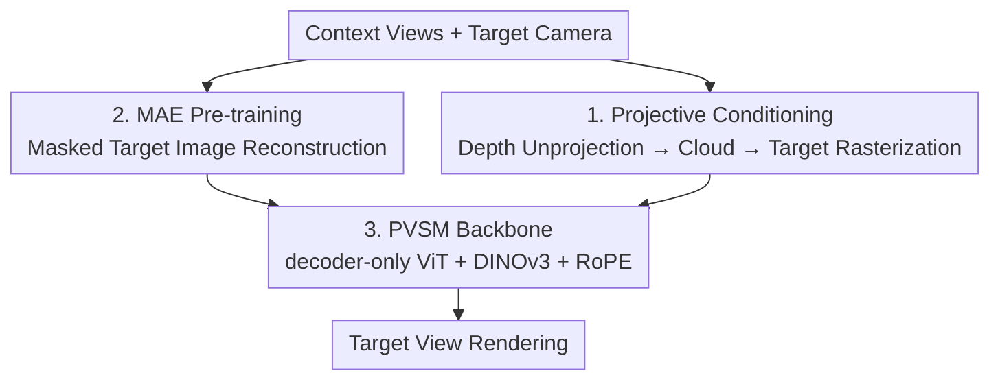

# From Rays to Projections: Better Inputs for Feed-Forward View Synthesis

**Conference**: CVPR 2026  
**Paper**: [CVF Open Access](https://openaccess.thecvf.com/content/CVPR2026/html/Wu_From_Rays_to_Projections_Better_Inputs_for_Feed-Forward_View_Synthesis_CVPR_2026_paper.html)  
**Code**: Project Page https://wuzirui.github.io/pvsm-web (Code, data, and models committed to open source)  
**Area**: 3D Vision  
**Keywords**: Feed-forward view synthesis, projective conditioning, point cloud rasterization, masked auto-encoder pre-training, geometric consistency  

## TL;DR
To address the fragility of encoding cameras as Plücker rays in feed-forward view synthesis, this paper adopts "target-view point cloud projections" as conditional inputs. This reformulates fragile geometric regression into a stable image-to-image translation task. Combined with MAE self-supervised pre-training, the method outperforms ray-conditioned baselines on standard NVS benchmarks and a custom view-consistency benchmark.

## Background & Motivation

**Background**: The goal of feed-forward view synthesis is to render novel views in a single forward pass given context images and a target camera, bypassing scene-specific optimization (unlike NeRF/3DGS). Currently, Large View Synthesis Models (LVSM and successors like RayZer, Less3D) utilize pure ViT architectures. They encode camera poses as pixel-wise 6D Plücker ray maps (ray origin and movement vector) and concatenate them with image patches as tokens for a decoder-only Transformer to output target RGB.

**Limitations of Prior Work**: Plücker rays represent the **absolute world coordinate system**, making them extremely sensitive to minor camera modifications. Small visual movements cause drastic, spatially non-uniform jumps in the 6D ray space. Consequently, minor scaling, stretching, or rolling of the camera leads to inputs deviating from the training distribution, causing grid artifacts or total rendering collapse (Fig. 3/4).

**Key Challenge**: A view synthesis model should ideally maintain "canonical world-coordinate invariance"—transforming the scene geometry $G$ and all cameras by a global $g\in SE(3)$ should not change the rendering. Plücker representations fail this: in ray space, the transformation is $(\mathbf{m}',\mathbf{d}')=(R\mathbf{m}+[\mathbf{t}]_\times R\mathbf{d},\,R\mathbf{d})$, where tokens are disturbed differently by position. Models must "brute-force" learn this invariance through data augmentation, which wastes capacity and leaves a significant train-test gap.

**Goal / Key Insight**: Instead of asking "how to encode cameras better," the authors ask "what input is best suited as a condition for stability and consistency?" The insight is that by delegating "camera geometry processing" to a **deterministic rasterization engine**, the model only needs to operate in the stable 2D image domain. Minor camera changes then only cause small, local variations in the input image.

**Core Idea**: Use "point cloud projection maps in the target view" instead of raw camera parameters. The method uses an off-the-shelf perception model to estimate depth from context views, unprojects them into a unified point cloud, and rasterizes this cloud into the target camera view. This converts view synthesis from "fragile geometric regression in ray space" to "well-posed image-to-image translation in the target view."

## Method

### Overall Architecture

The system is named PVSM (Projective View Synthesis Model). It takes context views and a target camera as input and outputs the target image using a decoder-only ViT backbone. The core shift: **Instead of feeding cameras as tokens, all camera effects are condensed into a "target-view point cloud projection map."** The pipeline has two training stages: MAE-style self-supervised pre-training (conditioned on "masked target views" to learn cross-view completion priors) followed by short fine-tuning on the projective conditioning task. Both stages share the same backbone because sparse point cloud projections are structurally similar to masked target images.

### Key Designs

**1. Projective Conditioning: Replacing Fragile Ray Regression with Stable Image Translation**

This is the core contribution. Addressing the sensitivity of Plücker rays, the authors outsource camera processing to a deterministic geometric engine. For each context view, depth maps $D_i^c$ are estimated using perception models (e.g., MapAnything). Pixels are unprojected into a 3D point cloud and rasterized from the target view:

$$\mathcal{I}^{c\rightarrow t}=\mathtt{Rast}(\{\mathtt{UnProj}(\mathcal{D}_i^c,\mathcal{I}_i^c,\mathcal{C}_i^c)\},\,\mathcal{C}^t)$$

Rasterization is performed via gsplat, treating 3D points as Gaussians with fixed parameters. This projection $\mathcal{I}^{c\rightarrow t}$ explicitly shows the model "what the visible geometry looks like from the target view," leaving occluded or newly exposed areas as holes for the network to complete. Because the projection changes **locally and continuously** with the camera, the model is naturally robust to focal length, aspect ratio, and extrinsic extrapolation.

The authors provide a quotient-space explanation: for a projection operator $q=\mathtt{Rast}\circ\mathtt{UnProj}$, for any 3D points $\mathbf{X}$, projection matrix $\mathbf{P}$, and transformation $T$, $\mathbf{P}'\mathbf{X}'\sim(\mathbf{P}T^{-1})(T\mathbf{X})=\mathbf{P}\mathbf{X}$. Thus, $q(\mathcal{X})$ only depends on the **relative** configuration of camera and geometry, providing an invariant representation in the quotient space $\mathcal{X}/SE(3)$.

**2. MAE Pre-training: Learning Cross-View Completion Priors with Unlabeled Data**

To address the scarcity of labeled RGB-D data, the authors leverage the 2D nature of projective conditioning for MAE pre-training. Since sparse point cloud projections visually resemble masked target images, they design a pretext task: corrupt the ground-truth target image $\mathcal{I}^t$ into $\mathcal{I}^{t*}$ by randomly masking patches, sparsifying pixels, and applying random affine color transformations. The model is trained to reconstruct the original $\mathcal{I}^t$. Using unlabeled data like DL3DV, the model learns robust priors that allow it to gain rendering capabilities after very short fine-tuning schedules on labeled 3D data.

**3. PVSM Backbone: Three-Way Tokens + RoPE for Ambiguity Resolution**

The backbone is a decoder-only ViT. Input tokens come from: ① context view patches $\mathcal{I}_i^c$, ② point cloud projection patches $\mathcal{I}^{c\rightarrow t}$, and ③ DINOv3 features $f^{dino}$ from context views. Context and target patches are embedded via separate linear layers: $\mathbf{x}^c_{ij}=\mathtt{Linear}_c(\mathcal{I}^c_{ij})$, $\mathbf{x}^t_j=\mathtt{Linear}_p(\mathcal{I}^{c\rightarrow t}_j)$. Because projections often contain empty holes, patches can produce **identical tokens** that are indistinguishable due to the permutation invariance of self-attention. RoPE (Rotary Positional Embedding) is used to inject unique spatial information into all tokens.

### Loss & Training
The model is optimized using MSE and Perceptual loss: $\mathcal{L}=\mathtt{MSE}(\mathcal{I}^t,\hat{\mathcal{I}^t})+\lambda\cdot\mathtt{Perceptual}(\mathcal{I}^t,\hat{\mathcal{I}^t})$. The ViT contains 12 or 24 layers with patch size 8 and $d_{model}=768$. Pre-training lasts 100k steps (AdamW, cosine peak lr $10^{-3}$), and fine-tuning uses a shorter schedule. The 24-layer model requires ~1560 H100 GPU-hours, which is ~7x less than the LVSM baseline.

## Key Experimental Results

### Main Results

View viewpoint consistency benchmark (self-constructed based on NoPoSplat, applying four types of out-of-distribution transformations to the target camera). PSNR(M) is calculated only on valid pixels.

| Transformation | Metric | Ours | LVSM | Note |
|:---|:---|:---|:---|:---|
| World Scale | PSNR(M)↑ | **25.43** | 14.56 | Ray conditioning collapses under scaling |
| Anisotropic Pixel | PSNR(M)↑ | **19.66** | 19.58 | SSIM 0.763 vs 0.725 |
| FOV | PSNR(M)↑ | **20.88** | 18.67 | LPIPS 0.104 vs 0.119 |
| Roll | PSNR(M)↑ | 17.53 | **19.54** | LVSM is higher on Roll; Ours improves with aug |

RealEstate10K standard NVS benchmark (Total column):

| Model | PSNR↑ | SSIM↑ | LPIPS↓ |
|:---|:---|:---|:---|
| MVSplat | 24.12 | 0.817 | 0.168 |
| NoPoSplat | 23.78 | 0.807 | 0.178 |
| LVSM (12L) | 24.60 | 0.795 | 0.182 |
| **Ours (12L)** | **25.64** | **0.832** | **0.148** |
| LVSM (24L) | 25.74 | 0.830 | 0.150 |
| **Ours (24L)** | **26.90** | **0.851** | **0.133** |

Ours shows significant gains in the "small overlap" (large viewpoint change) category: 12L Ours 23.64 vs LVSM 21.58 (+2.06 PSNR).

### Ablation Study

Component-wise ablation (DL3DV pre-training + RealEstate10K):

| Configuration | PSNR↑ | SSIM↑ | LPIPS↓ | Description |
|:---|:---|:---|:---|:---|
| baseline (≈LVSM) | 24.60 | 0.795 | 0.182 | Starting point |
| + Projective Cond. | 25.20 | 0.811 | 0.177 | +0.60 PSNR gain |
| + Cond. + DINO | 25.13 | 0.816 | 0.163 | Improves SSIM/LPIPS |
| + Full (incl. Pre-train) | **25.64** | **0.832** | **0.148** | Best performance |

### Key Findings
- **World Scale gain is largest** (25.43 vs 14.56, +10.9 PSNR): Ray conditioning suffers severe distribution shift under scaling, while projections remain stable.
- **Seen/unseen split**: In unseen regions (newly exposed), Ours maintains a lead (+1.90dB over LVSM). This proves the model learns to "synthesize" rather than just copying geometry.
- **Efficiency**: 12L model processing takes 1.1ms; rendering speed for the 24L model is on par with LVSM.
- **Fast adaptation**: With only 500 steps of camera augmentation, Ours adapts quickly, whereas LVSM improves minimally.

## Highlights & Insights
- **Invariance as Design, Not Learning**: By using a deterministic projection operator $q$, $SE(3)$ invariance is hard-coded. The network $h$ does not need to waste capacity learning global coordinates.
- **"Sparse Projection ≈ Masked Image"**: This observation bridges the gap between NVS and Masked Image Modeling (MIM), allowing the use of massive unlabeled data.
- **RoPE for Holes**: A practical engineering insight: sparse inputs in Transformers require RoPE to distinguish positionally identical empty patches.
- **Error Correction in 2D**: Unlike feed-forward Gaussian methods that expose geometric errors directly through a fixed rasterizer, PVSM's 2D decoder learns to correct imperfect geometry.

## Limitations & Future Work
- **Perception Dependency**: Performance relies on the quality of upstream depth/perception models.
- **Static Scene Assumption**: Point cloud unprojection assumes a static environment.
- **Future Work**: Joint end-to-end training of depth and rendering; temporal extensions for dynamic scenes.

## Related Work & Insights
- **vs LVSM / RayZer (Ray-conditioned)**: Ray-based methods are fragile to coordinate conventions; projective conditioning provides stability using the same backbone.
- **vs Less3D (SSL Implicit Camera)**: SSL methods can lead to data leakage or unaligned coordinate spaces; PVSM utilizes explicit, physics-controllable signals.
- **vs Feed-forward Gaussians (MVSplat/NoPoSplat)**: These regress Gaussians directly; PVSM acts as a 2D translator, which is more tolerant of depth noise and faster in processing.

## Rating
- Novelty: ⭐⭐⭐⭐⭐ The quotient-space invariance proof and projective reformulation provide fundamental insights into input representations.
- Experimental Thoroughness: ⭐⭐⭐⭐⭐ Extensive benchmarks including a custom consistency suite and comprehensive ablations.
- Writing Quality: ⭐⭐⭐⭐ Clear motivation-to-theory chain, though some token concatenation notation is dense.
- Value: ⭐⭐⭐⭐⭐ Solves a root cause of fragility in LVSM-style models with high transferability.

<!-- RELATED:START -->

## Related Papers

- [\[CVPR 2026\] Cross-View Splatter: Feed-Forward View Synthesis with Georeferenced Images](cross-view_splatter_feed-forward_view_synthesis_with_georeferenced_images.md)
- [\[CVPR 2026\] EcoSplat: Efficiency-controllable Feed-forward 3D Gaussian Splatting from Multi-view Images](ecosplat_efficiency-controllable_feed-forward_3d_gaussian_splatting_from_multi-v.md)
- [\[CVPR 2026\] Feed-forward Gaussian Registration for Head Avatar Creation and Editing](feed-forward_gaussian_registration_for_head_avatar_creation_and_editing.md)
- [\[CVPR 2026\] AnchorSplat: Feed-Forward 3D Gaussian Splatting with 3D Geometric Priors](anchorsplat_feed-forward_3d_gaussian_splatting_with_3d_geometric_priors.md)
- [\[CVPR 2026\] EmbodiedSplat: Online Feed-Forward Semantic 3DGS for Open-Vocabulary 3D Scene Understanding](embodiedsplat_online_feed-forward_semantic_3dgs_for_open-vocabulary_3d_scene_und.md)

<!-- RELATED:END -->
