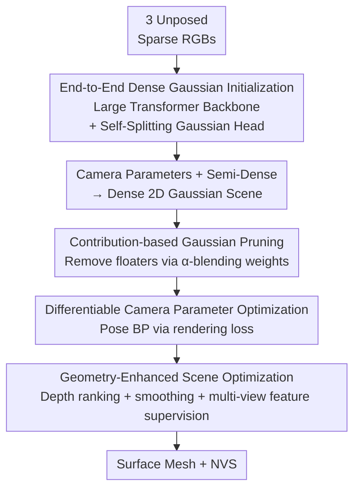

# FSFSplatter: Geometrically Accurate Reconstruction with Free Sparse-view Images within 2 minutes

**Conference**: CVPR 2026  
**Paper**: [CVF Open Access](https://openaccess.thecvf.com/content/CVPR2026/html/Zhao_FSFSplatter_Geometrically_Accurate_Reconstruction_with_Free_Sparse-view_Images_within_2_CVPR_2026_paper.html)  
**Code**: https://github.com/Zhaoyibinn/FSFSplatter  
**Area**: 3D Vision  
**Keywords**: Sparse-view reconstruction, 3D Gaussian Splatting, Surface reconstruction, Pose-free reconstruction, Feed-forward initialization

## TL;DR
FSFSplatter utilizes a large multi-view Transformer to convert 3 uncalibrated sparse images into a dense, geometrically consistent 2D Gaussian scene via a single feed-forward pass while simultaneously estimating camera parameters. This is followed by contribution-based pruning to remove floaters and geometry-enhanced optimization supervised by depth and multi-view features, resulting in accurate, renderable surfaces within 2 minutes. Surface error is reduced by at least 28% and NVS error by at least 46% on DTU/Replica/BlendedMVS.

## Background & Motivation
**Background**: Gaussian Splatting (3DGS/2DGS) has become the mainstream for high-quality New View Synthesis (NVS) and detailed reconstruction. However, most methods default to **dense, calibrated** multi-view images, requiring both dense coverage and pre-computed camera poses.

**Limitations of Prior Work**: Real-world scenarios often provide only a few sparse, unposed "free" images. In such cases: ① Traditional pipelines split the problem into independent stages (pose estimation → dense reconstruction → surface extraction/SDF), where errors introduced in each stage **accumulate irreversibly**; ② Insufficient overlap in sparse views causes Structure-from-Motion (SfM) to fail frequently. Even with camera parameters, extrapolation/occlusion ambiguities in sparse settings lead optimization to **overfit to a single view**, resulting in collapsed or erroneous geometry.

**Key Challenge**: Under sparse inputs, initialization quality and optimization stability constrain each other—poor initialization prevents convergence to correct geometry, while increasing iterations based solely on RGB loss amplifies multi-view ambiguity, leading to "catastrophic degradation" of geometry. Existing end-to-end methods have drawbacks: DUSt3R only processes image pairs, causing accumulated inconsistency during merging; VGGT regresses point clouds from arbitrary images but the **point clouds are sparse**, making them unsuitable for NVS; FreeSplatter treats scene generation and pose estimation as independent steps, where post-processing alignment introduces additional errors.

**Goal**: Starting from 3 free sparse images, obtain **accurate surfaces** and **high-quality NVS** within 2 minutes without relying on pre-calibrated cameras.

**Core Idea**: Use a large Transformer for a single feed-forward pass to directly output a dense, geometrically consistent Gaussian scene + camera parameters (end-to-end initialization), resolving the critical "initialization quality" variable. Then, use contribution-based pruning to remove floaters and geometry-enhanced optimization (via depth and multi-view feature supervision) to combat sparse-view overfitting, allowing stable convergence with minimal iterations.

## Method

### Overall Architecture
FSFSplatter decomposes "free sparse-view reconstruction" into two serial components: **(A) End-to-end dense Gaussian initialization + camera parameter estimation**, which takes 3 unposed RGB images and outputs a dense, geometrically consistent 2D Gaussian scene along with camera intrinsics and extrinsics; **(B) Geometry-enhanced Gaussian scene optimization**, which performs contribution-based pruning to remove invisible floaters, followed by short-term optimization using differentiable camera parameters and depth/multi-view feature supervision to obtain the final surface and NVS. The key intuition is to "front-load" most geometric quality into the initialization so that the optimization stage only requires lightweight refinement rather than searching from scratch, reducing time to ~107 seconds.

### Key Designs

**1. End-to-end Dense Gaussian Initialization and Self-Splitting Gaussian Head: Resolving Point Cloud Sparsity at the Initialization Stage**

While large Transformers like VGGT can regress camera parameters, depth maps, and point clouds from arbitrary images, the point clouds are too sparse for NVS. This method uses VGGT-1B as the backbone (encoding images into tokens via DINOv2). It obtains camera parameters and DPT decoding features through independent heads, fuses pixel-aligned depth maps and DPT features into a **semi-dense** Gaussian scene $G_{init}$, and then uses an Encoder-Decoder $D$ to "self-split" it into a dense scene. Specifically, a DPT re-projection module uses positional encoding to map tokens back to pixel-aligned high-dimensional features $F_P$. A PointMLP encodes point cloud geometry into $F_c$. These are concatenated with explicit Gaussian attributes (Spherical Harmonics $SH_P^{48}$, rotation $R_P^4$, scale $S_P^2$) and fed into independent decoders to predict attribute deltas for splitting each Gaussian into $N$ new primitives:

$$\Delta G_{N\cdot P} = D(\mathrm{Cat}(F_P, SH_P^{48}, R_P^4, S_P^2, F_c)), \quad D(G_P) = G_P + \Delta G_{N\cdot P}$$

To generalize across scenes, the input units are **point cloud patches**—KNN is used to partition high-dimensional point clouds into randomly sampled local patches, which are densified patch-by-patch, de-normalized, and merged:

$$G = N'\Big(B'\big[B(N(G_{init})) + D(B(N(G_{init})))\big]\Big)$$

Where $N/N'$ denotes normalization/de-normalization, and $B/B'$ denotes patch splitting/merging. This step is the source of overall geometric quality; removing the self-splitting densification $D$ causes Replica CD to jump from 33.66 to 59.83.

**2. Contribution-based Gaussian Pruning: Removing Non-gradient Floaters from Initialization**

Although sub-pixel dense initialization provides a strong prior, it introduces many occluded or invisible primitives that receive no gradients during backpropagation and cannot be removed by simple opacity filtering. This method quantifies the contribution $C_n$ of each Gaussian based on its actual weight in $\alpha$-blending, $\alpha_i\prod(1-\alpha_n)$, and normalizes it by the number of affected pixels $|P_n|$ to prevent large-scale Gaussians from gaining contribution merely by area:

$$C_n = \sum_{k=1}^{3} \frac{1}{|P_n|}\sum_{p\in P_n}\Big(\alpha_i^p \prod_{i-1}^{n}(1-\alpha_n^p)\Big)$$

Primitives are sorted and those with low contribution or low opacity are pruned. Ablations show that removing pruning $T$ increases DTU CD from 2.208 to 2.930, proving its effectiveness in removing floaters and stabilizing geometry.

**3. Differentiable Camera Parameter Optimization: Backpropagating Rendering Loss to Poses**

In pose-free reconstruction, native GS rasterizers do not support camera parameter backpropagation. Subtle multi-view inconsistencies are amplified during optimization in sparse settings. This method unifies all camera poses at the origin and applies the inverse transformation of camera poses $T_k^{cam}$ to all Gaussian primitives before rasterization. This yields NVS equivalent to the original framework while keeping $T_k^{cam}$ differentiable—any rendering-based loss backpropagates to camera poses first, then to Gaussian primitives. Due to view sparsity, pose optimization across views is independent and converges quickly.

**4. Geometry-Enhanced Scene Optimization: Combating Sparse Overfitting with Depth and Multi-view Feature Supervision**

Optimizing sparse free images directly with RGB loss introduces unavoidable multi-view ambiguities. Besides RGB terms ($L_1, L_{SSIM}$) and a normal term $L_n$, three types of geometric supervision are added. First, a **ranking loss** uses monocular depth estimation $D_{est}$ to supervise rendered depth $D_{re}$ by randomly sampling pixel pairs $(p_1, p_2)$ in local patches to constrain relative order, avoiding scale ambiguity ($\mathrm{sgn}$ is sign function, $m$ is margin, $\sigma$ is ReLU):

$$L_{rank} = \sum_P \sigma\big(\mathrm{sgn}(S(D_{pre}, p_1, p_2)\cdot S(D_{re}, p_1, p_2)) + m\big), \quad S(D, p_1, p_2)=D(p_1)-D(p_2)$$

Second, a depth smoothness loss $L_{smooth}$ constrains local consistency of rendered depth at edges of estimated depth. Third, a multi-view feature alignment loss $L_{MVS}$ uses a pre-trained U-Net to extract high-dimensional features, comparing cosine similarity after re-projection to handle multi-view illumination inconsistency:

$$L_{MVS} = \sum_r \Big(1 - \cos\big[R_r(U(c)(I_r)), U(c)(I)\big]\Big)$$

Removing $L_{MVS}$ increases DTU CD from 1.581 to 3.130, confirming that depth and feature supervision are critical for geometric stability in sparse scenes.

### Loss & Training
Training uses 512×512 resolution, patch size 2048, and takes ~27 hours for 120 epochs on an RTX 5090 using BlendedMVS + DTU + Virtual KITTI + Replica. A **progressive geometry training** strategy is used: (1) Initialize the backbone with VGGT-1B weights and enable only $L_D, L_{Cam}$ for geometric stability; (2) Freeze DPT/Camera heads and backbone, training the DPT re-projection head and densification MLP (disabling KNN patches for global densification pre-training, enabling $L_1, L_{SSIM}$); (3) Unfreeze all parameters, restore KNN patches, and activate all losses to learn the RGB-to-attribute mapping.

## Key Experimental Results

### Main Results
DTU Surface Reconstruction Chamfer Distance (CD↓, mm) and NVS (PSNR↑) across three datasets with 3 input images:

| Dataset / Metric | Ours | Ours(wo Opt.) | VGGT | Strongest Baseline* | Notes |
|--------------|-----------|---------------|------|-----------|------|
| DTU CD↓ | **1.581** | 1.907 | 2.586 | FatesGS* 3.856 | ~39% lower than VGGT |
| Replica CD↓ | **32.554** | 37.621 | 50.818 | FatesGS 151.85 | Larger margin in scenes |
| DTU PSNR↑ | 30.251 | 28.61 | 28.61 | 3DGS 29.37 | Leading at equal iterations |
| Replica PSNR↑ | **35.79** | 23.51 | 13.04 | 3DGS 22.05 | Significant lead |
| BlendedMVS PSNR↑ | **30.74** | 19.52 | 13.41 | 3DGS 18.75 | Significant lead |

Author's Summary: Surface error decreased by **at least 28.39% / 34.37%** on DTU/Replica. NVS error (measured by LPIPS) decreased by **at least 46.19% / 73.13% / 87.35%** on DTU/Replica/BlendedMVS. Pose estimation RMSE is comparable to or better than SOTA: Replica rotation 0.634° / translation 3.746mm.

### Speed
Replica per-scene optimization time (Time↓, seconds):

| Method | 3DGS | 2DGS | FatesGS | PGSR | Ours |
|------|------|------|---------|------|------|
| Time(s) | 429.45 | 840.37 | 915.93 | 1018.2 | **107.39** |

Initialization on DTU takes only 0.63s, yielding a 26.3% surface improvement and an 80% reduction in subsequent optimization time.

### Ablation Study
DTU / Replica Surface CD↓:

| Config | Replica CD | DTU CD | Notes |
|------|-----------|--------|------|
| Full (Ours) | 33.66 | 1.581 | Full model |
| No $L_{rank}$ | 36.23 | 2.905 | w/o monocular depth ranking |
| No $L_{smooth}$ | 37.71 | 2.653 | w/o depth smoothness |
| No $L_{MVS}$ | 35.36 | 3.130 | w/o multi-view features |
| No $T_k^{cam}$ | 37.05 | 2.855 | w/o differentiable pose |
| Ours(wo Opt.) | 40.05 | 2.208 | w/o per-scene optimization |
| No $T$ (Pruning) | 40.69 | 2.930 | w/o contribution pruning |
| No $D$ (Densification) | 59.83 | 3.584 | w/o self-splitting, largest drop |

### Key Findings
- **Self-splitting densification $D$ contributes most**: Removing it doubles Replica CD, proving that dense, geometrically consistent initialization is the foundation.
- **$L_{MVS}$ is critical for DTU, $T_k^{cam}$ is critical for Replica**: Different datasets have different bottlenecks (multi-view features for objects, differentiable poses for scenes).
- **"More iterations ≠ Better" in sparse views**: Simply increasing iterations causes catastrophic geometric degradation due to overfitting; initialization is the key differentiator.
- Optimization without geometric supervision can be **detrimental** (Ours(wo Opt.) 2.208 is better than No $L_{MVS}$ 3.130 on DTU).

## Highlights & Insights
- **The methodology of "front-loading geometric quality to initialization"**: Rather than repeated error correction during optimization, a single feed-forward pass provides consistent geometry, leaving optimization for lightweight refinement.
- **Self-splitting head + KNN patches fix VGGT's sparsity**: Attribute increment prediction is superior to heuristic densification, and patch-based input improves generalization.
- **Contribution pruning uses $\alpha$-blending weights rather than opacity**: Normalizing by pixel count prevents large Gaussians from being falsely preserved—a natural metric for floater removal.
- **Differentiable poses integrate pose optimization into rendering BP**: This avoids the errors found in post-processing alignment methods like FreeSplatter.

## Limitations & Future Work
- Reliance on large Transformer pre-trained weights (VGGT-1B) leads to high training costs and domain sensitivity.
- Robustness to extreme few-view cases (e.g., 2 views) or cases with nearly zero overlap is not fully explored.
- Ranking loss avoids scale ambiguity but means absolute scale still relies on priors, which may not suffice for downstream metrology tasks.

## Related Work & Insights
- **vs VGGT**: VGGT provides sparse point clouds; this work adds a self-splitting head to upgrade them to dense Gaussians and adds refinement, improving DTU CD from 2.586 to 1.581.
- **vs FreeSplatter**: This work integrates pose optimization into the rendering pipeline rather than using independent post-processing alignment.
- **vs FatesGS / PGSR**: These require camera parameters and take 1000s+ to optimize; this work is pose-free and completes in 107s with superior CD.
- **vs DUSt3R**: DUSt3R processes image pairs; this work uses multi-view joint feed-forward for a direct renderable Gaussian representation.

## Rating
- Novelty: ⭐⭐⭐⭐ Solid integration of Transformer initialization, self-splitting heads, and differentiable pose optimization.
- Experimental Thoroughness: ⭐⭐⭐⭐⭐ Comprehensive coverage of surface/NVS/pose/speed across three datasets.
- Writing Quality: ⭐⭐⭐⭐ Clear methodology and pipeline stages.
- Value: ⭐⭐⭐⭐⭐ High utility for AR/VR and robotics where only sparse RGB images are available.

<!-- RELATED:START -->

## Related Papers

- [\[CVPR 2026\] Cross-View Splatter: Feed-Forward View Synthesis with Georeferenced Images](cross-view_splatter_feed-forward_view_synthesis_with_georeferenced_images.md)
- [\[CVPR 2026\] Intrinsic Geometry-Appearance Consistency Optimization for Sparse-View Gaussian Splatting](intrinsic_geometry-appearance_consistency_optimization_for_sparse-view_gaussian_.md)
- [\[CVPR 2026\] FreeScale: Scaling 3D Scenes via Certainty-Aware Free-View Generation](freescale_scaling_3d_scenes.md)
- [\[CVPR 2026\] EcoSplat: Efficiency-controllable Feed-forward 3D Gaussian Splatting from Multi-view Images](ecosplat_efficiency-controllable_feed-forward_3d_gaussian_splatting_from_multi-v.md)
- [\[CVPR 2026\] E2EGS: Event-to-Edge Gaussian Splatting for Pose-Free 3D Reconstruction](e2egs_event-to-edge_gaussian_splatting_for_pose-free_3d_reconstruction.md)

<!-- RELATED:END -->
