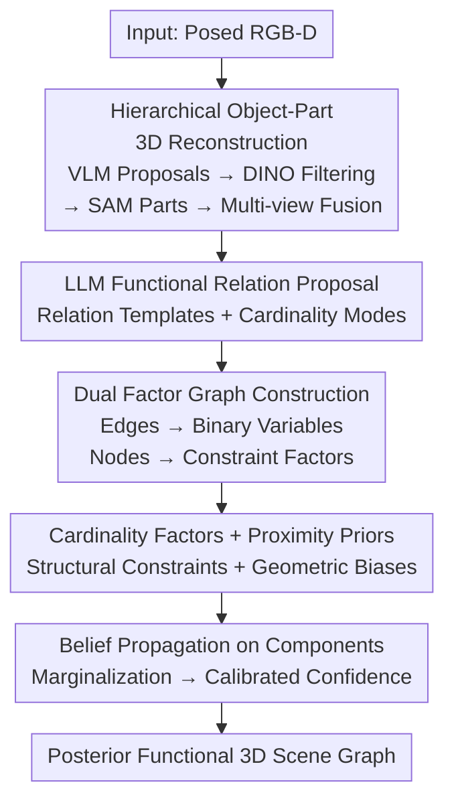

# FunFact: Building Probabilistic Functional 3D Scene Graphs via Factor-Graph Reasoning

**Conference**: CVPR 2026  
**Paper**: [CVF Open Access](https://openaccess.thecvf.com/content/CVPR2026/html/Fu_FunFact_Building_Probabilistic_Functional_3D_Scene_Graphs_via_Factor_Graph_Reasoning_CVPR_2026_paper.html)  
**Code**: Project Page https://funfact-scenegraph.github.io/ (No open-source repository found)  
**Area**: 3D Vision  
**Keywords**: Functional Scene Graphs, Factor Graphs, Belief Propagation, Confidence Calibration, Open-Vocabulary  

## TL;DR
FunFact constructs **probabilistic open-vocabulary functional 3D scene graphs** from posed RGB-D images. It first reconstructs object-part level 3D maps using foundation models, then transforms candidate functional relations into a "dual factor graph." By performing belief propagation with LLM commonsense priors and geometric proximity priors, the method jointly reasons over all functional edges in the scene to output **well-calibrated** confidence scores for each edge, significantly outperforming pair-wise reasoning baselines in functional relation recall and calibration error.

## Background & Motivation
**Background**: 3D scene understanding is evolving from "geometry/semantics" toward "functional understanding"—asking not just what is in the scene and where, but **how objects interact**: which switch controls which light, which knob controls which burner, or which cord to unplug to power off a kettle. This information is critical for task planning in AR assistants, virtual training, and embodied robotics. Existing functional scene graph works (OpenFunGraph, FunGraph) use LLMs and 2D vision-language models to propose open-vocabulary object-part and object-object functional relations.

**Limitations of Prior Work**: Existing methods treat functional relations as **isolated object pairs** for judgment. Each edge is calculated independently, ignoring the "scene-wide interdependencies" humans use for disambiguation. For instance, with two switches and two lights on a wall, visual evidence alone cannot distinguish the mapping—switches and lights might be far apart or occluded, and the causal effect of toggling a switch is not encoded in static appearance.

**Key Challenge**: Functionality is inherently **under-determined from static observations** (a natural gap exists between visual evidence and functional behavior), yet existing models only provide a "most likely connection." They neither model the "distribution over all possible options" nor provide calibrated confidence—reporting 0.9 does not necessarily imply a 90% accuracy, hindering risk-aware decision-making in downstream planning.

**Goal**: (1) Reconstruct object-part level 3D representations from posed RGB-D; (2) Perform joint probabilistic reasoning over **all** functional edges rather than pair-wise independent judgments; (3) Output **well-calibrated** confidence scores for every edge.

**Key Insight**: The authors observe that functional relations naturally possess **structural constraints**—many relations are one-to-one (each burner has a dedicated knob) and closer connections are more likely (lights are usually near their switches). These constraints span multiple edges and are scene-level, making them suitable for joint optimization using mature probabilistic graphical models such as **factor graphs and belief propagation**.

**Core Idea**: The functional scene graph is "dualized" into a factor graph—**edges in the scene graph become binary variables in the factor graph, and nodes in the scene graph become constraint factors**. These variables are constrained by LLM commonsense priors (cardinality modes) and geometric proximity priors, with global joint reasoning performed via belief propagation to obtain calibrated marginal confidence.

## Method

### Overall Architecture
FunFact is a two-stage serial pipeline. The **Input** consists of posed RGB-D images, and the **Output** is a posterior functional 3D scene graph (with calibrated confidence for each edge).

The first stage, **Scene Reconstruction**, uses a VLM (GPT-4.1) to propose functional objects, hierarchical part labels, and coarse 2D boxes for each RGB image. GroundingDINO is then used with these labels as queries for open-vocabulary detection, cross-checking with VLM coarse boxes to **filter hallucinations**. Local crops are taken for each validated object to run another round of GroundingDINO+SAM for fine-grained functional part detection. Finally, all object/part instances are back-projected to 3D and fused across views to obtain a consistent object-part 3D map.

The second stage, **Functional Scene-Graph Creation**, involves an LLM proposing semantically plausible functional relation templates for each object (predicting its one-to-one or one-to-many cardinality mode). These candidate relations are **instantiated as binary variables in a dual factor graph**, paired with cardinality constraint factors and proximity prior factors. Belief propagation is run on each disjoint connected component to compute marginal probabilities for each edge, which are thresholded to produce the final functional scene graph.

### Key Designs

**1. Hierarchical Object-Part 3D Reconstruction + Hallucination Filtering: Reliably attaching small functional parts to parent objects**

Functional relations often occur on **small parts** (knobs, buttons, handles), which flat object-level baselines (e.g., ConceptGraph) either miss or treat as independent objects, losing parent-child ownership. FunFact solves this with a hierarchical pipeline: first, the VLM outputs "functional objects + part labels for each object + object-level descriptions + normalized xyxy coarse boxes" for the whole image. Since VLMs hallucinate and provide coarse boxes, GroundingDINO uses the VLM's object labels as text queries to re-detect objects, **cross-checking against VLM coarse boxes**. Proposals not detected by GroundingDINO or strongly inconsistent with coarse boxes are discarded, effectively using two models for ensemble voting to suppress hallucinations. For each validated object, its box is expanded and cropped to run **GroundingDINO+SAM again using the object's part names as queries**. Cropping increases the relative resolution of small parts, facilitating fine-grained detection. Parts are filtered by geometric rules (too large/small relative to the parent, insufficient overlap) and back-projected to 3D following the BBQ approach for multi-view fusion. Ablations show that removing the hierarchical representation causes interactive element mapping recall to drop from 69.5% to 41.8%, nearly degrading to the level of OpenFunGraph (41.1%).

**2. Duality of Functional Scene Graphs: Turning "edges" into variables and "nodes" into constraint factors**

This is the core modeling transformation. Given an object-part 3D map, an LLM first proposes plausible functional relation templates $T_k=\{r_{k,j}\}$ (e.g., "knob controls burner", "handle opens door") and predicts **typical cardinality modes** (one-to-one or one-to-many). For each template $r_{k,j}$, all semantically matching part-object/part-part combinations are **exhaustively** paired (e.g., all "knobs x burners" on the same stove), forming candidate functional edges $E_{k,j}=\{e^{k,j}_i\}$. The key step is "duality": each candidate edge $e^{k,j}_i$ is mapped to a binary variable $x^{k,j}_i\in\{0,1\}$, representing the **existence** of the edge. Nodes from the original scene graph are converted into factors constraining these variables. In other words, **scene graph edges → factor graph variables; scene graph nodes → factor graph factors**. Consequently, all knobs and burners on the same stove form a densely connected local factor graph (e.g., a complete bipartite graph), allowing for joint disambiguation rather than independent judgments. Object-object relations (e.g., "sponge wipes counter") are handled similarly, though proximity priors are only applied if the LLM specifies (e.g., "curtain covers window").

**3. Cardinality Factors + Proximity Priors: Encoding "one-to-one structure" and "proximity preference" as soft constraints**

Transforming edges into variables is insufficient without priors. FunFact introduces two types of factors. **Cardinality factors** $\phi_{card}$ encode one-to-one/one-to-many structures: for a node $n$ participating in a one-to-one relation, let $X_n$ be the associated dual variables and $d_n=\sum_{x\in X_n}x$ be the number of active connections. Then:

$$\phi_{card}(X_n)=\begin{cases}b^{\,d_n-1} & d_n\ge 1\\ b^{\,2} & d_n=0\end{cases}$$

where $b\in(0,1)$ is a hyperparameter controlling penalty strength. Intuitively, a knob controlling multiple burners (large $d_n$) is exponentially penalized, as is a knob connected to nothing ($d_n=0$), biasing the model toward structurally sound one-to-one assignments. **Proximity priors** $\phi_{prox}$ are unary factors providing prior belief based on Euclidean length:

$$\phi_{\text{prox}}(x^{k,j}_i)=\exp\!\left(-\frac{d(e^{k,j}_i)}{\lambda_{k,j}}\right)$$

where $d(\cdot)$ is the edge length and $\lambda_{k,j}$ is median length of the candidate set $E_{k,j}$. This biases the graph toward closer connections (e.g., light near its switch), but the soft prior allows cardinality constraints to override it when necessary. This combination enables scene-level disambiguation.

**4. Belief Propagation on Connected Components: Joint reasoning + Calibrated confidence**

Using pgmpy to implement the dual factor graph, FunFact runs **belief propagation** to find the joint distribution over all candidate functional edges. For efficiency, the graph is decomposed into **disjoint connected components** $C_m$ that do not share priors or factors. For a component $C_m$ and variables $X_m$, the joint distribution is:

$$P(X_m)=\frac{1}{Z_m}\prod_{x\in X_m}\phi_{prox}(x)\prod_{f\in F_m}\phi_{card}(\partial f)$$

where $F_m$ are cardinality factors in the component, $\partial f$ are variables connected to factor $f$, and $Z_m$ is the normalization constant. After convergence, **marginalization** provides the confidence for each edge, followed by a threshold (0.5). Joint reasoning across the scene ensures that marginal probabilities reflect structural constraints, resulting in calibration (ECE) significantly superior to pair-wise prediction.

### Loss & Training
FunFact is a **zero-shot pipeline**. Object/part proposals come from frozen foundation models (GPT-4.1, GroundingDINO, SAM), functional relations and cardinality modes from LLM commonsense, and reasoning via factor graph belief propagation. No task-specific network training is performed. Hyperparameters include cardinality penalty $b$, proximity scale $\lambda_{k,j}$ (median length), and a final threshold of 0.5.

## Key Experimental Results

Datasets: Real-world SceneFun3D and FunGraph3D, plus a new synthetic benchmark **FunThor** (based on AI2-THOR, 12 scenes, 4 environment types, 26 functional relations, 720 images total with rule-generated dense GT for precision and calibration evaluation).

### Main Results: Reconstruction Recall (Recall@K)

| Method | SceneFun3D Overall R@3 | SceneFun3D Overall R@10 | FunGraph3D Interactive R@3 | FunGraph3D Overall R@3 | FunGraph3D Overall R@10 |
|------|------|------|------|------|------|
| Open3DSG | 56.7 | 64.7 | 21.8 | 33.4 | 43.6 |
| ConceptGraph | 28.3 | 31.4 | 2.5 | 20.1 | 25.2 |
| ConceptGraph+IED | 60.1 | 66.0 | 20.5 | 38.9 | 45.0 |
| OpenFunGraph | 73.0 | 82.8 | 44.4 | 55.5 | 65.8 |
| **Ours (FunFact)** | **73.2** | **83.6** | **68.3** | **77.9** | **86.2** |

Recall for small interactive elements on FunGraph3D jumped from 44.4% to 68.3%, attributed to hierarchical object-part mapping.

### Triplet Evaluation (Recall@K)

| Dataset | Metric | OpenFunGraph | Ours (FunFact) |
|------|------|------|------|
| FunGraph3D | Overall Triplets R@5 / R@10 | 29.8 / 45.0 | **48.7 / 63.9** |
| FunThor | Overall Triplets R@3 / R@5 | 15.1 / 17.6 | **54.1 / 54.7** |
| SceneFun3D | Overall Triplets R@5 / R@10 | **60.4 / 70.3** | 41.0 / 57.9 |

⚠️ On SceneFun3D, FunFact lags behind baselines. The authors attribute this to SceneFun3D's vague labels ("handle", "knob"), where FunFact's fine-grained open-vocabulary predictions (e.g., "television stand" vs "cabinet") are systematically misjudged by CLIP/BERT matching protocols. FunThor's rule-based fine-grained labels avoid this pseudo-misalignment.

### Ablation Study (FunThor, ECE ↓)

| Configuration | Interactive Mapping R@3 | Prec.[%] | Recall[%] | F1[%] | ECE(All)↓ | ECE(Ambig)↓ |
|------|------|------|------|------|------|------|
| OpenFunGraph | 41.1 | 23.4 | 12.2 | 16.0 | 0.43 | 0.51 |
| **FunFact Full** | **69.5** | **31.9** | 49.3 | **38.7** | **0.36** | **0.07** |
| w/o Factor Graph | 69.5 | 21.9 | **53.4** | 31.1 | 0.70 | 0.45 |
| w/o Hierarchical Prop. | 41.8 | 21.6 | 18.2 | 19.8 | 0.36 | 0.14 |

### Key Findings
- **Factor graph reasoning drives precision and calibration**: Removing it slightly increases recall (53.4%) but crashes precision from 31.9% to 21.9%, worsens ECE from 0.36 to 0.70, and spikes ECE in ambiguous scenes from 0.07 to 0.45. It improves F1 by suppressing low-confidence edges, especially in ambiguous mappings (e.g., switch/knob).
- **Hierarchical representation is crucial for small parts**: Its removal drops interactive element recall from 69.5% to 41.8%, leading to a collapse in triplet metrics.
- FunFact achieves a ~8.5pp absolute precision gain over OpenFunGraph on FunThor, validating the effectiveness of global context in resolving visual ambiguity.

## Highlights & Insights
- **The "Duality" step is elegant**: Swapping edges $\leftrightarrow$ nodes between scene and factor graphs converts discrete existence judgments into jointly reason-able binary variables, bridging scene graph semantics with probabilistic graphical models (pgmpy + belief propagation).
- **Modeling distributions, not points**: The authors argue that prior models should model the distribution over possible options rather than just predicting the most likely connection. This transforms the under-determined nature of functionality into quantifiable uncertainty, making calibrated confidence useful for downstream planning.
- **Component decomposition is intuitive and efficient**: Functional clusters (e.g., burners vs. TV) are naturally separable, allowing for independent graph reasoning at low computational cost.
- **Transferable tricks**: VLM proposals + GroundingDINO cross-checking suppresses hallucinations, and local cropping boosts part resolution. This "foundation model ensemble + local zoom" approach is applicable to other fine-grained open-vocabulary 3D grounding tasks.

## Limitations & Future Work
- The method still suffers from **over-segmentation/under-segmentation** (e.g., multiple cabinets fused into one). Part segmentation granularity is inconsistent (FunFact might detect individual buttons where a dataset labels a whole panel).
- **Heavy reliance on LLM reasoning** introduces multi-second latency per image, limiting real-time application.
- Evaluation protocols are a bottleneck: CLIP/BERT label matching often penalizes fine-grained open-vocabulary outputs, highlighting the need for more granular, rule-based benchmarks like FunThor.
- ⚠️ Personal Observation: Cardinality priors entirely rely on LLM judgments. If an LLM misidentifies the typical cardinality for a relation, the factor graph may be misled by incorrect structural constraints.

## Related Work & Insights
- **vs OpenFunGraph / FunGraph**: These methods also build open-vocabulary functional 3D scene graphs but perform **pair-wise independent** judgments. They neither model scene-level dependencies nor provide calibrated confidence. FunFact's joint reasoning over the factor graph results in superior recall and calibration (except where label granularity conflicts occur).
- **vs ConceptGraph / HOV-SG / Open3DSG**: These focus on semantic and spatial relationships and **do not model functional interactions**. FunFact leverages similar open-vocabulary grounding for the skeleton but adds reasoning for "what controls what."
- **vs IFR-Explore**: IFR-Explore learns functional relations in synthetic environments but only judges **existence** without types and relies on GT 3D data. FunFact operates on real RGB-D to provide both relation types and calibrated confidence.

## Rating
- Novelty: ⭐⭐⭐⭐⭐ Transforming functional scene graphs into dual factor graphs for belief propagation is a novel perspective in scene understanding.
- Experimental Thoroughness: ⭐⭐⭐⭐☆ Three datasets plus the dense FunThor benchmark and clear ablations, though SceneFun3D results are explained rather than rectified through direct experiments.
- Writing Quality: ⭐⭐⭐⭐☆ The dualization and factor definitions are clear; diagrams are helpful; equations and tables are self-consistent.
- Value: ⭐⭐⭐⭐⭐ Well-calibrated confidence in functional relations is practical for risk-aware robotics/AR, and the FunThor benchmark provides a much-needed dense evaluation set.

<!-- RELATED:START -->

## Related Papers

- [\[CVPR 2026\] FunREC: Reconstructing Functional 3D Scenes from Egocentric Interaction Videos](funrec_reconstructing_functional_3d_scenes_from_egocentric_interaction_videos.md)
- [\[CVPR 2026\] ARES: Unifying Asymmetric RGB-Event Stereo for Probabilistic Scene Flow Estimation](ares_unifying_asymmetric_rgb-event_stereo_for_probabilistic_scene_flow_estimatio.md)
- [\[CVPR 2026\] Masking Matters: Unlocking the Spatial Reasoning Capabilities of LLMs for 3D Scene-Language Understanding](masking_matters_unlocking_the_spatial_reasoning_capabilities_of_llms_for_3d_scen.md)
- [\[CVPR 2026\] Fusion of Depth and Semantics for Probabilistic Floorplan Localization](fusion_of_depth_and_semantics_for_probabilistic_floorplan_localization.md)
- [\[CVPR 2026\] Edges Compete for Trust: Group Relative Edge Optimization for Building Reconstruction from Point Clouds](edges_compete_for_trust_group_relative_edge_optimization_for_building_reconstruc.md)

<!-- RELATED:END -->
