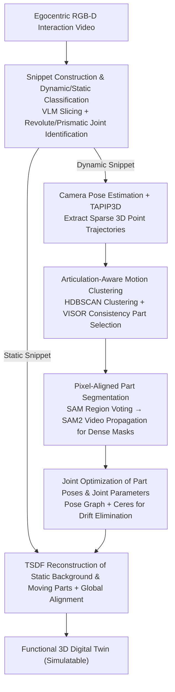

# FunREC: Reconstructing Functional 3D Scenes from Egocentric Interaction Videos

**Conference**: CVPR 2026  
**arXiv**: [2604.05621](https://arxiv.org/abs/2604.05621)  
**Code**: [https://functionalscenes.github.io/](https://functionalscenes.github.io/)  
**Area**: 3D Vision  
**Keywords**: Functional 3D Reconstruction, Egocentric Video, Articulated Object Reconstruction, Digital Twin, Motion Estimation

## TL;DR
This paper proposes FunREC, a training-free optimization-based method that reconstructs functional articulated 3D digital twins directly from egocentric RGB-D interaction videos. It automatically discovers articulated parts, estimates kinematic parameters, tracks 3D motion, and reconstructs both static and moving geometries. It significantly outperforms prior methods across all benchmarks (part segmentation mIoU increased by over 50, joint angle error reduced by 5-10 times) and supports simulation export and robotic interaction.

## Background & Motivation

1. **Background**: While 3D scene reconstruction has advanced significantly, existing large-scale RGB-D datasets (ScanNet, ARKitScenes, etc.) only capture single static states of environments, failing to represent functional interactions like opening doors or sliding drawers. Digital twins require not only geometric capture but also an understanding of how objects move and articulate.

2. **Limitations of Prior Work**: (1) MultiScan requires scanning the same room twice (open/closed states) with manual alignment and labeling, which is extremely inefficient; (2) SceneFun3D/Articulate3D label functional information on static LiDAR scans but cannot directly observe kinematic properties; (3) Digital cousins methods retrieve CAD proxy models as replacements, which only loosely correlate with actual geometry; (4) Object-level articulation reconstruction methods generally assume controlled environments, fixed cameras, or known CAD models, making them unsuitable for in-the-wild scene-level reconstruction.

3. **Key Challenge**: Human interactions naturally reveal which parts move, what joints they move around, and what internal volumes are exposed—rich signals that have been underutilized. Existing methods rely either on multiple scans + manual labeling or on weak proxies like CAD retrieval.

4. **Goal**: Can a complete, interactive, and physics-simulation-compatible functional 3D digital twin be automatically reconstructed from a standard egocentric interaction video?

5. **Key Insight**: Human interaction provides the most direct and rich functional supervision signals. When people operate the environment, egocentric observations naturally reveal articulation information. FunREC leverages semantic and motion priors from vision foundation models to complete the entire pipeline without training.

6. **Core Idea**: By segmenting egocentric interaction videos, discovering articulated parts using foundation model semantic and motion priors, tracking their motion, and jointly optimizing part poses and joint parameters, functional 3D digital twins are reconstructed directly from video.

## Method

### Overall Architecture
FunREC addresses the following problem: given an egocentric RGB-D video of a person interacting with objects in a room, automatically recover a simulatable functional digital twin—including geometry, identifying moving parts, their axes of motion, and the range of movement. This method is a **training-free** optimization pipeline that synthesizes semantic and motion priors from off-the-shelf vision foundation models without training any new models.

The processing sequence is as follows: first, long videos are segmented into "interactive (dynamic)" and "non-interactive (static)" snippets; for each dynamic snippet, camera poses are estimated, sparse 3D point trajectories are calculated, and moving parts are clustered from these trajectories; clustered sparse motion points are expanded into dense pixel masks; frame-by-frame part poses and joint parameters are jointly optimized in a pose graph; finally, static backgrounds and moving parts are reconstructed using TSDF, and all snippets are globally aligned into a unified digital twin. The four design points below correspond to the most critical steps in this pipeline.

### Key Designs

**1. Snippet Construction & Dynamic/Static Classification: Replacing manual labeling with VLMs**

Traditional functional reconstruction requires labor-intensive manual labeling of "which video segments contain interaction and what the joint types are." FunREC delegates this to Vision-Language Models (VLMs). The VLM processes the video to automatically slice it into interactive dynamic snippets and non-interactive static snippets, while predicting whether each interaction involves a revolute joint (e.g., opening a door) or a prismatic joint (e.g., pulling a drawer). This decomposes the long video challenge into independently processable snippets and replaces human-labeled semantic judgments with zero-shot VLM understanding.

**2. Articulation-Aware Motion Clustering: Discovering moving parts from geometry rather than segmentation networks**

Once interaction periods are known, the specific moving objects must be identified. FunREC does not guess using segmentation models but looks at motion geometry: it extracts sparse 3D point trajectories using TAPIP3D and filters out static background points with displacements below a threshold $\epsilon_s$. For each remaining motion point, a joint hypothesis is fitted (circular arcs for revolute, straight lines for prismatic), retaining only points with fitting residuals below $\epsilon_f$. These points are سپس clustered using HDBSCAN based on similarity in joint parameters (axis, pivot, motion mode)—since HDBSCAN does not require a predefined number of clusters, it is well-suited for scenes where the number of moving parts is unknown. Finally, each cluster is compared against the interaction object mask provided by VISOR to calculate a consistency score $s_\gamma$, with the highest-scoring cluster identified as the target part.

**3. Pixel-Aligned Part Segmentation: Expanding sparse trajectories to dense masks via region voting**

The resulting motion parts consist only of sparse points. To reconstruct geometry, dense pixel-level masks are required. Projecting sparse points directly onto images results in fragmented masks due to occlusion and noise. FunREC uses "region-level voting": it first performs over-segmentation on keyframes using SAM's automatic mask generator, then projects both motion and static points onto these regions to count the proportion of motion points:

$$\gamma_r = \frac{n_r^m}{n_r^m + n_r^s + \epsilon}$$

where $n_r^m$ and $n_r^s$ are the number of motion and static points in region $r$. Regions with $\gamma_r$ exceeding a threshold $\eta_m$ are labeled as part of the moving component. These keyframe masks are then used as prompts for SAM2’s video propagation module to generate temporally consistent dense segmentation sequences.

**4. Joint Optimization of Part Poses & Joint Parameters: Locking motion and joints via pose graphs to eliminate drift**

Global consistency in frame-by-frame part poses and joint parameters must be recovered from noisy trajectories. Independent frame-by-frame estimation leads to cumulative drift. FunREC optimizes the entire trajectory within a pose graph: it establishes 3D-3D correspondences between frame pairs, uses SupeRANSAC for relative transformations, and incorporates adjacent frame constraints, loop closure constraints (with learned confidence $l_{ij}^m$ to downweight mismatches), and joint parameter constraints into the objective function:

$$\mathcal{L} = \sum_i f(T_i^m, T_{i+1}^m, T_{i \to i+1}^m) + \sum_{i,j} l_{ij}^m\, f(T_i^m, T_j^m, T_{i \to j}^m) + \mu \sum_{i,j}\big(\sqrt{l_{ij}^m} - 1\big)^2$$

where $T^m$ is the part pose sequence. The Ceres Solver is used for non-linear optimization, and manifold optimization ensures joint parameters satisfy geometric constraints (rotation axis on a unit sphere, rotation angle on a unit circle). Coupling poses and joint parameters in a single energy function is the key to FunREC's performance leap compared to simple 3D tracking + RANSAC fitting.

### Loss & Training
FunREC is training-free; its primary optimization objective is the pose graph energy $\mathcal{L}$ mentioned above. Static backgrounds and moving parts are reconstructed via TSDF volumes, and global alignment between snippets is achieved using geometric correspondences extracted by PREDATOR.

## Key Experimental Results

### Main Results—Joint Motion Estimation

| Method | OmniFun4D Axis Error (°) | Position Error (m) | State Error (°/m) | Failure Rate (%) |
|------|-------------------|-----------|-------------|----------|
| MonST3R (CoTr3) | 46.8/58.9 | 1.20 | 45.3/0.18 | 11.7 |
| BundleSDF (GT mask) | 38.2/55.9 | 0.95 | 23.4/0.20 | 55.0 |
| **Ours (FunREC)** | **5.3/5.4** | **0.03** | **5.0/0.02** | **1.7** |

FunREC’s axis orientation error is only 5.3°, over 30° lower than BundleSDF; its position error is an order of magnitude lower.

### 6D Part Pose and Reconstruction Quality

| Method | OmniFun4D ADD-S(%) | CD(cm) | HOI4D ADD-S(%) | CD(cm) |
|------|-------------------|--------|---------------|--------|
| MonST3R (GT depth+CoTr3) | 37.12 | 13.9 | 54.83 | 1.3 |
| SpatialTrackerV2 (GT depth) | 29.71 | 9.88 | 60.98 | 0.8 |
| BundleSDF (GT mask) | 22.84 | 17.1 | 53.12 | 1.4 |
| **Ours (FunREC)** | **78.96** | **3.2** | **79.43** | **0.7** |

ADD-S accuracy more than doubles, and Chamfer Distance (CD) is significantly reduced.

### Key Findings
- FunREC leads baselines by a large margin across all three datasets (synthetic, controlled, and real-world) and all four evaluation tasks.
- Baseline failure rates are high (e.g., BundleSDF at 55% on OmniFun4D), while FunREC maintains a near-zero failure rate.
- Even when baselines are provided with GT depth and GT masks, FunREC significantly outperforms them.
- Jointly optimizing poses and joint parameters is crucial; simple RANSAC fitting following 3D tracking is insufficient.

## Highlights & Insights
- **"Interaction as Supervision" Paradigm**: Instead of multiple scans or manual labeling, human interaction itself serves as the best supervision signal for functional understanding.
- **Training-free System Design**: The pipeline is composed entirely of foundation model capabilities (VLM, TAPIP3D, SAM2, RoMA, PREDATOR), demonstrating the immense potential of foundation model ensembles.
- **Sparse-to-Dense Segmentation Strategy**: The three-step strategy of sparse 3D trajectories → region-level voting → SAM2 video propagation effectively handles noisy sparse signals to obtain precise dense masks.
- **New Dataset Contributions**: RealFun4D (351 real interaction videos across 60 apartments) and OmniFun4D (127 simulation sequences) fill a gap in functional scene understanding data.

## Limitations & Future Work
- Dependent on RGB-D input, which limits deployment in hardware without depth sensors.
- Currently handles one articulated part interaction at a time; complex scenes with simultaneous multi-part motion are not yet supported.
- VLM classification errors for joint types can cause downstream failures.
- Tiny motions (below $\epsilon_s$) or parts heavily occluded by hands may not be detected.
- Strong occlusions still pose a challenge for 3D trajectory trackers.

## Related Work & Insights
- **vs MultiScan**: MultiScan requires two scans and manual alignment; FunREC automates the entire process from a single interaction video.
- **vs BundleSDF**: BundleSDF requires GT masks, a fixed camera, and pre-scanned objects. FunREC operates without these priors.
- **vs ArtGS**: ArtGS requires multiview static states (open/closed); FunREC processes continuous video, which is more natural.
- **vs 4D Reconstruction (MonST3R)**: These methods lack articulated semantic understanding and cannot estimate specific joint parameters.

## Rating
- Novelty: ⭐⭐⭐⭐⭐ First to reconstruct scene-level functional digital twins directly from egocentric interaction video.
- Experimental Thoroughness: ⭐⭐⭐⭐⭐ Comprehensive testing across three datasets and four tasks with consistent large margins.
- Writing Quality: ⭐⭐⭐⭐ Clear methodological descriptions and convincing results.
- Value: ⭐⭐⭐⭐⭐ Significant push for embodied AI and robotic scene understanding; practical applications (URDF export) are well-demonstrated.

<!-- RELATED:START -->

## Related Papers

- [\[CVPR 2026\] Efficiently Reconstructing Dynamic Scenes One D4RT at a Time](efficiently_reconstructing_dynamic_scenes_one_d4rt_at_a_time.md)
- [\[CVPR 2026\] FunFact: Building Probabilistic Functional 3D Scene Graphs via Factor-Graph Reasoning](funfact_building_probabilistic_functional_3d_scene_graphs_via_factor-graph_reaso.md)
- [\[CVPR 2026\] CrowdGaussian: Reconstructing High-Fidelity 3D Gaussians for Human Crowd from a Single Image](crowdgaussian_reconstructing_high-fidelity_3d_gaussians_for_human_crowd_from_a_s.md)
- [\[CVPR 2026\] AffordMatcher: Affordance Learning in 3D Scenes from Visual Signifiers](affordmatcher_affordance_learning_in_3d_scenes_from_visual_signifiers.md)
- [\[CVPR 2026\] Featurising Pixels from Dynamic 3D Scenes with Linear In-Context Learners](featurising_pixels_from_dynamic_3d_scenes_with_linear_in-context_learners.md)

<!-- RELATED:END -->
